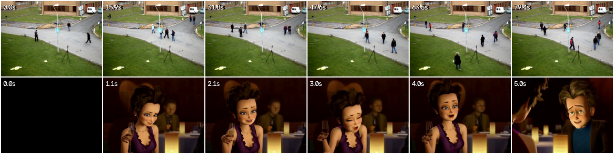
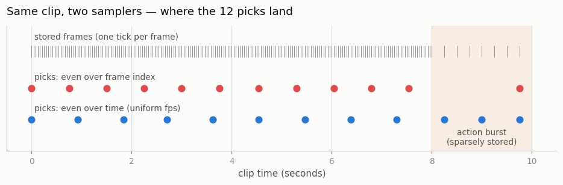
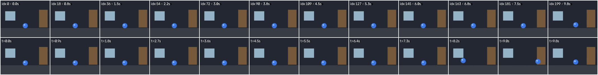

# Frame Extractor

## Key Insight

There are two different ways to pull N frames from a clip, and they are not the same: sampling evenly across the *frame indices* — take every Kth frame in the file — versus evenly across *time* — a fixed [frame rate](/shared/glossary/#frame-rate-fps), such as one frame per second. Index-sampling treats every stored frame as equal, so whichever stretch of the clip was saved with the most frames soaks up the most picks; time-based (fps) sampling instead hands every real second the same number of frames. When a clip's frames are spread evenly over time, the two agree. They split apart when a clip mixes a long, near-still stretch — saved as many almost-identical frames — with a short burst of fast action saved as just a handful: index-sampling then floods you with copies of the boring still part and barely catches the action, while fps-sampling keeps the picks evenly spaced in real seconds, so the fast moment still gets its fair share. Picking the wrong one feeds your model a distorted picture of how fast the world moves. This project samples both ways on fast and slow scenes so you can see the difference with your own eyes.

## What's in this directory

| File | What it does |
|------|--------------|
| `extract.py` | Implements both samplers, proves they agree on normal clips, then shows two ways they mislead you: same-N sampling across clips of different lengths, and a variable-frame-rate clip where the two samplers pick visibly different frames. |
| `outputs/` | The three committed figures below. |

Imports `vid_lib.py` and `plot_style.py` from [project 01](../01-video-loader-benchmark/README.md).

## The two samplers, in five lines each

```python
def sample_by_index(n_stored, n_pick):          # even over the FILE
    return np.linspace(0, n_stored - 1, n_pick).round().astype(int)

def sample_by_time(times, duration, n_pick):    # even over SECONDS
    targets = np.linspace(0, duration, n_pick)
    return np.array([np.abs(times - t).argmin() for t in targets])
```

The second one needs each stored frame's *timestamp*. Video files carry one per frame (the "presentation timestamp", pts — the instant at which a player should display that frame), and `vid_lib.frame_times` reads them with PyAV. On a **constant-frame-rate (CFR)** clip, frame `i` sits at exactly `i/fps` seconds, so the two samplers pick identical frames — the script asserts this rather than assuming it.

## How to run

```bash
python3 extract.py     # ~30 seconds; reuses project 01's downloaded videos
```

## Demo 1 — same N, different clip lengths

Even when index- and time-sampling agree, "sample N frames evenly" hides a trap: N picks from an 80-second clip and N picks from a 5-second clip produce wildly different *real-time gaps* between adjacent frames.



Top row: 6 even picks from an 80 s surveillance clip — 15.9 s apart, so pedestrians teleport, appear, and vanish between "adjacent" frames. Bottom row: 6 even picks from a 5 s trailer clip — 1.0 s apart, a mostly coherent scene. A model fed both under the same recipe sees the same "one step" mean two very different amounts of real motion — motion becomes an unreliable signal. This is why serious video models either sample at a *fixed fps* (accepting that a long clip yields many training windows rather than one stretched one) or feed the sampling fps to the model as an input so it can adjust — the same clip at 8 fps and 24 fps then stops being a contradiction and becomes two labeled variants.

## Demo 2 — a VFR clip splits the two samplers apart

**Variable frame rate ([VFR](/shared/glossary/#variable-frame-rate-vfr))** files store each frame with its own timestamp instead of promising one frame every 1/fps seconds. Screen recordings, webcam captures, and phone videos are commonly VFR — the encoder simply saves fewer frames when it is starved for CPU or bandwidth, which is often exactly when the scene gets busy. We build a worst-case VFR file on purpose (this is why `vid_lib.write_video` accepts explicit per-frame timestamps): 8 seconds of a near-still room stored at 24 fps (192 frames), then a 2-second action burst — the ball goes flying — stored at only 4 fps (8 frames).



The tick marks show where stored frames actually sit: dense for 8 seconds, then sparse. Index-sampling (red) spaces its picks evenly through the *file*, so the densely stored still stretch soaks up 11 of 12 picks and the action burst gets 1. Time-sampling (blue) spaces picks evenly through the *seconds*, so the burst gets its duration-proportional share: 3 of 12.



Top strip (index picks): eleven near-identical shots of a resting ball, plus one frame of action. Bottom strip (time picks): the same still scene, but the burst now appears at three different moments — the ball mid-flight in three different positions. The top strip teaches a model "this world is essentially static"; the bottom strip teaches it what actually happened.

## What to take away

1. **"Evenly" is ambiguous — always say evenly over *what*.** Frame indices and seconds only coincide when the file is CFR, and much real-world data isn't.
2. **Timestamps are data.** Treating a video as "a list of frames" throws away the pts track that tells you when each frame happened; every serious loader (decord, PyAV) exposes it. Time-based sampling is just index-sampling *after* consulting the timestamps.
3. **Fixed-fps sampling is the training default** because it makes motion mean the same thing across every clip in the [batch](/shared/glossary/#batch) — at the price of choosing a window when the clip is longer than N frames at that fps. That window choice (random crop in time) is a data-augmentation decision, not an afterthought.
