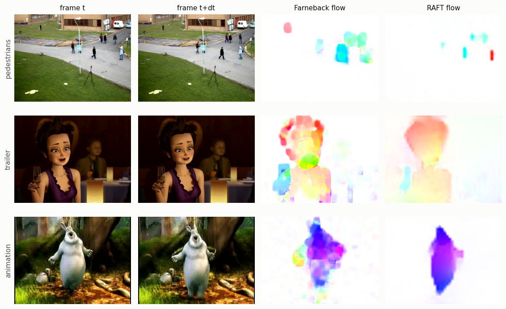
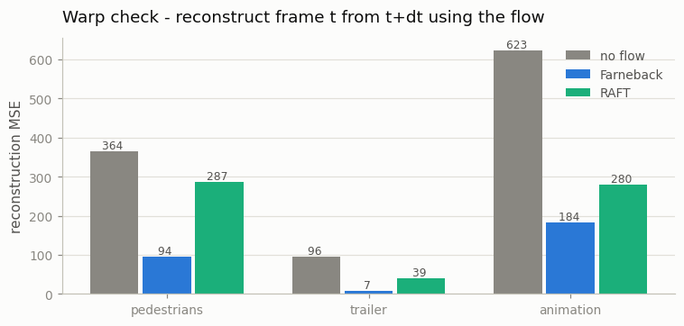

# Optical Flow Visualizer

## Key Insight

[Optical flow](/shared/glossary/#optical-flow) is a per-pixel map of how each point moved between two frames — the raw "motion signal" that video generation ultimately has to model, and that reappears everywhere in the field. This project computes dense flow between adjacent frames with both a classic algorithm ([Farnebäck](/shared/glossary/#farnebäck-optical-flow)) and a modern neural one ([RAFT](/shared/glossary/#raft)), then paints the result with a color wheel where [hue](/shared/glossary/#hue) encodes direction and brightness encodes speed. Seeing motion as color makes it obvious where a clip is calm versus chaotic, and where the classic and neural methods disagree. That same flow signal is exactly what later phases reuse to filter data and to condition models on motion.

## What's in this directory

| File | What it does |
|------|--------------|
| `flow.py` | Computes Farnebäck and RAFT flow on three real scenes, renders both with the color wheel, and scores each flow field with a warp check. |
| `outputs/` | The committed figures below. |

Imports `vid_lib.py` and `plot_style.py` from [project 01](../01-video-loader-benchmark/README.md).

## What "optical flow" means

For every pixel in frame *t*, flow answers: *where did this bit of the picture go in frame t+dt?* The answer is a 2D arrow `(dx, dy)` per pixel, so a flow field has shape `(H, W, 2)` — same spatial size as the frame, but with motion instead of color in it. The name is old perception-science vocabulary: as you move through the world, the pattern of light "flows" across your retina, and researchers called that apparent motion of brightness patterns *optic(al) flow*. It is *apparent* motion — a flickering light moves nothing physically but still produces flow — which turns out to matter below.

The two algorithms attack the question very differently:

- **Farnebäck (2003)** fits a small quadratic surface to the brightness around every pixel in both frames, then solves for the shift that best maps one surface onto the other — a purely local, hand-derived calculation. (Like most classical flow methods it works on grayscale: it tracks brightness patterns and ignores color.)
- **RAFT (2020)** — *Recurrent All-pairs Field Transforms* — is a neural network, and its name is its algorithm: it compares **all pairs** of positions between the two frames (so a pixel can be found even after a big jump), and then a **recurrent** unit — a loop — starts from "no motion" and repeatedly refines the whole **field** of arrows, looking up the all-pairs comparisons as it goes. It was trained on synthetic scenes where the true motion of every pixel is known.

## Reading the color wheel


Every arrow becomes a color: the *direction* of motion picks the hue around the wheel (rightward = red/pink side, leftward = cyan, and so on), and the *speed* picks the saturation — white means "did not move," vivid means "moved fast." A flow image is therefore the whole `(H, W, 2)` arrow field shown at once: colored blobs are moving objects, and two objects moving in different directions get different hues.

## How to run

```bash
python3 flow.py     # ~1 minute; downloads RAFT-small weights (~4 MB) on first run
```

## Results — seeing motion



Both methods find the real motion: each walking pedestrian becomes a blob (different walking directions = different hues), the trailer character's turning head becomes one coherent region, the bunny's moving body stands out from the still background. But look at *how* they differ:

- **RAFT's fields are clean.** Sharp object boundaries, one coherent color per moving thing, near-perfect white where nothing moves.
- **Farnebäck's fields are mottled.** Rainbow speckle covers the trailer character, and blobs bleed beyond object edges. It is chasing every tiny brightness change — video-compression noise, lighting flicker — because to a purely local brightness-matcher, those *are* motion. Remember "apparent motion": flow methods track brightness, and brightness can change without anything moving.

## The warp check — and an honest surprise

A flow field makes a testable prediction: if pixel `(x, y)` really moved by `(dx, dy)`, then frame *t+dt* at the arrived-at position should look like frame *t* at the start position. So we *warp* frame *t+dt* backward along the flow and measure how far the reconstruction lands from the real frame *t* (mean squared error). A "no flow" baseline — pretend nothing moved — shows how much error the motion causes in the first place.



Both methods beat the no-flow baseline easily — the flow genuinely explains most of the frame-to-frame change. **But Farnebäck beats RAFT on every scene, while its flow fields are visibly worse.** That is not a bug; it is the project's best lesson. The warp check measures *photometric* agreement — "did you re-match the brightness?" — and local brightness matching is literally the objective Farnebäck optimizes. It will happily invent arrows that "explain" compression noise, or grab *any* similar-colored pixel rather than the corresponding one, and the warp metric rewards it for both. RAFT reports the actual scene motion and refuses to hallucinate arrows for noise — so its reconstructions match the *scene* better but the *pixels* slightly worse.

The general moral: **when a metric is one method's training objective (or, here, its built-in objective), that method wins the metric without being better.** This is why real flow benchmarks (Sintel, KITTI) score *endpoint error* — the distance between predicted and ground-truth arrows — which requires knowing the true motion, and why RAFT is trained on synthetic data where the truth is available. You will meet this pattern again every time an evaluation metric can be gamed — in video generation's own metrics ([Phase 10](../../README.md#phase-10-training-at-scale-evaluation-and-frontier-topics)) most of all.

## Where flow shows up later in the guide

1. **Data filtering ([Phase 10](../../README.md#phase-10-training-at-scale-evaluation-and-frontier-topics)):** mean flow magnitude is a *motion score* — pipelines drop near-static clips (slideshow-like, low value) and absurdly chaotic ones before training.
2. **Motion conditioning ([Phase 3](../../README.md#phase-3-image-to-video-as-a-stepping-stone)):** Stable Video Diffusion's "motion bucket" input is a per-clip motion statistic of exactly this kind.
3. **Codecs already do it:** [H.264](/shared/glossary/#h264)'s motion vectors ([project 01](../01-video-loader-benchmark/README.md) relied on them) are a coarse block-level cousin of optical flow — compression and generation both live off the fact that video is mostly "the same stuff, moved a little."
