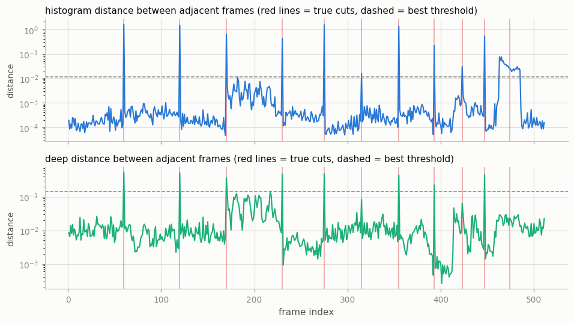
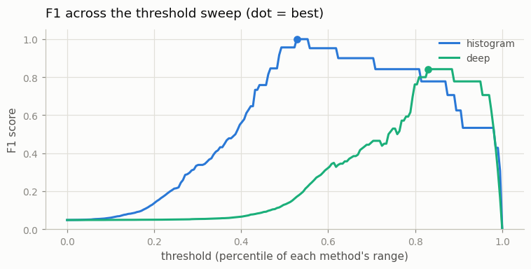
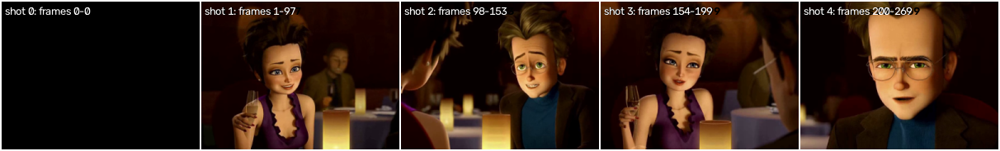

# Scene-Cut Detector

## Key Insight

A training clip that accidentally spans a scene cut — the hard jump where a video switches shots — teaches the model a "motion" that is really just an editing splice, poisoning what it learns about how things actually move. This project performs [scene detection](/shared/glossary/#scene-detection) automatically by watching for sudden jumps in a frame's color histogram or deep-feature distance, then splits a long video into clean single-shot clips. Cutting on shot boundaries is one of the most important — and least glamorous — steps in building a usable video dataset, and skipping it quietly corrupts everything trained downstream.

## What's in this directory

| File | What it does |
|------|--------------|
| `scenecut.py` | Splices a test movie with 11 *known* cut positions (three of them deliberately hard), runs two detectors over it, scores them with [precision and recall](/shared/glossary/#precision-and-recall), and then splits a real trailer clip into shots. |
| `outputs/` | The committed figures below. |

Imports `vid_lib.py` and `plot_style.py` from [project 01](../01-video-loader-benchmark/README.md).

## Why we build the test movie ourselves

To *score* a detector you need ground truth — the true cut positions. Instead of hand-labeling someone else's video, we splice our own movie out of 12 segments cut from three real videos (a surveillance camera, a movie trailer, an animation), so every boundary is known exactly. The segments are verified single-shot first: the script's own histogram probe found the trailer's internal cuts (after frames 97, 153, 199), and the slices avoid crossing them. Three boundaries are deliberately evil:

- **same-camera splice** — two different moments of the same static surveillance scene, spliced. Same background, same colors; only the pedestrians teleport.
- **jump cut** — one shot of the trailer with 10 frames removed in the middle. The name is film-editing vocabulary: the scene stays, time "jumps."
- **gradual dissolve** — a 1-second crossfade instead of an instant cut. Every adjacent-frame difference during the fade is small; there is no single frame where the scene changes.

## The two detectors

Both reduce "did the shot change between frame *t* and *t+1*?" to a per-frame distance score, then flag frames whose score crosses a threshold:

1. **Color histogram.** Count how many pixels fall into each of 32 brightness bins per RGB channel — a 96-number summary of "what colors, how much" that ignores *where* anything is. Adjacent frames of one shot have near-identical histograms even when things move (motion rearranges pixels but barely changes the color census); a cut swaps the whole palette at once. We compare adjacent histograms with the chi-square (χ²) distance — a weighted squared difference, named after the χ² statistic in statistics, that divides each bin's squared change by the bin's size so a change of 500 pixels counts a lot in a small bin and little in a huge one.
2. **Deep features.** Push each frame through a pretrained ResNet-18 [CNN](/shared/glossary/#cnn) and keep its 512-number [embedding](/shared/glossary/#embedding) — a summary of *what is in the picture* rather than what colors it has — then measure [cosine similarity](/shared/glossary/#cosine-similarity) between adjacent frames' embeddings. Why bother, when project 03 already used a neural net for motion? Different question: RAFT answers "where did each pixel go," this asks "is it still the same scene."

## How to run

```bash
python3 scenecut.py     # ~2 minutes; downloads ResNet-18 weights (~45 MB) on first run
```

## Results



The histogram detector (top) is almost embarrassingly good on real cuts: spikes 100–1000× above its baseline at every true boundary (red lines), including both "hard" instant cuts. At its best threshold it scores **precision 1.00, recall 1.00**. The deep detector (bottom) reaches **precision 1.00 but recall 0.73** — and *which* cuts it misses is the interesting part:

| Cut type | Histogram | Deep |
|----------|-----------|------|
| 8 normal cuts | found | found |
| same-camera splice | found | **MISSED** |
| jump cut | found | **MISSED** |
| gradual dissolve | found (smeared — see below) | **MISSED** |

The deep detector's misses are not noise — they are its design. A ResNet embedding is deliberately *invariant*: it maps "the same courtyard, pedestrians in different spots" to nearly the same vector, because that invariance is what makes it good at recognizing scenes. But a shot-boundary detector's job is to notice exactly the low-level discontinuities that the embedding was trained to shrug off. The dumb color census, which has no idea what a courtyard is, sees a different pixel mass and fires. **A "better" feature is only better for the question it was built to answer** — the same metric-vs-objective lesson as [project 03](../03-optical-flow-visualizer/README.md)'s warp check, from the other side.



The histogram's F1 also holds a wide plateau across thresholds — you don't need to tune it delicately — while the deep detector only peaks in a narrow band. (Each curve is plotted against its own threshold range, since χ² distances and cosine distances live on different scales.)

**The dissolve doesn't hide — it smears.** During the 1-second fade, 23 of the 29 window frames individually cross the histogram threshold (peak distance 0.075 vs threshold 0.012): blending shifts pixel values through in-between histogram bins, so every fade step looks like a small cut. A naive splitter would emit twenty 1-frame "shots" — which is why real pipelines add a *minimum shot length* and merge nearby detections, and why our scoring counts any detection inside the fade window as one hit. A much longer, gentler fade would eventually sink below any usable threshold; catching those needs a detector that compares frames *seconds* apart, not adjacent ones.

## Splitting a real video

Finally the histogram detector — with the threshold tuned on the synthetic movie — runs on the raw trailer clip and splits it into shots:



It recovers the trailer's real editing structure: a black lead-in frame, then the woman, the boy, the woman again, the older man — a classic shot/reverse-shot dialogue sequence, each now a clean single-shot clip that is safe to train on.

## What to take away

1. **Ground truth first.** Constructing data with known answers (and known hard cases) turned "look, it kind of works" into precision/recall numbers and a per-cut-type autopsy.
2. **The cheap method wins this job.** Adjacent-frame histogram distance — essentially what the standard `PySceneDetect` tool does — handles hard cuts nearly perfectly. Semantic embeddings *underreact* by design.
3. **The failure modes that remain** (long dissolves, and the flip side — false alarms from camera flashes or fast pans, which this movie's within-shot motion kept below threshold) are exactly why production pipelines stack a second signal on top, such as motion estimation from [project 03](../03-optical-flow-visualizer/README.md) or a minimum-shot-length rule.
