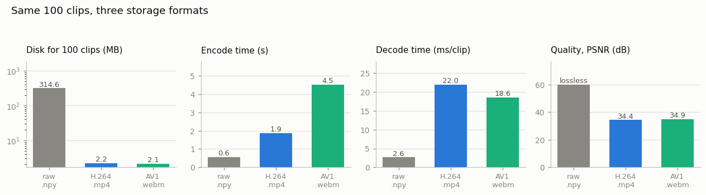

# Storage Study

## Key Insight

How you store video on disk is a direct trade between space and speed: raw `.npy` frames decode instantly but are enormous, while compressed formats shrink the files 10–100× at the cost of CPU time to decode them back. This project stores the same 100 clips three ways — raw arrays, [H.264](/shared/glossary/#h264) inside an `.mp4` [container](/shared/glossary/#media-container), and [AV1](/shared/glossary/#av1) inside a `.webm` — and measures both disk footprint and decode speed. The right choice depends on whether your training run is bottlenecked on disk space, on network bandwidth, or on CPU decode, and this project gives you the concrete numbers to decide instead of guessing.

## What's in this directory

| File | What it does |
|------|--------------|
| `storage.py` | Cuts 100 clips (16 frames, 256×256) from the three source videos, writes each clip in all three formats, and measures disk, encode time, decode time, and quality. |
| `outputs/` | The committed figure and CSV below. |

Imports `vid_lib.py` and `plot_style.py` from [project 01](../01-video-loader-benchmark/README.md).

## The three formats

- **raw `.npy`** — the decoded uint8 pixels dumped straight to disk with numpy. No codec, no loss, no decode work. (And note it's uint8: the same pixels stored as float32 would be 4× bigger for zero extra information — the guide's [pitfall list](../../README.md#common-pitfalls-to-avoid) calls this one out because preprocessing pipelines do it by accident all the time.)
- **H.264 in `.mp4`** — the 2003-era workhorse [video codec](/shared/glossary/#video-codec); plays literally everywhere. Encoded with `libx264` at its default quality (crf 23 — "constant rate factor", the knob where lower = better quality and bigger files).
- **AV1 in `.webm`** — the 2018 royalty-free successor (the name is just "AOMedia Video 1", after the Alliance for Open Media that designed it). Encoded with `libsvtav1` at crf 35 — the two crf scales aren't comparable numbers, so these are each codec's "typical default," and we *measure* quality instead of assuming it.

Both codecs store frames as [YUV](/shared/glossary/#yuv) 4:2:0 rather than RGB, and quality is scored with [PSNR](/shared/glossary/#psnr) computed after the full RGB → YUV → codec → RGB round trip, so every real cost — including the color-resolution halving of 4:2:0 — is inside the number.

## How to run

```bash
python3 storage.py     # ~4 minutes; most of it is AV1 encoding
```

## Results



| Format | Disk (100 clips) | Encode | Decode | Quality |
|--------|-----------------:|-------:|-------:|--------:|
| raw `.npy` | 314.6 MB | 0.6 s | 2.6 ms/clip | lossless |
| H.264 `.mp4` | 2.2 MB | 1.9 s | 22.0 ms/clip | 34.4 dB |
| AV1 `.webm` | 2.1 MB | 4.5 s | 18.6 ms/clip | 34.9 dB |

Three findings worth staring at:

1. **Compression is not a 2× kind of deal — it's 145×.** The same pixels, at a quality where the clips look essentially identical (~34.5 dB PSNR — for reference, 30 dB reads as "noticeably degraded", 40 dB as "visually lossless"), take 0.7% of the space. This is [temporal redundancy](/shared/glossary/#temporal-redundancy) being harvested: most 16-frame windows of real video are "the same picture, slightly moved," and the codec stores exactly that. This ratio is why "just store raw frames" stops being an option the moment your dataset outgrows one machine — and, scaled up, why every big video-model team treats storage/decode as a systems problem.
2. **The decode tax is ~8× — but read the raw number carefully.** 2.6 ms/clip for `.npy` is a *warm-cache* number: the files were just written, so "decode" is mostly a memory copy. From cold storage, raw means actually moving 3.1 MB per clip — at a realistic 100 MB/s disk or network link that's ~31 ms, *slower* than decoding H.264's 22 KB. Compressed formats don't just save disk; they trade cheap CPU work for expensive I/O, which is usually the right direction — and it's also why [project 01](../01-video-loader-benchmark/README.md) obsessed over decoder speed: decode time is a tax you pay on every epoch, forever.
3. **AV1 quietly wins three of four columns** — smaller *and* higher-quality *and* faster to decode (its `dav1d` decoder is a famously optimized piece of software) — and loses only on encode time (2.4× slower than x264, and this gap widens a lot at higher quality settings/resolutions). That asymmetry matches how video is used: encode once, decode millions of times. The catch in practice is hardware support: many GPUs/phones have dedicated H.264 decode circuits, while AV1 hardware decode is only becoming universal.

## What to take away

For a *training dataset*, the numbers say: store compressed, pick the codec your data-loading stack decodes fastest, and only cache decoded raw arrays for small hot subsets that fit in local fast storage (the classic use of `.npy` here: a validation set you re-read constantly). The next phases' cost tables — like the guide's [clip-cost table](../../README.md#the-cost-of-a-single-clip) — all assume this discipline; a 1.5 GB ten-second clip only exists *in memory*, never on disk.
