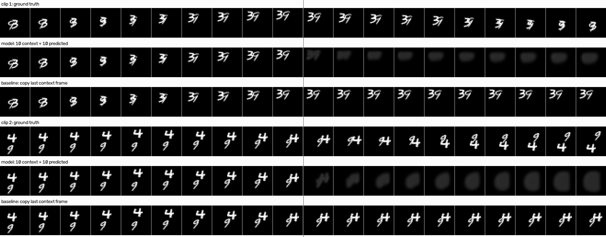
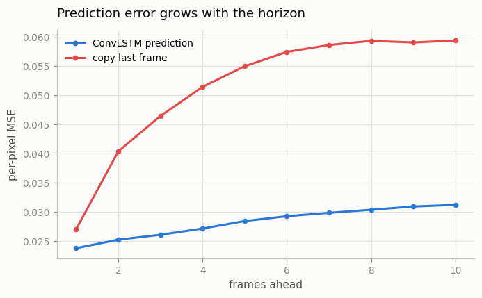
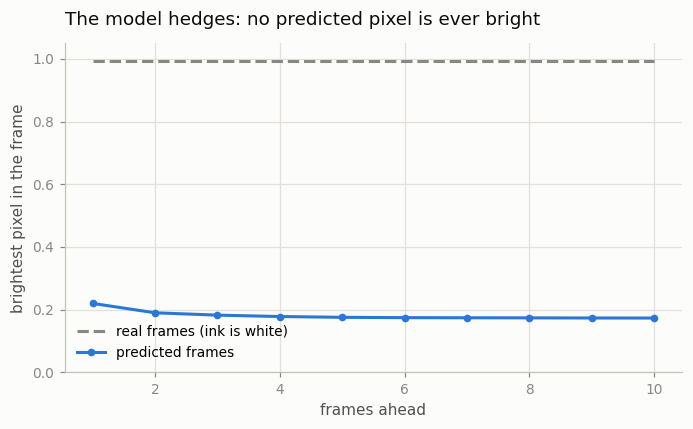
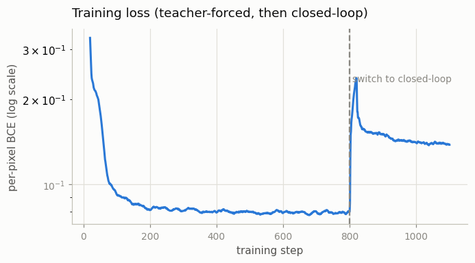

# Moving MNIST Predictor

## Key Insight

[Future frame prediction](/shared/glossary/#future-frame-prediction) — show a model the first few frames of a clip and ask it to draw what comes next — is the oldest test of whether a network has actually learned how things move, and [Moving MNIST](/shared/glossary/#moving-mnist) (two handwritten digits bouncing around a small frame) is its classic toy benchmark. This project trains a [ConvLSTM](/shared/glossary/#convlstm) — an [LSTM](/shared/glossary/#lstm) that keeps each frame's 2D grid instead of flattening it into a flat list of numbers — to predict the next 10 frames given the first 10. The instructive failure to watch for: because the future is uncertain, a model trained with plain [mean squared error](/shared/glossary/#mse-mean-squared-error) hedges its bets by *blurring* the digits, averaging every plausible next position into one smeared guess. Seeing that blur firsthand explains why later video models reach for sharper, probabilistic objectives like [GANs](/shared/glossary/#gans) and [diffusion](/shared/glossary/#diffusion-model).

## What's in this directory

| File | What it does |
|------|--------------|
| `mmnist.py` | Generates Moving MNIST clips on the fly: MNIST digits bouncing around a 32×32 canvas. Also used by [project 09](../09-read-mocogan/README.md). |
| `predictor.py` | The ConvLSTM cell and the encoder → ConvLSTM → decoder predictor. |
| `train.py` | Trains the predictor (~9 min on CPU) and makes all the figures below. |
| `outputs/` | The committed figures. |

Imports `plot_style.py` from [project 01](../01-video-loader-benchmark/README.md).

## The dataset: bouncing digits, generated on demand

Moving MNIST takes handwritten digits from MNIST (a 1990s digit-recognition dataset; the name means *Modified NIST*, after the US standards institute that collected the originals) and slides them across a small canvas in straight lines, bouncing them off the walls like a screensaver. It became *the* benchmark for early video prediction because it isolates exactly one difficulty: **motion**. The appearance of a digit never changes — so if a model draws blurry frames, the blur can only come from its uncertainty about *where things are going*, not from any difficulty drawing digits.

Instead of downloading the standard pre-rendered 10,000-clip file, `mmnist.py` renders clips on demand, so every training batch is brand new (an infinite dataset for free) and we can shrink the canvas from 64×64 to 32×32 to fit the CPU time budget. The physics — straight lines, wall bounces, two digits overlapping — stays the same.

## The model: an LSTM whose memory is a picture

A normal [LSTM](/shared/glossary/#lstm) reads a sequence of *vectors* and carries a running memory of what it has seen. (The name *Long Short-Term Memory* is a deliberate oxymoron: neural activations are "short-term memory" that fades after a few steps, and the LSTM's gated cell was designed to make that short-term memory *long-lasting*.) You could apply it to video by flattening each frame into one giant vector — but that throws away the picture's spatial layout and needs enormous weight matrices.

The **ConvLSTM** (Shi et al., 2015 — invented for rain forecasting from radar maps, not for ML benchmarks) keeps the LSTM's gating machinery but makes two changes:

- the hidden state and cell memory are *feature maps* of shape `(channels, H, W)` — literally a stack of small images — instead of vectors;
- every matrix multiplication becomes a [convolution](/shared/glossary/#convolution-layers), so each spatial position updates its memory from its own local neighborhood.

The memory itself is now a picture: "there is a digit here, moving down-left" can be stored *at the position where the digit is*. Our predictor sandwiches one ConvLSTM cell between a small conv encoder (32×32 frame → 16×16 feature map) and a deconv decoder (16×16 → next frame), 264k parameters in total.

## Two training phases — and why the obvious way fails

The obvious training setup is also the honest one: give the model 10 real frames, let it roll out 10 predictions *feeding each predicted frame back in as its next input* (a **closed-loop** rollout, exactly like test time), and penalize the error. Our first attempt did exactly that, with an MSE loss. The result: the model painted **every frame solid black** — and the loss looked fine.

That failure is worth understanding, because it is a classic:

- Moving MNIST frames are ~95% black pixels, so "predict all black" already scores a deceptively low MSE (0.036 — our first model's loss curve flattened exactly there). It is a comfortable local minimum.
- Early in training the model's own predictions are garbage, and closed-loop training feeds that garbage back in as input — the model has to learn from inputs it has itself polluted.
- With a [sigmoid](/shared/glossary/#sigmoid) output squashed near 0 everywhere, MSE gradients almost vanish: the score is bad, but the *slope* pointing out of the hole is nearly flat, so the model never climbs out.

The fixes, both standard:

1. **[Teacher forcing](/shared/glossary/#teacher-forcing) first.** For most of training, the model predicts frame *t+1* from the *real* frames up to *t* — every step has a clean input and a direct target. The name is the classroom image: instead of letting the student build answer 5 on their own possibly-wrong answer 4, the teacher hands them the correct answer 4 first.
2. **Cross-entropy instead of raw MSE as the training loss.** Treat each pixel as a "how bright?" probability and train with [binary cross-entropy](/shared/glossary/#cross-entropy): its gradient is simply `prediction − target`, which never vanishes however saturated the sigmoid is. This is what the original Moving MNIST paper (Srivastava et al., 2015) did, and our black-screen experience is presumably why.

Why add a closed-loop phase at all, when teacher forcing already trains next-frame prediction? Because teacher forcing never lets the model practice the thing it must do at test time: build on its *own* output. With real frames always provided, small errors are erased every step during training but *compound* step by step at test time (the same train/test mismatch that language-model people call **exposure bias**). So the last portion of training switches to the closed-loop rollout — which is safe *now* because the model already predicts sensible frames. Two phases, each covering the other's blind spot.

## How to run

```bash
python3 train.py           # ~9 min on CPU: train + all figures
python3 train.py --plot    # remake figures from the saved checkpoint
```

## Results



Left of the dark vertical line: the 10 context frames the model sees. Right of it: the future. Read each clip's three rows top to bottom — ground truth, the ConvLSTM's rollout, and a "copy the last context frame" baseline.

The first predicted frames keep recognizable digits at roughly the right positions — the model genuinely learned the motion. Then, frame by frame, the digits dissolve into dim round blobs. That dissolve is the whole lesson; see below.



Per-pixel MSE as a function of how far ahead we predict. The copy-last-frame baseline starts fine (one frame ahead, the digits have barely moved) and then climbs steeply as the real digits travel away from where they were. The ConvLSTM stays below it at every horizon — moving the digits, even imperfectly, beats not moving them.

Always run a dumb baseline like copy-last-frame: video is so [temporally redundant](/shared/glossary/#temporal-redundancy) that "nothing will change" is embarrassingly hard to beat, and a video model that cannot beat it has learned nothing about motion.



The blur, measured. Real frames always contain white ink — their brightest pixel is ~0.99 at every step. The model's predictions never exceed **0.22**, decaying toward 0.17: it *never fully commits* to any pixel being ink, even one frame ahead, and commits less the further out it predicts. A pixel's predicted value is effectively the model's probability that ink will be there — and once the digits' exact positions are uncertain, no single pixel deserves a confident "white."



Note the spike at the dashed line, where training switches from teacher forcing to closed-loop rollout. The task suddenly got harder — same model, same data, but now every input after the context is the model's own imperfect output. The gap between the loss just before and just after the switch is the exposure-bias gap made visible.

## Why the blur is not a bug

The model is deterministic: one input sequence → one output frame. But a few steps into the future, many outcomes are genuinely possible — tiny uncertainties about a digit's exact speed and bounce angle multiply into many plausible positions. A deterministic model trained with an averaging loss (MSE *or* cross-entropy — both are minimized by predicting the per-pixel average of all plausible futures) does the mathematically optimal thing: it paints all those futures on top of each other, weighted by probability. A digit that might be at five slightly different positions becomes one soft gray blob covering all five. The blob in the strips above *is* a probability cloud of digit positions.

That is why the fix is not "train longer" or "bigger model" — those sharpen the first couple of frames (where the future is still nearly certain), but at some horizon the uncertainty, and therefore the blur, always wins. The fix is to stop predicting the average and start *sampling one* future: exactly what [GANs](/shared/glossary/#gans) (next two projects) and [diffusion models](/shared/glossary/#diffusion-model) ([Phase 4](../../README.md#phase-4-video-diffusion--the-modern-foundation)) do. Diffusion's injected noise is, at heart, the coin flip that picks *one* plausible future instead of blending them all.

## Where this idea goes next

Closed-loop rollout — predict, feed back, predict again — is not just a toy-benchmark trick. It is the exact generation loop of the [autoregressive](/shared/glossary/#autoregressive-model) long-video models in [Phase 8](../../README.md#phase-8-long-form-and-consistent-video) and the [world models](/shared/glossary/#world-model) of [Phase 9](../../README.md#phase-9-world-models-and-interactive-video), and the failure mode seen here — small errors compounding into drift as outputs are fed back in — is *their* central open problem too.
