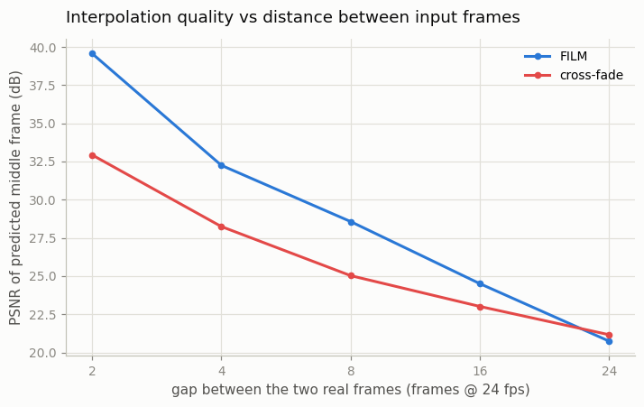
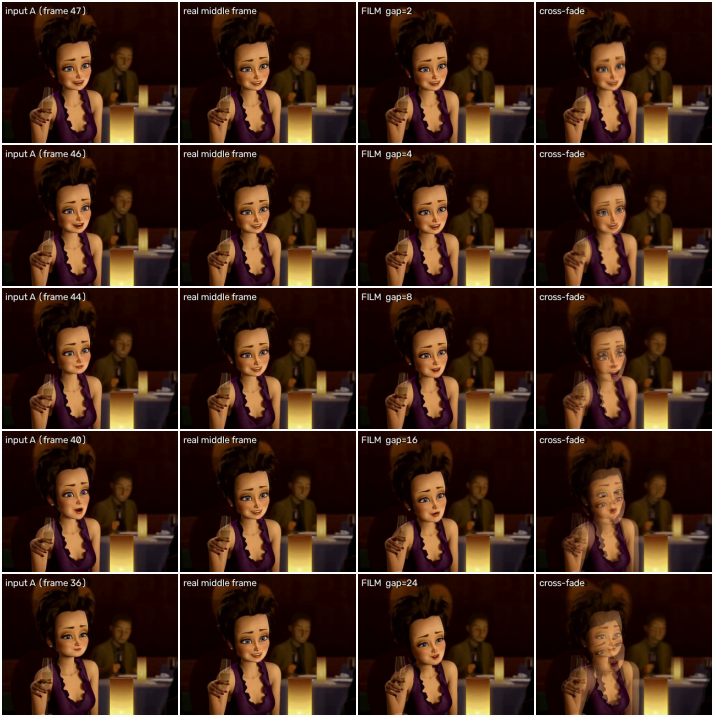
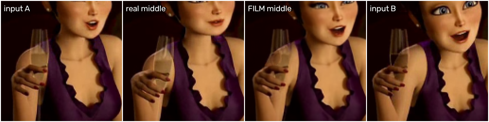
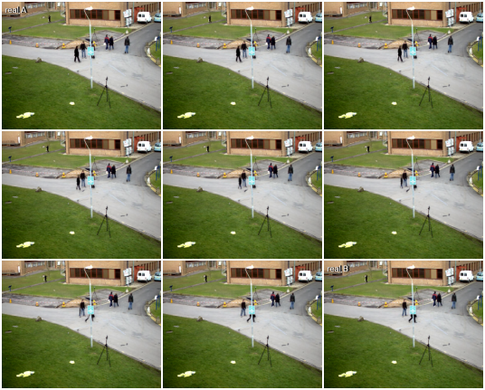

# FILM Frame Interpolation

## Key Insight

[Frame interpolation](/shared/glossary/#frame-interpolation) — inventing the in-between frames that turn a choppy clip into a smooth or slow-motion one — is the gentlest version of video generation, because the model only has to fill in the short motion between two real frames it can already see rather than imagine a whole scene from nothing. This project runs a pretrained [FILM (Frame Interpolation for Large Motion)](/shared/glossary/#film) model to interpolate between two real frames and watches where it breaks. The interesting part is the artifacts: when an object moves a long way between the two frames, even a strong model smears, ghosts, or tears it, because it has to guess a motion path it was never shown. Spotting those failures builds intuition for why large, fast motion is the central difficulty that all of video generation keeps running into.

## What's in this directory

| File | What it does |
|------|--------------|
| `film.py` | Runs pretrained FILM on real frame pairs: a gap sweep with PSNR scoring, an 8× slow-motion strip, and a zoom on the worst artifact. |
| `outputs/` | The committed figures below. |

Imports `vid_lib.py` and `plot_style.py` from [project 01](../01-video-loader-benchmark/README.md).

## What FILM is

FILM's name is its mission statement: **F**rame **I**nterpolation for **L**arge **M**otion (Google, 2022). Given two photos of the same scene a moment apart, it outputs the frame that "should" sit at any time in between. Under the hood it estimates where every pixel moved between the two inputs — [optical flow](/shared/glossary/#optical-flow), exactly what [project 03](../03-optical-flow-visualizer/README.md) computed — at many scales at once (a *pyramid* of zoom levels, so a big jump at full resolution looks like a small, findable step when zoomed out), then [warps](/shared/glossary/#warp) both inputs partway along those flows and fuses them into one frame. The "large motion" in the name is the design target and the reason for the pyramid: earlier interpolators worked only when nothing moved more than a few pixels.

We use a faithful PyTorch port of the released model (the original is TensorFlow). One checkpoint download, no training:

```bash
curl -L -o data/film_net_fp32.pt \
  https://github.com/dajes/frame-interpolation-pytorch/releases/download/v1.0.2/film_net_fp32.pt
python3 film.py    # ~4 min on CPU
```

## Why interpolation counts as "video generation lite"

The interpolated frame does not exist anywhere in the input — the model *generates* it, pixel by pixel, same as any video model. But two things make the job radically easier than text-to-video:

1. **Appearance is given.** Both endpoint frames show exactly what everything looks like; only the in-between *positions* are unknown. (Compare [project 06](../06-moving-mnist-predictor/README.md), where the future had to be invented — here the "future" frame is handed to you.)
2. **The ambiguity is small and local.** Over a 1/24-second gap, most pixels move a few pixels at most, and mostly in straight lines.

And crucially for training: *any* video is a free training set — take three consecutive frames, hide the middle one, and you have an input pair plus a perfect ground-truth answer. No labels, no captions. This trick (called [*self-supervision*](/shared/glossary/#self-supervised): the data grades the model without any human labeling) is also why [image-to-video models](../../README.md#phase-3-image-to-video-as-a-stepping-stone) are the cheapest video models to train.

## The experiment: stretch the gap until it snaps

If the two input frames are adjacent (1/24 s apart), interpolation is nearly solved. The interesting question is how far apart the inputs can drift before the model's motion guess falls apart. So we take one continuous fast-motion shot (the animated trailer from project 01) and interpolate the middle frame of pairs that are 2, 4, 8, 16, and 24 frames apart — up to a full second of motion.

Two comparisons keep us honest:

- **Ground truth.** For even gaps the true middle frame exists in the source video, so we can score the prediction with [PSNR](/shared/glossary/#psnr) rather than eyeballing it.
- **A cross-fade baseline** — just average the two input frames, the way a video editor's "dissolve" transition does. This is what "no motion understanding at all" looks like: every moving object appears twice, as two half-transparent ghosts. Any model worth running must beat it.

## Results



At a 2-frame gap FILM scores **39.6 dB** against the real middle frame — essentially perfect — versus the cross-fade's 32.9 dB. As the gap grows, both fall, but look at where the lines meet: **at a 24-frame gap (one full second) FILM drops to 20.7 dB and loses to the dumb cross-fade (21.2 dB)**.

That crossover is the most instructive number in this project. The cross-fade is *ignorant but humble* — its ghosts are wrong everywhere, but mildly, and it never moves a pixel to the wrong place. FILM is *smart but confident*: it commits to one guessed motion path, and when a second of unseen motion makes that guess wrong, its errors are large and structured — a face rebuilt in the wrong pose scores worse than two faint faces superimposed. You met this pattern in [project 03](../03-optical-flow-visualizer/README.md) (Farnebäck "beating" RAFT on a metric it happened to optimize): a pixel-difference metric like PSNR quietly favors hedged, blurry answers over confident wrong ones. Keep that in mind every time a video-generation paper reports a pixel metric.



Each row doubles the gap. Compare the two right columns against the "real middle frame" column: the cross-fade shows double-exposure ghosts at every gap, while FILM produces a clean, single image — until the motion gets too large, at which point it starts inventing.



Zooming into the fastest-moving region at gap 24 shows *how* FILM fails: the champagne glass and hand are rebuilt mid-swing along the model's guessed path — bent, half-melted, with the glass's stem smeared into the dress. It does not look like a double exposure (cross-fade's failure); it looks like a *plausible object that never existed*. Confident hallucination versus honest ghosting is exactly the trade you buy with a learned motion model.

## Slow motion for free



Interpolation composes with itself: interpolate the midpoint, then the midpoints of each half, and so on — each level of this recursion doubles the frame rate. Here, three levels turn 2 real frames (top-left and bottom-right) into a 9-frame sequence, i.e. 8× slow motion. This is exactly how commercial "smooth slow-mo" features and TVs' motion smoothing work, and it is also video generation's cheapest length-extender: some pipelines in [Phase 8](../../README.md#phase-8-long-form-and-consistent-video) generate sparse [keyframes](/shared/glossary/#keyframe) and let an interpolator fill the gaps.

## Why the failures matter

A 1-second gap between frames sounds extreme for an interpolator, but it is precisely the regime that matters later in the guide: a text-to-video model imagining the next second of a clip faces the *same* unseen-motion problem, without even a second endpoint frame to anchor on. FILM's failure curve is a preview of why fast, large motion is where every video generator — through [Sora](../../README.md#phase-6-diffusion-transformers-dit-and-sora-class-models)-class systems — still visibly struggles, and why datasets are filtered by motion magnitude before training ([Phase 10](../../README.md#phase-10-training-at-scale-evaluation-and-frontier-topics)).

Speed, for reference: ~1.5 s per generated frame on a 12-core CPU at 320×256 — pretrained inference is entirely practical without a GPU at this scale.
