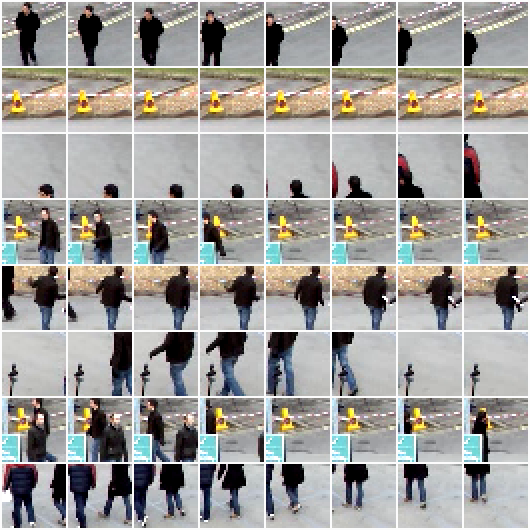
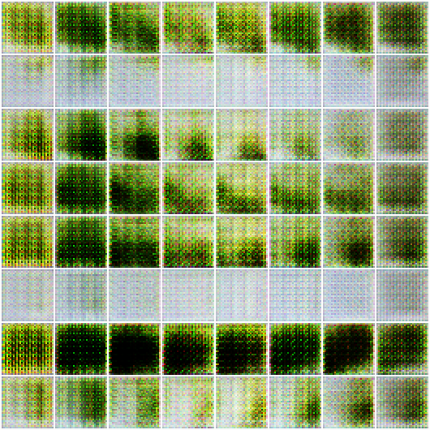
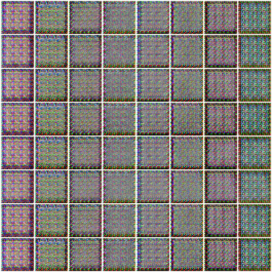
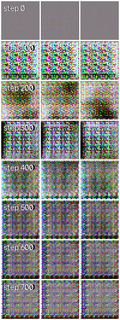
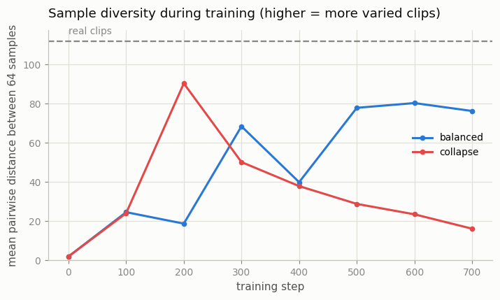
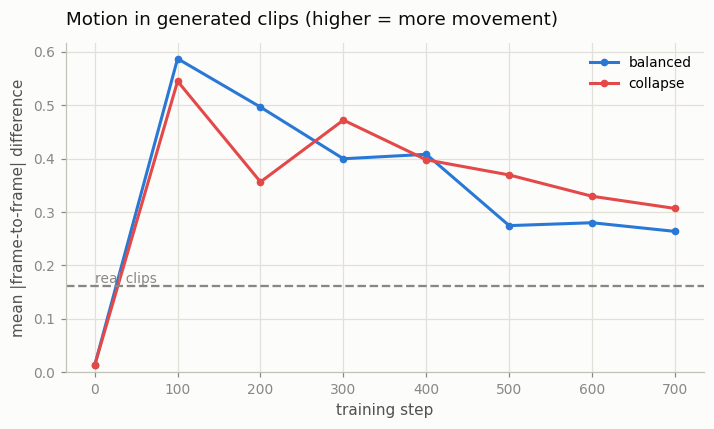

# Tiny Video GAN

## Key Insight

This project trains a small [video GAN](/shared/glossary/#video-gan) on face crops from [UCF-101](/shared/glossary/#ucf-101) so you can watch [mode collapse](/shared/glossary/#mode-collapse) happen with your own eyes — the [generator](/shared/glossary/#generator) discovers a couple of clips that reliably fool the [discriminator](/shared/glossary/#discriminator) and then keeps producing only those, ignoring the variety in the real data. [GANs](/shared/glossary/#gans) extend awkwardly to video because the discriminator must judge not just whether each frame looks real but whether the *motion* between frames does, which makes the adversarial game even less stable than it is for images. Living through that instability is the point: it is the concrete reason the field abandoned GANs for [diffusion](/shared/glossary/#diffusion-model) once diffusion proved both sharper and far more stable to train.

## What's in this directory

| File | What it does |
|------|--------------|
| `videogan.py` | Builds the clip dataset from real video and defines the 3D-conv generator and discriminator. |
| `train.py` | Trains the GAN twice — balanced and rigged-to-collapse — and makes the figures. |
| `outputs/` | The committed figures below. |

Imports `vid_lib.py` and `plot_style.py` from [project 01](../01-video-loader-benchmark/README.md).

## The data: real motion, small enough for a CPU

UCF-101 (101 categories of human actions — the University of Central Florida's 2012 action-recognition dataset) is ~7 GB, so we substitute something with the same essential property — *real video of real human motion* — that downloads in seconds: the surveillance clip of walking pedestrians from [project 01](../01-video-loader-benchmark/README.md). `videogan.py` slides a window over it, keeps the 64×64 regions where the most motion happens (scored by frame-to-frame difference, the poor man's [motion score](../03-optical-flow-visualizer/README.md)), and downsamples to ~1,500 clips of 8 frames at 32×32. Small, but every clip contains a person actually walking.

## GAN in one paragraph, video GAN in one more

A [GAN](/shared/glossary/#gans) trains two networks against each other: a **generator** turns random noise vectors into samples, and a **discriminator** learns to tell those samples from real data. The generator's only training signal is "did I fool the discriminator?" — it never sees a real clip directly. The two improve in lockstep, or they are supposed to: the arrangement is a [minimax](/shared/glossary/#minimax) game (each net minimizes what the other maximizes), and unlike an ordinary loss that only goes down, this equilibrium can be lost mid-training and never recovered.

To make a GAN generate *video*, our networks are the 3D generalization of [DCGAN](/shared/glossary/#dcgan): every 2D convolution becomes a 3D convolution whose [kernel](/shared/glossary/#kernel) spans time as well as space. The generator's transposed convolutions upsample a noise vector into a `(3, 8, 32, 32)` clip — growing time 2→4→8 alongside space 4→16→32 — and the discriminator mirrors it downward. Why must the discriminator's kernels span time, when it could already judge each frame separately? Because per-frame judging cannot see *motion*: eight individually plausible frames can jump-cut randomly between poses, and a frame-wise discriminator would wave them through. Only a filter that reads several frames at once can tell "walking" from "teleporting." (You will meet this factorization again as the "(2+1)D" temporal layers of [Phase 4](../../README.md#phase-4-video-diffusion--the-modern-foundation).)

## The experiment: same model, two learning-rate settings

Mode collapse — "mode" as in statistics: a *peak* of the data distribution, one of the distinct kinds of sample the data contains — is when the generator abandons most of those peaks and produces endless variations of just one or two. It is GAN training's signature disease, and it is fundamentally a *balance* failure: if the generator adapts much faster than the discriminator can respond, the winning move is to rush to whatever single output currently fools the discriminator best, rather than to cover all the data's variety. So we train the identical architecture twice, changing nothing but the [learning rates](/shared/glossary/#learning-rate):

| run | learning rates | expectation |
|-----|-----------|-------------|
| `balanced` | G and D both 2e-4 (the DCGAN defaults) | stable-ish training |
| `collapse` | identical — but at step 350, D's LR is cut to ~0 | G outruns a frozen judge; collapse on schedule |

(First attempts used the folklore recipe — just give G a 10–40× higher LR from the start — and got something *worse* than collapse: the generator destabilized before learning anything and produced pure noise forever. To watch a *trained* generator collapse, it must first be allowed to learn; hence the mid-training switch. In the wild nobody flips this switch — the balance drifts on its own — but forcing it at a known step makes the cause-and-effect visible.)

Two metrics, logged every 100 steps on 64 generated clips:

- **Diversity** — mean pairwise distance between the generated clips. Healthy generators keep this near the real data's spread; a collapsed generator's samples are near-copies of each other, so it falls toward zero.
- **Motion** — mean absolute frame-to-frame difference *within* each generated clip, compared with the real clips' value. A generator can also "collapse in time": produce clips that are just one still image repeated, which per-frame eyes would never notice.

## How to run

```bash
python3 train.py --config balanced    # ~5 min CPU
python3 train.py --config collapse    # ~5 min CPU
python3 train.py --plot               # combined figures from both runs
```

## Results



Eight real training clips (rows = clips, columns = their 8 frames): pedestrians crossing the crop, camera fixed.



The balanced generator, 64 samples after 700 steps (each row is one clip, left to right in time). Honesty first: this is a ~3M-parameter GAN trained for five minutes on 1,500 clips — it produces grass-and-asphalt color fields with [checkerboard artifacts](https://distill.pub/2016/deconv-checkerboard/) (a signature of transposed convolutions), not pedestrians. What matters for this project is the *variety*: dark rows, pale rows, green rows — different z vectors give visibly different clips, and its diversity score climbs back toward the real data's level (see the curve below).





The collapse run, same format — all 64 samples are now near-copies of one checkerboard texture. The timeline above shows three different z vectors (columns) over training (rows): up to step 300 they produce three *different* clips, then, after the discriminator is frozen at 350, they converge onto the *same* one. The generator found the one output pattern its frozen judge scores as maximally real — D(fake) hit **0.98** — and every noise vector now routes to it. A judge that stops adapting gets exploited rather than obeyed; you will meet the same phenomenon as [reward hacking](/shared/glossary/#reward-hacking) when a policy over-optimizes a frozen reward model.



The metric version of the same story. The two runs are configured identically until step 350, and their early curves wander in the same range — though not on the same path: even with the same seed, multithreaded CPU arithmetic is not bit-reproducible, and the adversarial game chaotically amplifies those last-digit differences (one more small instability GANs are heir to). After the starve, the difference is anything but noise: the balanced run recovers to ~76–80 and holds there — below the real clips' 106, i.e. even healthy training under-covers the data — while the starved run slides monotonically toward zero, losing variety every step. Note that collapse is *gradual*: diversity halves and halves again over 350 steps. In a real training run, with no marked "starve" line on the chart, the drift down is easy to miss until it is far along — which is why every serious GAN codebase logs a diversity-like metric.



Both runs' clips "move" 2–4× more than real clips — but the motion is per-pixel flicker between frames, not anything walking. Early in training the flicker is huge (near-noise outputs), and it declines toward the real value as textures stabilize. This metric is the temporal cousin of the diversity check: a generator can collapse *in time* (frozen stills replayed 8 times, motion → 0) just as it can collapse across samples, so both directions need watching.

## Why this killed video GANs

Everything painful in this project is generic GAN behavior, but video makes each pain worse. The 3D discriminator is judging an 8-frame, 24,576-value object — a far bigger haystack in which to find a fooling needle, so there is always *some* texture that beats it. The compute per step is ~8× the image case, so the practical response to instability ("train much longer, try five seeds") costs 8× more. And a video GAN that collapses has lost not just sample variety but *motion* variety — the very thing video adds. DVD-GAN (2019) burned enormous compute to get short plausible clips out of this framework; [diffusion](/shared/glossary/#diffusion-model), whose loss is an ordinary always-decreasing regression objective with no equilibrium to lose, displaced GANs for video almost immediately once it worked for images ([Phase 4](../../README.md#phase-4-video-diffusion--the-modern-foundation)). The GAN's one enduring advantage — single-step generation — returns in [Phase 9](../../README.md#phase-9-world-models-and-interactive-video) and [Phase 10](../../README.md#phase-10-training-at-scale-evaluation-and-frontier-topics) as adversarial *distillation* (ADD), where a GAN loss sharpens a distilled few-step diffusion model.
