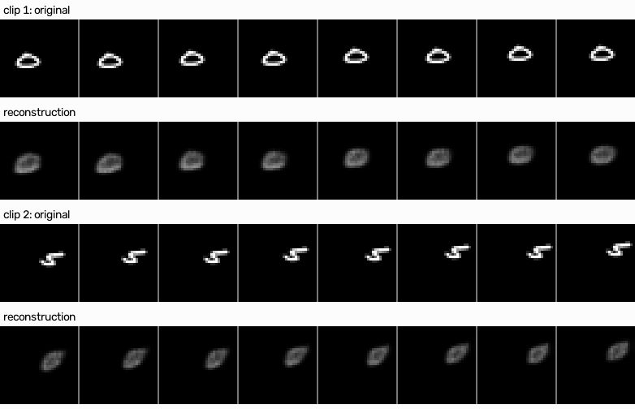
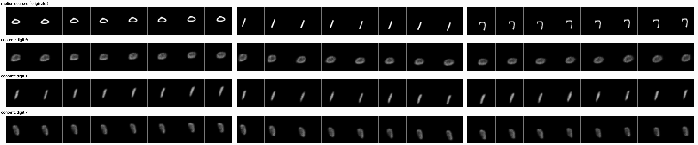
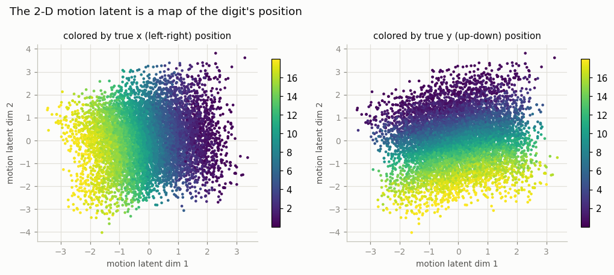
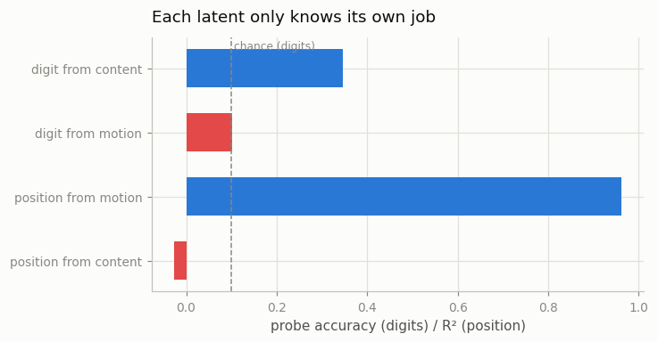

# Read MoCoGAN

## Key Insight

[MoCoGAN](/shared/glossary/#mocogan)'s lasting idea is to split a video's [latent](/shared/glossary/#latent-space) code into two pieces — a single *content* vector that stays fixed across the whole clip (who or what is in it) and a sequence of *motion* vectors that change each frame (how it moves). This project implements just that decomposition inside a small [VAE](/shared/glossary/#vae): hold content steady and vary motion, and the same subject performs different movements without morphing into someone else partway through. The reason it is worth studying a 2017 model in a diffusion world is that this exact content/motion separation keeps reappearing — as keyframe-plus-motion conditioning, as reference-image identity locks — inside modern systems. The framework was wrong; the decomposition was right.

## What's in this directory

| File | What it does |
|------|--------------|
| `comovae.py` | The content/motion VAE: one 16-dim content code per clip, one 2-dim motion code per frame. |
| `train.py` | Trains it on one-digit Moving MNIST (~4 min CPU), then makes the swap grids and probe figures. |
| `outputs/` | The committed figures below. |

Imports the Moving MNIST generator from [project 06](../06-moving-mnist-predictor/README.md) and `plot_style.py` from [project 01](../01-video-loader-benchmark/README.md).

## The idea: two latents with different clocks

MoCoGAN — **Mo**tion-**Co**ntent **GAN** (Tulyakov et al., 2017) — starts from an observation about what video *is*: some facts about a clip are true for its whole duration (who is in it, what they look like, the background), and some change every frame (pose, position). So instead of one latent vector per clip, give the model two kinds:

- **content** `z_c` — sampled once, held fixed for all frames;
- **motion** `z_m(t)` — a fresh (small) vector for every frame.

We reimplement just this decomposition in the least glamorous, most inspectable framework available — a [VAE](/shared/glossary/#vae) — on one-digit Moving MNIST clips (from [project 06](../06-moving-mnist-predictor/README.md)'s generator), where the ground truth is known perfectly: content *should* capture the digit's identity and handwriting, motion *should* capture its position.

## How the split is enforced (architecture, not loss)

Nothing in the loss says "put identity here, position there." The split comes from two structural constraints:

1. **Content is computed by averaging.** The [encoder](/shared/glossary/#autoencoder) extracts features from every frame and *averages them over time* before producing `z_c`. Averaging flattens away frame-to-frame differences, so `z_c` cannot *track* the digit from frame to frame.
2. **Motion is tiny.** Each frame's `z_m(t)` has just **2 dimensions**. The digit's appearance needs far more than 2 numbers to describe, so identity cannot fit through this pipe — but an (x, y) position fits exactly.

Averaging alone turned out not to be enough, and the reason is instructive. Our first version leaked position badly: a [linear probe](/shared/glossary/#linear-probe) could read the digit's position out of the *content* code with R² = 0.83. Averaging destroys *frame-to-frame differences*, but the average of the frame features still remembers the clip's **mean** position — and over an 8-frame clip, the digit never strays far from its mean. The fix adds one more deliberately "redundant-looking" step:

3. **The content path sees randomly shifted frames.** Before the content encoder runs, every frame is independently shifted by a random offset (wrapping around the edges). A shifted digit is still the same digit, so identity survives — but position becomes literally unrecoverable from the content encoder's input. After this change the probe's R² fell from 0.83 to **−0.03** (exactly zero information). If you cannot *prove* a code ignores a factor, make the factor invisible to it.

The decoder rebuilds frame *t* from `(z_c, z_m(t))`, and reconstruction pressure does the rest: any identity information the model tries to smuggle through the motion channel gets crushed by the 2-dim bottleneck, and any position information routed into content gets erased by the average. The information has nowhere to go but the right place.

Why bother with a *per-frame* motion encoder at all when the content encoder already reads every frame? Because the two answer different questions on different clocks: the content path deliberately throws away time (the average) to answer "what is this clip about," while the motion path preserves time to answer "where are we within it, right now." One encoder cannot do both jobs — the averaging that makes content stable is exactly what would destroy the motion signal.

## How to run

```bash
python3 train.py           # ~4 min CPU: train + all figures
python3 train.py --plot    # figures only, from the saved checkpoint
```

## Results



Reconstructions are blurry — this is a plain VAE with a heavily bottlenecked latent, and VAE samples trade sharpness for a well-behaved latent space (the same trade you saw in the [image-generation guide](../../../image-generation/README.md#phase-2-autoencoders-and-vaes)). What matters here: the digit is at the right place in every frame, and its rough shape stays constant across the clip.



The payoff figure. Top row: three real clips (the *motion sources*). Each following row decodes **one clip's content code** against **each of the three motion sequences**. Read down a column: the trajectory stays the same while the digit changes. Read across a row: the same digit performs three different movements — without morphing into another digit partway through. That is the decomposition working.



Each dot is one frame's 2-dim motion code, colored by the digit's true x position (left panel) and y position (right panel). The colors form two clean, perpendicular gradients: the motion latent has organized itself into a *map of the canvas* — dim 1 ≈ x, dim 2 ≈ y — without ever being told positions exist. A linear probe reads position from it with **R² = 0.96**. Nothing else fits through a 2-number pipe, and position is exactly what the decoder needs from it.



The quantitative version of the swap grid, using probes (small read-out models trained on frozen codes — they measure what information a code *contains*, not what the model chooses to show):

| probe | result |
|-------|--------|
| digit's position from **motion** code | R² = **0.96** |
| digit's position from **content** code | R² = **−0.03** (nothing) |
| digit's class from **content** code | **35%** accuracy (chance = 10%) |
| digit's class from **motion** code | **10%** (exactly chance) |

The asymmetry is the result: motion knows *where* and nothing about *who*; content knows *who* and nothing about *where*. The modest 35% on digit class is honest — a linear probe on 16 VAE dimensions clusters handwriting *appearance* rather than class labels (a skinny 7 and a skinny 1 sit close together), which is also visible in the swap grid: what transfers is the digit's *look*, exactly what a content code is for.

## Where this idea reappears

The 2017 execution — a GAN with a recurrent motion generator — lost to diffusion. The *decomposition* did not:

- **Image-to-video** ([Phase 3](../../README.md#phase-3-image-to-video-as-a-stepping-stone)): the conditioning frame *is* a content code (pixels instead of a latent vector); the model only has to invent motion. Stable Video Diffusion's motion-bucket knob is a 1-dim motion latent you set by hand.
- **Identity preservation** ([Phase 7](../../README.md#phase-7-conditioning-control-and-editing)): reference-image encoders and character [LoRAs](/shared/glossary/#lora) are content codes engineered to survive across shots.
- **Latent action models** ([Phase 9](../../README.md#phase-9-world-models-and-interactive-video)): [Genie](/shared/glossary/#genie) infers a small discrete "action" latent between adjacent frames of unlabeled video — recognizably the same trick as our 2-dim motion code, upgraded to internet scale.
