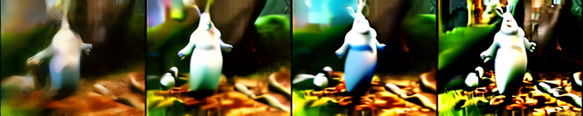
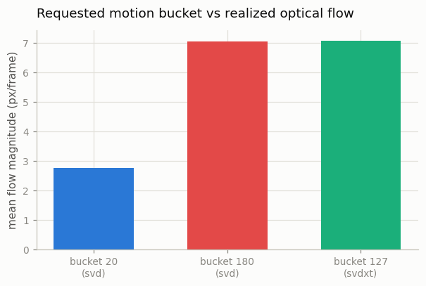

# Run SVD Inference

## Key Insight

[Stable Video Diffusion (SVD)](/shared/glossary/#stable-video-diffusion-svd) is the canonical open-weights [image-to-video (I2V)](/shared/glossary/#i2v) model: hand it a single still image and it produces a short clip that begins from that frame and invents plausible motion, with no text prompt required. This project runs SVD's two released [checkpoints](/shared/glossary/#checkpoint) — one tuned to emit 14 frames, one for 25 — on arbitrary images, so you feel both the model's range and its limits (a few seconds of motion, no real story) before building anything yourself. The reason it works at all is [temporal inflation](/shared/glossary/#temporal-inflation): SVD takes a [frozen](/shared/glossary/#frozen) [Stable Diffusion](/shared/glossary/#stable-diffusion) image model and adds new time-aware layers on top, so it inherits a strong sense of *what things look like* and only has to learn *how they move*. Running inference first — before any training — is the cheapest way to build intuition for what an I2V model can and cannot do.

## Running a 1.5B-parameter video model on a CPU

SVD's native operating point is 576×1024 pixels, 14–25 frames, 25 denoising steps — a few seconds on a data-center GPU and roughly an hour per clip on this machine's CPU. Nothing about the *pipeline* requires that operating point, though: [diffusion](/shared/glossary/#diffusion-model) models accept any (reasonable) resolution, frame count, and step count at inference. So this project runs the real SVD weights at a deliberately humble setting — **256×320, 8 frames, 8 steps** — which brings one clip down to ~2.5 minutes of CPU time. You will see real, coherent motion *and* real degradation (softness, color drift) from running so far below the trained operating point; both are worth seeing. `run_svd.py` runs three generations from the same conditioning image:

| run | checkpoint | `motion_bucket_id` |
|---|---|---|
| 1 | SVD (14-frame checkpoint) | 20 — "keep it calm" |
| 2 | SVD (14-frame checkpoint) | 180 — "make it move" |
| 3 | SVD-XT (25-frame checkpoint) | 127 — the default |

The two SVD checkpoints share an architecture and differ in fine-tuning: the base model was tuned to emit 14-frame clips, SVD-XT ("extended") 25-frame clips. At our reduced 8-frame setting the checkpoints behave similarly — the comparison that *does* show something dramatic at CPU scale is the motion bucket, which is why runs 1 and 2 get the contrast treatment.

The conditioning image is a frame of Big Buck Bunny, fetched with [project 01](../01-video-loader-benchmark/README.md)'s downloader.

## What's in this directory

| File | What it does |
|------|--------------|
| `run_svd.py` | Downloads the checkpoints (~4.2 GB each, cached by Hugging Face), runs the three generations, measures realized motion, writes all figures. `--plot` remakes figures from saved frames. |
| `outputs/` | Committed figures, GIFs, and metrics. |

## The knobs SVD actually exposes

An I2V model has no text prompt, so all control comes from a handful of numeric inputs — worth knowing before you run anything:

- **`motion_bucket_id` (0–255)** — how much motion to generate. During training, every clip's motion was *measured* (via [optical flow](/shared/glossary/#optical-flow)) and binned into 255 buckets, and the bucket id was fed to the model; at inference the id becomes a request. [Project 13](../13-motion-control/README.md) builds this exact mechanism from scratch, small enough to see all the parts.
- **`fps`** — the [frame rate](/shared/glossary/#frame-rate-fps) the clip is *supposed to be played at*, fed the same way. Why does a model that just emits frames need this? Because the same physical motion looks completely different per frame at 6 fps vs 30 fps (big jumps vs tiny steps); conditioning on fps during training lets one model serve both, and lets you ask for either.
- **`noise_aug_strength`** — how much noise to add to the conditioning image before the model sees it. Counterintuitive but standard: a *slightly corrupted* condition frees the model from copying the input's every pixel (compression artifacts included) and gives motion room to develop.
- **steps / resolution / frame count** — pure quality-vs-compute dials, which is exactly what this project exploits to fit a CPU.

## How to run

```bash
python3 run_svd.py           # ~9 min compute (plus ~8.4 GB one-time download)
python3 run_svd.py --plot    # remake figures from saved frames
```

## Results

The conditioning frame:


**Motion bucket 20** — requested calm. The clip is close to an "animated still":


**Motion bucket 180** — same image, same [seed](/shared/glossary/#seed), one number changed:


Frame strips (every 2nd frame) for the three runs:





And the knob, verified with a ruler rather than by eye — mean [Farnebäck optical-flow](/shared/glossary/#farnebäck-optical-flow) magnitude of each generated clip (the same kind of measurement SVD's training pipeline used to *define* the buckets, and the same one [project 13](../13-motion-control/README.md) uses on our own tiny model):



Changing `motion_bucket_id` from 20 to 180 — one integer, same image, same seed — raises the measured flow from **2.78 to 7.05 px/frame**, a 2.5× difference you can also simply see in the GIFs above. The XT checkpoint at its default bucket 127 lands at 7.07 px/frame on this input. The knob is real, and it is *learned*, not hard-coded: nothing in the architecture enforces it beyond the association absorbed from labeled training clips.

## What to notice

- **The first frame holds, the rest is invention.** Frame 0 tracks the conditioning image closely; by frame 7 the model is inventing content it cannot know (the bunny's far side, revealed background). I2V = appearance anchored, motion sampled.
- **Degradation from off-nominal settings is real and visible** — softness everywhere, and a slow color/exposure drift across frames at 8 steps and a quarter of the trained resolution. This is what "a model has an operating point" means in practice: weights are not magic, they were tuned for a setting, and the further you run from it the more quality leaks away. (The drift compounding frame over frame is also your first taste of the error-accumulation problem that dominates [Phase 8](../../README.md#phase-8-long-form-and-consistent-video).)
- **No text, still controllable.** Everything you steered came through numbers — bucket, fps, noise level, seed. Control surfaces do not require language.

## Where this idea goes next

[Project 11](../11-animatediff-tour/README.md) tours the other classic inflation design — AnimateDiff's swappable motion module — and then [project 12](../12-tiny-i2v-model/README.md) stops *using* pretrained I2V models and builds one, small enough to train on a CPU, with exactly the pieces seen here: temporal layers on a frozen image model, first-frame conditioning, and (in [project 13](../13-motion-control/README.md)) the motion bucket.
