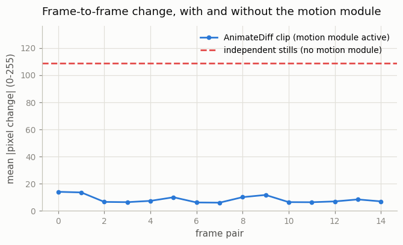
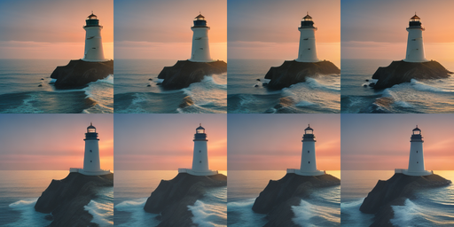
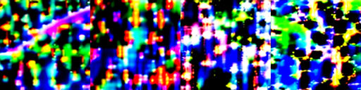

# AnimateDiff Tour

## Key Insight

[AnimateDiff](/shared/glossary/#animatediff) turns any community [Stable Diffusion](/shared/glossary/#stable-diffusion) image [checkpoint](/shared/glossary/#checkpoint) into a short-video generator without retraining it: it slots a separately trained [motion module](/shared/glossary/#motion-module) — a stack of time-aware layers — between the [frozen](/shared/glossary/#frozen) image model's blocks, and that one module supplies all the motion knowledge. This project plugs that module into an off-the-shelf SD 1.5 checkpoint and generates *animated stills* (subtle, looping motion on an otherwise static scene), letting you swap art styles freely while the same motion module animates each one. The lesson is that motion can be learned *once* and reused across many image models — a clean example of [temporal inflation](/shared/glossary/#temporal-inflation) packaged as a drop-in part rather than a model you must train end to end.

## Why this works at all

AnimateDiff's motion module was trained *once*, on real video, with a frozen base SD 1.5 — and yet it animates checkpoints it has never met (art styles, photoreal fine-tunes, anime models). The reason: every SD 1.5 fine-tune keeps the base model's architecture and, largely, its internal feature language — fine-tuning bends *what* the features depict, not the coordinate system they live in. A motion module that learned "how features at this layer should evolve over time" therefore still speaks the right dialect inside a different checkpoint. That is also its limit: plug it into a model with a genuinely different feature space (SDXL, say) and it does nothing useful — motion modules are per-architecture, which is why AnimateDiff ships separate modules per SD family.

## The CPU-honest configuration

Video diffusion at SD's native 512 px and 25 steps with [classifier-free guidance](/shared/glossary/#cfg-classifier-free-guidance) would cost ~1 s per frame-step here — half an hour per clip. Two standard shortcuts bring one 16-frame clip down to ~70 s of CPU:

- **AnimateDiff-Lightning** — a [distilled](/shared/glossary/#distillation) version of the AnimateDiff motion module (ByteDance) that generates in **4 denoising steps** instead of 25. Distillation here means a *student* module was trained to reproduce, in few steps, the result the original produces in many.
- **No guidance** (`guidance_scale=1`) — the Lightning module is trained to be used without classifier-free guidance, which halves compute (CFG runs the U-Net twice per step, once with and once without the prompt).
- 256×256 output — quarter resolution; softer but perfectly legible.

## What's in this directory

| File | What it does |
|------|--------------|
| `tour.py` | Loads the Lightning motion module into two different SD 1.5 checkpoints, generates the four comparisons below, measures, and plots. `--plot` remakes figures from saved frames. |
| `outputs/` | Committed figures, GIF, and metrics. |

Uses `plot_style.py` from [project 01](../01-video-loader-benchmark/README.md).

## The four generations

| clip | image checkpoint | seed | why |
|---|---|---|---|
| A | epiCRealism (photoreal) | 3 | the tour itself |
| B | DreamShaper 8 (stylized) | 3 | *same seed, same module, different style* — does the motion carry over? |
| C | epiCRealism | 17 | control clip for the motion comparison (same model, different seed) |
| D | epiCRealism, 4 independent single-frame stills | — | what per-frame image generation *without* the motion module produces |

Clip D answers the question a beginner should ask here: *the image checkpoint can already generate each frame — why is a motion module needed at all?* Because sixteen independently generated frames are sixteen unrelated pictures: same prompt, different layout every time. The motion module is what makes frame *t+1* a continuation of frame *t* — via temporal attention layers through which each pixel's feature can consult its own past — rather than a fresh roll of the dice.

## How to run

```bash
python3 tour.py           # ~7 min compute (plus ~8 GB one-time download)
python3 tour.py --plot    # remake figures from saved frames
```

## Results

The animated still (epiCRealism, 16 frames):


**Flicker, measured.** Mean absolute pixel change between adjacent frames, motion module on vs off:



With the motion module active, adjacent frames differ by ~8.5 gray levels on average (out of 255) — small, smooth changes, exactly what "animated still" means. The independent stills differ from each other by ~109, nearly 13× more: without shared temporal layers (and shared starting noise), "sixteen frames of the same prompt" is just sixteen different photographs.

**One seed, two styles.** Same prompt, same seed, same motion module — the only change is the image checkpoint:



The independent stills of clip D, for contrast — each is a fine image; together they are not a video:



**Does the motion itself transfer?** We compute dense [optical flow](/shared/glossary/#optical-flow) for every adjacent-frame pair of clips A, B, C and correlate the flow fields:

| comparison | flow correlation |
|---|---|
| A vs B — different checkpoints, same seed & module | **0.746** |
| A vs C — same checkpoint, different seed | −0.020 |

0.75 versus zero. With the seed and motion module shared, *where things move* carries across checkpoints almost intact even though every pixel is rendered in a different style; with a different seed, even the same checkpoint's motion is completely uncorrelated. In other words: the motion module (together with the starting noise) owns the motion, and the image checkpoint owns the pixels — which is precisely the modularity the Key Insight promised.

## Where this idea goes next

AnimateDiff and [SVD](/shared/glossary/#stable-video-diffusion-svd) ([project 10](../10-run-svd-inference/README.md)) are the two poles of the same inflation idea: SVD bakes its temporal layers *into* one fine-tuned model for quality; AnimateDiff keeps them *detachable* for ecosystem reach — every community checkpoint and [LoRA](/shared/glossary/#lora) becomes a video generator for free, which is why AnimateDiff exploded in the open-source scene. [Project 12](../12-tiny-i2v-model/README.md) builds the shared underlying mechanism — zero-initialized temporal layers on a frozen image model — at a scale where you train it yourself, and [Phase 4](../../README.md#phase-4-video-diffusion--the-modern-foundation) inflates the real SD U-Net in [project 15](../15-inflate-sd-to-a-video-model/README.md).
