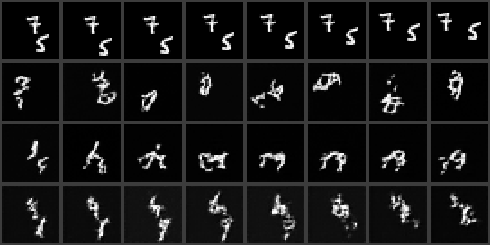
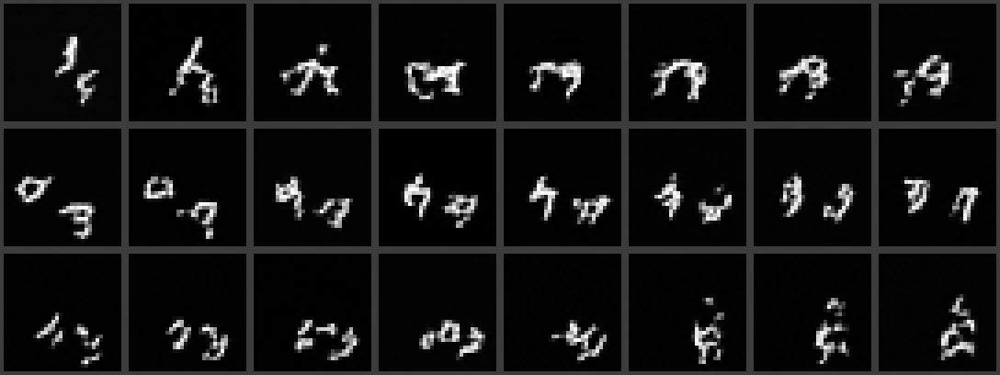
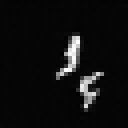
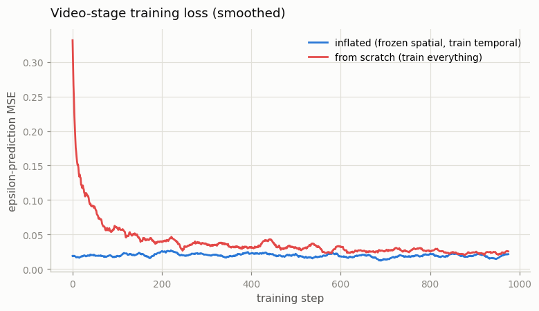

# Tiny I2V Model

## Key Insight

This is the smallest honest version of building your own [image-to-video (I2V)](/shared/glossary/#i2v) model: start from a [frozen](/shared/glossary/#frozen) [Stable Diffusion 1.5](/shared/glossary/#stable-diffusion) [U-Net](/shared/glossary/#u-net), insert new [(2+1)D](/shared/glossary/#21d) temporal convolution layers, and [fine-tune](/shared/glossary/#fine-tuning) only those new layers on ~100k clips while the first frame is fed in as the condition. Because *any* video is automatically a training example — its first frame is the input and the remaining frames are the target — you need no paired text captions at all, which is why I2V is the cheapest place to start training. Freezing the image backbone and training only the temporal layers is [temporal inflation](/shared/glossary/#temporal-inflation) in its rawest form: you keep everything the image model already knows about appearance and teach it only how those pixels should move over time.

## The honest downscale

The recipe above — as literally stated — needs a GPU cluster: Stable Diffusion's U-Net has ~860M parameters, and "100k clips" means days of training. This project runs the *identical recipe* at a scale where every step finishes in minutes on a CPU:

| Real recipe | This project |
|---|---|
| Pretrained Stable Diffusion 1.5 U-Net (~860M params) | Our own tiny [diffusion](/shared/glossary/#diffusion-model) U-Net (~1.4M params), pretrained on single frames in stage 1 |
| Web video clips | [Moving MNIST](/shared/glossary/#moving-mnist) clips (two digits bouncing on a 32×32 canvas), generated on the fly by [project 06](../06-moving-mnist-predictor/README.md)'s `mmnist.py` |
| Insert temporal layers, freeze the rest, fine-tune on clips | Exactly the same, unchanged |

Nothing essential is lost in the shrinking: the whole point of the exercise — *what temporal inflation buys you and why it works* — is a property of the recipe, not of the model size. And because we pretrain the "image model" ourselves, you get to see the full pipeline instead of treating the pretrained checkpoint as a black box.

## What's in this directory

| File | What it does |
|------|--------------|
| `i2v_lib.py` | The shared library for Phase 3: the DDPM schedule, the 2D image U-Net, the temporal blocks, the inflated `VideoUNet`, training loops, sampling, metrics. Imported by [project 13](../13-motion-control/README.md) and [project 14](../14-camera-trajectory/README.md). |
| `train.py` | The four stages (see "How to run"). |
| `outputs/` | Committed figures and metrics. |

Uses `mmnist.py` from [project 06](../06-moving-mnist-predictor/README.md) and `plot_style.py` from [project 01](../01-video-loader-benchmark/README.md).

## Step 1: pretrain an image model

Stage 1 trains a plain [DDPM](/shared/glossary/#ddpm)-style diffusion model on *single frames* pulled from Moving MNIST clips — it never sees two frames of the same clip together, so it knows what a frame looks like but nothing about motion. This is our stand-in for "download Stable Diffusion". (If DDPM itself feels fuzzy — the [noise schedule](/shared/glossary/#noise-schedule), epsilon prediction, [sampling](/shared/glossary/#sampling) — the [Image Generation guide](../../../image-generation/README.md#phase-5-diffusion-models--foundations-ddpm) owns those fundamentals; this project only adds the time axis on top.)

Two small notes on names that will appear in the code:

- **"Epsilon prediction"**: the network is trained to look at a noised image and predict the exact noise `ε` (epsilon — the conventional math symbol for a small added disturbance) that was mixed into it. Knowing the noise is equivalent to knowing the clean image, but predicting the noise trains more stably.
- **"Ancestral sampling"**: generation walks the noise-removal chain step by step, each step drawing a sample whose distribution depends on the previous step's result — like walking down a family tree where each child is drawn given its ancestor (hence *ancestral*). That chain structure is why one bad early step can poison everything after it; the code clamps the implied clean image at each step to prevent exactly that.

## Step 2: inflate it into a video model

**Why is it called "inflation"?** The picture behind the name: a 2D network is flat, like a deflated balloon; you "blow it up" along a third axis (time) until it becomes a 3D network — but the flat material (the pretrained 2D weights) is still all there, just built upon. Concretely, `VideoUNet` runs the frozen 2D U-Net on every frame of the clip *as if each frame were an independent image*, and inserts a new `TemporalBlock` after every U-Net block. Each temporal block reshapes the features so that *time* becomes the axis a 1D convolution slides along: at every spatial position independently, it mixes a window of 3 consecutive frames. Spatial layers handle *within-frame* structure, temporal layers handle *across-frame* structure. That split is what the guide calls a [(2+1)D](/shared/glossary/#21d) factorization — 2 spatial dimensions + 1 time dimension handled by *separate* layers, rather than a full 3D convolution over all three at once. It is nearly as expressive, much cheaper, and (the reason that matters here) it is what lets the 2D pretrained weights be reused completely unchanged.

**The identity-at-initialization trick.** The last convolution inside every temporal block starts with all-zero weights, so at step 0 each block adds exactly nothing: the freshly inflated video model produces *bit-for-bit the same output* as the frozen image model applied to each frame separately. `train.py` asserts this:

```
identity-at-init check |video - per-frame image| = 0.00e+00
```

Why insist on this? Because the pretrained model is *good*, and a randomly initialized layer dropped into its middle would garble its features from the very first forward pass — training would begin by destroying what the freeze was meant to preserve, then slowly repairing the damage. Zero-initialization means training starts from "a working image model that ignores time" and only ever *adds* temporal behavior on top. Every serious inflation-based model (AnimateDiff, ModelScope, Stable Video Diffusion) uses some version of this trick, and the guide's Phase-3 sample code shows the same idea for convolutions.

## Step 3: feed in the first frame — through a side door

An I2V model must see the conditioning frame. [SVD](/shared/glossary/#stable-video-diffusion-svd) does it by concatenating the clean first frame to the noisy input as extra channels. We *cannot* do that here, and the reason is instructive: our first conv layer is frozen, and it was pretrained with exactly one input channel — there is no weight slot for a second one. (SVD can concatenate because it widens that first layer with zero-initialized extra weights and then *fine-tunes the whole network*; we committed to a strict freeze.)

So the condition enters through [adapters](/shared/glossary/#adapter) instead: small trainable convs read the first frame and *add* their features onto the frozen features — same information, injected additively beside the frozen path rather than through it. There is one adapter per resolution level (reading the condition downscaled to 32, 16, and 8 px), so the deep layers receive the condition directly rather than hoping the frozen path carries it down to them; each adapter's last conv is zero-initialized, preserving the identity-at-step-0 property. If you have seen [ControlNet](/shared/glossary/#controlnet) in image generation, this is the same move in miniature: never widen a frozen layer; bolt zero-initialized side branches onto it, one per scale.

One subtlety worth pausing on: *why noise and denoise frame 0 at all, when the clean frame 0 is already given as the condition?* You might expect the model to be told "frame 0 is fixed, generate only frames 1–7". Instead, standard I2V training treats all frames — first included — as targets, with the clean first frame supplied as a *separate* conditioning input. The apparent redundancy is deliberate: denoising frame 0 *toward* the condition is precisely the exercise that teaches the adapter pathway to carry appearance information (the loss on frame 0 is almost entirely "did you read the condition?"), and at inference the generated frame 0 reproducing the condition is your visual check that conditioning works at all.

## Why freeze? The experiment

Freezing is a choice, not a law — so we test it. Two arms, identical architecture, identical video-training budget (800 steps):

- **inflated** — spatial weights loaded from stage 1 and frozen; only the temporal blocks + adapters train (360k of 1.77M params);
- **scratch** — the same network, all 1.77M parameters training from random initialization on the same clips.

## How to run

```bash
python3 train.py --stage image     # ~9.5 min: pretrain the 2D U-Net
python3 train.py --stage video     # ~7 min: inflate, freeze, fine-tune
python3 train.py --stage scratch   # ~6.5 min: the all-trainable baseline
python3 train.py --stage figures   # ~1.5 min: sample everything, plot
```

## Results



Same conditioning frame (leftmost of each row), four rows. Top to bottom: **(1)** a real clip starting from that frame; **(2)** the inflated model *before* any video training — every frame is an independent image sample, so digits teleport and change identity from frame to frame: this is literally "an image model that ignores time", and the zero-initialized model produces it by construction; **(3)** the inflated model after 800 steps — the conditioned digits persist and move smoothly; **(4)** the scratch model at the same budget.



Three more held-out conditions for the trained inflated model (each row: generated frames 0–7). One clip, animated:





The loss curves make the freeze argument by themselves: the inflated arm *starts* where the scratch arm takes hundreds of steps to arrive, because the frozen backbone already knows how to denoise frames — the temporal layers only have to learn the residual "how do frames relate" part. The scratch arm spends its one budget learning appearance and motion at once.

Numbers (also in `outputs/metrics.csv`):

| model | flicker (mean pixel change between adjacent frames) | condition fidelity (MSE of generated frame 0 vs condition) |
|---|---|---|
| real clips | 0.0479 | — |
| inflated, temporal untrained | 0.0854 | 0.0756 |
| inflated, temporal trained | 0.0450 | 0.0206 |
| scratch, same budget | 0.0539 | 0.0246 |

Read the flicker column against the real-clip value (0.0479): untrained temporal layers produce nearly double the frame-to-frame change (independent samples = maximal flicker), while the trained model lands almost exactly on the real value — its frames change *as much as real motion changes them*, no more. Condition fidelity tells you whether the adapters learned to carry the first frame through: training cuts the mismatch to about a quarter of the unconditioned value.

Be honest about what the scratch row shows, too: at this tiny scale, 1000 steps is enough for the scratch model to close most of the gap — its final numbers sit only a little behind the inflated model's. The inflation advantage here is the *head start*, which is exactly what the loss figure shows. Now scale that head start up: for an 860M-parameter model, "the part of training the frozen backbone lets you skip" is the difference between fine-tuning for days and pretraining for months — and that, not any toy-scale quality gap, is why every 2022–2024 video model inflated instead of starting fresh.

## Two things worth internalizing

1. **The training signal is free.** No captions, no labels, no annotation of any kind — the first frame conditions, the remaining frames supervise. This is why I2V is where video-generation training starts, both in this guide and historically (SVD trained I2V before text-to-video; AnimateDiff bolted motion onto image checkpoints).
2. **Motion is *sampled*, not predicted.** The first frame does not determine the future — a digit may be moving in any direction. [Project 06](../06-moving-mnist-predictor/README.md)'s deterministic predictor was forced to average all those possible futures into blur. A diffusion model instead *samples one* future per run: same condition, different [seed](/shared/glossary/#seed), different — but individually sharp — motion. That single difference is most of the reason video generation moved to diffusion.

## Where this idea goes next

The two conditioning mechanisms built here are the hooks the rest of Phase 3 hangs on: [project 13](../13-motion-control/README.md) adds a *motion score* input through the temporal blocks' [FiLM](/shared/glossary/#film-feature-wise-linear-modulation) path, and [project 14](../14-camera-trajectory/README.md) adds *camera control* through a second, per-frame adapter. [Phase 4](../../README.md#phase-4-video-diffusion--the-modern-foundation)'s [project 15](../15-inflate-sd-to-a-video-model/README.md) then repeats today's inflation on the real Stable Diffusion U-Net.
