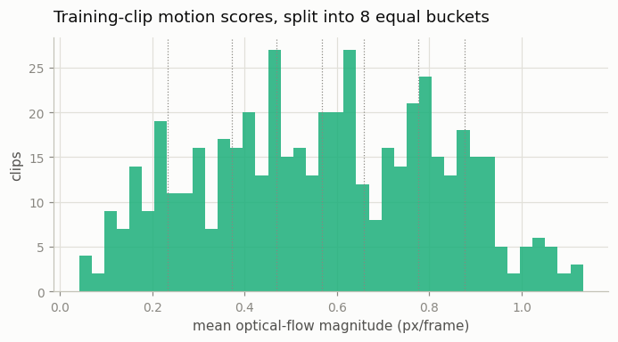
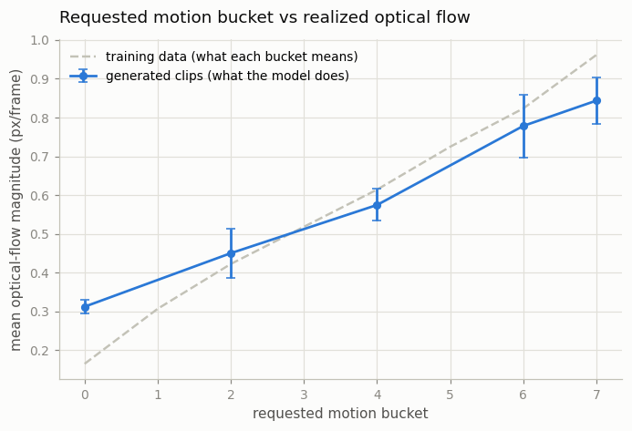
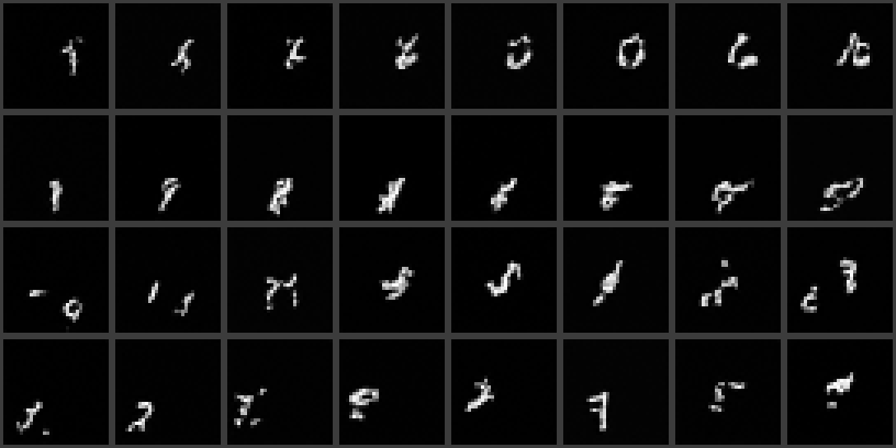
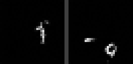

# Motion Control

## Key Insight

An [image-to-video](/shared/glossary/#i2v) model trained on raw clips gives you no say over *how much* things move — some outputs barely twitch, others thrash. A [motion score](/shared/glossary/#motion-score) (also called a *motion bucket*) fixes this by feeding the model a single number at training time that measures how much motion each training clip actually contains — typically derived from [optical-flow](/shared/glossary/#optical-flow) magnitude, i.e. how far pixels travel between frames — so that at inference you can dial that number up or down to request subtle or energetic motion. This project adds that input to the [Tiny I2V model](../12-tiny-i2v-model/README.md) and checks that the model truly learned the association: low scores should produce gentle, animated-still motion, high scores dramatic movement. It is the simplest *control surface* for video — one extra knob that separates *how much it moves* from *what is in it*.

## The idea, in one sentence

During training, *measure* how much each clip moves and tell the model; the model then cannot help but learn the association "this number ↔ this much motion", and at inference the number becomes a knob you turn.

Note what makes this trick so cheap: the label is computed *automatically from the pixels* — like [project 12](../12-tiny-i2v-model/README.md)'s first-frame conditioning, it needs no human annotation at all. Any quantity you can measure from a clip (motion, camera shake, brightness, cut count) can become a control knob this same way. The field keeps rediscovering this pattern; the motion score is just its simplest instance.

## What's in this directory

| File | What it does |
|------|--------------|
| `train.py` | Calibrates motion buckets and trains the conditioned model (stage `train`), then samples every bucket and plots the dose–response curve (stage `figures`). |
| `outputs/` | Committed figures and metrics. |

Builds entirely on [project 12](../12-tiny-i2v-model/README.md)'s `i2v_lib.py` (and reuses its stage-1 pretrained image U-Net — no need to retrain it), [project 06](../06-moving-mnist-predictor/README.md)'s `mmnist.py`, and [project 01](../01-video-loader-benchmark/README.md)'s `plot_style.py`.

## Step 1: measure motion the way SVD does

For each training clip we compute a **motion score**: the mean magnitude of [Farnebäck optical flow](/shared/glossary/#farnebäck-optical-flow) between adjacent frames — literally "on average, how far did pixels travel per frame". ([Project 03](../03-optical-flow-visualizer/README.md) built intuition for exactly this quantity.)

Why measure from pixels when *we wrote the clip generator* and know each digit's true speed? Because using that inside knowledge would break the lesson: for real training data — web video — nobody knows the "true" speed of anything. A motion knob that needs ground-truth labels would be unusable in practice. [Stable Video Diffusion](/shared/glossary/#stable-video-diffusion-svd)'s data pipeline scores its clips with optical flow for the same reason, and doing it the same way keeps the recipe transferable. The data for this project uses a much wider speed range than project 12 (digits drift between 0.2 and 3.0 px/frame), so there is real variety for the score to describe.

**From score to bucket.** The raw score is a continuous number; following SVD we discretize it into a *bucket id* — here 8 buckets split at the quantiles of the training-score distribution (SVD uses 255 buckets). Why bucket at all, instead of feeding the number directly? Discrete ids make the knob's meaning stable and evenly covered: splitting at quantiles guarantees every bucket appears equally often in training, so no part of the knob's range is starved of examples:



## Step 2: feed the bucket to the layers that can use it

The bucket id is embedded with the same sinusoidal machinery as the diffusion timestep and handed to the model. But *where* it enters is a design decision worth understanding:

- **SVD** adds its motion-bucket [embedding](/shared/glossary/#embedding) into the timestep embedding, which flows into every layer — possible because SVD fine-tunes *all* of its layers, so every layer can learn to react to the new signal.
- **Our model** keeps the spatial layers [frozen](/shared/glossary/#frozen). Pushing the motion signal into the frozen layers' timestep pathway would be shouting at layers that finished learning long ago and will never adapt to the new input — worse than useless, since it would also shift their inputs away from what they were trained on.

So the bucket embedding enters only the *trainable* temporal blocks, through [FiLM](/shared/glossary/#film-feature-wise-linear-modulation): a tiny layer predicts a per-channel scale and shift from the embedding and applies them inside each temporal block. The placement is principled, not just forced: motion *amount* is a property of the time structure, and the temporal blocks are both the layers that model time and the layers that are actually training — the knob goes where it can be heard. (The FiLM layers are zero-initialized, so — the same trick as everywhere in this trilogy — the conditioned model starts exactly equal to an unconditioned one.)

## How to run

```bash
python3 train.py --stage train      # ~6 min: calibrate buckets + train
python3 train.py --stage figures    # ~4 min: sample 5 buckets, measure, plot
```

## Results



The dose–response curve. Dashed line: what each bucket *means* — the average measured flow of the training clips in that bucket. Solid line: the average measured flow of *generated* clips when that bucket is requested (same conditioning frames, same seeds, only the bucket changes; error bars span the 4 test conditions). The curve is monotone — every increase in the requested bucket produces measurably more motion — and it tracks the target closely through the middle buckets (2–6). At the two extremes it compresses toward the middle: asked for near-stillness (bucket 0, target 0.16 px/frame) the model still moves at 0.31, and asked for maximum motion (bucket 7, target 0.96) it delivers 0.84. That pull toward typical motion is standard behavior for a conditioned generator — the knob *shifts* the distribution being sampled from rather than clamping it, and the tails of the training distribution are exactly where the model saw the fewest examples.



Same conditioning frames, bucket 0 requested (top two rows) vs bucket 7 (bottom two rows). With bucket 0 the digit mostly stays put, drifting slightly; with bucket 7 it travels visibly across the canvas. Same conditioning, same appearance — only the amount of motion changed.

The same contrast, animated — bucket 0 on the left, bucket 7 on the right, identical conditioning frame and seed:



Numbers are in `outputs/metrics.csv`.

## Why this matters beyond the toy

This project is the smallest complete example of a *control surface*: (1) find a measurable property of training clips, (2) feed it in during training, (3) turn it into a user knob at inference. The same three steps with "camera pose" substituted for "flow magnitude" give [project 14](../14-camera-trajectory/README.md)'s camera control — and with "aesthetic score", "[frame rate](/shared/glossary/#frame-rate-fps)", or "shot type" substituted, they give half the conditioning inputs of production video models (SVD's fps conditioning is literally this trick again). When [project 10](../10-run-svd-inference/README.md) turns SVD's `motion_bucket_id` knob, this mechanism is what answers.
