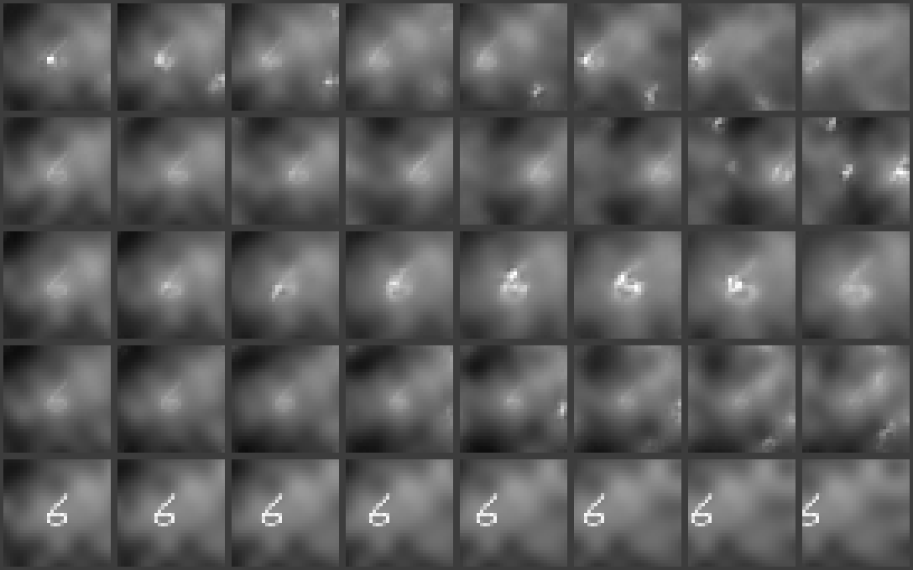
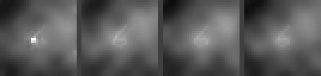
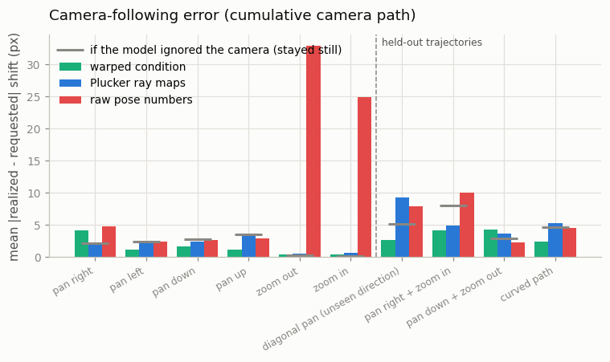
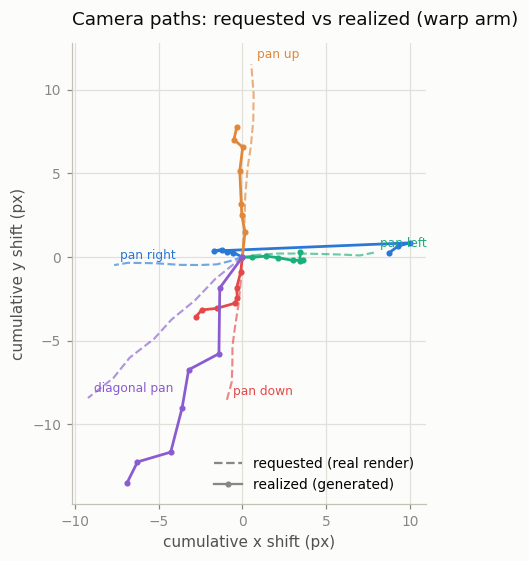
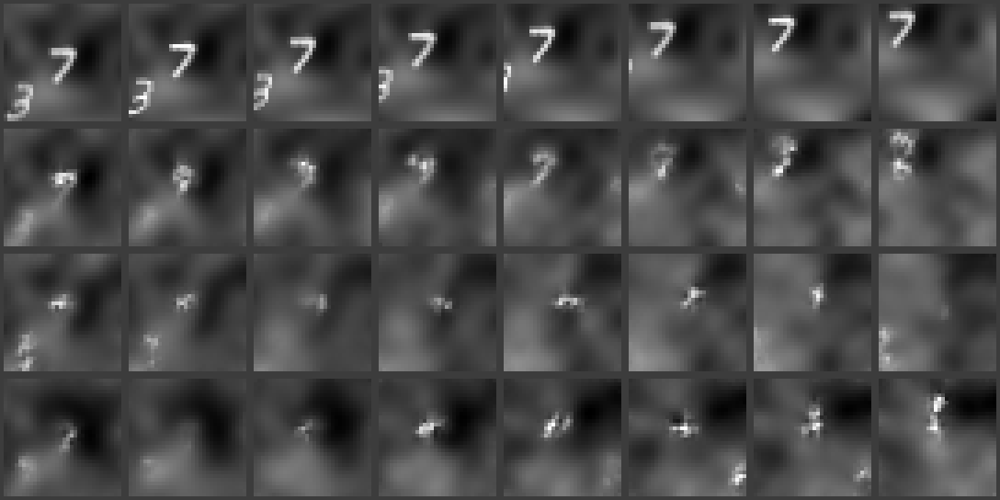

# Camera Trajectory

## Key Insight

To move from "something moves in the clip" to "the *camera* pans left and zooms in", a video model has to be told the camera's path explicitly. This project adds [camera control](/shared/glossary/#camera-control) to an [image-to-video](/shared/glossary/#i2v) model by feeding it [Plücker-coordinate](/shared/glossary/#plücker-coordinates) camera embeddings — a compact six-number description of the ray each pixel looks along, computed per frame from the desired camera trajectory — and then verifies the model honors requests to pan, zoom, and orbit. Encoding the camera as per-pixel rays rather than raw position numbers is what lets the model generalize to trajectories it never saw in training, because every pixel then carries a direct geometric hint about where its content should appear to come from.

## A world where all motion is camera motion

To study camera control cleanly you want data where the camera's path is *known exactly* and nothing else moves. So `camera.py` builds one: a static 96×96 "scene" (a few MNIST digits on a soft random terrain) filmed by a virtual camera — a square crop window that can slide across the scene (**pan**) and grow or shrink (**zoom**, resized to a 32×32 frame either way). Every frame is just "what the window sees", so *all* apparent motion in a clip is camera motion by construction.

Two design details that look arbitrary but are load-bearing:

- **The background terrain.** Over a plain black region, a camera pan produces *no pixel change at all* — every crop looks identical, so no training signal could ever connect the camera input to what the model should draw. Real video has texture nearly everywhere; the soft random terrain is its stand-in. It is deliberately *smooth*: an early version of this project used a field of small sharp dots instead, and the tiny diffusion model simply could not reproduce a specific dot constellation from the conditioning frame — every generated clip started from an unrecognizable dot field, and no camera measurement could survive that. A low-frequency terrain is easy to carry through the conditioning pathway, which keeps the *camera* question — not the rendering question — at the center of the experiment.
- **Poses are relative to the first frame.** The camera path is expressed as offsets from the frame-0 camera, not as absolute scene coordinates. The model sees the world *only* through the conditioning frame — it has no way to know where on the canvas that view came from, so absolute coordinates would be an unlearnable input. (Real camera-control models such as CameraCtrl parameterize relative to the first frame for the same reason.)

Training clips use straight-line pans (the four cardinal directions × 3 speeds) and steady zooms (in or out). Three kinds of trajectory are deliberately **held out** of training entirely — diagonal pans, pan-while-zooming, and curved paths — to test generalization later.

## Telling the model where the camera goes: three designs

The interesting question of this project is *how to encode* the camera path. We train the same model three times ([project 12](../12-tiny-i2v-model/README.md)'s inflated `VideoUNet`, frozen spatial layers, fresh temporal layers), changing only the camera input:

**Arm 1 — raw pose numbers (the obvious design).** Each frame's camera is, honestly, three numbers: (horizontal offset, vertical offset, zoom level relative to frame 0). Feed those through a small MLP into the temporal blocks' [FiLM](/shared/glossary/#film-feature-wise-linear-modulation) input, one embedding per frame — exactly how [project 13](../13-motion-control/README.md) fed in its motion bucket.

**Arm 2 — Plücker ray maps (what the papers use).** Model the crop window as a real [pinhole camera](/shared/glossary/#pinhole-camera-model) hovering above the scene plane: pan = the camera translating sideways, zoom = the camera moving toward or away from the plane (a *dolly*). Then, for every pixel of every frame, compute the 3D ray that pixel looks along, and encode each ray by its 6 [Plücker coordinates](/shared/glossary/#plücker-coordinates) — direction plus moment. The result is a `(frames, 6, 32, 32)` tensor that enters the network through zero-initialized [adapters](/shared/glossary/#adapter), side by side with project 12's first-frame adapters. The claimed advantage over three clean numbers (see the Key Insight) is *generalization*: a per-pixel ray tells each pixel directly "the content you show should come from over there" — a local geometric instruction that stays meaningful for camera paths never seen in training, where a global 3-number code asks the model to memorize what each value implies for every pixel at once.

**Arm 3 — the warped condition (motion compensation).** Both designs above still leave the model a genuinely hard sub-task: *computing where old content lands*. Even with a ray per pixel, the network must internally move information sideways by up to 14 px — a long journey through 3×3 convolutions. The third design does that geometry *for* the model: for every frame, warp the conditioning frame itself by the requested camera motion (shift it for a pan, rescale it for a zoom — the classic *motion compensation* operation from video codecs), mark the pixels that fall outside the known view, and feed the warped images through the same adapter mechanism. The model no longer interprets coordinates at all; it sees, per frame, a picture of "what you should paint, where it is known", and only has to denoise toward it and invent the unknown margins.

The three arms form a ladder of *how much geometric work is left to the network* — all of it (pose numbers), a per-pixel hint (rays), none of it (warp). The held-out trajectories then test each rung's generalization, and the honest answer at this toy scale is measured, not assumed.

## Measuring whether the model obeyed

A generated clip either follows the requested camera or it does not — and this is checkable without eyeballs. For pans we measure each adjacent frame pair's global shift by [phase correlation](/shared/glossary/#phase-correlation) and chain the per-pair estimates into a cumulative camera path. (Why not correlate each frame directly against frame 0 — a bigger, easier-to-measure total shift? Because on *generated* clips it fails: by late frames most content is newly invented, the overlap with frame 0 shrinks, and the estimator locks onto spurious alignments. Adjacent generated frames, in contrast, are temporally smooth — the ~2 px pair-shift is exactly what phase correlation is good at. We tried both; the wreckage of the frame-0 version was a useful reminder that *the measuring instrument needs validating as much as the model*.) For zooms we brute-force the scale factor that best aligns each frame with the next. And to avoid being fooled by the estimators' own quirks, the "requested" reference values come from running *the same estimators on real renders* of the same trajectories — and every plot also shows the error a model would get by simply *ignoring* the camera and holding still. If a trained arm doesn't beat that grey line, the camera input taught it nothing.

## What's in this directory

| File | What it does |
|------|--------------|
| `camera.py` | The static scene, the crop-window camera, trajectory generators, relative poses, the per-pixel Plücker-map computation, and the motion-compensation warp. |
| `train.py` | Five stages (see below): pretrain the image model on camera views, train the three arms, then sample / measure / plot. |
| `outputs/` | Committed figures and metrics. |

Builds on [project 12](../12-tiny-i2v-model/README.md)'s `i2v_lib.py`, [project 06](../06-moving-mnist-predictor/README.md)'s MNIST digits, and [project 01](../01-video-loader-benchmark/README.md)'s `plot_style.py`. (The image U-Net is re-pretrained here rather than reused from project 12 because the frames look different — camera views of terrain scenes, not bouncing digits on black — and a frozen backbone is only as good as its match to the data it must denoise.)

## How to run

```bash
python3 train.py --stage image     # ~7 min: pretrain 2D U-Net on views
python3 train.py --stage warp      # ~9 min: train the warped-condition arm
python3 train.py --stage plucker   # ~9 min: train the Plücker arm
python3 train.py --stage pose      # ~9 min: train the raw-pose arm
python3 train.py --stage figures   # ~8 min: sample, measure, plot
```

## Results



The warped-condition arm, one scene, one conditioning frame (leftmost), four different camera requests: pan right, pan left, zoom in, zoom out (bottom row: the real render of the pan-right request, for reference). The terrain slides and rescales with the request while the fine details wobble — and one honest limitation is visible immediately: the sharp digit pasted into the start view survives only as a bright smudge. Carrying *low-frequency* content through the conditioning pathway is easy; carrying exact high-frequency strokes is not, at this model size.

The same four requests, animated (left to right: pan right, pan left, zoom in, zoom out — all from the identical start frame):





Camera-following error per trajectory: how far the measured cumulative path of the generated clip sits from the real render's, in pixels (lower = more obedient; the grey dash is the ignore-the-camera reference). Left of the dashed line: trajectory types seen in training; right: the held-out types no arm ever saw. Averaged over all ten trajectories the ladder is unambiguous — **warped condition 2.3 px** (beats the ignore-it reference of 3.2 px, including on the held-out diagonal, pan+zoom, and curve), **Plücker rays 3.5 px** (statistically indistinguishable from ignoring the camera), **raw pose numbers 9.6 px** (much *worse* than ignoring it — the zoom requests send this arm into wild, uncorrelated motion, the two ~30 px bars). One number per arm, and each is a lesson:

- The **warp** arm proves the model *can* follow a camera when the geometry is delivered in a form it can use — pixels, already moved to where they belong.
- The **Plücker** arm shows that a per-pixel coordinate *hint* is not enough at this scale: the network would still have to move content sideways through its own layers, a computation our 500k trainable parameters never learn within the budget. It doesn't hurt, but it doesn't control either.
- The **pose** arm is the cautionary tale: a signal the network can sense but not decode properly is worse than no signal — it learns "when these numbers move, something should change" without learning *what*, and thrashes.

A camera path figure makes the warp arm's obedience (and its limits — systematic undershoot, one stubborn direction) directly visible:



Dashed: the requested path, as measured on the real render. Solid: the generated clip's realized path. Pan up, pan left, and — most importantly — the *held-out diagonal* track their requests (the diagonal is the generalization the Key Insight promises: the warp map for a diagonal is nothing special to the model, just another picture of shifted pixels, so an unseen direction costs nothing). Realized paths cover roughly 50–70% of the requested distance — the model hedges toward stillness, the same regression-to-typical behavior as [project 13](../13-motion-control/README.md)'s extreme buckets.



A held-out trajectory — the diagonal pan, a direction never seen in training. Top to bottom: real render, warped-condition arm, Plücker arm, raw-pose arm.

Full numbers in `outputs/metrics.csv`.

## Reconciling this with the Key Insight

The Key Insight — per-pixel rays generalize better than raw pose numbers — is the finding reported by CameraCtrl-class papers on *production-scale* models: billions of parameters, spatiotemporal attention (which can move content anywhere in one step), and full fine-tuning. Our experiment reproduces the *bottom* of that claim (coordinates-as-numbers is the weakest encoding, and per-pixel geometric conditioning the direction to go) but honestly cannot reproduce the top: at 500k trainable parameters, even ray maps leave too much geometry for the network to compute, and the arm that wins is the one where the geometry arrives precomputed. The general rule that survives every scale: **a control signal only works if the network can actually afford the computation that turns the signal into pixels.** What changes with scale is how much of that computation the model can absorb — big models internalize the warp; ours needs it done for them.

## What the model is — and is not — being told

Camera conditioning tells the model where existing content should *appear to move*; it says nothing about what should slide into view at the frame's edge. Watch the strips: content revealed by the pan is *invented* (plausible dots, sometimes a digit) and only the content carried over from the conditioning frame is faithful. That is correct behavior, not a bug — an I2V model is a generator, and camera control constrains geometry, not content. Scaled up, this same combination — "move the view as told, hallucinate what enters" — is how a [world model](/shared/glossary/#world-model) explores beyond its starting observation ([Phase 9](../../README.md#phase-9-world-models-and-interactive-video)).

## Where this idea goes next

This is the last of the Phase-3 conditioning trilogy: [project 12](../12-tiny-i2v-model/README.md) conditioned on *content* (the first frame), [project 13](../13-motion-control/README.md) on a *scalar* (motion amount), and this project on a *dense geometric field* (one ray per pixel) — the three shapes that nearly every video-control signal takes. The dense-field pattern returns in [ControlNet-Video](../31-controlnet-video/README.md)'s depth maps ([project 31](../31-controlnet-video/README.md)) and real camera control à la CameraCtrl on full-scale models, and the "verify controllability by measuring the output" habit returns everywhere control is claimed.
