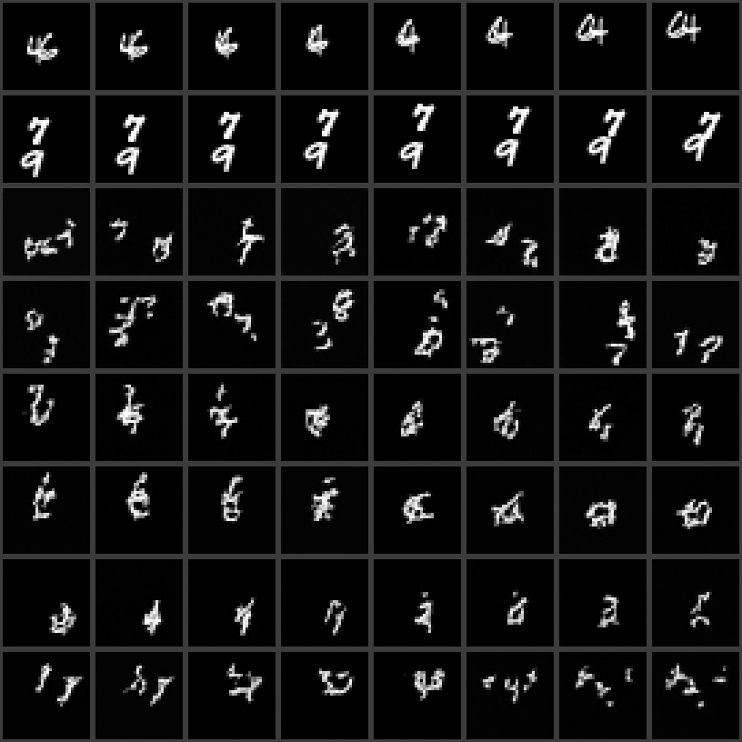
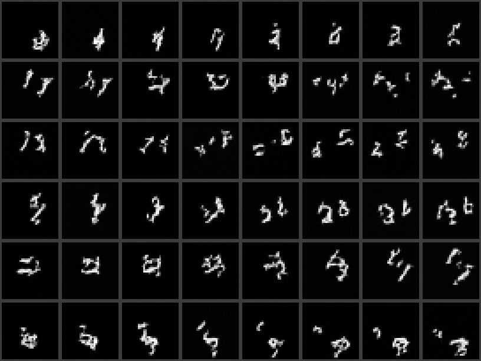
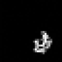
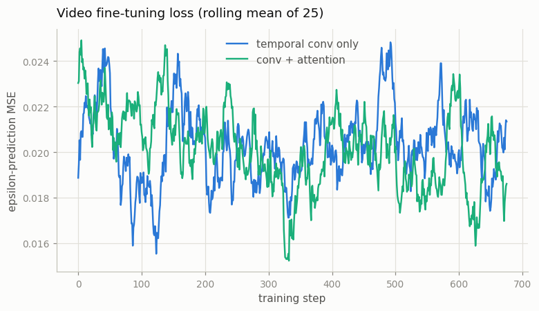

# Inflate SD to a Video Model

## Key Insight

This is the foundational move of the entire video-diffusion era: [temporal inflation](/shared/glossary/#temporal-inflation). You start from a pretrained [Stable Diffusion 1.5](/shared/glossary/#stable-diffusion) [U-Net](/shared/glossary/#u-net) — a model that only knows how to denoise a *single still image* — and grow it into the time dimension by inserting two kinds of new layer: a temporal [convolution](/shared/glossary/#convolution-layers) that slides a small filter along the frame axis, and [temporal attention](/shared/glossary/#temporal-attention) that lets each spatial position compare itself across every frame. Both are initialized as a pass-through, so before any training the inflated model still behaves exactly like the original image generator; then [fine-tuning](/shared/glossary/#fine-tuning) on a small video dataset teaches only the new layers how things move while the spatial layers keep all their hard-won knowledge of appearance. Unlike the first-frame-conditioned [Tiny I2V model](../12-tiny-i2v-model/README.md), which inflates with temporal convolutions alone to animate one given image, here you build a full [video diffusion model](/shared/glossary/#diffusion-model) that generates an entire clip from noise — making this the cheapest honest way to reach a from-scratch-feeling video generator without paying for from-scratch training.

## The honest downscale

The literal recipe — inflate the real 860M-parameter Stable Diffusion U-Net and fine-tune it on video — is a GPU-cluster job. This project splits it into the two halves a CPU *can* do honestly:

| Part of the recipe | Where it happens here |
|---|---|
| The inflation surgery on the **real SD 1.5 U-Net** — insert zero-initialized temporal layers, verify nothing changes, count what it costs | `inflate_real_sd.py`, run once on the genuine 860M-parameter checkpoint (no training) |
| The **full training pipeline** — pretrain an image model, inflate it, fine-tune on clips, sample video from pure noise | `train.py`, on our ~1.4M-parameter U-Net and [Moving MNIST](/shared/glossary/#moving-mnist) clips |

This is the same split as [project 12](../12-tiny-i2v-model/README.md), one phase up: the *recipe* is what you are learning, and the recipe does not change with scale.

## What's in this directory

| File | What it does |
|------|--------------|
| `vdm_lib.py` | The shared Phase-4 library: `TemporalAttention`, the `VideoDiffusionUNet` wrapper, SVD-style `widen_conv_in`, a [DDIM](/shared/glossary/#ddim) sampler, and video metrics. Imported by projects [16](../16-joint-image-video-training/README.md), [17](../17-temporal-cfg-study/README.md) and [18](../18-cascaded-super-resolution/README.md). It builds on Phase 3's `i2v_lib.py` (the [DDPM](/shared/glossary/#ddpm) schedule, the 2D U-Net, the temporal convolution block). |
| `train.py` | The four stages (see "How to run"). |
| `inflate_real_sd.py` | The structural inflation of the real SD 1.5 U-Net. |
| `outputs/` | Committed figures and metrics. |

Uses `mmnist.py` from [project 06](../06-moving-mnist-predictor/README.md) and `plot_style.py` from [project 01](../01-video-loader-benchmark/README.md).

## From I2V to full video diffusion

[Project 12](../12-tiny-i2v-model/README.md) always handed the model a clean first frame, so it only had to model *motion*. Here there is no condition of any kind: the model starts from pure noise and must invent appearance **and** motion together. Two consequences:

- **Everything must come out of the denoiser.** There is no anchor frame for the digits to copy their appearance from. If the temporal layers are weak, each frame invents its *own* digits — the "teleporting digits" failure you will see in the results.
- **This is text-to-video with the text removed.** A real [T2V](/shared/glossary/#t2v) model is exactly this plus a text condition steering *which* clip comes out. Dropping conditioning isolates the part this phase is about — making frames agree with each other — and conditioning is added back in [project 17](../17-temporal-cfg-study/README.md).

## Why a second temporal layer? Convolution vs attention

Project 12 inflated with temporal *convolutions* only, and it worked — so a fair question: **isn't attention along time already covered by the temporal conv?**

No, and the difference is the [receptive field](/shared/glossary/#receptive-field) — the stretch of the input a layer can actually see. A temporal convolution has a kernel of 3: each frame is updated from itself and its two neighbors only. News about frame 0 reaches frame 7 only by hopping through layer after layer, getting averaged and diluted at each hop. [Temporal attention](/shared/glossary/#temporal-attention) gives every frame a *direct* connection to every other frame in a single layer: frame 7 can look straight at frame 0 and agree on what the digit looks like. The two layers also split the work naturally:

- **temporal conv** — local smoothness: adjacent frames should differ by a small, consistent amount (at 8 frames, this is most of what "motion" means);
- **temporal attention** — global agreement: *every* frame should show the same objects with the same identity, even frames far apart.

One subtlety in the implementation: attention by itself is *order-blind* — it treats its inputs as an unordered set, so it cannot tell frame 2 from frame 6. The `TemporalAttention` block therefore adds a learned temporal position [embedding](/shared/glossary/#embedding) before attending, tagging each frame with its place in the sequence. And like every layer added by inflation, its output projection is zero-initialized so the block starts as an exact identity. `train.py` asserts this — before training, the inflated model matches the frozen per-frame image model to the last bit:

```
[convattn] identity-at-init check |video - per-frame image| = 0.00e+00
```

(Why identity-at-init matters — and why "inflation", "[(2+1)D](/shared/glossary/#21d)" and "ancestral [sampling](/shared/glossary/#sampling)" are called what they are — is unpacked in [project 12](../12-tiny-i2v-model/README.md); this README does not repeat it.)

## Inflating the real Stable Diffusion U-Net

`inflate_real_sd.py` performs the same surgery on the genuine article — the SD 1.5-architecture U-Net from `emilianJR/epiCRealism`, a checkpoint [project 11](../11-animatediff-tour/README.md) already downloaded. A CPU cannot *train* the result, but the surgery and its bookkeeping are fully real (`outputs/sd_inflation.txt`):

```
spatial (pretrained, would stay frozen) params: 859,520,964
temporal (new, zero-initialized) params:        55,329,280  (6.4% of spatial)
temporal blocks inserted: 9  (channels: [320, 640, 1280, 1280, 1280, 1280, 1280, 640, 320])
identity at init, max |base - inflated|: 0.00e+00
forward pass, 8 frames at 32x32 latents (= 256x256 px):
  original per-frame U-Net: 16.6 s
  inflated video U-Net:     18.9 s
```

Three things to take from the numbers. First, the identity check holds on an 860M-parameter production model exactly as on our toy — zero-initialization does not care how big the network is. Second, the temporal layers add only a modest fraction of new parameters: that sliver (usually with the rest [frozen](/shared/glossary/#frozen)) is all inflation asks you to train, which is its entire economic argument. Third, one forward pass over 8 frames already takes seconds — multiply by hundreds of denoising steps and thousands of training updates and you see why the trainable half of this project runs at Moving-MNIST scale instead.

One honesty note: production inflations (AnimateDiff, SVD) insert temporal layers *inside* each U-Net block, after every spatial sublayer; our script hooks each block's *boundary*, because that needs no surgery on `diffusers` internals. Same principle, coarser placement — fine for demonstrating the mechanics, not what you would train.

## The experiment: does attention earn its keep?

Two inflation arms, identical in every other respect (same frozen backbone, same data, same 700-step budget):

- **temporal conv only** — project 12's inflation, applied to unconditional generation;
- **temporal conv + attention** — the full Phase-4 inflation.

Both are compared against real clips and against the *untrained* inflated model, which by construction generates every frame independently — the "before" picture. Two metrics, chosen to separate "how much pixels change" from "does the change look like motion":

- **flicker** — mean absolute pixel change between adjacent frames. Real Moving-MNIST clips have a characteristic value; independently sampled frames score far higher.
- **alignment response** — the peak strength of [phase correlation](/shared/glossary/#phase-correlation) between adjacent frames (the measurement tool from [project 14](../14-camera-trajectory/README.md)). If the next frame is roughly a *shifted copy* of this one — which is what rigid motion looks like — the peak is strong; if content teleports or morphs, no single shift explains the change and the peak collapses. Flicker alone cannot tell "small random repaint" from "small coherent shift"; this can.

## How to run

```bash
python3 train.py --stage image      # ~11 min: pretrain the 2D U-Net on frames
python3 train.py --stage video      # ~9 min: inflate with conv+attention, train
python3 train.py --stage conv       # ~8 min: ablation arm, conv only
python3 inflate_real_sd.py          # ~2 min: the real-SD structural demo
python3 train.py --stage figures    # ~7 min: sample everything, metrics, plots
```

## Results



Two rows each, top to bottom: **real clips**; the **untrained** inflated model — by construction, 8 independent image samples per row, so digits teleport and change identity every frame; **temporal conv only** after 700 steps; **conv + attention** after 700 steps. In the trained rows the same shapes persist and drift smoothly across the row — motion invented from pure noise, no conditioning frame anywhere. (Appearance is rougher than [project 12](../12-tiny-i2v-model/README.md)'s clips for an honest reason: unconditional generation must invent appearance too, and a 1.4M-parameter backbone invents imperfect digits. The *temporal* behavior is what this project measures.)





Numbers (also in `outputs/metrics.csv`):

| model | flicker | alignment response |
|---|---|---|
| real clips | 0.0377 | 0.913 |
| inflated, untrained (independent frames) | 0.0839 | 0.321 |
| temporal conv only | 0.0419 | 0.668 |
| temporal conv + attention | **0.0376** | **0.678** |

Read the columns against the real-clip row. Untrained: 2.2× the real flicker and an alignment collapse to 0.32 — pixels change a lot, and no shift explains the change, i.e. teleportation. Both trained arms restore motion-like statistics; the conv+attention arm lands *exactly* on the real flicker value (0.0376 vs 0.0377) and edges out conv-only on alignment.

Be honest about the margin, though: at 8 frames, conv-only is already most of the way there. Stacked 3-frame kernels (two per temporal block, seven blocks deep) give information a path across the whole clip, so the [receptive-field](/shared/glossary/#receptive-field) argument for attention has little room to bite at `T=8` — it bites at the 16–120-frame lengths real models train at, where no reasonable stack of convolutions spans the clip. [Project 19](../19-compare-attention-patterns/README.md) makes that scaling argument quantitative.



One more honest lesson, from the plot that *doesn't* show anything: both arms' training losses overlap in a noisy band and barely fall. Compare [project 12](../12-tiny-i2v-model/README.md)'s loss figure, where the same curve told the whole frozen-vs-scratch story. The difference: here training starts from a model that is already a competent per-frame denoiser, so most of the epsilon-prediction error — per-frame appearance — is already solved, and the temporal improvement the new layers add is a small *fraction of the MSE* even though it is the entire *perceptual* difference between rows 3–4 and rows 5–8 above. Remember this asymmetry: in video diffusion, the loss number is a poor progress meter for temporal quality — measure motion directly (flicker, alignment, and later [FVD](/shared/glossary/#fvd)) instead.

## Where this goes next

The inflated `VideoDiffusionUNet` built here is Phase 4's workhorse: [project 16](../16-joint-image-video-training/README.md) fine-tunes it jointly on images and video, [project 17](../17-temporal-cfg-study/README.md) adds two independently-guided conditions, and [project 18](../18-cascaded-super-resolution/README.md) chains two of them into a cascade. The 55M-parameter question this project left open — actually *training* the inflated real SD U-Net — is what AnimateDiff did ([project 11](../11-animatediff-tour/README.md) ran its result), and [Phase 5](../../README.md#phase-5-latent-video-diffusion-and-video-tokenizers) shows the compression trick that makes such training affordable.
