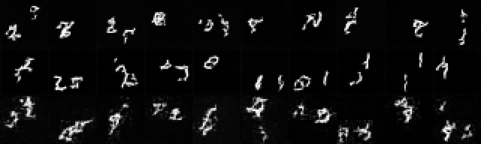
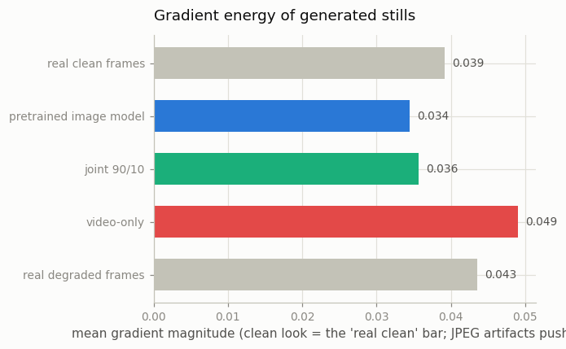
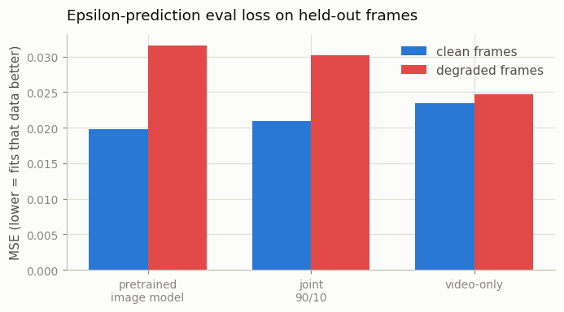
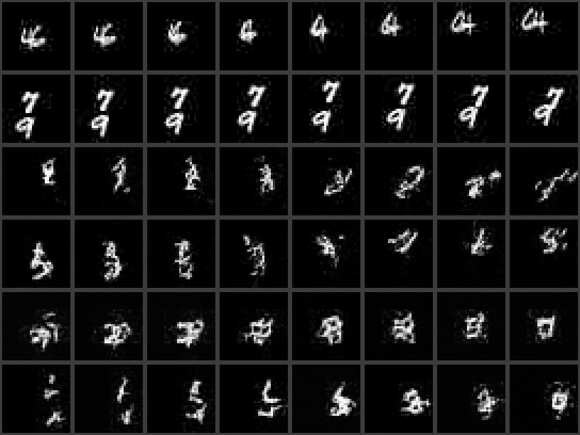

# Joint Image-Video Training

## Key Insight

When you [fine-tune](/shared/glossary/#fine-tuning) an image model on video alone, its still-image quality quietly collapses — the rich appearance knowledge it started with drifts away because video datasets are smaller and more compressed than image datasets. [Joint image-video training](/shared/glossary/#joint-image-video-training) prevents this by mixing the two in every batch — here 90% still images (each treated as a one-frame "video") and 10% real clips — so the model keeps practicing crisp single-frame generation while it learns motion. This project co-trains your inflated model both ways and compares it against a video-only run, so you can see directly how much sharper and more data-efficient the joint recipe is. It works without any change to the architecture because a still image is simply the `T=1` special case of a video: the very same layers process both.

## Why would image quality collapse at all?

Read the Key Insight's claim carefully and a puzzle appears: video *is* made of frames, so training on video *is* training on images — **isn't image quality maintained automatically?**

It would be, if video frames looked like good images. They don't. Real video datasets are smaller than image datasets and — the part that does the damage — far more heavily compressed: most public video went through a codec at an aggressive bitrate ([Phase 1](../../README.md#phase-1-foundations--video-as-a-tensor)'s point). So "train on video only" really means "train on millions of slightly blurry, block-artifacted frames", and since the fine-tune is *unfrozen* (real video fine-tunes usually are — motion learns better when spatial layers can adapt too), the spatial weights drift toward that degraded look. The pretrained crispness — learned from clean image data the video set does not contain — has nothing anchoring it in place. Joint training is that anchor: it keeps clean images in the batch mix so "what a good frame looks like" keeps being practiced.

This project builds that mechanism honestly at toy scale by recreating the *data gap*, not just the data type:

- **image source** — pristine [Moving MNIST](/shared/glossary/#moving-mnist) frames (the stand-in for a large, clean image dataset);
- **video source** — the same kind of clips, but with every frame passed through JPEG compression at quality 25 (the stand-in for "web video has been through a codec"). On a 32×32 frame, quality-25 JPEG mostly shows up as block artifacts and speckle around the strokes and a faintly mottled background — small enough that the clips still look fine in motion, big enough to matter statistically.

Without the degradation there would be nothing to demonstrate: clean-video-only training would keep image quality just fine, because the frames would already *be* clean images. The degradation is what makes the toy honest.

## What's in this directory

| File | What it does |
|------|--------------|
| `train.py` | Three stages (see "How to run"). |
| `outputs/` | Committed figures and metrics. |

Uses `vdm_lib.py` from [project 15](../15-inflate-sd-to-a-video-model/README.md) (and, through it, Phase 3's `i2v_lib.py`), `mmnist.py` from [project 06](../06-moving-mnist-predictor/README.md), `plot_style.py` from [project 01](../01-video-loader-benchmark/README.md).

## The two arms

Both arms start from the same place: [project 15](../15-inflate-sd-to-a-video-model/README.md)'s pretrained image U-Net, inflated with temporal conv + attention, **all parameters trainable**. Same step budget (700), same data seeds:

- **video-only** — every batch is 8 degraded clips;
- **joint 90/10** — each step is, with probability 0.9, a batch of 32 *clean* single frames pushed through the model as `T=1` clips, and with probability 0.1 a batch of 8 degraded clips.

The `T=1` trick deserves a beat: nothing special is coded for images. A still image enters as a one-frame video; the temporal convolution sees a length-1 sequence, the [temporal attention](/shared/glossary/#temporal-attention) attends over a single frame, and both effectively pass it through. One architecture, two data types — that is why this recipe costs nothing to adopt and why nearly every serious video model (Make-A-Video, Imagen Video, SVD's pretraining) uses some version of it. Note also that the image steps are ~8× cheaper than clip steps (32 frames vs 64, and no cross-frame mixing to learn), so the joint arm is not just better — it is *faster per step* on average.

## How the collapse is measured

Three probes, each aimed at a different aspect:

1. **Still-image generation** — sample 32 single frames (`T=1`) from noise with each model and compare their **gradient energy** (mean gradient magnitude). Clean frames have a characteristic value; JPEG blockiness and speckle push it *higher*. Reference points: real clean frames, real degraded frames, and the original pretrained image model — a drifted model's samples land near the wrong reference.
2. **Held-out eval loss** — the epsilon-prediction MSE of each model on *clean* frames vs on *degraded* frames, with identical noise draws. This is the quantitative fingerprint of drift: a model that has slid toward the degraded distribution fits degraded frames better than clean ones.
3. **Video generation** — sample 8-frame clips and check flicker / [phase-correlation](/shared/glossary/#phase-correlation) alignment, to confirm the joint arm's 10% video diet was still enough to learn motion.

## How to run

```bash
# needs ../15-inflate-sd-to-a-video-model/checkpoints/image.pt (project 15, stage image)
python3 train.py --stage video      # ~9 min: video-only fine-tune
python3 train.py --stage joint      # ~4 min: 90% images / 10% video
python3 train.py --stage figures    # ~5 min: sample stills + clips, metrics
```

## Results



Ten stills per row — **pretrained** (top), **joint 90/10** (middle), **video-only** (bottom). You do not need a metric to see the collapse: the first two rows have clean black backgrounds and compact strokes; the video-only row has mottled grey backgrounds and speckled, JPEG-mush digits. That bottom row is what "still-image quality quietly collapses" looks like — after only 700 steps of video-only fine-tuning.



The same story as numbers. Real clean frames sit at 0.039 gradient energy; real degraded frames at 0.044 (blockiness *adds* edge energy — degraded here means artifacted, not blurred). The pretrained model (0.034) and the joint arm (0.036) sit on the clean side; the video-only arm (0.049) overshoots past even the degraded reference — it has learned to *generate* compression artifacts.



The quantitative fingerprint of drift. Each model's epsilon-prediction loss on clean vs degraded held-out frames, identical noise draws:

| model | clean | degraded | gap (clean advantage) |
|---|---|---|---|
| pretrained image model | 0.0198 | 0.0316 | +0.0118 |
| joint 90/10 | 0.0210 | 0.0302 | +0.0092 |
| video-only | 0.0235 | 0.0247 | **+0.0012** |

The pretrained model is a clean-frame specialist. After video-only fine-tuning, its clean-frame loss worsens 19% while its degraded-frame loss improves 22% — the gap between the two data types nearly vanishes, meaning the model has *relocated* to the degraded distribution. The joint arm gives up almost none of its clean-frame fit (+6%) while still improving on degraded frames.

And the price paid, honestly (from `outputs/metrics.csv`, video generation):

| model | flicker | alignment response | frame gradient energy |
|---|---|---|---|
| joint 90/10 | 0.0469 | 0.550 | 0.0374 |
| video-only | 0.0521 | **0.735** | 0.0435 |
| real degraded clips | 0.0433 | 0.855 | 0.0406 |



The video-only arm learned *motion* better (alignment 0.735 vs 0.550) — no surprise, it saw ~10× more clips at the same step budget. That is the real shape of the trade-off at a fixed budget: joint training protects appearance, video-only training buys motion. Two things tilt the balance toward joint in practice. First, the joint arm's video competence keeps growing with more steps (its clip exposures accumulate; the collapse in the other arm does not undo itself), and its image steps are ~8× cheaper than clip steps, so "just train the joint arm longer" costs little. Second — visible in the last column — even when generating *video*, the joint arm produces cleaner frames (0.0374, below the degraded reference) while video-only reproduces the artifacts (0.0435). Appearance knowledge transfers from the image mix into the video mode, which is precisely the mechanism the recipe exists to exploit.

## The takeaway

The guide's [Key Advice](../../README.md#key-advice) lists joint image-video training third for a reason: it is nearly free (no architecture change, cheaper steps), it protects the single most valuable thing you start with (the pretrained appearance prior), and its cost — slower motion learning per step — is repaid by training longer. When you see a real recipe quote a "90% image / 10% video" or similar mix (Make-A-Video, Imagen Video and SVD's pretraining all do some version), this experiment is the phenomenon that number is tuned against.
