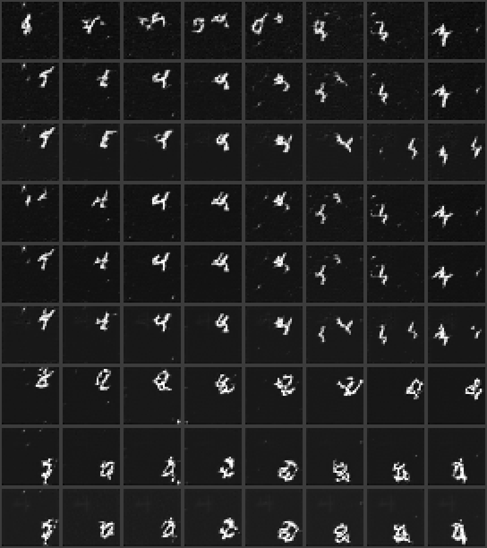
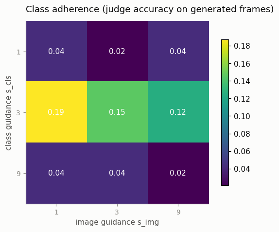
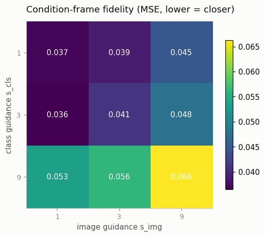
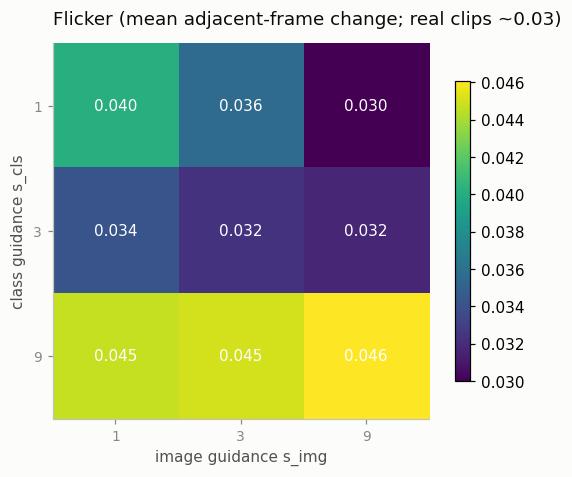
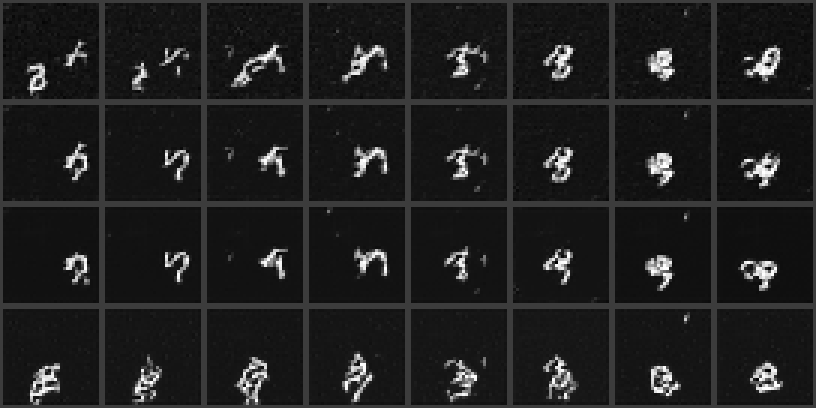

# Temporal CFG Study

## Key Insight

[Classifier-free guidance (CFG)](/shared/glossary/#cfg-classifier-free-guidance) is the inference knob that makes a [diffusion model](/shared/glossary/#diffusion-model) follow its conditioning more closely, but a video model often has *two* conditions pulling on it at once — a text prompt and a conditioning image — and each wants a different amount of push. [Video-CFG](/shared/glossary/#video-cfg) gives them separate guidance scales instead of one shared dial: turn up text guidance for tighter prompt adherence, turn up image guidance to stay faithful to the conditioning frame. This project sweeps the two scales independently and observes the trade-offs — push either too hard and the clip's colors over-saturate or its motion starts to flicker, because guidance amplifies per-frame detail at the expense of smooth change across frames. The lesson is why real video systems expose more than one guidance knob: the strength that makes the text land is rarely the strength that keeps the image and the motion clean.

## The setup: two conditions, two dials

Our stand-ins for the two conditions of a real [I2V](/shared/glossary/#i2v) system, on one-digit [Moving MNIST](/shared/glossary/#moving-mnist):

- **"text prompt" → the digit class** (0–9). A real prompt is a sentence; its job — *say what should be in the clip* — is played here by a 10-way label fed in through a learned class [embedding](/shared/glossary/#embedding).
- **conditioning image → the first frame**, fed in as an extra input channel tiled across all 8 frames.

*Why does the model need the class label when the conditioning frame already shows the digit?* In this toy the two really do overlap — deliberately, because the overlap is what makes their tug-of-war visible later. In a real system they don't: the text describes things the first frame cannot (what should *happen*, what enters the scene, style), and the frame pins down things text never could (the exact face, the exact room). The point of this project is not that you need both conditions for Moving MNIST; it is that *whenever* a model has two conditions, each needs its own guidance dial — and overlapping conditions are exactly the case where you can watch the dials fight.

Two implementation notes, both callbacks to earlier projects:

- The conditioning frame enters by **widening the input convolution** (`widen_conv_in`): the pretrained 1-channel first conv is rebuilt with 2 input channels, pretrained weights copied into channel 0, new channel zero-initialized. This is exactly what [SVD](/shared/glossary/#stable-video-diffusion-svd) does — and exactly what [project 12](../12-tiny-i2v-model/README.md) *couldn't* do, because its backbone was [frozen](/shared/glossary/#frozen); this fine-tune is unfrozen, so the widened conv can learn to read its new channel.
- "No image given" is encoded as an all-zero conditioning channel. Zero is mid-grey in the signed pixel range, and no real Moving-MNIST frame is made of mid-grey (backgrounds are −1), so the null is unambiguous.

## CFG in ninety seconds — and why "classifier-free"

Ordinary [classifier guidance](/shared/glossary/#classifier-guidance) steered diffusion with a *separately trained classifier*'s gradients. The "classifier-free" trick gets the same steering out of the diffusion model itself: during training, randomly *drop* the condition some fraction of the time, so one network learns both "denoise given the condition" and "denoise given nothing". At sampling time, run it both ways and *extrapolate past* the conditional prediction:

```
eps = eps(nothing) + s * ( eps(condition) - eps(nothing) )
```

The difference in parentheses is the direction in noise-space that the condition pulls; `s = 1` just uses the conditional model, `s > 1` exaggerates the pull. With two conditions the same move is applied twice (this is the [InstructPix2Pix](/shared/glossary/#instructpix2pix) decomposition, and how SVD-class models guide image + text separately):

```
eps = e(∅,∅) + s_img·( e(img,∅) − e(∅,∅) )  +  s_cls·( e(img,cls) − e(img,∅) )
```

Each denoising step therefore costs **three** forward passes — the real price of two dials, worth knowing before you wonder why guided video sampling is slow. Crucially, the two conditions are dropped *independently* during training (30% for the image, 20% for the class), so all four combinations in the formula are states the network has actually practiced. Drop them jointly and `e(img,∅)` would be a state the model has never seen — the second dial would point in an untrained direction.

The unusually high image-dropout rate is a lesson this project learned the hard way. With a routine 15%/15%, every class-guided sample came out *pixel-identical* to the unguided one — the class dial turned nothing. The reason is worth internalizing: while the conditioning frame is present, the class label is redundant (the digit is right there in the input!), so the training loss puts no pressure on the class pathway; the only steps that teach it are the ones where the image is *absent* and the class is not — about 13% of steps at 15%/15%, evidently too few. Redundant conditions do not just tolerate heavy dropout, they *need* it: dropout is what forces the model to learn each condition as a stand-alone signal. (Real T2V+image models face a milder version, since a text prompt carries plenty the frame does not.)

## Where conditioning is actually learned: at image scale

Raising the dropout was necessary but not sufficient — video fine-tuning alone *still* left the class dial dead. Count what the class pathway gets to learn from: 8 clips per step, class-informative only on the ~24% of steps where the image is dropped, ≈ 2,700 class-labeled examples total. Nowhere near enough to teach "what a 7 looks like" from scratch.

The fix mirrors what the real pipeline does. Stable Diffusion's text conditioning was not learned from video — it was learned from *billions of still images*, and every video model inflated from SD **inherits** it; video fine-tuning merely preserves and extends it. Our miniature of that: a `imgcls` stage first trains the model class-conditionally on *single frames* — batch 64 (8× the clip batch, at a fraction of the cost) with no conditioning frame in sight, so the class label is the only source of identity information. Only then does the video stage fine-tune with both conditions and their dropout. After this two-stage curriculum the class dial finally turns something. If you skip ahead knowing [project 16](../16-joint-image-video-training/README.md), this is its data-efficiency argument from another angle: images are the cheap, dense supervision; video is the expensive, sparse one; learn everything you can from the former.

## What's in this directory

| File | What it does |
|------|--------------|
| `train.py` | Four stages (see "How to run"): image-scale class conditioning, the dual-condition video fine-tune, a small digit classifier used as the judge, and the sweep + figures. |
| `outputs/` | Committed figures and metrics. |

Uses `vdm_lib.py` from [project 15](../15-inflate-sd-to-a-video-model/README.md), `mmnist.py` from [project 06](../06-moving-mnist-predictor/README.md), `plot_style.py` from [project 01](../01-video-loader-benchmark/README.md). Sampling uses the [DDIM](/shared/glossary/#ddim) sampler (80 steps instead of 300) — a 3×-per-step, 9-cell sweep is exactly the situation strided sampling exists for.

## The measurements

For every cell of the 3×3 grid `s_cls, s_img ∈ {1, 3, 9}` (1 = no extra push), six clips are generated and scored on:

- **class adherence** — a small CNN digit classifier (trained on real canvas frames, held-out accuracy reported in the results) reads every generated frame; adherence = fraction of frames classified as the conditioned class. This is the toy version of "did the prompt land?".
- **condition fidelity** — MSE between generated frame 0 and the conditioning frame ("did it keep my image?").
- **flicker** — mean adjacent-frame change, against the real-clip reference (~0.03). Guidance pushes each frame harder toward its conditionally-likely appearance, and does so *per frame* — the push is not coordinated across time, so overshoot shows up as temporal shimmer.

Then the **tug-of-war**: condition on a frame showing one digit but a *mismatched* class label (shifted by 5), fix `s_img = 4`, and sweep `s_cls ∈ {0, 1, 3, 9}`. The judge reports which condition wins the pixels. This is the cleanest way to *see* that the two dials are genuinely independent forces on the same sample.

## How to run

```bash
# needs ../15-inflate-sd-to-a-video-model/checkpoints/image.pt (project 15, stage image)
python3 train.py --stage imgcls     # ~7 min: class-conditional training on frames
python3 train.py --stage train      # ~12 min: dual-condition video fine-tune
python3 train.py --stage clf        # ~5 min: the digit-classifier judge
python3 train.py --stage figures    # ~10 min: 9-cell sweep + tug-of-war
```

## Results

### A second scale bug, and the fix

Even after the imgcls curriculum above, the class dial still turned almost nothing — adherence pinned near the 10%-chance floor everywhere. The final culprit was a second, more basic scale problem: the class embedding is *added* to the timestep embedding inside the U-Net (`emb = time_mlp(t) + class_emb(cls)`), and a direct probe found the timestep term's norm sitting around **5.8** while the (zero-initialized-then-trained) class embedding's norm had grown to only **~0.15** — roughly **40× fainter**. Zero-initialization is the right call for the temporal layers in [project 15](../15-inflate-sd-to-a-video-model/README.md), where it protects an identity the pretrained weights must start from; here there is no such identity to protect (class conditioning is a wholly new, unfrozen path), and nothing in ordinary training pressure pushed the embedding's scale up to where it could compete for gradient signal against a term 40× louder. The fix (now in `vdm_lib.py`) initializes the class embedding at a scale already comparable to the timestep term (~2.0) instead of at zero, so it starts *audible* rather than needing to grow into audibility. This is worth remembering as a general rule: **when two signals are combined by addition, "trainable" only helps if they can reach comparable scale — check the norms, don't assume gradient descent will find them.**

### The guidance grid



Three rows of digits, `s_cls ∈ {1, 3, 9}` top to bottom, `s_img ∈ {1, 3, 9}` left to right (each cell: 8 frames of the class-and-image-guided clip). And the numbers, from `outputs/metrics.csv`:





Read the three heatmaps together and a coherent, if not simply-monotone, story appears. Class adherence **peaks at `s_cls=3`** (up to 19%, versus a 10%-chance floor) and **falls back down at `s_cls=9`** (2–4%) — and at that same `s_cls=9` row, fidelity MSE and flicker both spike in lockstep (0.053–0.066 and 0.045–0.046, both worse than anywhere else in the grid). That is not three independent failures; it is the guidance-overshoot pattern this project's own Key Insight predicts: pushed hard enough, guidance does not just "guide harder" — the extrapolation formula walks the sample outside the region the model was ever trained to denoise, and *everything* about the sample degrades together, including the very property being guided for. A closer digit doesn't need this much force to reach; digits shown in the grid at `s_cls=9` are visibly smeared or blob-like, not sharper versions of a different class. `s_img=9` shows the same pattern along the other axis (fidelity gets *worse*, not better, past `s_img=3`) — both dials have a sweet spot, not a "more is better" direction.

### The tug-of-war

Fix `s_img=4`, condition on a frame showing one digit but a *mismatched* class label, and sweep `s_cls`:



| s_cls | frames matching mismatched class | frames matching image's real digit |
|---|---|---|
| 0 | 0.04 | 0.00 |
| 1 | 0.21 | 0.04 |
| 3 | **0.33** | 0.04 |
| 9 | 0.04 | 0.00 |

The "image digit kept" column stays pinned near zero across the whole sweep — `s_img=4` alone is not strong enough to make frames crisply classifiable as the original digit, so the original reading was never a serious contender here. What moves is the mismatched-class column: it climbs from 0.04 at `s_cls=0` to 0.21 at `s_cls=1` and peaks at **0.33** at `s_cls=3` — a third of frames pulled toward a digit the conditioning image never showed — before collapsing back to 0.04 at `s_cls=9`, the same overshoot signature as the main grid. Growing class guidance does visibly win pixels away from a fixed image guidance, right up until it pushes too far outside the training distribution for the judge to read the result as any digit at all.

## The two-dial lesson

Neither guidance scale is "more adherence, monotonically" — each has a working range, and real video systems expose separate dials for exactly this reason: the strength that makes a class (or a text prompt) land clearly is rarely the strength that keeps the conditioning image and the motion clean, and pushing either past its sweet spot costs *all* the axes at once, not just the other one. A single shared CFG scale, tuned for one condition, would have no way to express "text needs more push, image needs less" — which is precisely the situation the `s_img=1, s_cls=3` cell of this grid is in.
