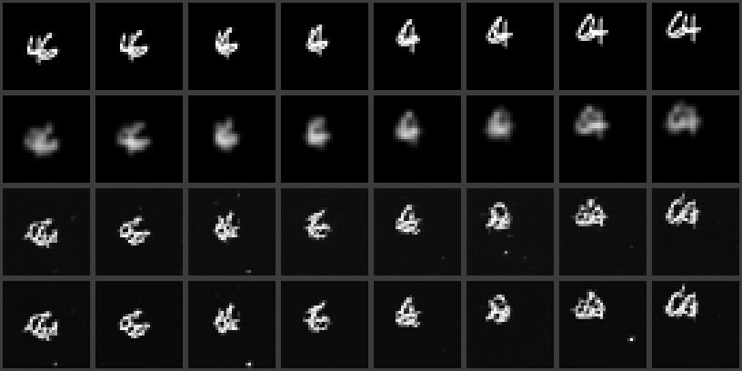
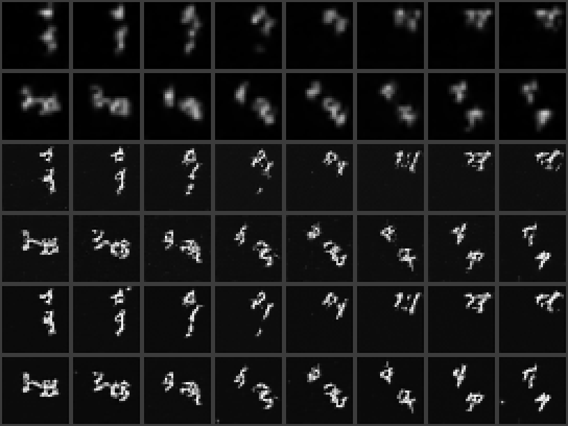
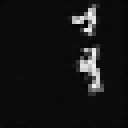
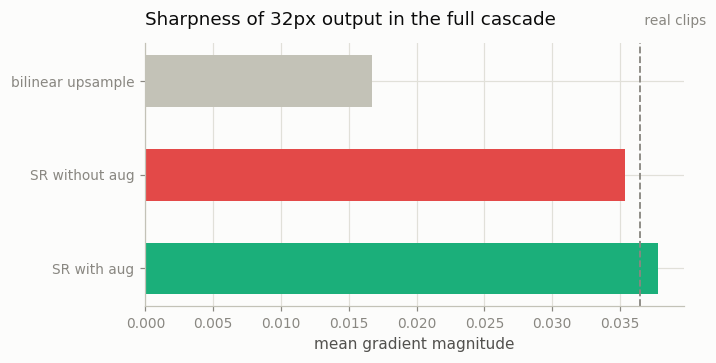
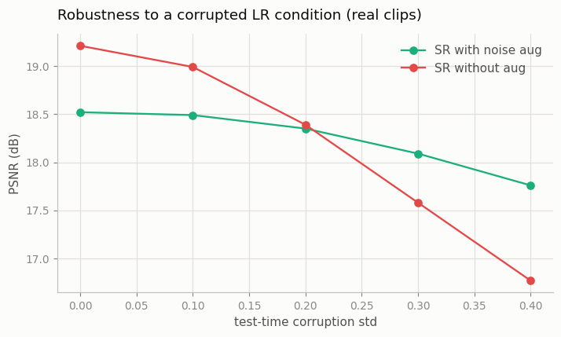
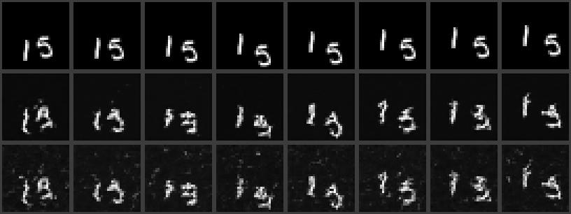

# Cascaded Super-Resolution

## Key Insight

Generating high-resolution video in one shot is brutally expensive, so an older but instructive approach splits the job: one [diffusion model](/shared/glossary/#diffusion-model) makes a small, coarse clip, and a second model — a [super-resolution](/shared/glossary/#super-resolution) model — upscales it into a sharp one. Chaining models so each cleans up and enriches the previous one's output is [cascaded diffusion](/shared/glossary/#cascaded-diffusion); Imagen Video and Make-A-Video both used it. This project builds that second stage — a "low-res video → high-res video" diffusion model conditioned on the upsampled coarse clip — so you feel why splitting resolution across stages was the dominant pre-[Sora](/shared/glossary/#sora) recipe, and why modern [latent](/shared/glossary/#latent-space) models, which compress aggressively up front, mostly dropped it. The key idea is that layout and fine detail can be learned by different models at different scales, so neither has to do the whole job at full resolution.

## Why "cascaded"?

A *cascade* is a waterfall that falls in stages, each pool spilling into the next. That is literally the architecture: a chain of diffusion models where each stage's output pours into the next stage as conditioning. Imagen Video ran a seven-stage cascade (a 16×40×24 base, then alternating spatial and temporal super-resolution stages up to 128 frames of 1280×768). Ours is the minimal two-stage version:

```
stage A  "base":  noise ──diffusion──► 8-frame clip at 16×16     (layout + motion)
stage B  "SR":    noise + upsampled LR clip ──diffusion──► 32×32 (detail)
```

Why bother splitting? Count the pixels: a 32×32 clip has 4× the pixels of a 16×16 clip, and attention/conv cost scales with pixel count (or worse). The base model — the one that has to solve the *hard* problems of layout and motion — runs on ¼ of the pixels, and the expensive full-resolution stage has the easy job of adding local detail to an answer it is handed. That division of labor is the whole idea; latent diffusion ([Phase 5](../../README.md#phase-5-latent-video-diffusion-and-video-tokenizers)) achieves the same economy by compressing once with a VAE instead of chaining diffusion stages.

## The SR stage — and two "why is that needed?" questions

The SR model is [project 15](../15-inflate-sd-to-a-video-model/README.md)'s pretrained image U-Net, inflated with temporal layers, with its input convolution **widened by one channel** (`widen_conv_in`, the SVD move) so every denoising step sees the bilinearly-upsampled low-res clip alongside the noisy high-res clip.

**Q1: The noisy high-res input already *contains* a blurry version of the image — why feed the LR clip in separately at all?** Because at high noise levels it doesn't. Early in [sampling](/shared/glossary/#sampling), the "image" part of the noisy input is almost entirely drowned out; without a clean side-channel the model would have to *invent* the layout, which is precisely the job the cascade assigned to the base model. The extra channel gives every denoising step clean, un-noised access to "what the clip should coarsely be", making the SR model a *translator* (LR→HR) instead of a generator.

**Q2: Why corrupt the LR conditioning with noise during training, when diffusion already noises the target?** This is [noise-conditioning augmentation](/shared/glossary/#noise-conditioning-augmentation), the trick that makes cascades work at all, and the two noises do different jobs. The noise on the *target* is the diffusion process itself. The noise on the *conditioning* is a data-honesty patch: during training the LR input is a perfect downsample of a real clip, but at inference it will be the base model's *generated* clip — subtly wrong in ways a perfect downsample never is. An SR model trained only on perfect LR learns to trust its conditioning completely and faithfully upscales every upstream artifact (or worse, falls apart on inputs slightly off its training manifold). Randomly corrupting the conditioning during training — each clip gets a corruption strength drawn from `[0, 0.4]` — puts "slightly wrong LR" inside the training distribution, so the model learns to *clean up* rather than *trust*. We train both versions (`sr` and `sr_noaug`) and run both on real and on generated LR clips; the gap is the point of the project.

## What's in this directory

| File | What it does |
|------|--------------|
| `train.py` | Four stages (see "How to run"). |
| `outputs/` | Committed figures and metrics. |

Uses `vdm_lib.py` from [project 15](../15-inflate-sd-to-a-video-model/README.md), `mmnist.py` from [project 06](../06-moving-mnist-predictor/README.md), `plot_style.py` from [project 01](../01-video-loader-benchmark/README.md).

## The measurements

- **On real LR inputs** (downsampled held-out clips, so ground truth exists): [PSNR](/shared/glossary/#psnr) of each SR model's output against the true 32×32 clip, with plain bilinear upsampling as the "no model at all" baseline.
- **On generated LR inputs** (the base model's samples — the actual cascade): there is no ground truth to PSNR against, so we report **sharpness** (mean gradient magnitude, with real clips as the reference line) and show the clips.

## How to run

```bash
# needs ../15-inflate-sd-to-a-video-model/checkpoints/image.pt (project 15, stage image)
python3 train.py --stage base       # ~4 min: 16x16 base video model (from scratch)
python3 train.py --stage sr         # ~9 min: SR stage WITH noise augmentation
python3 train.py --stage sr_noaug   # ~9 min: SR stage without (the ablation)
python3 train.py --stage figures    # ~5 min: run the cascade, metrics, plots
python3 train.py --stage robust     # ~8 min: corruption-robustness sweep
```

## Results

### SR on real low-res clips — and a metric that prefers blur



Rows: ground truth 32×32; bilinear upsampling of the 16×16 version; the no-aug SR model; the aug SR model. The numbers (from `outputs/metrics.csv`):

| upscaler | PSNR vs ground truth | gradient energy |
|---|---|---|
| bilinear upsample | **20.66 dB** | 0.017 |
| SR without aug | 18.79 dB | 0.037 |
| SR with aug | 18.14 dB | 0.039 |

Look at the image, then at the table, and notice they disagree: **the blurry bilinear row wins [PSNR](/shared/glossary/#psnr)** even though the SR rows are obviously better pictures (crisp strokes at the real clips' gradient energy of ~0.039, vs bilinear's 0.017 mush). The reason is a lesson this guide keeps circling back to: 16×16 does not contain enough information to say *exactly* where each stroke pixel goes, so a diffusion SR model *invents* plausible detail — and every invented stroke that lands two pixels off costs more squared error than never committing to a stroke at all. Averaging metrics reward hedging; generative models refuse to hedge. You saw the same inversion when Farnebäck beat RAFT on warp-MSE ([project 03](../03-optical-flow-visualizer/README.md)) and when cross-fade beat FILM at long gaps ([project 07](../07-film-frame-interpolation/README.md)). This is also exactly why super-resolution papers report perceptual metrics and human ratings, not PSNR alone.

### The full cascade



Rows 1–2: two clips from the 16×16 base model, bilinearly enlarged for display — coherent layout and motion, no fine detail. Rows 3–4: the no-aug SR stage's 32×32 output for those clips; rows 5–6: the aug SR stage's. Both turn blobs into stroke-level digits while preserving the base clip's layout and motion — the division of labor working as designed. An animated cascade output:





On the honest margin between the two SR arms *on this input*: aug 0.0378 vs no-aug 0.0354 gradient energy — real but modest, because our 16×16 base model is decent and its samples land close to the "perfect downsample" manifold the no-aug model trained on. The augmentation's real payoff appears when the input is *worse* than that, which is what the last experiment measures directly.

### What noise-conditioning augmentation actually buys

Feed both SR arms progressively *corrupted* LR conditioning (real clips, so PSNR has a ground truth; the corruption has the same form as the training augmentation):



| corruption std | 0.0 | 0.1 | 0.2 | 0.3 | 0.4 |
|---|---|---|---|---|---|
| SR **without** aug | **19.21** | 18.99 | 18.39 | 17.58 | 16.77 |
| SR **with** aug | 18.52 | 18.49 | 18.35 | **18.09** | **17.76** |

This is the specialization-vs-robustness trade in one table. On *perfect* input the no-aug model wins (19.21 vs 18.52 dB) — it could afford to trust its conditioning completely, and trust pays when the input deserves it. As the input degrades, the no-aug model's blind trust becomes a liability: it loses 2.4 dB across the sweep while the augmented model loses 0.8 dB, and the curves cross right around corruption 0.2 — inside the augmented model's training range. Visually, at corruption 0.3:



Ground truth on top; the augmented model (middle) still produces digits on a clean black background; the no-aug model (bottom) faithfully passes the conditioning noise through as background speckle — *garbage in, garbage upscaled*. A cascade's base model always hands the SR stage something imperfect, which is why every serious cascade (Imagen Video, Make-A-Video, SVD's own SR stage) trains with [noise-conditioning augmentation](/shared/glossary/#noise-conditioning-augmentation) and pays the small clean-input tax for it.

## Why modern models dropped the cascade

The cascade solved "diffusion can't afford full resolution" by *stacking diffusion models*; [latent](/shared/glossary/#latent-space) video diffusion ([Phase 5](../../README.md#phase-5-latent-video-diffusion-and-video-tokenizers)) solves it by *compressing once* with a VAE and running a single diffusion model in the small space. One model to train instead of a chain, no stage-to-stage mismatch to patch over with augmentation, no error accumulation across stages. The cascade survives in corners where an extra enhancement pass is still worth it (and as the historical recipe of Imagen Video and Make-A-Video) — but its *ideas* survive everywhere: stage-wise division of labor lives on in base-then-refiner image pipelines, and noise-conditioning augmentation is the same train/test-mismatch medicine you will meet again as noisy-context training in autoregressive long video ([Phase 8](../../README.md#phase-8-long-form-and-consistent-video)).
