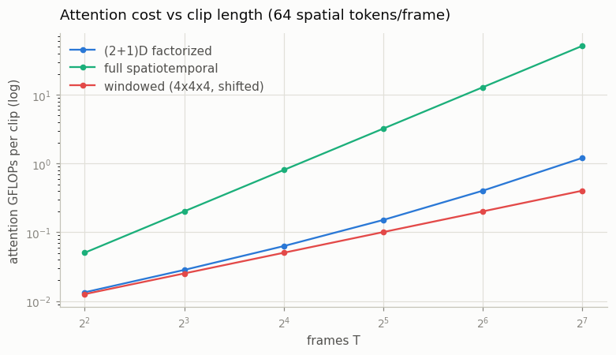
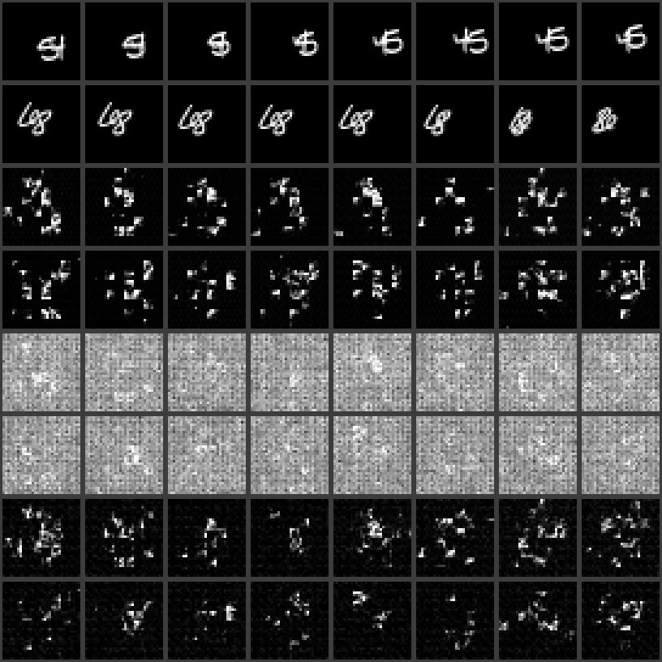
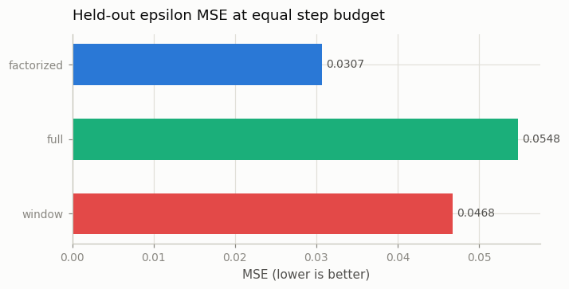

# Compare Attention Patterns

## Key Insight

The single biggest design choice in a video model is *how attention crosses the time axis*, and this project pits the three main patterns against each other on the same data, measuring both [FLOPs](/shared/glossary/#flops) (a hardware-independent count of the arithmetic each one costs) and output quality. [(2+1)D](/shared/glossary/#21d) is cheapest — each frame attends within itself, then each position attends across time in a separate step — but space and time never interact inside one layer. Full [spatiotemporal attention](/shared/glossary/#spatiotemporal-attention) lets every token attend to every other token across all frames at once, which is the most expressive but grows quadratically with `T×H×W` and gets expensive fast. [Windowed attention](/shared/glossary/#windowed-attention) is the compromise — full joint space-time attention, but only inside small local 3D windows — trading away long-range reach for far less compute. Running all three side by side turns the abstract "expressiveness vs cost" trade-off into concrete numbers you can plot.

## The testbed: one tiny video transformer, three attention wirings

To compare attention patterns cleanly, everything else must be identical — so instead of the inflated U-Nets of projects 15–18, this project uses a small video *transformer* (a mini [DiT](/shared/glossary/#dit), the architecture [Phase 6](../../README.md#phase-6-diffusion-transformers-dit-and-sora-class-models) is built around): clips are cut into 4×4-pixel [patches](/shared/glossary/#patchification) (8×8 = 64 tokens per frame × 8 frames = 512 tokens), and 4 [transformer](/shared/glossary/#transformer) blocks denoise them (epsilon prediction, same [DDPM](/shared/glossary/#ddpm) schedule as the whole phase). Each block conditions on the timestep DiT's way — [AdaLN-Zero](/shared/glossary/#adaln-zero): the timestep embedding produces per-block shift/scale/gate vectors, zero-initialized so every block starts as an identity. That detail earned its place here the hard way: a first version injected the timestep only once, added at the input, and it *trained fine but sampled pure noise* — per-noise-level probing showed epsilon prediction was good at high noise (MSE 0.005) and terrible at low noise (0.22 at `t=5`), so the last, fine-detail stretch of every sampling chain failed. Low noise is exactly where knowing `t` precisely matters most, and one addition at the input is too weak a way to know it. The three arms differ *only* in how each block's attention groups those 512 tokens:

- **factorized (2+1)D** — attention among the 64 tokens of each frame (space), then attention among the 8 time-mates of each spatial position (time). Two small attentions instead of one big one; space-time interaction happens only indirectly, across sublayers.
- **full spatiotemporal** — one attention over all 512 tokens. Every patch sees every patch of every frame.
- **windowed** — full space-time attention, but only inside 4(frames)×4×4(patches) boxes of 64 tokens. Alternating blocks *shift* the window grid by half a window (the Swin-transformer trick — named for **S**hifted **win**dows) so that tokens near a window border are not permanently walled off from their neighbors: what a token cannot see in this block, it sees in the next.

A fairness note the results table makes visible: the factorized arm has ~30% *more parameters* (each block carries two attention modules), yet — as the FLOP numbers show — it is still the cheaper computation at scale. Parameters and compute are different currencies.

## Doing the FLOP arithmetic yourself

The part of attention that depends on the pattern is the score-and-mix step (`QKᵀ` and `A·V`): every token multiplies against every token *it is allowed to see*, so its cost is `2 × (number of tokens) × (tokens each can see) × dim`. With `S` spatial tokens per frame and `T` frames:

| pattern | tokens each token sees | cost per layer | grows with clip length as |
|---|---|---|---|
| full | `T·S` | `2·(T·S)²·d` | **T²** |
| factorized | `S` then `T` | `2·(T·S²·d + S·T²·d)` | ~T (the T² term is tiny while `T ≪ S`) |
| windowed | 64 | `2·(T·S)·64·d` | T |

(The QKV/output projections cost the same in all three patterns and grow linearly, so they are excluded — the table isolates what the *pattern* changes. `train.py` also cross-checks reality with `torch.utils.flop_counter` on a full forward pass.)

The punchline is in the exponents: at our operating point (T=8, S=64) full attention is only ~7× the factorized cost — noticeable, not fatal. But full grows as **T²** while the others grow as T, so by T=64 frames the gap is ~50× and climbing. This is the Phase-4 Key Insight in numbers: full spatiotemporal attention is affordable *only if something first makes `T×H×W` small* — which is exactly the job Sora-class models give their aggressive 3D VAE ([Phase 5](../../README.md#phase-5-latent-video-diffusion-and-video-tokenizers)).

## What's in this directory

| File | What it does |
|------|--------------|
| `train.py` | The video transformer, the three attention wirings, analytic + measured FLOP counting, training and figures. |
| `outputs/` | Committed figures and metrics. |

Uses `vdm_lib.py` from [project 15](../15-inflate-sd-to-a-video-model/README.md) (schedule, training loop, DDIM sampler, metrics), `mmnist.py` from [project 06](../06-moving-mnist-predictor/README.md), `plot_style.py` from [project 01](../01-video-loader-benchmark/README.md).

## The measurements

Each arm trains for the same 2200 steps on the same [Moving MNIST](/shared/glossary/#moving-mnist) clips (transformers need noticeably more steps than the U-Nets of projects 15–18 — no convolutional inductive bias means more of "images are local" must be learned from data), then:

- **held-out epsilon MSE** — denoising error on 48 unseen clips with identical noise draws for every arm (the apples-to-apples quality number at equal budget);
- **measured seconds/step and forward FLOPs** — what the pattern costs in practice at T=8;
- **the scaling curve** — analytic attention FLOPs as the clip grows from 4 to 128 frames (the reason this choice is *the* design decision);
- **samples** — 8 clips per arm (full 300-step ancestral [sampling](/shared/glossary/#sampling)), with flicker and [phase-correlation](/shared/glossary/#phase-correlation) alignment against real clips.

## How to run

```bash
python3 train.py --stage train --arm factorized   # ~9 min
python3 train.py --stage train --arm full         # ~8 min
python3 train.py --stage train --arm window       # ~7 min
python3 train.py --stage figures                  # ~4 min
```

## Results

### The cost curve — the reason this design choice exists



At `T=8` (this project's operating point) full spatiotemporal attention costs ~7× the factorized pattern — real, but not yet dramatic. Follow the lines to `T=128` and full costs **~40× factorized and ~120× windowed**, because it is the only one of the three that grows as `T²` rather than `T`. This is not a knob you can safely ignore: whatever clip length your model targets, this chart tells you whether full attention is still affordable there.

### Quality and samples — an honest surprise

Measured at the same 2200-step budget (also in `outputs/metrics.csv`):

| arm | params | held-out eps MSE | s/step | forward GFLOPs | flicker | alignment |
|---|---|---|---|---|---|---|
| (2+1)D factorized | 971,344 | **0.0307** | 0.139 | 0.62 | 0.074 | **0.511** |
| full spatiotemporal | 710,608 | 0.0548 | 0.144 | 0.47 | 0.092 | 0.144 |
| windowed | 710,608 | 0.0468 | 0.104 | 0.47 | 0.070 | 0.288 |
| real clips | — | — | — | — | 0.046 | 0.929 |



Rows, top to bottom: real clips; factorized; full; windowed (two clips each). At this budget, **factorized wins on every quality axis**, full is worst, and windowed lands in between — the opposite order from "more expressive should mean better." The samples make it vivid: full attention's rows are barely-there noise with faint smudges, while factorized produces the clearest (if still imperfect) moving digits.

Why would the most expressive pattern lose? Two honest reasons, not "attention is bad":

1. **Optimization difficulty scales with expressiveness.** Full attention gives every one of 512 tokens a say over every other token in one softmax — a much larger, more entangled space to fit than factorized's two small, structured attentions (64-token and 8-token). At a fixed, modest step budget, the *easier* optimization landscape wins; full attention's extra expressiveness is real capacity that this budget cannot afford to use.
2. **Factorized effectively gets more layers for the same depth.** Every "factorized block" contains two attention operations (spatial then temporal) versus the other arms' one, so 4 factorized blocks apply 8 attention operations total — real extra computation (and 36% more parameters), not a free lunch, but it does mean the direct comparison at "4 blocks" is not a comparison at equal attention depth.

This is a legitimate, reproducible finding at *this* scale and budget — and also a caution against over-generalizing it. Production Sora-class models train full or windowed attention for far more steps, at far larger scale, specifically because more data and optimization time let the extra expressiveness pay off; the field did not converge on (2+1)D by accident, but neither did it abandon full attention — it paired full attention with the aggressive latent compression from [Phase 5](../../README.md#phase-5-latent-video-diffusion-and-video-tokenizers) that keeps `T×H×W` small enough to afford it. The lesson to take from this table is not "(2+1)D is always better" — it's that **expressiveness has to be paid for in optimization budget, not just FLOPs**, and a toy-scale sweep at a fixed step count will always show that bill coming due before the payoff arrives.



## Where this goes next

The FLOPs-vs-quality trade-off measured here is the design axis [Phase 6](../../README.md#phase-6-diffusion-transformers-dit-and-sora-class-models) resolves at production scale: Sora-class models pick full or windowed spatiotemporal attention *and* an aggressive 3D VAE together, because the VAE is what makes `T×H×W` small enough for the expensive pattern to be worth its optimization cost.
