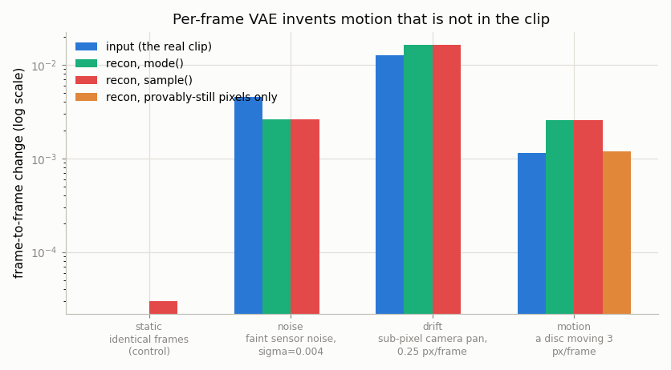
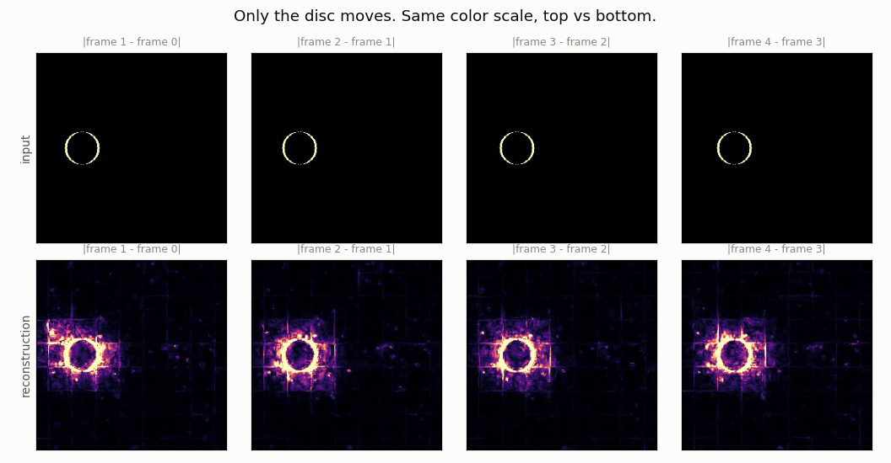
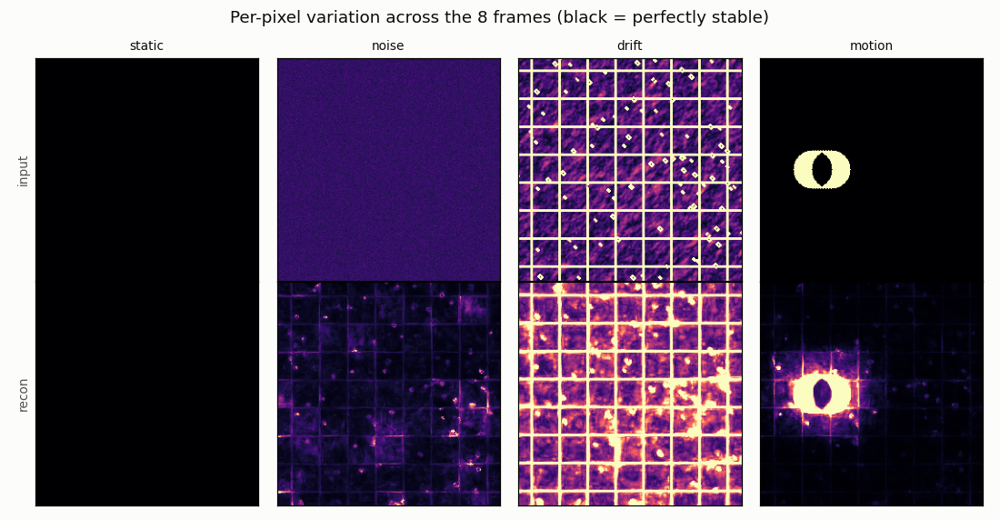
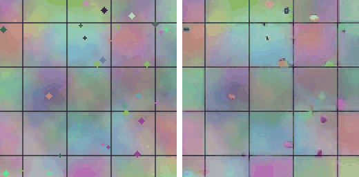

# Frame-by-Frame 2D VAE

## Key Insight

The cheapest way to push video into a [latent space](/shared/glossary/#latent-space) is to run a [Stable Diffusion](/shared/glossary/#stable-diffusion) image [VAE](/shared/glossary/#vae) on each frame on its own — no new training, no time axis. But a lossy compressor always leaves *some* reconstruction error, and which details it sacrifices depends on exactly how the content lines up with its compression grid. So the moment anything in the scene moves, the error pattern shifts with it, and that shifting error is what you see as [temporal flicker](/shared/glossary/#temporal-flicker): textures shimmer and flat areas pulse even in parts of the frame that never changed at all. This project makes that failure visible — and pins down its real cause, which is *not* the one most people guess. It motivates the [3D VAE](/shared/glossary/#3d-vae) in the next project, which compresses across time too and so cannot make inconsistent per-frame decisions in the first place. The lesson is that per-frame compression throws away the one thing video has that a stack of images doesn't — the fact that neighboring frames are almost identical.

## What this project actually does

No training. We take the **already-trained** VAE that ships inside Stable Diffusion 1.5, push each frame of a short clip through `encode` → `decode` independently, and measure how much frame-to-frame change the round trip *invented*.

Then we do something this kind of demo usually skips: rather than showing shimmer and blaming "the VAE", we run four clips designed to **rule out the wrong explanations one at a time**, until only the real cause is left standing.

## Background: what the VAE is doing here

A [VAE](/shared/glossary/#vae) (Variational AutoEncoder) is a pair of networks. The **encoder** squeezes an image into a small grid of numbers — the [latent](/shared/glossary/#latent-space) — and the **decoder** rebuilds the image from it. Stable Diffusion's VAE takes a 256×256 RGB image and returns a 4×32×32 latent:

```
image   256 x 256 x 3 = 196,608 numbers
latent    4 x  32 x 32 =   4,096 numbers      48x smaller
```

The compression is lossy — 48× smaller cannot be exact — so the decoded image is *close to* the original, never identical. Ours come back at about **27 dB [PSNR](/shared/glossary/#psnr)**, which for a single still image looks essentially perfect to the eye. (PSNR is measured in decibels on a logarithmic scale, so +6 dB means roughly half the error; the absolute number only means something compared against another number from the same test.)

**"Variational" — why that word?** An ordinary autoencoder's encoder outputs one point. A *variational* one outputs a whole probability distribution — a mean and a spread — and you draw the latent from it. The name comes from *variational inference*, a statistics technique for approximating a distribution you cannot compute directly by picking the closest member of a simpler family you can compute with. That is what the encoder does: it proposes a plain Gaussian as a stand-in for the true, unknowable distribution of latents that could have produced this image. This matters below, because it leaves us two ways to pick the latent:

- `mode()` — take the mean, the single most likely latent. Deterministic.
- `sample()` — draw randomly from the distribution. This is what Stable Diffusion actually does during training.

*If the encoder is random, isn't `sample()` obviously the flicker culprit?* That is the natural first guess, and the experiment below tests it directly. It turns out to be wrong, and knowing *why* it is wrong is more useful than the guess being right would have been.

## The four clips

Real footage mixes every possible cause of flicker at once — motion, camera shake, sensor noise, codec artifacts — so with real footage you can never tell which one the VAE is reacting to. `scenes.py` instead builds four synthetic 256×256 clips that change **exactly one thing each**:

| Clip | What changes between frames | The guess it tests |
|------|-----------------------------|--------------------|
| `static` | nothing — the frames are bit-identical | "the VAE is just inconsistent from run to run" |
| `noise` | faint sensor noise, σ = 0.004 | "tiny pixel-value wobble sets it off" |
| `drift` | the camera pans 0.25 px per frame | "sub-pixel motion sets it off" |
| `motion` | one disc crosses the frame at 3 px/frame | "ordinary visible motion sets it off" |

The background is fractal noise plus hard edges (a thin grid, scattered dots). That is deliberate: a lossy compressor spends its error budget on the *sharpest* detail, so a clip of smooth gradients would hide the effect entirely.

## Results

### The headline chart



"Flicker" here is the mean absolute change between neighboring frames — the number your eye reads as shimmer when the scene is supposed to be still. Blue is the real clip, green and red are the reconstruction. The scale is logarithmic, so a missing bar means an exact zero.

From `outputs/metrics.csv` (the `mode()` rows):

| Clip | input flicker | recon flicker | ratio | PSNR |
|------|--------------:|--------------:|------:|-----:|
| static | 0.000000 | **0.000000** | — | 27.38 dB |
| noise  | 0.004505 | **0.002588** | **0.57×** | 27.36 dB |
| drift  | 0.012675 | **0.016401** | 1.29× | 28.63 dB |
| motion | 0.001147 | **0.002544** | **2.22×** | 27.29 dB |

Now read it as a sequence of eliminations.

### Elimination 1 — the VAE is not "randomly inconsistent"

On the `static` clip the reconstruction flicker is **exactly 0.000000**. Feed the network identical pixels twice and you get identical output twice; there is no gremlin adding jitter of its own. Whatever flicker is, it is a *response to something changing in the input*.

### Elimination 2 — the random latent is not the culprit either

`sample()` draws the latent randomly instead of taking the mean, so it looks like the obvious source of frame-to-frame randomness. Compare the green and red bars: the same height everywhere. On the static clip, switching to `sample()` raises flicker from 0 to **0.00003** — about 1% of the flicker on the motion clip, and far below anything an eye could catch.

The reason is worth keeping. A well-trained encoder, shown a real image, is *confident* about which latent explains it, so the "distribution" it reports is a very narrow spike and drawing from it lands essentially on the mean. The variational machinery does its work during **training**, where the injected noise is what forces nearby latents to decode to similar images and keeps the latent space smooth. It is not a meaningful source of randomness at inference time.

### Elimination 3 — pixel noise does not set it off; the VAE actually *cleans it up*

The `noise` clip is the surprise. Its input flickers at 0.0045 and its reconstruction flickers at 0.0026 — the round trip **reduced** frame-to-frame change by 43%.

That is not a bug, it is what lossy compression *is*. Independent per-pixel noise is the highest-frequency, least-structured content in an image, exactly what an 8×-downsampling encoder has no room to store, so it gets dropped. If raw sensitivity to tiny pixel changes were the mechanism, this clip would have been the worst case. Instead it is the best one in the table.

### What is left: motion

Only two clips make the reconstruction flicker *more* than the input: `drift` (1.29×) and `motion` (2.22×). Both are motion. And the `motion` clip lets us sharpen the claim as far as it will go.

In that clip exactly one disc moves. `run.py` builds a mask of pixels that are **provably identical in every single frame** of the input — 63,734 of 65,536, or **97% of the frame**. Across those pixels the input change is, by construction, exactly zero. The reconstruction's change across those same pixels is **0.00118** — as large as the flicker of the entire input clip, moving disc included.



Top row: `|frame t − frame t−1|` of the input. Black everywhere except the disc's outline, because nothing else moved. Bottom row: the same difference for the reconstruction, on the **same color scale**. The grid lines, the dots and the texture all light up — across the whole frame, including regions the disc never goes near.



Per-pixel variation across all 8 frames; black means perfectly stable. The `static` column is black in both rows (Elimination 1, visually). The `motion` column's input is black apart from the disc — its reconstruction is lit up everywhere.

And the animation, cropped to a corner of the background the disc **never touches** — input on the left, reconstruction on the right:



### Why motion — and only motion — does this

The VAE's error is deterministic, but it is not *smooth* with respect to the input. The encoder's convolutions divide the image into a grid of 8×8-pixel cells, and each cell's 4 latent numbers must summarize 192 pixel values. Which details survive that summary depends on how the content happens to line up inside the cell.

Move the disc by 3 pixels and every cell it overlaps receives a different mix of content, so each one re-rolls *which* of its details it keeps. The reconstruction error changes — and because neighboring cells feed the same decoder convolutions, that change bleeds outward into pixels that never moved. That is the halo spreading around the disc in the error maps.

So: **flicker is not randomness, it is the reconstruction error moving.** The error was always there — 27 dB means even a still image is imperfect — but on a still image the error is *frozen*, and your eye files it away as texture. Once content moves, the error pattern moves with it, and a moving error is exactly what human vision is built to notice.

This also explains why `drift` is such a strong result: a quarter-pixel per frame is motion no human would ever call motion, yet it changes every cell's alignment at once and produces the largest absolute flicker in the table.

## The other half of the problem: nothing was compressed in time

Even if flicker were solved, per-frame encoding would still be a dead end, for a reason the flicker charts do not show.

The image VAE compresses 48× — but **per frame**. A 16-frame clip costs exactly 16 latents; a 5-second clip at 24 [fps](/shared/glossary/#frame-rate-fps) costs 120. The time axis is untouched.

And leaving it untouched is spectacularly wasteful. `metrics.csv` records how much the *latents* change between neighboring frames, next to their typical size:

| Clip | mean \|latent\| | mean latent change per frame | change as % of size |
|------|---------------:|-----------------------------:|--------------------:|
| motion | 0.612 | 0.0157 | **2.6%** |
| noise  | 0.593 | 0.0187 | 3.2% |
| drift  | 0.624 | 0.0903 | 14.5% |

On the motion clip, **97% of each latent is a repeat of the previous one**. You are paying full price, sixteen times over, to store almost the same numbers — the [temporal redundancy](/shared/glossary/#temporal-redundancy) of Phase 1, still completely unexploited.

*So why not bolt a second compressor on top of this one, or just smooth the latents across time?* Both are patches at the wrong layer. Smoothing blurs real motion along with the flicker, because by that point the information about *why* a latent changed is already gone — a latent that moved because the disc moved and one that moved because a cell re-rolled its details look the same. And a compressor stacked on a frozen image encoder can only remove redundancy the first encoder already committed to keeping. The fix has to happen *inside* the encoder, where the network can look at several frames at once and decide what to keep on the basis of all of them together. That is exactly the [3D VAE](/shared/glossary/#3d-vae) of [project 21](../21-train-a-small-3d-vae/README.md): one encoder that sees a whole block of frames, spends its budget once for the block, and therefore has no opportunity to make inconsistent per-frame decisions.

## What's in this directory

| File | What it does |
|------|--------------|
| `scenes.py` | Builds the four 256×256 diagnostic clips. |
| `run.py` | Runs the VAE round trip, writes `metrics.csv` and every figure. |
| `outputs/` | Committed figures and metrics. |

Uses `plot_style.py` from [project 01](../01-video-loader-benchmark/README.md). The VAE weights come from the `emilianJR/epiCRealism` [checkpoint](/shared/glossary/#checkpoint) — an ordinary SD 1.5 model whose VAE is the stock one; we load only its `vae` subfolder and ignore everything else.

## How to run

```bash
python3 run.py                  # ~3 min on CPU (no training, no GPU needed)
python3 run.py --figures-only   # redraw the charts from the cached round trip
```

## Takeaways

1. **Per-frame flicker is not randomness.** The VAE is deterministic, and its stochastic latent contributes about 1% of the observed effect. Both obvious suspects are innocent.
2. **Flicker is reconstruction error in motion.** A still image's error is invisible because it is frozen; motion re-rolls which details survive compression, and a moving error is what you see.
3. **A lossy compressor removes noise.** The clip with the noisiest input reconstructed *more* stably than the clean ones — the opposite of the intuitive prediction.
4. **97% of a latent is a repeat of the previous latent.** Even with flicker fixed, per-frame encoding leaves the whole time axis uncompressed — which is the opening [project 21](../21-train-a-small-3d-vae/README.md) walks through.
