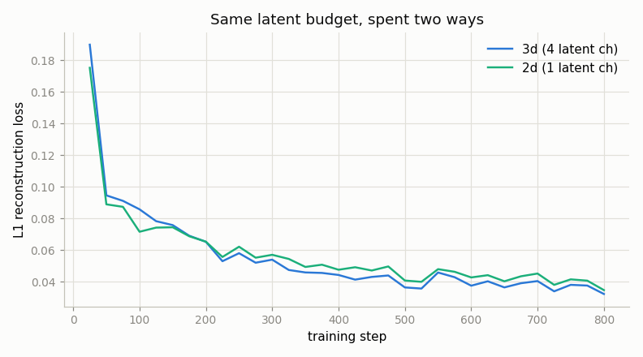
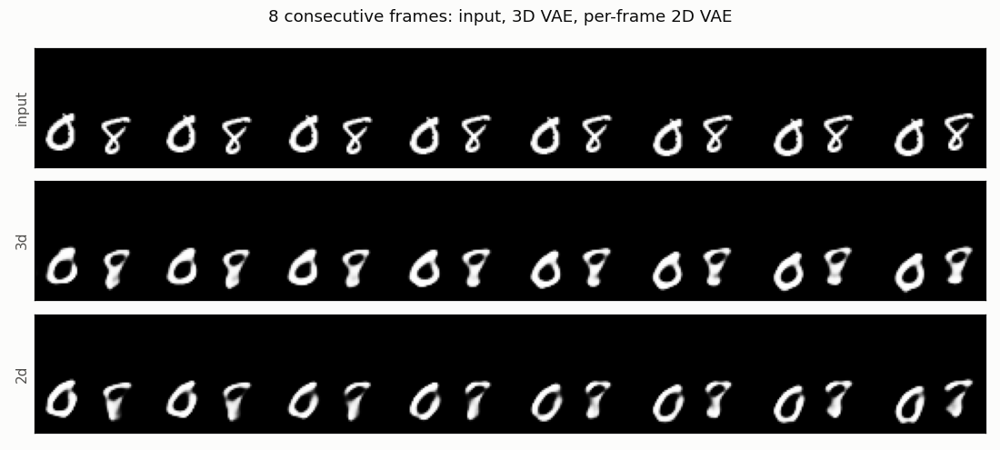
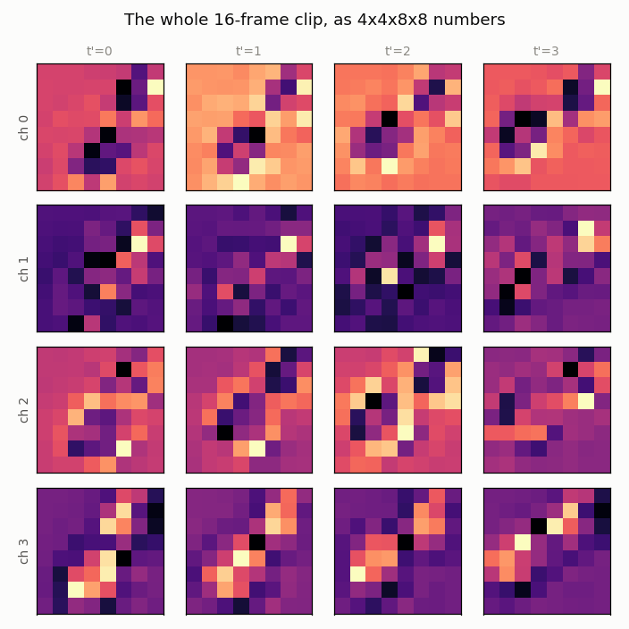
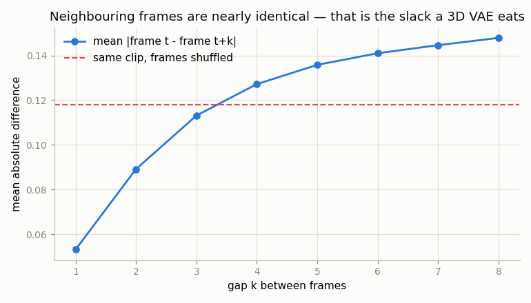

# Train a Small 3D VAE

## Key Insight

A [3D VAE](/shared/glossary/#3d-vae) fixes the waste of per-frame compression by squeezing *time* as well as height and width — it merges small groups of neighboring frames into one [latent](/shared/glossary/#latent-video) slice, exploiting the fact that consecutive frames barely change. This project trains a small one and then answers the question that actually matters: **given a fixed number of latent numbers, is it better to spend them across time or per frame?** We build both, hold the budget exactly equal, and measure. That single compressor, trained once and then frozen, is what later lets a [diffusion model](/shared/glossary/#diffusion-model) run on a handful of latent frames instead of the full pixel [tensor](/shared/glossary/#tensor).

> **A note on the dataset.** The phase description suggests [UCF-101](/shared/glossary/#ucf-101), the standard video benchmark. These projects run on a CPU in under ten minutes each, and UCF-101 is a multi-gigabyte download whose 3-channel 240p clips would put a single training step out of reach. We use 64×64 [Moving MNIST](/shared/glossary/#moving-mnist) instead. Everything structural — the shapes, the strides, the compression arithmetic, the trade-offs — is identical; only the pixel content is simpler. Where that simplicity changes a *conclusion*, this README says so explicitly (see "the claim that did not survive contact with the data").

## The shape math

Our clip is 16 frames of 64×64 greyscale. The encoder compresses 8× in space and 4× in time:

```
clip     1 x 16 x 64 x 64  = 65,536 numbers
latent   4 x  4 x  8 x  8  =  1,024 numbers      64x smaller
         ^    ^      ^   ^
         |    |      +---+-- 64/8 = 8, so 8x spatial compression
         |    +-- 16/4 = 4, so 4x temporal compression
         +-- latent channels: 1 greyscale channel becomes 4 latent channels
```

Note that the channel count went *up*, from 1 to 4. That is normal, and it is not cheating: the time, height and width axes shrink by 4 × 8 × 8 = 256×, and giving each surviving position 4 numbers instead of 1 hands back a factor of 4, for 64× net. Real 3D VAEs do the same at larger scale — CogVideoX turns 3 RGB channels into 16 latent ones — because a latent position has to summarize a whole *block* of pixels and needs more than one number to say what is in it.

**Why is a 3D convolution called "3D"?** Because its [kernel](/shared/glossary/#kernel) slides along three axes — time, height, width — instead of two. A 2D conv applied to a video sees each frame separately no matter how many you stack; a 3D conv's kernel spans several frames at once, so one output number can depend on what happened before and after it. That is the entire mechanism by which the encoder can notice "these four frames are nearly the same" and store them once.

*If a 2D VAE run per frame already compresses each frame 8× spatially, isn't a 3D VAE just that, sixteen times over?* No — they differ in what they are *allowed to notice*. A per-frame encoder is architecturally blind to the other frames: even if frames 5 and 6 were bit-identical, it has no way to represent "same as the last one" and must pay full price for both. A 3D encoder sees the whole block, so it can spend its budget on what *changed* and leave the rest implicit. [Project 20](../20-frame-by-frame-2d-vae/README.md) measured how much is on the table: 97% of an image VAE's latent is a repeat of the previous latent.

## The experiment: identical budget, spent two ways

The tempting comparison is "3D VAE beats 2D VAE" — but that one is rigged, because the two would be compressing by different amounts and the winner is decided before the experiment starts. So both arms here produce **exactly 1,024 latent numbers**:

| Arm | Latent shape | Numbers | Compression | What it can exploit |
|-----|--------------|--------:|------------:|---------------------|
| `3d` | 4 × **4** × 8 × 8 | 1,024 | 64× | space **and** time |
| `2d` | 1 × **16** × 8 × 8 | 1,024 | 64× | space only |

The `2d` arm is the same network with its temporal [strides](/shared/glossary/#stride) set to 1 and its channel count dropped from 4 to 1 — same architecture, same recipe, near-identical parameter count (733,555 vs 749,113). It keeps all 16 frames but is allowed only **one** number per latent position, because that is what an equal budget buys when you refuse to compress time. Any difference in the results therefore comes from *where* the budget went, and nothing else.

## Results

### Quality: the 3D arm wins, modestly

From `outputs/metrics.csv`:

| Arm | [PSNR](/shared/glossary/#psnr) | recon flicker | training time (800 steps) |
|-----|------:|--------------:|--------------------------:|
| `3d` | **20.23 dB** | 0.0409 | **425 s** |
| `2d` | 19.61 dB | 0.0427 | 542 s |



The 3D arm's L1 loss sits below the 2D arm's for essentially the whole run, finishing **0.62 dB** ahead. In plain terms: given the same number of latent numbers, spending some of them on compressing time buys a slightly better picture than spending them all per frame. The margin is real but small — worth saying plainly — and it is small because Moving MNIST is close to a best case for the *2D* arm: simple high-contrast shapes on a black background are exactly the content that survives aggressive spatial compression intact.

Both curves are still descending at step 800. These are 10-minute CPU runs, not converged models; the *ranking* is the result, not the absolute numbers.



Both arms produce recognizable, slightly blurred digits following the right trajectory. Look closely and you can see the limit of 64× compression: digit *identity* sometimes drifts, and an 8 comes back looking like a 7. The compressor keeps position and rough shape — what varies most across the dataset — and spends least on fine stroke detail.

Here is the entire 16-frame clip as the 1,024 numbers the encoder keeps:



Four channels (rows) × four latent time-slots (columns), each an 8×8 grid. Each column stands for four real frames. You can see the bright/dark blobs migrate left-to-right across the columns, tracking the digits' motion — the latent has not thrown the trajectory away, it has just stored it coarsely.

### The result nobody expects: the 3D arm is also *faster*

425 s versus 542 s for the same 800 steps — the 3D arm trained **22% faster**, despite having slightly *more* parameters.

This inverts the intuitive story that temporal compression is a memory saving you pay for in compute. The decoder is where the cost sits, and the 3D decoder starts from 4 latent frames and only reaches 16 at its very last layer, so most of its convolutions run over a 4-frame tensor. The 2D decoder carries all 16 frames through *every* layer. Compressing time does not only make the latent smaller — it makes every layer that touches the latent cheaper. That compounding is exactly why [project 24](../24-diffusion-on-latents/README.md) can afford to train a diffusion model at all.

### Why 4× in time, and not 8× or 2×?

Not a magic number — you can measure it. `figure_redundancy` asks how different two frames are when they sit *k* frames apart, and compares that against a baseline: the same clip with its frames randomly shuffled, which is how different two frames of this dataset are when they have nothing to do with each other.



| Gap *k* | mean difference |
|--------:|----------------:|
| 1 | 0.053 |
| 2 | 0.089 |
| 3 | 0.113 |
| 4 | 0.127 |
| 8 | 0.148 |
| *shuffled* | *0.118* |

Adjacent frames differ by 0.053 — less than half the shuffled baseline of 0.118. That gap **is** the [temporal redundancy](/shared/glossary/#temporal-redundancy): the slack a 3D VAE eats. But the curve crosses the shuffled line at about *k* = 3.4. Past roughly three to four frames apart, two frames of this dataset are as unrelated as two frames picked at random, so there is no shared content left to merge and compressing them together would simply destroy information.

That is the reasoning behind the "4× temporal" convention — and it is not universal, because it is a property of the *content*, not of video in general. Slow cinematic footage stays correlated much longer and tolerates more temporal compression; fast sports footage or rapid scene cuts tolerate less. Trust the measurement, not the convention.

### The claim that did *not* survive contact with the data

[Project 20](../20-frame-by-frame-2d-vae/README.md) showed that per-frame compression invents [temporal flicker](/shared/glossary/#temporal-flicker), so you would expect the 3D arm to win clearly on temporal consistency. It does not. The `flicker_error` metric — how much frame-to-frame *change* the round trip gets wrong — comes out at **0.0496 for the 3D arm and 0.0499 for the 2D arm** — a 0.6% difference, which is noise.

Reporting that rather than burying it is the point. The explanation is in project 20's own mechanism: flicker came from a lossy compressor re-rolling which *texture detail* survives as content shifts position. Moving MNIST has no texture. It is hard-edged white strokes on pure black, with no fine detail whose survival could flip from frame to frame. The dataset that makes this project fast enough for a CPU is also the dataset least able to show project 20's effect.

The general lesson: a metric can be correct, an effect can be real, and the two can still fail to meet because the test data leaves the effect no room to appear.

## Implementation notes worth knowing

These are the choices in `vae3d_lib.py` that look arbitrary and are not.

**The KL weight is 1e-6, which is almost zero — so why include it at all?** A [VAE](/shared/glossary/#vae)'s [KL divergence](/shared/glossary/#kl-divergence) term (named after Solomon **K**ullback and Richard **L**eibler, who introduced it in 1951 as a measure of how far one probability distribution sits from another) normally pulls the latent distribution towards a standard bell curve, so that you can *sample* new latents from that bell curve and decode them into new videos. We are never going to sample from this VAE — a diffusion model does the sampling in [project 24](../24-diffusion-on-latents/README.md). But turn the term off entirely and nothing stops the encoder inflating the latent scale without limit, since bigger numbers are easier to tell apart and reconstruction loss alone rewards that forever. The tiny weight is a leash, not a prior. [Stable Diffusion](/shared/glossary/#stable-diffusion) uses the same value for the same reason. Crank it up instead and you risk [posterior collapse](/shared/glossary/#posterior-collapse), where the encoder gives up and reports the same bell curve whatever it is shown.

**Then how does the latent get a sane scale?** Separately, and after the fact. `latent_scale()` runs the trained encoder over some clips, measures the standard deviation of the output and stores 1/std — 1.522 for our 3D arm. Diffusion noise schedules are written assuming their input has a standard deviation near 1, and a VAE trained with a near-zero KL weight has no reason to comply. This is exactly where Stable Diffusion's otherwise mysterious `0.18215` comes from: somebody measured it once, and it has been hard-coded ever since.

**L1 loss, not L2.** Squared error, faced with an ambiguous region, hedges by predicting the *average* of the plausible answers — and the average of several sharp possibilities is a blur. On a moving edge that blur is the most visible artifact there is. L1 hedges toward the median instead, which stays sharp.

**GroupNorm, not BatchNorm.** BatchNorm normalizes using statistics gathered across the batch; with 8 clips those statistics are noisy, and they differ between training and evaluation. GroupNorm normalizes within each sample, so batch size stops mattering.

**Nearest-neighbour upsampling followed by a conv, not `ConvTranspose3d`.** A transposed convolution's strides overlap unevenly, leaving a faint checkerboard in its output. On a still image that is cosmetic; on video the checkerboard shimmers as content moves — precisely the artifact this phase exists to remove.

**The stem downsamples space while it lifts channels.** A stride-1 first conv followed by a separate stride-2 conv would run a full 16×16-channel convolution at the untouched 16×64×64 resolution. On a CPU that one layer costs more than the entire rest of the encoder, for very little gain.

## What's in this directory

| File | What it does |
|------|--------------|
| `vae3d_lib.py` | The 3D VAE, the causal conv, the data helpers and all shared metrics. **Imported by projects 22, 23 and 24.** |
| `train.py` | Trains both arms and draws the figures. |
| `outputs/` | Committed figures and metrics. |
| `checkpoints/` | Trained weights (gitignored; regenerate with the commands below). |

Clips come from `mmnist.py` in [project 06](../06-moving-mnist-predictor/README.md), restored to the original 64×64 canvas — project 06 had shrunk it to 32×32 for its CPU ConvLSTM, and 8× spatial compression needs a canvas that survives being halved three times. Plot styling is `plot_style.py` from [project 01](../01-video-loader-benchmark/README.md).

## How to run

```bash
python3 train.py --stage 3d        # ~7 min on CPU
python3 train.py --stage 2d        # ~9 min on CPU
python3 train.py --stage figures   # ~1 min
```

## Takeaways

1. **At equal latent budget, compressing time beats not compressing it** — by 0.62 dB here, on a dataset close to the friendliest possible case for the per-frame control.
2. **Temporal compression makes the model faster, not slower** (22% here). Every decoder layer after the bottleneck runs on 4 frames instead of 16, and the saving compounds through the network.
3. **4× temporal compression is a measurement, not a convention.** Frames of this dataset stop being related at a gap of about 3–4, so 4 is where merging stops being free. Different content gives a different answer.
4. **The KL term at weight 1e-6 is a leash, not a prior**, and the latent scale is fixed afterwards by measurement. That is where SD's `0.18215` comes from.
5. **A real effect can fail to appear if the data leaves it no room.** The flicker advantage did not show, because Moving MNIST has no texture to flicker.
