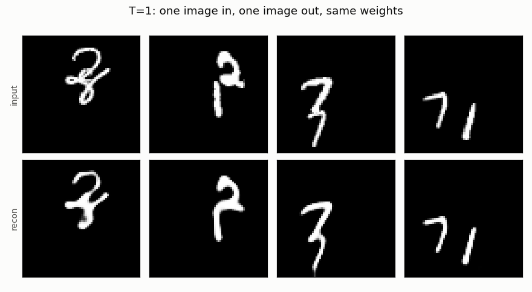
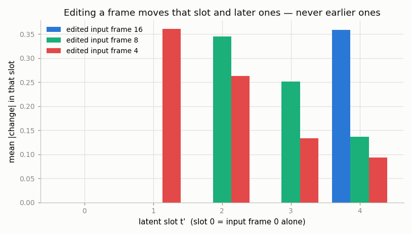
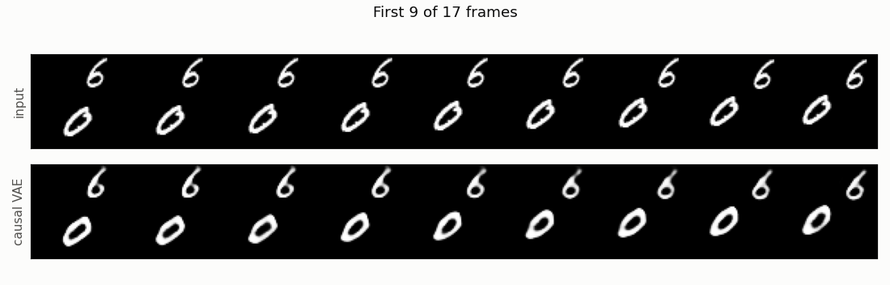

# Causal 3D VAE

## Key Insight

A [causal 3D VAE](/shared/glossary/#causal-3d-vae) is a video compressor built so that each frame is encoded using only itself and *earlier* frames. That one restriction buys something specific: a **single** image can be encoded correctly, because there are no later frames it needs to be merged with. This is exactly why frontier video models use them — they can [co-train on images and video](../16-joint-image-video-training/README.md) through one shared compressor instead of maintaining two separate encoders, and one shared [latent](/shared/glossary/#latent-video) space instead of two. This project makes the change (it is essentially one line of [padding](/shared/glossary/#padding)), then *verifies* it rather than trusting it — and the verification is what makes the project worth doing, because it caught a bug that reading the code never would have.

## What "causal" means, and why the word

**Causal** is borrowed from the everyday principle that a cause must come before its effect. A causal layer is one whose output at frame *t* is computed from frames *t*, *t−1*, *t−2*, … and never from *t+1*. The same word is used in signal processing for filters that cannot see the future, and in language models for the [causal mask](/shared/glossary/#causal-mask) that stops a token from attending to the words after it.

The change itself is small. An ordinary `Conv3d` with `padding=1` pads **both** ends of the time axis, so output frame *t* is built from input frames *t−1*, *t*, *t+1*. To make it causal we move all of that padding to the front:

```
non-causal:   [pad] f0 f1 f2 f3 ... f15 [pad]     output t sees t-1, t, t+1
causal:  [pad][pad] f0 f1 f2 f3 ... f15           output t sees t-2, t-1, t
```

Space is padded normally — there is no "future" in the up/down direction. The front padding replicates frame 0 rather than filling with zeros: zeros would tell the network "before this clip, the screen was black", an event it would then waste capacity encoding.

## The payoff: the 1 + 4k convention

With two stride-2 temporal stages, a causal encoder maps **1 + 4k frames onto 1 + k latent frames**. Frame 0 gets a latent slot entirely to itself; every following group of 4 frames shares one slot. That is why this project's clips are **17** frames long rather than 16: 17 = 1 + 4×4 → 5 latent frames. Feed it 16 and the final group comes out ragged.

The special treatment of frame 0 is the whole point, and `outputs/shapes.csv` shows what it buys:

| Model | frames in | latent frames | frames out | round trip intact? |
|-------|----------:|--------------:|-----------:|:------------------:|
| **causal** | 1 | 1 | **1** | ✅ |
| **causal** | 5 | 2 | **5** | ✅ |
| **causal** | 9 | 3 | **9** | ✅ |
| **causal** | 17 | 5 | **17** | ✅ |
| non-causal ([project 21](../21-train-a-small-3d-vae/README.md)) | 1 | 1 | **4** | ❌ |
| non-causal | 5 | 2 | **8** | ❌ |
| non-causal | 9 | 3 | **12** | ❌ |
| non-causal | 17 | 5 | **20** | ❌ |

Read the non-causal rows carefully, because they are the argument. Hand [project 21](../21-train-a-small-3d-vae/README.md)'s VAE a **single image** and you do not get an error — you get **four frames back**. Its decoder upsamples time by 4× unconditionally, because it was built on the assumption that every latent frame stands for exactly four real ones. There is no way to tell it "this one is just a picture." The causal model knows, because slot 0 is *defined* as frame 0 alone.

*Why does that matter, when you could simply keep a separate image VAE around?* Because two VAEs means two different latent spaces, and a diffusion model trained in one cannot use data encoded in the other. The reason to unify them is data: image datasets are vastly larger and cleaner than video datasets, and [project 16](../16-joint-image-video-training/README.md) showed what mixing them in buys. That mixing only works if a still image and a video clip land in the *same* latent space — which requires one encoder that handles both. The causal design is what makes that one encoder possible.

Here it is doing exactly that — four isolated single images in, four images out, from the same weights that handle 17-frame clips:



## Verifying causality instead of assuming it

It is easy to write causal padding, convince yourself it is right, and be wrong. So `causality_probe` tests the property directly: overwrite one input frame with noise, re-encode, and measure how much each latent slot moved. A causal encoder must leave every **earlier** slot bit-for-bit unchanged.



From `outputs/causality.csv`:

| edited input frame | slot 0 | slot 1 | slot 2 | slot 3 | slot 4 |
|---|---|---|---|---|---|
| 16 | **0.000000** | **0.000000** | **0.000000** | **0.000000** | 0.358677 |
| 8 | **0.000000** | **0.000000** | 0.345353 | 0.251815 | 0.136746 |
| 4 | **0.000000** | 0.361163 | 0.262917 | 0.133161 | 0.093863 |

Exact zeros, not merely small numbers — editing the last frame moves *only* the last slot. Note also that influence spreads *forward* and fades (edit frame 4 and slots 1→4 move by 0.36, 0.26, 0.13, 0.09), which is what a stack of causal convolutions should do: later frames still feel the edit, through a widening but weakening receptive field.

### The bug this probe caught

The first version of this project failed the probe. Editing the last frame changed **every** slot, all by about the same amount, even though every convolution was correctly causal.

The culprit was the normalization layer. `nn.GroupNorm` on a `(B, C, T, H, W)` tensor computes its mean and variance across `T` as well as height and width. So the statistics used to normalize frame 0 depended on every later frame — **information flowed backwards in time through the normalizer**, around all the careful convolution padding. Causality is a property of the *whole network*, and it takes only one layer that pools over time to destroy it.

The fix (`PerFrameGroupNorm` in `vae3d_lib.py`) folds `T` into the batch axis so each frame is normalized by its own statistics, exactly as it would be if it had arrived alone. That also quietly fixes a second problem: a 1-frame input and a 17-frame input would otherwise produce statistics computed over wildly different amounts of data, so the same weights would face two different normalization regimes — precisely the image-and-video case this VAE exists to serve.

**The transferable lesson:** when a network is supposed to have a structural property, test the property, not the code that is supposed to provide it. No amount of staring at the convolution definitions would have found this, because the convolutions were right.

### The second bug: a causal *decoder* will not train

Making the decoder's convolutions causal too seems obviously correct — and it stops the model training at all. Every configuration collapsed within 50 steps to a constant black image (reconstruction standard deviation 0.0000, L1 stuck at 0.104), while the same code with a symmetric decoder trained normally.

Isolating it took a bisection: causal encoder + symmetric decoder trains fine (17.0 dB), the reverse does not, and the failure survives swapping out the normalization and the upsampler. So it is specifically the causal convolutions *in the decoder*.

The resolution is to notice that a causal decoder was never needed. **Causality is a property of the encoder** — it decides what each latent slot is allowed to see, which is what makes `T=1 → T'=1` work and what an [autoregressive](/shared/glossary/#autoregressive-model) model over these tokens requires. The decoder is handed the whole latent sequence at once, so it gains nothing from being blinded to half of it. This VAE therefore uses a **causal encoder, a symmetric decoder, and the 1 + 4k temporal upsample** that keeps frame 0 standing alone. (A *streaming* decoder that emits frames as they arrive would genuinely need causal decoder convolutions — that is a different design with a different cost, and not what these projects need.)

Why the causal decoder specifically fails is a hypothesis rather than a demonstrated mechanism: one-sided padding means the earliest output frames rest almost entirely on replicated padding rather than on real content, and a constant output is the cheapest thing that satisfies those frames — after which the output `tanh` saturates and the collapse becomes permanent, since `tanh`'s gradient at its extremes is zero. Reported here as a measured result with a plausible explanation, not a solved mystery.

## Results

Compared against [project 21](../21-train-a-small-3d-vae/README.md)'s non-causal VAE, trained identically (`outputs/metrics.csv`):

| Model | video [PSNR](/shared/glossary/#psnr) | single-image PSNR | flicker error |
|-------|------:|------:|------:|
| **causal** (this project) | 19.81 dB | **21.17 dB** | 0.0508 |
| non-causal (project 21) | **20.23 dB** | *cannot do it* | 0.0496 |



Two things to take from this table.

**Causality costs about 0.4 dB.** That is the price of the restriction, and it is exactly what you should expect: a causal encoder is forbidden from using information that is genuinely available and genuinely useful. Frame 5's compression cannot be improved by peeking at frame 6, even though frame 6 is sitting right there in the clip. You pay a small, real quality tax in exchange for a capability.

**Single images reconstruct *better* than video** — 21.17 dB versus 19.81. Not a contradiction: a single frame gets an entire latent slot to itself, while frames 1–16 share four slots between them, four real frames to a slot. The image case is simply the easiest thing this compressor is ever asked to do, and its score reflects a 4× more generous budget per frame.

Training also mixes in single frames 25% of the time (`P_IMAGE`). A causal model *can* accept a 1-frame clip from day one, but "can" is not "is good at": trained only on 17-frame clips, frame 0's encoder path would only ever be exercised as the opening of a video. Feeding it isolated frames a quarter of the time trains that path as a stand-alone image encoder too — the miniature version of the image/video co-training real 3D VAEs do.

## What's in this directory

| File | What it does |
|------|--------------|
| `train.py` | Trains the causal VAE, then runs the shape table, the causality probe and the figures. |
| `outputs/` | Committed figures, plus `shapes.csv`, `causality.csv` and `metrics.csv`. |
| `checkpoints/` | Trained weights (gitignored). |

The model itself lives in `vae3d_lib.py` in [project 21](../21-train-a-small-3d-vae/README.md) — `CausalConv3d`, `PerFrameGroupNorm`, and the decoder's `causal_up` flag. The comparison rows need project 21's `checkpoints/3d.pt`, so train that one first.

## How to run

```bash
# needs ../21-train-a-small-3d-vae/checkpoints/3d.pt
python3 train.py --stage train     # ~7 min on CPU
python3 train.py --stage figures   # ~1 min
```

## Takeaways

1. **Causal means "never look at the future"**, implemented by moving all the temporal padding to the front. That single change makes `T=1 → T'=1 → 1 frame` work.
2. **The non-causal VAE does not merely do *worse* on a single image — it returns four frames.** That is why a separate image VAE is otherwise unavoidable, and why one shared latent space needs a causal encoder.
3. **Verify structural properties; do not assume them.** A correct stack of causal convolutions was still non-causal, because `GroupNorm` pooled statistics across time and leaked information backwards.
4. **Causality belongs in the encoder.** Making the decoder causal as well prevented training entirely, and the decoder sees the whole latent sequence anyway.
5. **The restriction costs about 0.4 dB.** A real capability at a real price — worth it when you want one compressor for both images and video.
