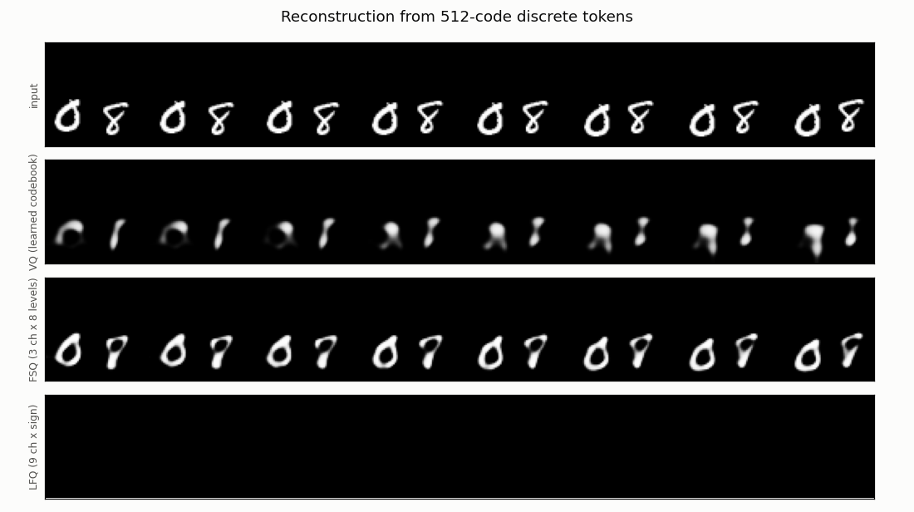
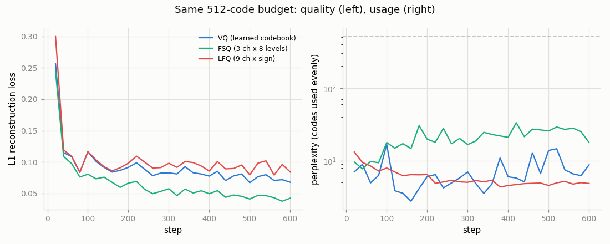
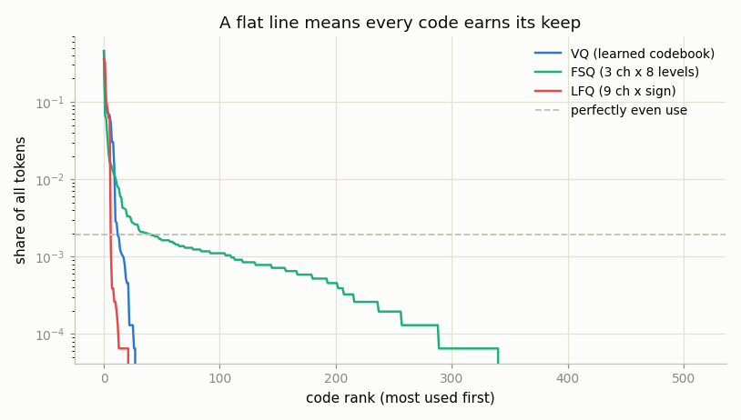

# MagViT-v2-Style Tokenizer

## Key Insight

Diffusion models want *continuous* latents, but [transformer](/shared/glossary/#transformer) and [autoregressive](/shared/glossary/#autoregressive-model) models want *discrete* tokens — and [MagViT-v2](/shared/glossary/#magvit-v2) is the strongest open recipe for turning video into a grid of discrete codes. This project rebuilds its core idea: instead of a learned [codebook](/shared/glossary/#codebook) (which can suffer [codebook collapse](/shared/glossary/#codebook-collapse), where most entries go unused), it discretizes each latent with [FSQ](/shared/glossary/#fsq) or [LFQ](/shared/glossary/#lfq) — two codebook-free schemes that simply snap each coordinate onto a fixed grid, sidestepping collapse by construction. You measure quality with a [reconstruction-FID](/shared/glossary/#fid) proxy: encode real clips to tokens, decode them back, and score how close the rebuilt frames look to the originals. The payoff is that good discrete video tokens let you generate video with the very same next-token machinery used for language.

## Why discrete tokens at all?

[Project 21](../21-train-a-small-3d-vae/README.md)'s VAE already compresses a clip 64×, and its latent is a grid of *real numbers* — exactly what a [diffusion model](/shared/glossary/#diffusion-model) wants. So why throw that precision away and round everything to one of 512 values?

Because a different family of generative model — the [autoregressive](/shared/glossary/#autoregressive-model) one that powers language models — can only predict from a **finite menu**. "Autoregressive" means the model predicts the next item from the items before it (*auto-* = self, *regress* = to look back: it regresses on its own past output). At each step it produces a probability *distribution over the possible next tokens*, and a probability distribution needs something finite to distribute probability over. With continuous latents there are infinitely many possible next values and no way to write a softmax over them.

Discretize, and a video becomes literally a sequence of integers — at which point the entire toolkit built for text (next-token prediction, cross-entropy loss, temperature sampling) applies to video unchanged. That is the trade: give up some reconstruction precision, gain access to a completely different and very well-developed class of model.

## Three quantizers, one fair comparison

All three arms use the **same** causal 3D encoder/decoder from [project 22](../22-causal-3d-vae/README.md) and the **same vocabulary of exactly 512 codes**. Holding the vocabulary fixed is what makes the comparison mean anything: more codes trivially reconstruct better, so a 1024-code method beating a 512-code one would say nothing about the method.

| Arm | How a latent position becomes a code | Codes |
|-----|--------------------------------------|------:|
| **VQ** | look up the nearest of 512 learned vectors | 512 |
| **FSQ** | 3 channels, each rounded to one of 8 levels | 8³ = 512 |
| **LFQ** | 9 channels, each rounded to its sign | 2⁹ = 512 |

### The problem all three must solve: rounding has no gradient

Rounding is flat almost everywhere. Nudge its input slightly and the output does not move at all, so the derivative is zero, so no gradient reaches the encoder and the encoder never learns.

Every quantizer here survives on the same workaround, the [straight-through estimator](/shared/glossary/#straight-through-estimator): run the *rounded* value forward, but during the backward pass pretend the rounding was the identity function. The name is literal — the gradient passes straight through the quantizer as if it were not there. In code it is the one-line idiom `x + (q - x).detach()`: the value equals `q`, while the gradient flows as though it were `x`.

### VQ: the original, and its famous failure

[VQ-VAE](/shared/glossary/#vq-vae) keeps a table of 512 learned vectors and replaces each latent with the nearest entry. Because the straight-through trick routes the reconstruction gradient *around* the lookup and back to the encoder, the table is never touched by that gradient — so it needs two loss terms of its own:

- **codebook loss** pulls each code vector towards the latents that chose it;
- **commitment loss** pushes the encoder's output towards the code it picked, so the encoder commits instead of drifting away and leaving the codebook chasing it forever.

The failure this invites is [codebook collapse](/shared/glossary/#codebook-collapse). A code that never gets picked receives no gradient, so it never moves, so it stays unpicked — dead forever. Early in training a handful of codes win by luck and the rest starve.

### FSQ: delete the table

[FSQ](/shared/glossary/#fsq) (Finite Scalar Quantization) asks: what if there were nothing to collapse? Each *scalar* — each channel of the latent — is independently rounded to one of a *finite* list of levels. With levels `[8, 8, 8]` a position is 3 numbers, each one of 8 values, so the code is one of 8×8×8 = 512 combinations. The vocabulary is *implied by the grid* rather than stored anywhere: no table, nothing to train in the quantizer, no entry that can go unused.

*Isn't rounding to a grid just what VQ does, only with a table?* No, and the difference is exactly what makes FSQ immune. VQ's code vectors are **learned parameters that move**, and it is their movement that starves. FSQ's levels are **fixed constants** — the grid is identical at step 1 and step 1,000,000. An unpopular code has no mechanism by which to become unreachable.

One implementation detail is worth flagging because it fails silently: with an *even* number of levels, `round(tanh(z) * 3.5)` lands in −3…3 — only **seven** values, so an "8-level" quantizer is quietly a 7-level one. Shifting by half a step first makes the range −4…3: eight values, as advertised.

### LFQ: FSQ taken to the extreme

[LFQ](/shared/glossary/#lfq) (Lookup-Free Quantization), the quantizer MagViT-v2 actually uses, gives every channel exactly **two** levels. Each channel is replaced by its sign, so a 9-channel latent becomes 9 bits and the code is the integer those bits spell out. "Lookup-free" because there is no table to look anything up in — the code *is* the pattern of signs.

## Results

| Arm | [PSNR](/shared/glossary/#psnr) | codes used | perplexity | rFID proxy |
|-----|------:|-----------:|-----------:|-----------:|
| VQ  | 15.70 dB | 5.5% | 7.0 | 759.8 |
| **FSQ** | **19.25 dB** | **66.8%** | **24.9** | **236.0** |
| LFQ | 13.64 dB | 5.3% | 5.0 | 1412.7 |





**Perplexity** is the honest usage number. Raw "codes used" counts any code that appeared even once; perplexity is 2^(entropy of the code distribution) — read it as *the number of codes being used evenly*. A tokenizer that touches 400 codes but spends 99% of its mass on three of them scores high on usage and low on perplexity, and perplexity is the one telling the truth.



This chart is the clearest single picture of collapse. Each curve shows what share of all tokens goes to the *n*-th most popular code, sorted. The dashed line is perfectly even use. FSQ's curve stretches out to rank ~340 and tracks the even-use line through the middle of its range; VQ's and LFQ's fall off a cliff by rank ~30, beyond which the vocabulary is decoration.

### VQ collapsed, exactly as advertised

VQ ended using **5.5% of its codes**, at a perplexity of **7 out of 512** — a 512-word vocabulary spoken with seven words. The reconstructions show the cost: blobs that track roughly the right position but have lost the digits entirely.

FSQ, with an identical encoder, decoder, training budget and vocabulary size, reached perplexity 24.9 and **3.55 dB** higher PSNR. That is the headline: **FSQ beats VQ here not by being more sophisticated but by being simpler.** Removing the learned table removed the failure mode.

Be careful how far you carry that, though. The glossary's phrasing — FSQ "stays competitive with VQ-VAE" — is the accurate general claim: at scale, with the rescue tricks VQ implementations have accumulated (EMA codebook updates, restarting dead codes, k-means initialization), a well-tuned VQ is a strong baseline and not the wreck it is here. What this experiment shows is narrower and still useful: **a naive VQ collapses, a naive FSQ does not.** FSQ's selling point is that it needs no rescue tricks in the first place.

### LFQ did not converge, and the diagnosis is the lesson

LFQ finished at 13.64 dB — the constant-output floor. Its row in the reconstruction figure is simply black. Reporting that rather than quietly dropping the arm matters, so here is what went wrong and what was tried.

**First failure: the loss went NaN.** Nothing in LFQ constrains the *magnitude* of the encoder's output, since only the sign is used — and the entropy term is minimized by being as confident as possible, i.e. by pushing |z| → ∞. So z exploded. Adding a **commitment loss** (anchoring z to the ±1 it will be rounded to, exactly the role commitment plays in VQ) fixed the NaN.

**Second failure: collapse to a single code.** With magnitudes tamed, every position still produced the same sign pattern. MagViT-v2's entropy loss has two halves — minimize per-position entropy (be decisive) and maximize batch-average entropy (do not all decide the same thing). Measuring them separately showed the first half was *actively harmful* at this scale: it is minimized by large |z|, which a network can achieve while leaving every sign identical, so raising its weight made usage **worse** (5.7% → 3.5% as the weight went 0.5 → 5.0). Keeping only the batch-average term helped (perplexity 1.0 → 5.0) but did not rescue the arm.

The honest conclusion is about *budget*, not about LFQ. One bit per channel is a far coarser signal than FSQ's eight gradations, and the gradient through `sign()` is correspondingly noisier, so LFQ is simply harder to optimize — it wants more steps, a bigger model, and warmup tricks than a 6-minute CPU run allows. MagViT-v2 shows it works very well at scale. **What this project demonstrates is that FSQ is the one that works when you have little compute and no tuning budget** — which, for a learner, is the more actionable fact.

### About the rFID number

Published FID uses [InceptionV3](/shared/glossary/#inception-network) trained on ImageNet, whose features are tuned to separate dog breeds and vehicles; on 64×64 white-on-black digits it would spend its capacity on distinctions that do not exist here. `fid_lib.py` instead trains a small CNN to classify *this* dataset's digits and uses its penultimate layer as the feature space — an in-domain extractor, as FID variants for specialised domains also do.

Stated plainly: **these numbers are comparable only to each other.** An rFID of 236 here means nothing beside a published rFID of 236. The feature network also reaches only 42.4% held-out accuracy, making it a coarse instrument — fine for separating 236 from 760 from 1413, not fine for splitting hairs between two close arms.

FID compares *sets*, not pairs: it models each set of feature vectors as a single Gaussian and measures the Fréchet distance between them (named after Maurice Fréchet, who defined this distance between probability distributions). The formula has two parts — how far apart the two clouds' centres sit, and how differently they are spread. A model that produced one perfect frame over and over would score well on the first part and terribly on the second.

## What's in this directory

| File | What it does |
|------|--------------|
| `quant_lib.py` | The three quantizers and the code-usage statistics. |
| `fid_lib.py` | The feature network and the Fréchet distance. Reused by [project 24](../24-diffusion-on-latents/README.md). |
| `train.py` | Trains one arm per invocation, then draws the figures. |
| `outputs/` | Committed figures and `metrics.csv`. |

Encoder, decoder and data come from `vae3d_lib.py` in [project 21](../21-train-a-small-3d-vae/README.md); the causal-encoder / symmetric-decoder split is [project 22](../22-causal-3d-vae/README.md)'s finding.

## How to run

```bash
python3 train.py --stage clf       # ~2 min: the feature network for rFID
python3 train.py --stage vq        # ~7 min
python3 train.py --stage fsq       # ~6 min
python3 train.py --stage lfq       # ~6 min
python3 train.py --stage figures   # ~2 min
```

## Takeaways

1. **Discretizing is not about compression, it is about access.** Tokens buy the entire next-token toolkit built for language; the price is precision.
2. **Rounding has no gradient**, and every quantizer here survives on the same straight-through trick: round forwards, pretend it was the identity backwards.
3. **A naive VQ collapses** — 5.5% of codes, perplexity 7 of 512 — because unpicked codes get no gradient and so stay unpicked. A well-tuned VQ with rescue tricks is a different story.
4. **FSQ wins here by being simpler, not cleverer.** Fixed grid levels are constants, so nothing *can* starve. Same encoder, same 512 codes, +3.55 dB.
5. **Report the arm that failed.** LFQ needed a commitment loss just to avoid NaN and still did not converge in budget — a fact about one-bit-per-channel gradients and a 6-minute CPU run, not a verdict on the method.
