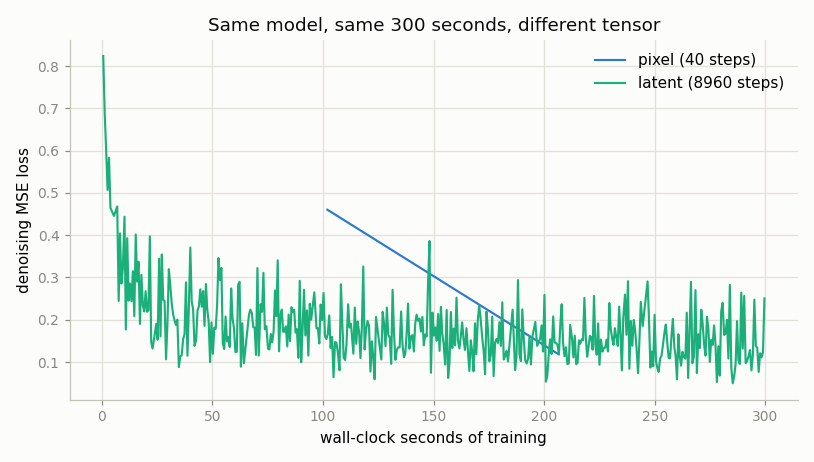
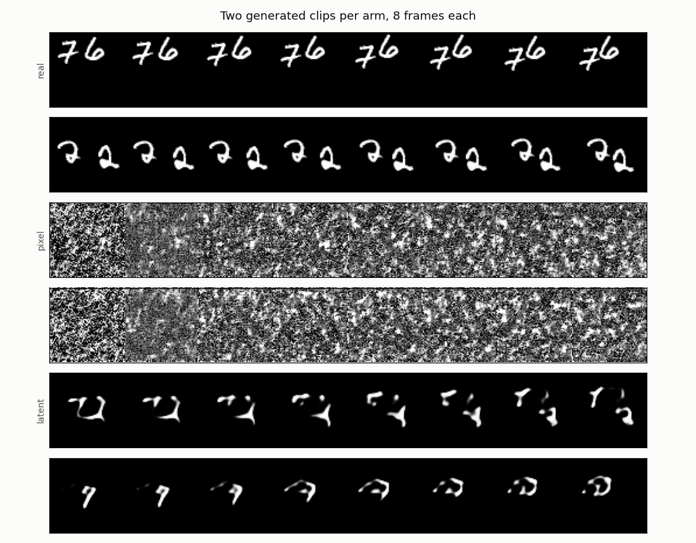

# Diffusion on Latents

## Key Insight

This project assembles the two halves of modern video generation: put the trained [3D VAE](/shared/glossary/#3d-vae) in front of a small video [diffusion model](/shared/glossary/#diffusion-model), so denoising runs entirely on compressed [latent video](/shared/glossary/#latent-video) instead of raw pixels — the same [latent-diffusion](/shared/glossary/#ldm) move that made [Stable Diffusion](/shared/glossary/#stable-diffusion) practical for images. Because the latent tensor is 64× smaller here, each training step is dramatically cheaper and far longer clips fit in memory than pixel-space diffusion could manage. Comparing the two side by side makes the headline result of Phase 5 concrete: given the *same wall-clock budget*, latent diffusion is not a little better, it is the difference between a working model and noise.

## The experiment: equal seconds, not equal steps

The same [U-Net](/shared/glossary/#u-net) denoiser — same depth, width, schedule and optimizer — is trained twice. Only the tensor it denoises differs:

| Arm | What it denoises | Numbers per clip |
|-----|------------------|-----------------:|
| `pixel` | the raw clip, `(1, 16, 64, 64)` | 65,536 |
| `latent` | the frozen VAE's latent, `(4, 4, 8, 8)` | 1,024 |

Each arm gets exactly **300 seconds**. This is the design decision that makes the project worth running.

*Why not just compare at the same number of steps?* Because that comparison is rigged, and rigged in a way that hides the actual result. Of course a 64×-smaller tensor is faster per step — that is arithmetic, not a finding. Fixing the step count would let the pixel arm take as long as it likes and would answer a question nobody has. Fixing the *seconds* answers the question a practitioner actually asks: **given one afternoon of compute, which setup gives me the better model?**

## Two-stage training, and why the VAE is frozen

The VAE is trained first ([project 21](../21-train-a-small-3d-vae/README.md)), then **frozen**, then the diffusion model is trained in its latent space. Training them jointly would be a moving target: every VAE update would shift the meaning of every latent, so the diffusion model would spend its capacity chasing a representation that keeps changing underneath it.

Because the VAE is frozen, a clip's latent never changes — so `--stage cache` encodes the whole training pool **once** and reuses it. That is not an approximation, just a refusal to redo identical work 9,000 times. Real pipelines do the same at a larger scale, writing latents to disk before diffusion training begins.

### The scale factor, in action

`build_cache` multiplies every latent by the VAE's stored scale factor (1.522 here) and reports the result:

```
cached (640, 1, 16, 64, 64) clips -> (640, 4, 4, 8, 8) latents,
scale 1.522, latent std 1.004
```

That `1.004` is the point. Diffusion noise schedules are written assuming their input has a standard deviation near 1 — the whole "add noise until the signal is gone" arithmetic is calibrated to that. A VAE trained with a near-zero KL weight has no reason to comply, so you measure its output's spread once and divide by it forever. This is exactly what Stable Diffusion's hard-coded `0.18215` is: somebody's measurement of *their* VAE, frozen into the code. Skip this step and the model trains against a noise schedule mismatched to its data.

## Results

### The headline

From `outputs/metrics.csv`:

| Arm | steps in 300 s | ms per step | sampling time | rFID proxy |
|-----|---------------:|------------:|--------------:|-----------:|
| `pixel` | **59** | 5147 | 220.6 s | 53,472.6 |
| `latent` | **8,974** | 33 | **1.3 s** | **90.4** |

The latent arm completed **152× more training steps** in the same wall clock, and samples **170× faster**.





Rows: real clips, then two samples from each arm. The pixel arm produces **pure noise** — after 59 steps a diffusion model has barely begun to learn what direction "less noisy" even is. The latent arm produces digit-like strokes that hold together and move coherently across the 8 frames.

This is a more brutal result than "latent diffusion is more efficient." At a fixed, realistic budget, pixel-space diffusion on 16×64×64 clips **did not get off the ground at all**. The 64× smaller tensor is not a nice optimization; on this hardware it is the entire difference between a model and a random-number generator.

### Reading the rFID numbers honestly

A single quality number is easy to over-trust, so `figures` computes a calibration ladder — two extra rows that are not models at all:

| What | rFID proxy | What it tells you |
|------|-----------:|-------------------|
| real clips vs *other* real clips | **4.7** | the floor: two samples of the same distribution |
| VAE reconstructions of real clips | **30.9** | the ceiling any latent-arm sample can reach |
| **latent diffusion samples** | **90.4** | the actual result |
| pixel diffusion samples | 53,472.6 | noise |

The middle row matters most and is easy to miss. Every latent-arm sample must come out through the same VAE decoder, so **the latent arm can never score better than 30.9** — the VAE's own reconstruction error is a floor built into the pipeline. The generator's real contribution is the gap from 30.9 to 90.4, not the whole distance from zero.

That is the honest framing of latent diffusion's central trade-off: you make generation affordable by handing the fine detail to a decoder, and in exchange you inherit that decoder's ceiling. If the VAE cannot reconstruct a face, no amount of diffusion training in its latent space will generate one. This is why every "Sora-class" team spends as much effort on the VAE as on the diffusion backbone — the VAE sets the maximum quality the whole system can ever reach.

The 4.7 row is a sanity check on the measuring instrument: two disjoint sets of *real* clips should score near zero, and 4.7 confirms the metric is not manufacturing differences out of sampling noise. (As in [project 23](../23-magvit-v2-style-tokenizer/README.md), this is an in-domain proxy, not a published-comparable [FID](/shared/glossary/#fid).)

### Why the latent arm is so much faster per step

33 ms versus 5,147 ms is a 154× gap, which is larger than the 64× compression ratio. The extra factor comes from where the tensor sits in the network. The clip is 64× bigger in *numbers*, but it is also spatially 8× larger in each direction, so every convolution in the pixel U-Net slides over 64× more positions at every layer — and the network's cost is dominated by those early, high-resolution layers. Compression does not just shrink the input; it shrinks the work at every single layer that touches it. This is the same compounding [project 21](../21-train-a-small-3d-vae/README.md) saw when its 3D decoder ran 22% faster than its 2D one.

## Implementation notes

**The denoiser predicts the noise, not the clean clip.** Both are valid parameterizations of the same problem, but predicting noise keeps the target's scale constant across timesteps — the clean-image target would be nearly invisible at high noise levels and nearly the whole signal at low ones.

**The output layer is zero-initialized**, so the model starts by predicting "no noise at all" — a neutral, harmless guess — instead of a random one it must first unlearn.

**Timesteps enter as sinusoidal embeddings**, the same trick transformers use for position: nearby timesteps get nearby vectors, so what the network learns at t=100 transfers to t=101 instead of being relearned from scratch.

**The schedule is cosine, not linear.** The original DDPM linear schedule destroys small images too early, leaving many training steps that see essentially pure noise and therefore teach nothing.

**Sampling uses [DDIM](/shared/glossary/#ddim) with 60 steps** rather than the full 300. DDIM ("denoising diffusion *implicit* models") reuses the same trained network but walks a deterministic path, which stays coherent at far fewer steps.

**The latent arm's U-Net downsamples space only.** Its time axis is already down to 4 frames; halving that again would leave 2, too coarse for the network to say anything useful about motion.

## What's in this directory

| File | What it does |
|------|--------------|
| `diffusion_lib.py` | The DDPM/DDIM schedule and the 3D U-Net denoiser, sized to run on either arm. |
| `train.py` | Caches latents, trains either arm against the clock, then samples and scores. |
| `outputs/` | Committed figures and `metrics.csv`. |

Requires [project 21](../21-train-a-small-3d-vae/README.md)'s trained VAE (`checkpoints/3d.pt`) and [project 23](../23-magvit-v2-style-tokenizer/README.md)'s feature network for the rFID proxy.

## How to run

```bash
# needs ../21-train-a-small-3d-vae/checkpoints/3d.pt
# and  ../23-magvit-v2-style-tokenizer/checkpoints/features.pt
python3 train.py --stage cache     # ~1 min: freeze the VAE, encode the pool
python3 train.py --stage pixel     # ~6 min (300 s training + startup)
python3 train.py --stage latent    # ~6 min
python3 train.py --stage figures   # ~5 min (pixel sampling is the slow part)
```

## Takeaways

1. **Compare at equal wall-clock, not equal steps.** Equal steps would have measured arithmetic you already know; equal seconds measured the thing that matters, and the answer was 152× more steps.
2. **At a realistic budget, pixel-space video diffusion did not work at all.** 59 steps produces noise. Latent diffusion is not an optimization here — it is the difference between having a model and not.
3. **The VAE sets a ceiling you can never beat.** The latent arm's best possible rFID is the VAE's own reconstruction score (30.9); it reached 90.4. Generator quality is the gap, and total quality is capped by the compressor.
4. **Always measure your metric's floor.** Real-vs-real scored 4.7, which is what tells you the metric is measuring real differences rather than sampling noise.
5. **Freeze the VAE and cache the latents.** A frozen encoder makes a clip's latent a constant, so encoding it 9,000 times is pure waste — and the scale factor that makes the latent's standard deviation ≈ 1 is what lets the noise schedule work as designed.
