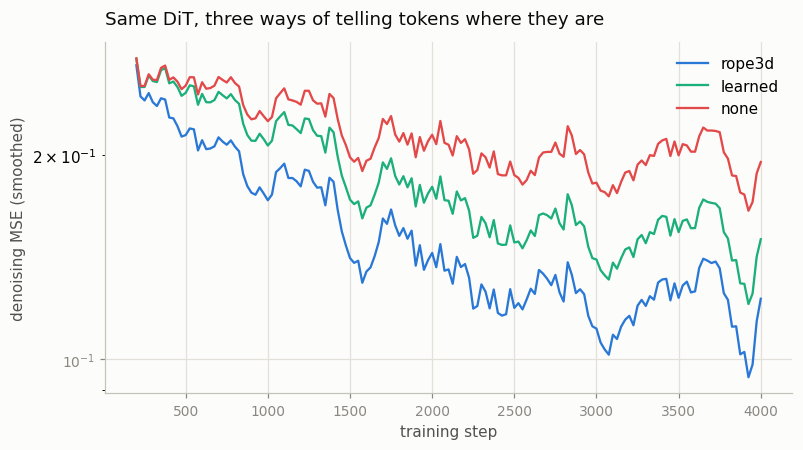
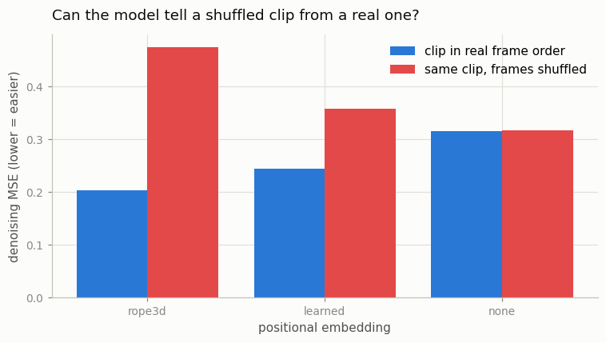
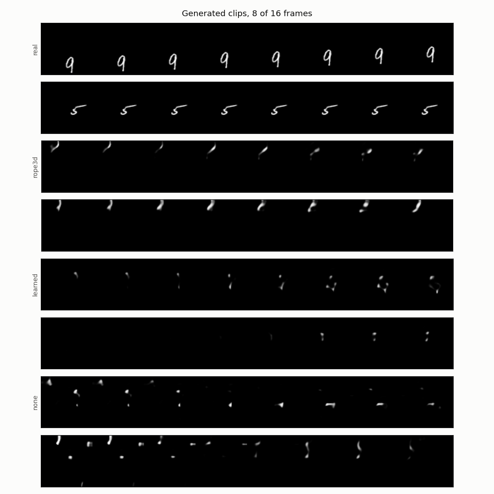

# Implement DiT for Video

## Key Insight

The [DiT (Diffusion Transformer)](/shared/glossary/#dit) replaced the [U-Net](/shared/glossary/#u-net) with a pure [transformer](/shared/glossary/#transformer) for image diffusion, and turning it into a *video* model is mostly a matter of changing what a "patch" is. Instead of cutting a single frame into flat 2D squares, you cut the [3D VAE](/shared/glossary/#3d-vae) [latent](/shared/glossary/#latent-video) into [spatiotemporal patches](/shared/glossary/#spatiotemporal-patches) — little boxes that also span a few frames — and add [3D RoPE](/shared/glossary/#rope) so each token carries its row, column, *and* frame index. The rest of the recipe is unchanged from image DiT: project each patch to a token, mix them with [attention](/shared/glossary/#attention), and condition on the denoising step through [AdaLN-Zero](/shared/glossary/#adaln-zero). Building this once makes the whole "[Sora](/shared/glossary/#sora)-class" family demystified — it is the same transformer you already know, fed a sequence of motion-aware tokens instead of word tokens.

## What this project builds

`dit_lib.py` is the backbone the whole of Phase 6 runs on. Projects [26](../26-flow-matching-from-scratch/README.md), [27](../27-read-and-reproduce-opensora/README.md), [28](../28-mmdit-for-video/README.md) and [29](../29-variable-resolution/README.md) all import it and change exactly one thing each. So it is worth understanding here, in four pieces.

### 1. The input is a latent, not a video

Nothing in this project touches a pixel during training. [Project 21](../21-train-a-small-3d-vae/README.md) trained a 3D VAE; we freeze it, run every training clip through it once, and store the result:

```
clip     (1, 16, 64, 64)   65,536 numbers
latent   (4,  4,  8,  8)    1,024 numbers      64x smaller
```

*Why freeze it and cache, rather than encode on the fly?* Because a frozen encoder makes a clip's latent a **constant**. Encoding the same clip again on step 4,000 recomputes a number we already know. Real pipelines do this at enormous scale — the latents go to disk, and the diffusion model never sees a pixel. [Project 24](../24-diffusion-on-latents/README.md) covers why the latent space is the right place to work at all.

### 2. Patchification: what a "token" is for video

A transformer wants a **list** of vectors. [Patchification](/shared/glossary/#patchification) is how a grid becomes a list. Image DiT cuts a picture into small squares and flattens each square into one vector. For video the same idea gains a third side: a patch is a little **box** spanning `pt` frames × `ph` rows × `pw` columns.

```
latent (4 channels, 4 frames, 8, 8)   with patch (1, 2, 2)
   -> a grid of (4, 4, 4) patches
   -> 64 tokens, each holding 4*1*2*2 = 16 numbers
   -> one Linear projects each 16-number patch into a 128-dim token
```

One token therefore carries a scrap of *appearance* and a scrap of *motion* at once, which is why a single attention layer can reason about both. This is not a toy simplification: OpenSora v1.2 uses a patch size of exactly `1x2x2` too, on a latent with exactly 4 channels — see [project 27](../27-read-and-reproduce-opensora/README.md), which downloads their real configuration file and lines it up against ours.

`patchify` and `unpatchify` must be exact inverses. If they are not, the model's prediction gets glued back into the wrong voxels, training still "works" in the sense that the loss falls, and the samples come out scrambled — a failure that is very hard to diagnose later and takes one line to rule out now. `--stage checks` asserts a round-trip error of exactly `0.00e+00`.

### 3. 3D RoPE: telling a token where it is

Once the grid becomes a list, the model has lost all sense of geometry — attention treats its input as an unordered *set*. Something has to put the coordinates back.

**RoPE** stands for **Ro**tary **P**osition **E**mbedding, and the name describes the mechanism. The older approach *adds* a position vector to each token. RoPE instead **rotates** each token's query and key vectors by an angle proportional to its position. The useful thing happens when two rotated vectors are compared: rotating both by the same extra amount leaves their dot product unchanged, so the attention score between two tokens depends only on the **difference** of their positions — how far apart they are, not where they sit in absolute terms.

That relative view is the whole point. "Three frames earlier" means the same thing at frame 4 and at frame 40, so a relationship learned once applies at a sequence length the model never trained on. [Project 29](../29-variable-resolution/README.md) cashes that in.

**"3D"** just means the channels of each attention head are split into three groups: one rotated by the frame index, one by the row, one by the column. A single token's rotation then encodes all three coordinates at once. In `rope_3d` the time axis deliberately gets the fewest channels, because this latent has 4 frames but 8 rows and 8 columns — channels are spent in proportion to how much there is to tell apart.

`--stage checks` verifies the relative claim directly. Place the *same* query and key vector at two different grid slots, so the only thing that can change the score is the rotation, and confirm that the pair (frame 0, frame 1) scores identically to (frame 2, frame 3) — both are "one frame apart":

```
RoPE relative-position check: score(t=0->1) -4.0964 vs score(t=2->3) -4.0964, diff 0.00e+00
```

### 4. AdaLN-Zero: telling the model how noisy its input is

Every diffusion model must be told which timestep it is denoising. **AdaLN-Zero** = **Ada**ptive **L**ayer **N**orm, **Zero**-initialised:

- *Adaptive*: the timestep vector is turned into a shift and a scale for each LayerNorm inside every block, so the timestep modulates the whole computation instead of merely being added to it.
- *Zero*: the small Linear producing those modulations starts at all zeros, and it also produces a `gate` multiplying each sub-layer's output. At step 0 every gate is 0, so **the whole network computes the identity** and its output is exactly zero — a neutral starting point with nothing to unlearn.

*Why not simply add the timestep vector to the tokens once at the input, which is far simpler?* [Project 19](../19-compare-attention-patterns/README.md) tried exactly that, and it failed instructively: the training loss went down and the samples came out as **pure noise**. Probing per noise level showed why — the model was fine at high noise and hopeless at low noise, which is precisely where knowing the timestep decides between polishing a picture and destroying it. A single addition at the input has to survive every layer intact, and the network learns to ignore it. AdaLN-Zero re-injects the timestep inside every block as a multiplicative control, which is much harder to ignore. At this scale it is not an optimisation; it is the difference between working and not.

```
AdaLN-Zero output at init: max |out| = 0.00e+00
```

## The experiment: three ways to tell a token where it is

Three models, identical in every respect — same architecture, same cached latents, same 4,000 steps, same optimiser and seed. Only the positional scheme differs:

| Arm | How a token learns its position | Parameters |
|-----|--------------------------------|-----------:|
| `rope3d` | rotary, relative, works at any grid size | 1,554,448 |
| `learned` | one trainable vector per grid slot, added to the token (the original DiT) | 1,562,640 |
| `none` | nothing at all — the control | 1,554,448 |

The `none` arm is not filler. Without it you cannot tell whether the model is *using* position information or merely tolerating it, and a video model that ignores frame order is generating a bag of frames rather than a video.

### The order probe

The direct question — *does this model know which frame is which?* — needs no extra training. Take a held-out clip, shuffle its four latent frames into a fixed wrong order, and ask each model to denoise both versions at a low noise level:

- A model that understands time should find the shuffled version **harder**. It is not a plausible video any more, so predicting its noise is a worse-posed problem.
- A model with no position information literally *cannot tell them apart*, because to it both inputs are the same set of tokens. Its two scores must come out equal.

That makes the probe a test of the positional embedding specifically, rather than of overall quality.

## Results

From `outputs/metrics.csv`:

| Arm | eval loss | rFID proxy | ms / step | shuffle probe: real → shuffled | gap |
|-----|----------:|-----------:|----------:|-------------------------------:|----:|
| `rope3d` | **0.1191** | **186.8** | 103.3 | 0.204 → 0.474 | **+132.9%** |
| `learned` | 0.1438 | 260.4 | 88.0 | 0.244 → 0.358 | +46.6% |
| `none` | 0.1926 | 232.4 | 64.8 | 0.315 → 0.317 | **+0.7%** |
| real clips vs other real clips | — | 1.4 | — | — | — |

The eval-loss column is the clean ranking: `rope3d` < `learned` < `none`, exactly matching how much each arm knows about position. The rFID column agrees that `rope3d` is best but is noisier — a repeated-measurement check ([project 26](../26-flow-matching-from-scratch/README.md) runs the same probe explicitly) shows this proxy wobbles by a few points run to run, which is why `learned` and `none` swapping places on it is not meaningful. Trust the eval loss for the ordering; read the rFID as "rope3d clearly best, other two roughly tied and both far worse".



### What the shuffle probe says

Read the last column first, because it is the cleanest result in the project.

The `none` arm's gap is **0.7%** — statistically nothing. That is not a weakness of the model, it is a *proof of correctness*: with no positional information, a shuffled clip and a real clip are genuinely the same input, so the two scores had to come out equal. Seeing 0.7% instead of, say, 20% confirms the position pathway really is the only thing carrying order.

The `rope3d` arm's gap is **+133%**: scrambling the frames makes its job more than twice as hard. It has learned something specific about how frame *n* relates to frame *n+1*, and destroying that relationship destroys its prediction. The `learned` arm sits in between at +47% — it knows the order, but less sharply.



### What the samples say



Two generated clips per arm, eight of sixteen frames each. The differences are visible without any metric:

- **`rope3d`** produces one bright object that holds together and slides smoothly across all eight frames. It is a stroke, not a legible digit — see the honesty note below — but it is *one thing, moving*.
- **`learned`** produces a fainter, more fragmented object whose motion is less consistent.
- **`none`** produces several disconnected specks that appear, vanish and jump around. This is what "no sense of place or order" looks like when rendered: the model knows the *statistics* of a Moving-MNIST clip (mostly black, a few bright pixels) but has no way to place those pixels consistently from frame to frame.

### Being honest about absolute quality

Every arm scores far above the 1.4 real-vs-real floor. At 1.55M parameters, 4,000 steps and a ~7-minute CPU budget, this model learns *coherent moving strokes*, not readable digits. The comparison between arms is the deliverable; the absolute number is not a claim about DiTs, it is a claim about seven minutes of CPU. [Project 26](../26-flow-matching-from-scratch/README.md) improves the same architecture by changing only the training objective, which is a good illustration that this ceiling is not architectural.

### The cost of RoPE, stated plainly

`rope3d` is the slowest arm per step — 103 ms against `none`'s 65 ms, about 60% more. The rotation has to be applied to the queries and keys of every head in every block, and here that is written as a straightforward reshape-and-stack in Python. Production implementations fuse it into the attention kernel and the overhead largely disappears; ours does not, so the honest reading is "3D RoPE bought a large accuracy gain at a real, but implementation-dependent, cost."

### Patch size: the dial that sets everything

`--stage patchcost` runs the same latent through five patch sizes (`outputs/patch_cost.csv`):

| Patch | Tokens | Numbers per token | Params | Forward ms |
|-------|-------:|------------------:|-------:|-----------:|
| `1x1x1` | 256 | 4 | 1,551,364 | 27.2 |
| `1x2x2` | **64** | 16 | 1,554,448 | 11.2 |
| `2x2x2` | 32 | 32 | 1,558,560 | 9.0 |
| `1x4x4` | 16 | 64 | 1,566,784 | 5.2 |
| `4x4x4` | 4 | 256 | 1,616,128 | 4.4 |

Three things in this table are worth pausing on.

**The parameter count barely moves** (1.55M → 1.62M across a 64× change in token count). Patch size does not change the transformer at all — only the width of the little Linear at the entrance and the one at the exit. It is a *sequence-length* dial, not a capacity dial, which is exactly why it is the cheapest knob a video model has.

**The speedup is sub-linear.** Going from 256 tokens to 64 — four times fewer — buys only 2.4× (27.2 ms → 11.2 ms). Attention's quadratic term shrinks 16×, but the per-token linear projections shrink only 4×, and at these small sizes the linear term dominates. At OpenSora's 93,600 tokens the balance is completely different and the quadratic term rules; see [project 27](../27-read-and-reproduce-opensora/README.md).

**Below 64 tokens the returns collapse** (11.2 → 9.0 → 5.2 → 4.4 ms) while each token has to carry ever more of the clip. `4x4x4` compresses the entire 4-frame latent into 4 tokens — nothing left for attention to relate. This is the trade patch size always is: fewer tokens, cheaper model, less that the model can say about where things are.

## Implementation notes

**Eval loss is measured on a fixed set of noises.** Training loss draws a fresh random timestep every step, so the printed number wobbles by more than the gap between arms. `eval_loss` fixes the held-out clips, the timesteps *and* the noise, turning a coin flip into a measurement.

**Sampling uses [DDIM](/shared/glossary/#ddim) with 60 steps** out of the 300-step schedule, reusing [project 24](../24-diffusion-on-latents/README.md)'s sampler unchanged. That the DiT drops straight into a U-Net's slot is itself worth noticing: the *denoiser* is swappable, the diffusion machinery around it is not.

**The output head is zero-initialised**, so the model's first prediction is "there is no noise here" — harmless — instead of a random guess it must first unlearn.

**Clips have one digit moving in a straight line**, unlike the bouncing two-digit clips of [project 21](../21-train-a-small-3d-vae/README.md). That is not for simplicity; it makes the *label* truthful. A clip whose digit bounces halfway through is neither "moving left" nor "moving right", and [project 28](../28-mmdit-for-video/README.md) needs labels that hold for every frame. `--stage cache` checks that the VAE — trained on the bouncier two-digit clips — still reconstructs these ones before the phase builds on top of it.

## What's in this directory

| File | What it does |
|------|--------------|
| `dit_lib.py` | Labelled clips, patchify/unpatchify, 3D RoPE, AdaLN-Zero blocks, `VideoDiT`. Imported by projects 26–29. |
| `train.py` | The property checks, the latent cache, the three positional arms, the patch-cost table and the figures. |
| `outputs/` | Committed figures, `metrics.csv`, `patch_cost.csv`, `checks.txt`. |

Requires [project 21](../21-train-a-small-3d-vae/README.md)'s trained VAE (`checkpoints/3d.pt`) and [project 23](../23-magvit-v2-style-tokenizer/README.md)'s feature network (`checkpoints/features.pt`).

## How to run

```bash
python3 train.py --stage cache                 # ~1 min
python3 train.py --stage checks                # seconds
python3 train.py --stage train --pos rope3d    # ~7 min
python3 train.py --stage train --pos learned   # ~7 min
python3 train.py --stage train --pos none      # ~7 min
python3 train.py --stage patchcost             # ~2 min
python3 train.py --stage figures               # ~3 min
```

## Takeaways

1. **A video DiT is an image DiT with a three-dimensional patch.** The patch box spans frames as well as rows and columns; everything after that — project, attend, modulate — is unchanged. OpenSora's real config uses the same `1x2x2` patch on the same 4-channel latent.
2. **Position information is doing most of the work.** Removing it costs 62% more eval loss (0.119 → 0.193) and turns a moving object into scattered specks. Rotary beats a learned table (0.119 vs 0.144) because it encodes *relative* distance rather than absolute slots.
3. **Test the property, not the code.** Three assertions — exact patchify round trip, exact zero output at init, and identical RoPE scores for equal gaps — take seconds and each rules out a bug that training would otherwise hide behind a falling loss.
4. **The shuffle probe is the honest way to ask "does it understand time?"** The control arm's 0.7% gap proves the probe measures what it claims, and the rotary arm's 133% gap proves the model uses it.
5. **Patch size is a sequence-length dial, not a capacity dial.** It changes the parameter count by 4% and the cost by 6×. Compressing time belongs in the VAE and compressing space belongs in the patchifier — each applied where it costs least.
6. **Absolute quality here is a statement about the compute budget, not the architecture.** Seven CPU minutes buy coherent motion, not legible digits; the arms-vs-arms comparison is what this project measures.
