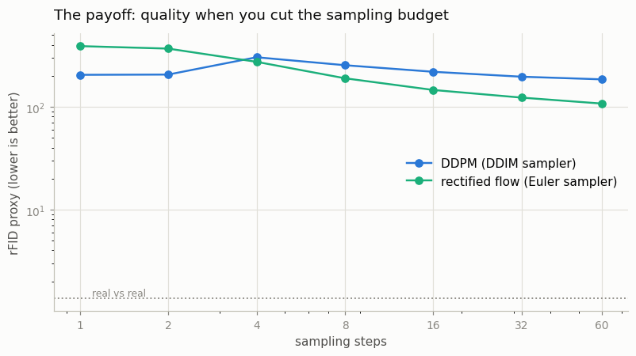
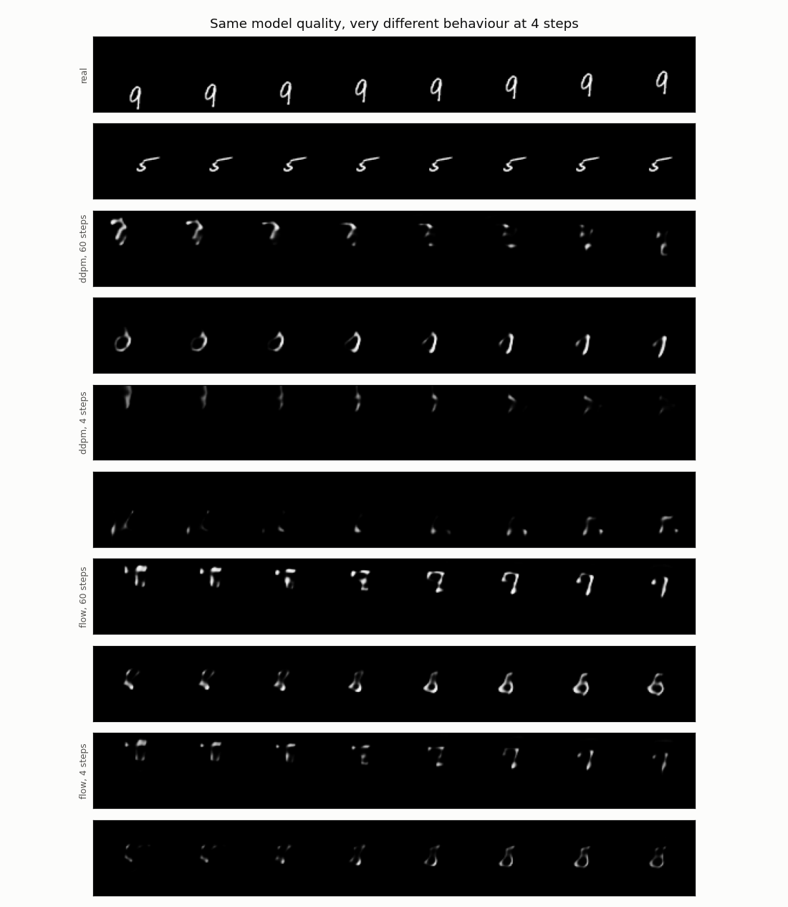
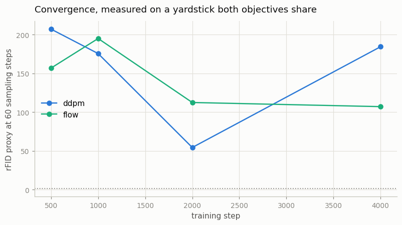

# Flow Matching from Scratch

## Key Insight

[DDPM](/shared/glossary/#ddpm) trains a model to undo noise one small, carefully scheduled step at a time; [flow matching](/shared/glossary/#flow-matching) throws away the schedule and trains a *velocity field* instead — a model that, given a half-noisy clip and a time, predicts the single straight-line direction pointing back toward clean video. [Rectified flow](/shared/glossary/#rectified-flow) is the variant that makes those paths actually straight, which is why generation needs far fewer sampling steps than the curvy trajectories of older diffusion. Swapping DDPM for rectified flow inside a small video [DiT](/shared/glossary/#dit) and watching it converge faster makes concrete why nearly every 2024+ model — [SD3](/shared/glossary/#sd3), [Flux](/shared/glossary/#flux), and most frontier video models — trains this way instead.

## The whole method, in two lines

DDPM needs an apparatus: a beta schedule, alphas, cumulative alpha-bars, a posterior variance. Rectified flow needs this:

```python
x_t   = (1 - t) * x0 + t * noise        # training input: a point on a straight line
target = noise - x0                      # what the model must predict
```

Pick a clean clip `x0` and a pure-noise clip `noise`, draw the straight line between them, and slide along it with a dial `t` running from 0 (clean) to 1 (noise). Differentiate that line with respect to `t` and the answer is the same everywhere on it: `noise - x0`. So training is "pick a random `t`, build the point, predict the direction", and generation is "start at noise and walk backwards along the directions the model reports".

That walk is plain [Euler integration](/shared/glossary/#euler-method) of an [ODE](/shared/glossary/#ode): `x ← x + Δt · v`. No noise is injected along the way, and no schedule is consulted.

### Decoding the names

**Flow matching.** A *flow* is a [velocity field](/shared/glossary/#velocity-field) that transports one probability distribution into another over time — here, noise into video. "Field" is the physics word for "a value attached to every point in a space", like the arrows on a weather map showing wind at each location. You cannot compute the true field for a whole distribution, but Lipman et al. showed that matching the model to the *per-example* straight-line velocity gives the same answer in expectation. You "match" a model to a flow: flow matching.

**Rectified flow.** To *rectify* is to make straight. DDPM's reverse trajectories curve, so a sampler taking big steps cuts corners and lands off the data manifold. Training on straight-line paths makes the learned trajectories straighter, so big steps hurt less — which is the entire reason modern models sample in 20–30 steps rather than 250.

**Velocity, not noise.** DDPM's network predicts the noise that was added; flow matching's predicts a direction of travel. They are convertible — two labels for the same underlying object. What differs is what stays constant: the noise target keeps a fixed *scale* across timesteps, while the velocity target keeps a fixed *direction* along the whole path. A constant direction is exactly what a large ODE step needs in order to be accurate, and that is the property being bought.

## The experiment

The same [project 25](../25-implement-dit-for-video/README.md) `VideoDiT` — same 3D RoPE, same AdaLN-Zero, same width and depth — trained twice on the same cached latents for the same 4,000 steps. Only the objective differs.

### Why the two loss curves are NOT the comparison

It is tempting to plot both training losses and declare the lower one better. That comparison is meaningless, and the trap is worth naming explicitly:

- the DDPM arm's loss is `MSE(predicted noise, actual noise)`
- the flow arm's loss is `MSE(predicted velocity, actual velocity)`

Different targets, different natural scales. A number from one says nothing about the other — like comparing a car's fuel gauge reading to a plane's altimeter reading and concluding the plane is doing better because 30,000 is larger than 40.

So the comparison is made on **yardsticks both arms share**:

1. **Sample quality at N sampling steps**, for N from 1 to 60. This is the practical question — you get one model, how cheaply can you sample from it?
2. **Path straightness.** For each sampler, record every intermediate point, compute the total start-to-finish displacement, and check each individual step against it. If every step points the same way as the whole journey, the average cosine is 1 and the path is a straight line; a wandering path scores lower. Nothing optimises this directly — it is a measurement of the property rectified flow is *named* after.
3. **Quality over training**, evaluated by generating from saved milestone checkpoints with the same 60-step budget for both.

The quality yardstick is the rFID proxy from [project 23](../23-magvit-v2-style-tokenizer/README.md): push real and generated clips through a small in-domain feature network and measure the distance between the two clouds. As always with that metric, the numbers are comparable only to each other, so a "real clips vs other real clips" floor is measured alongside to show what a score of "no difference" looks like.

## Results

### How noisy is the ruler?

Before comparing arms, `figures` measures the rFID proxy three times on the *same* flow checkpoint with three different starting noises (`outputs/metric_noise.csv`):

| seed | rFID proxy |
|------|-----------:|
| 5 | 107.2 |
| 6 | 114.3 |
| 7 | 112.7 |

The spread is about ±4. Any difference smaller than that is not a result, it is the ruler shaking — which is exactly why the earlier draft's 24-sample measurements were untrustworthy and this project generates 96 clips per point.

### The payoff: quality when you cut the sampling budget

From `outputs/step_sweep.csv`:

| Sampling steps | DDPM (DDIM) | rectified flow (Euler) |
|---------------:|------------:|-----------------------:|
| 1 | **204** | 389 |
| 2 | **205** | 368 |
| 4 | 303 | **273** |
| 8 | 253 | **189** |
| 16 | 219 | **145** |
| 32 | 196 | **123** |
| 60 | 185 | **107** |



The two curves cross, and the crossing is the whole story:

- **The flow arm reaches DDPM's best-ever score (185, at 60 steps) using only 8 steps** (189). That is the "few-step generation" win in one sentence: same quality, roughly 7× fewer steps. Push further and it keeps improving to 107, a place DDPM never reaches at any budget here.
- **At 1–2 steps the flow arm is *worse*.** This is honest and worth understanding rather than hiding. One or two steps is too few to integrate any ODE, straight path or not; meanwhile DDPM's DDIM sampler predicts the clean image directly and its clamp lands a blurry mean that this blur-friendly proxy scores generously. So the naive slogan "rectified flow always wins with fewer steps" is not quite right — it wins once you take *enough* steps to actually follow the path, and the win then grows.

### Why: the paths really are straighter

From `outputs/straightness.csv`:

| Arm | path straightness |
|-----|------------------:|
| DDPM (DDIM) | 0.86 |
| rectified flow | **0.96** |

This is the mechanism behind the sweep, measured directly. The flow sampler's path from noise to clip is much closer to a straight line (0.96 vs 0.86, where 1.0 is perfectly straight). A straight path is one an Euler solver can follow in big steps without cutting corners, which is why the flow arm holds up as the step count drops. Nothing trained this number — it is the property "rectified flow" is named for, showing up on its own.



The sample grid makes it visible. At 60 steps both arms produce a moving stroke. At **4 steps** the DDPM sample has fragmented into faint specks while the flow sample still holds a recognisable moving shape — same model, same clip, the sampler is the only difference.

### The convergence plot, read honestly

From `outputs/convergence.csv`, generating from milestone checkpoints at a fixed 60 steps:

| step | DDPM | flow |
|-----:|-----:|-----:|
| 500 | 207 | 157 |
| 1000 | 176 | 195 |
| 2000 | 54 | 113 |
| 4000 | 185 | 107 |



Both curves are **bumpy and non-monotone** — DDPM even dips to 54 at step 2000 and then gets worse. At 1.55M parameters on this dataset the training is not stable enough for a clean "flow converges faster" line, and it would be dishonest to draw one. The reliable, reproducible result of this project is the **sampling-step sweep and the straightness measurement**, not the training-speed race. That is a useful lesson in itself: at toy scale, sampling behaviour separates the two methods far more cleanly than convergence does.

## Implementation notes

**The timestep embedding is reused unchanged.** DDPM passes integers in `[0, 300)`; flow matching's `t` is a real number in `[0, 1]`. Multiplying by `T_SCALE = 1000` puts the continuous dial into the range the sinusoidal embedding was written for, so both arms share the same code and the same model class. This is not a hack — real flow-matching models do exactly this.

**Sampling injects no noise.** DDIM already walks a deterministic path, so both samplers here are deterministic given the same starting noise; the comparison is not confounded by one arm getting extra randomness.

**`ddim_trajectory` duplicates project 24's sampler** for one reason: to keep every intermediate `x` so the straightness of the path can be measured. The generated result is identical to `DDPM.sample`.

## What's in this directory

| File | What it does |
|------|--------------|
| `flow_lib.py` | `RectifiedFlow` (the two-line objective and the Euler sampler), the trajectory-keeping DDIM variant, and the straightness measure. Imported by projects 27, 28 and 29. |
| `train.py` | Trains both arms, then runs the sampling-step sweep, the straightness measurement and the milestone convergence check. |
| `outputs/` | Committed figures and CSVs. |

Requires [project 25](../25-implement-dit-for-video/README.md)'s latent cache, [project 21](../21-train-a-small-3d-vae/README.md)'s VAE and [project 23](../23-magvit-v2-style-tokenizer/README.md)'s feature network.

## How to run

```bash
python3 train.py --stage train --arm ddpm    # ~7 min
python3 train.py --stage train --arm flow    # ~7 min
python3 train.py --stage figures             # ~4 min
```

## Takeaways

1. **The whole method is two lines.** Interpolate on a straight line, predict `noise - x0`. No schedule, no alphas, no posterior variance. The simplicity is the point — and it does not cost quality.
2. **Never compare the two training losses.** They measure MSE against different targets (noise vs velocity) on different scales; one number says nothing about the other. Compare on a shared yardstick — sample quality at a fixed step budget.
3. **Flow's win is a few-step win, and it is real: 8 steps matched DDPM's best 60-step score.** But it is not a *every*-step win — at 1–2 steps flow was worse, because too few steps cannot integrate any ODE. State the crossover, not the slogan.
4. **Straighter paths are why.** The flow sampler's trajectory scored 0.96 straight vs DDPM's 0.86, measured directly, and that is exactly what lets an Euler solver take big steps. The name "rectified flow" describes a measurable property.
5. **Measure your ruler before your result.** The rFID proxy wobbled ±4 run to run; the first draft's 24-sample points were inside that noise. 96 samples per point turned a shaking ruler into a usable one.
6. **At toy scale, sampling separates the methods more cleanly than convergence.** The training curves were too bumpy to race honestly; the step sweep was decisive.
