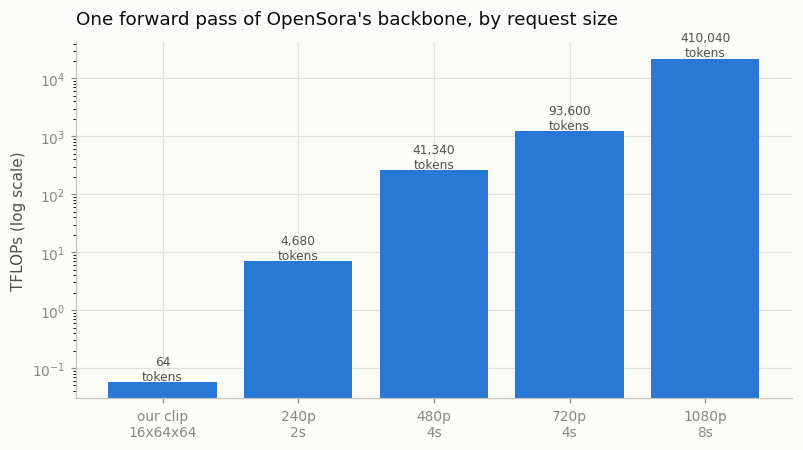
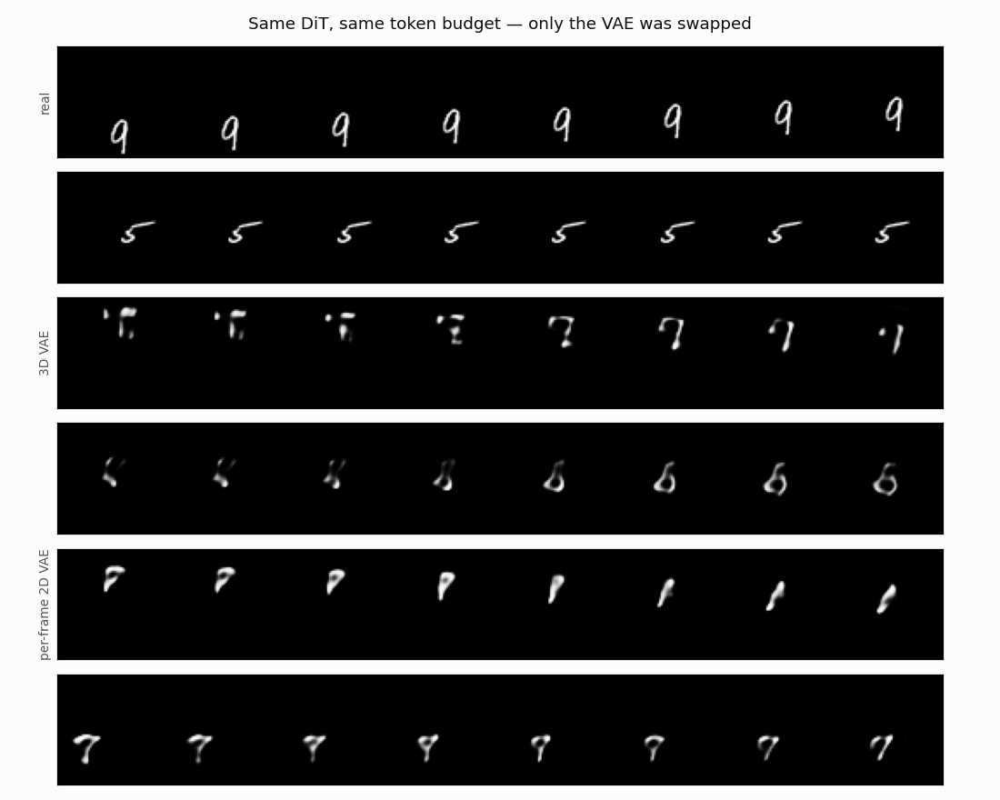

# Read and Reproduce OpenSora

## Key Insight

[OpenSora](/shared/glossary/#opensora) is a fully open replica of OpenAI's [Sora](/shared/glossary/#sora) recipe — a [DiT](/shared/glossary/#dit) running over [3D VAE](/shared/glossary/#3d-vae) latents and trained with [flow matching](/shared/glossary/#flow-matching) — and because its code, weights, and data pipeline are all public, it is the fastest way to see a complete Sora-style system end to end rather than from a paper's block diagram. Running inference on a pretrained checkpoint first builds intuition for what the model can and cannot do; then swapping out one component (for example, retraining with a different [VAE](/shared/glossary/#vae)) teaches which piece of the pipeline controls which failure mode. This is the project where the abstract architecture of [Phase 6](../../README.md#phase-6-diffusion-transformers-dit-and-sora-class-models) becomes a concrete thing you can run, break, and fix.

## Honest scope: what runs here and what does not

OpenSora v1.2's backbone is a 1.1-billion-parameter transformer, and its released checkpoints are tens of gigabytes. On a CPU-only machine a single denoising step of the real model takes longer than this whole project. So rather than pretend, this project splits the task in two:

- **`--stage anatomy` reads the real thing.** It downloads OpenSora's actual `config.json` files from the Hugging Face Hub — a few kilobytes, no weights — and lays their numbers next to ours, including the arithmetic that shows exactly *why* the real model is out of reach here.
- **Everything else runs a faithful miniature.** The mini pipeline has the same three parts in the same order (3D VAE → patchified DiT with 3D RoPE → flow matching), so a component swap teaches the same lesson at 1/2000th of the size.

If you want to run a real pretrained video checkpoint on this machine, [project 10](../10-run-svd-inference/README.md) already does that with Stable Video Diffusion — a smaller model, and slow, but real. This project is about the *architecture*, and for that the config file is the honest source.

## Part 1: what the config file tells you

The most useful thing about an open release is not the weights, it is that you can read the exact configuration a frontier team settled on. Here is what comes back:

From `outputs/anatomy.csv` (downloaded live from `hpcai-tech/OpenSora-STDiT-v3` and `hpcai-tech/OpenSora-VAE-v1.2`):

| Quantity | OpenSora v1.2 | Our mini DiT |
|----------|--------------:|-------------:|
| transformer blocks | 28 | 5 |
| hidden size | 1152 | 128 |
| attention heads | 16 | 4 |
| **patch size (t,h,w)** | **1×2×2** | **1×2×2** |
| latent channels | 4 | 4 |
| text embedding width | 4096 | 0 ([project 28](../28-mmdit-for-video/README.md) adds text) |
| tokens for a 4-second 720p clip | **93,600** | 64 |
| forward GFLOPs | ~1,213,848 | 0.136 |

Two rows match exactly and are not tuned to: the **patch size** and the **latent channel count**. The rest is scaled down. The right way to read this table is that the *architecture* is identical and only the *dimensions* shrank — which is exactly the sense in which our miniature "reproduces" OpenSora.

### The one line worth staring at

`patch_size: [1, 2, 2]`. That is the same patch our mini DiT uses, chosen in [project 25](../25-implement-dit-for-video/README.md) before we looked. It is not a coincidence — it is what the token-count arithmetic forces.

A patch of `1` in time means **no temporal patching at all**: each latent frame stays a separate row of tokens. That looks like leaving compression on the table, until you notice where the compression already happened. The VAE has already merged 4 real frames into 1 latent frame; merging again in the patchifier would put 8 real frames into one token, and a token that spans a third of a second cannot represent anything that changes inside it. Space is different — neighbouring latent cells within one frame are highly redundant, so `2x2` there is nearly free.

So the design reads as: **compress time in the VAE, compress space in the patchifier.** Two different tools, each applied where it costs least.

### Why the real model needs a datacentre

A single 4-second 720p generation feeds the transformer **93,600 tokens** — against our 64. That is not a small difference. Timing our miniature's forward pass on this CPU and scaling by the FLOP ratio, one forward pass of the real backbone would take roughly **half a day** here, and a full 30-step generation would take weeks — and that is before the 1.1 billion parameters that do not fit in cache. This is the concrete reason the anatomy stage reads the config rather than running the model: the honest thing a CPU box can do with OpenSora is study its shape.



The reason the curve bends upward is in the FLOP formula. Per transformer block, the linear projections cost about `12·N·D²` multiply-adds and the attention score/aggregate pair costs about `2·N²·D`, where `N` is the token count. The first term grows *linearly* with tokens; the second grows with their *square*. Doubling a video's resolution quadruples `N`, so it costs 4× through the first term and 16× through the second. That quadratic term is why every video-model paper spends so much space on the [VAE](/shared/glossary/#vae) compression ratio: shrinking `N` is worth far more than shrinking anything else.

## Part 2: swap one component and retrain

The mini pipeline is a chain — VAE, then DiT, then sampler. To learn which link controls which failure, change one link and hold the rest fixed.

We swap the **VAE**, using the two that [project 21](../21-train-a-small-3d-vae/README.md) already trained:

| Arm | VAE | Latent | Numbers per clip | Tokens into the DiT |
|-----|-----|--------|-----------------:|--------------------:|
| `3d` | compresses 8× in space **and 4× in time** | `(4, 4, 8, 8)` | 1,024 | 64 |
| `2d` | compresses 8× in space, **each frame separately** | `(1, 16, 8, 8)` | 1,024 | 64 |

This is a genuinely controlled swap, and getting it controlled took a little care:

- Both VAEs compress to **exactly the same number of numbers** — that was [project 21](../21-train-a-small-3d-vae/README.md)'s design, so neither arm has a bigger budget.
- The patch size is adjusted so both arms produce **exactly 64 tokens of exactly 16 numbers**: `(1,2,2)` on the 3D latent, `(4,2,2)` on the 2D one. The DiT is therefore the same size and does the same amount of work in both arms.

What is left to differ is only **where the compression happened** — across time, or inside each frame. Everything downstream is identical, so any difference in the output is attributable to that choice alone.

*Why does this mirror the real system?* Because OpenSora's own VAE is precisely this decision made explicit. Its config shows a `vae_2d` (a pretrained image VAE, borrowed from PixArt) followed by a `vae_temporal` — a per-frame compressor and a time compressor, stacked. They chose to have both. Our two arms are the two halves of that choice, run separately.

### Results

From `outputs/swap.csv`:

| Arm | VAE reconstruction PSNR | VAE floor (rFID) | sample rFID | align |
|-----|------------------------:|-----------------:|------------:|------:|
| `3d` | 22.85 dB | **25.06** | **120.0** | 0.893 |
| `2d` | 23.13 dB | 39.49 | 172.9 | 0.876 |
| real clips | — | — | 1.36 | 1.00 |



Read the two middle columns as a pair, because together they explain the whole result.

**The VAE floor is the ceiling the generator can never beat.** Every generated clip has to come out through the VAE's decoder, so it inherits that decoder's own reconstruction error as a hard floor. The 3D VAE's floor is **25.1**; the 2D VAE's is **39.5**. Before the DiT trains a single step, the 2D arm is already racing toward a worse finish line.

**And the sample scores land in the same order:** 3D at 120, 2D at 173. The DiT is byte-for-byte the same in both arms and does the same amount of work — so this gap is attributable entirely to the VAE swap. Compressing across time gave the generator a better latent to work in than compressing each frame alone.

*Why would time-compression help, when both latents hold the same 1,024 numbers?* Because a video's frames are mostly redundant — adjacent frames are nearly identical. The 3D VAE spends its 1,024 numbers describing what *changes*; the 2D VAE spends a full share on each of 16 frames, most of which repeat what the last one said. Same budget, but the 3D arm's is not wasted on redundancy. This is the Phase-5 lesson ([project 21](../21-train-a-small-3d-vae/README.md)) reappearing one level up: it does not just make the VAE better, it makes everything downstream of the VAE better too.

Notice also what did **not** separate the arms: PSNR (22.85 vs 23.13 dB) actually slightly *favours* the 2D VAE, even though the 3D arm generates visibly better clips. PSNR rewards blur-safe per-pixel accuracy and is nearly blind to whether motion is coherent — the same lesson [projects 03](../03-optical-flow-visualizer/README.md), [07](../07-film-frame-interpolation/README.md) and [18](../18-cascaded-super-resolution/README.md) each ran into. The rFID and align columns, which look at whole clips, are the ones that track what your eye sees.

This is the "swap one component, learn which failure it controls" payoff: the VAE controls the quality *ceiling*, and no amount of DiT training reaches past it. It is why frontier teams spend as much on the VAE as on the transformer.

## Implementation notes

**The DiT is trained with rectified flow** ([project 26](../26-flow-matching-from-scratch/README.md)), because that is what OpenSora uses. Reproducing a recipe means reproducing the whole recipe, not the parts that are convenient.

**`transformer_flops` is deliberately approximate.** It counts the two matmul families that dominate and ignores norms, activations and AdaLN. The point is the *shape* of the formula — one linear term, one quadratic term — not a precise number.

**The Hub fetch has an offline fallback.** If the network is unavailable the stage prints published values instead and carries on, so the project still runs.

**The alignment metric comes from [project 15](../15-inflate-sd-to-a-video-model/README.md).** `align_response` measures how well each frame is explained as a *shifted copy* of the previous one — real motion scores high, teleporting or morphing content scores low. It complements flicker, which only measures how *much* pixels change, not whether the change looks like movement.

## What's in this directory

| File | What it does |
|------|--------------|
| `run.py` | The anatomy comparison, the 2D-VAE latent cache, both training arms, and the scoring. |
| `outputs/` | `anatomy.csv`, `swap.csv`, and the committed figures. |

Requires both of [project 21](../21-train-a-small-3d-vae/README.md)'s VAEs (`checkpoints/3d.pt` and `checkpoints/2d.pt`), [project 25](../25-implement-dit-for-video/README.md)'s latent cache, and [project 23](../23-magvit-v2-style-tokenizer/README.md)'s feature network.

## How to run

```bash
python3 run.py --stage anatomy         # ~1 min (needs network)
python3 run.py --stage cache2d         # ~1 min
python3 run.py --stage train --vae 3d  # ~7 min
python3 run.py --stage train --vae 2d  # ~7 min
python3 run.py --stage figures         # ~3 min
```

## Takeaways

1. **An open release's most valuable file is often its config, not its weights.** OpenSora's `config.json` reveals the exact architecture a frontier team settled on, and it fits in a kilobyte. Our miniature matches its patch size and latent channels exactly — the architecture is the same, only the dimensions shrank.
2. **The token count, not the parameter count, is what puts frontier video out of CPU reach.** 93,600 tokens versus 64, and the attention cost grows with the *square* of that. Half a day per forward pass is the honest number.
3. **`1x2x2` patching is forced, not chosen.** Compress time in the VAE (adjacent frames are redundant) and space in the patchifier (adjacent cells are redundant); a temporal patch would merge frames that already went through 4× VAE compression, past the point of meaning.
4. **Swapping one component isolates what it controls.** Same DiT, same token budget, only the VAE differs: the 3D VAE's better reconstruction floor (25 vs 39) becomes a better generation score (120 vs 173). The VAE sets a ceiling the generator cannot beat.
5. **PSNR disagreed with every clip-level metric and with the eye.** It slightly favoured the worse arm. On video, measure whole clips.
