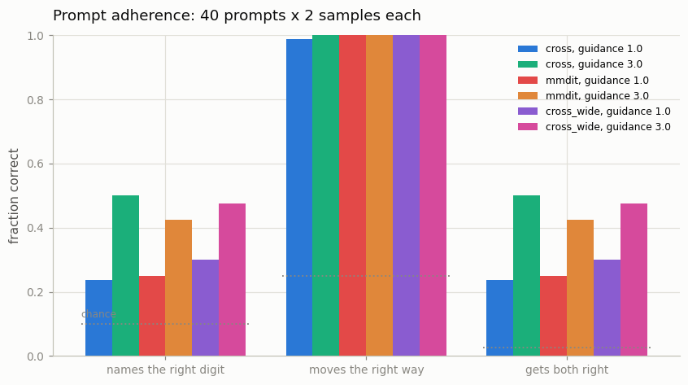
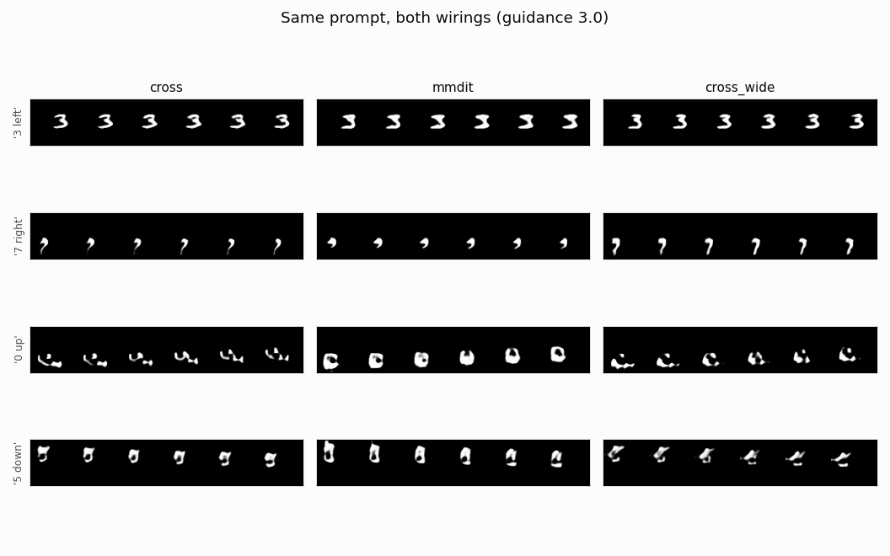

# MMDiT for Video

## Key Insight

A plain video [DiT](/shared/glossary/#dit) lets the video tokens *read* the text prompt through a one-way [cross-attention](/shared/glossary/#cross-attention) step — the text influences the video, but never the reverse. [MMDiT (Multi-Modal Diffusion Transformer)](/shared/glossary/#mmdit) — the [SD3](/shared/glossary/#sd3) and [Flux](/shared/glossary/#flux) design — instead sends text tokens and video tokens through the *same* [attention](/shared/glossary/#attention) layers, so the two [modalities](/shared/glossary/#modality) see and shape each other inside one shared operation. That two-way conversation is what helps the model get compositional prompts right ("a red cube *on* a blue sphere"), and building it for video lets you measure the payoff directly: text adherence should visibly improve over a cross-attention baseline.

## A four-word language

The prompts here are `digit 7 moving left` — four tokens from a 18-word vocabulary. That is deliberately tiny, because the thing being compared is a *wiring diagram*, not a language model. But a four-word prompt keeps the property that matters: it states **two independent facts** that must both land on the same clip. Getting one right and one wrong is exactly what "compositional prompt failure" means, scaled down to something a CPU can measure 80 times in a minute.

The clips are built so those two facts are *always true of every frame* — one digit, one straight cardinal direction, no wall bounces ([project 25](../25-implement-dit-for-video/README.md)'s `attr_batch`). A conditioning experiment is only as trustworthy as its labels, and a digit that bounces halfway through a clip is neither "moving left" nor "moving right".

## Two wirings

### Arm 1: cross-attention (the older design)

Video tokens self-attend, and then each block has a **second, separate** attention where the video reads the text: queries come from the video, keys and values from the prompt. The text vectors are computed once by the text encoder and never change as the block stack runs. Information flows one way.

### Arm 2: MMDiT (the SD3/Flux design)

Text tokens and video tokens are concatenated into **one sequence** and pass through **one** attention. Every token, of either kind, can attend to every other. Each modality keeps its own weights — its own QKV projection, its own MLP, its own AdaLN modulation — hence "multi-modal": two streams sharing one attention.

Note precisely what is and is not shared. The attention *itself* is shared: there is a single softmax over the whole concatenated sequence. Everything that turns a token into a query/key/value, and everything that processes the result afterwards, is per-modality — because a word and a patch of video are not the same kind of object and should not be squeezed through the same projection.

### Why would sharing help?

In the cross wiring the text side is **frozen mid-forward**. Whether "7" and "left" were bound to each other was decided by the text encoder alone, before the model knew anything about the picture it was about to draw. In MMDiT the binding can be negotiated: the token for "left" can be shaped by which part of the clip is currently taking form, and the video tokens that will become the digit can pull on the token naming it. The claim is that this two-way negotiation is what fixes prompts where *which attribute goes with which object* matters.

### "Doesn't a frozen text encoder already understand the prompt?"

This question is worth answering directly, because both arms contain a text encoder and it is reasonable to wonder why the DiT needs text tokens inside it at all.

A text encoder produces **meaning**. The DiT decides **placement** — which pixels, in which frames, that meaning applies to. Those are different jobs, and the second one cannot be done before the picture exists. Cross-attention gives the DiT read access to the encoder's finished answer; MMDiT lets the DiT *revise* that answer in light of the image forming. The encoder is not redundant, it is upstream.

(Real systems put a frozen [T5](/shared/glossary/#t5) or [CLIP](/shared/glossary/#clip) encoder in that slot, for two reasons our four-word vocabulary does not need: it imports knowledge from far more text than any video dataset contains, and keeping it frozen means video training cannot corrupt that knowledge. Our tiny encoder is trained, but it occupies the same position in the diagram.)

## Keeping the comparison honest

MMDiT gives the text stream its own projections and MLP, which costs about **57% more parameters** than plain cross-attention at the same width. If MMDiT then wins, a fair reader immediately asks whether the win came from the wiring or from the extra weights.

So there is a third arm. `cross_wide` is plain cross-attention widened from 128 to 160 channels until its parameter count matches MMDiT's to within 0.5%:

| Arm | Wiring | Width | Parameters |
|-----|--------|------:|-----------:|
| `cross` | one-way cross-attention | 128 | 2,036,752 |
| `mmdit` | joint attention, two streams | 128 | 3,190,672 |
| `cross_wide` | one-way cross-attention | 160 | 3,175,696 |

If MMDiT beats `cross` **and** `cross_wide`, the wiring is doing the work. If it beats `cross` but ties `cross_wide`, the parameters were doing the work, and the honest conclusion is different.

## How adherence is graded

Two independent judges, one per fact in the prompt:

**The digit judge** is a small CNN classifier trained on real one-digit clips (`--stage probe`). *Why train a new one when [project 23](../23-magvit-v2-style-tokenizer/README.md) already has a digit network?* Because that one was built as a *feature extractor* for the FID proxy and tops out at 42% accuracy — perfectly adequate for comparing two clouds of feature vectors, far too vague to answer "is this a 7?" about one clip. A grader has to be right about individual items, so this one gets more training and sees exactly the clips this phase generates.

**The direction judge** needs no training at all. The digit is the only bright thing on the canvas, so the intensity-weighted centre of mass tracks it directly; where that centre ends up relative to where it started *is* the answer. On real clips it scores **100%** — a perfect judge, because on this clean data the question really is that simple. (The digit judge reaches **84.2%** held-out, the realistic ceiling for the digit half.)

Every one of the 40 possible prompts (10 digits × 4 directions) is generated twice per arm, and three numbers come out: digit correct, direction correct, and **both** correct. The last one is the compositional score, and its chance level is only 2.5%.

### Classifier-free guidance

Sampling uses [CFG](/shared/glossary/#cfg-classifier-free-guidance): at every step the model is asked twice, once with the prompt and once with an empty prompt, and the two velocities are combined as

```
v = v_null + scale * (v_prompt - v_null)
```

Read it as "start from the direction you would go with no instructions, then exaggerate whatever difference the instructions made". `scale = 1` is plain conditional generation. For this to work at all, the model must have *seen* an empty prompt during training — which is why 10% of training steps replace the prompt with `<null>`. A model that never saw one would treat the empty prompt as just another strange sentence, and the subtraction would be meaningless.

## Results — and an honest surprise

From `outputs/adherence.csv` (40 prompts × 2 samples per arm; chance is 10% digit, 25% direction, 2.5% both):

| Arm | guidance | names right digit | moves right way | **both right** | rFID |
|-----|---------:|------------------:|----------------:|---------------:|-----:|
| `cross` | 3.0 | 0.500 | 1.00 | **0.500** | 4.97 |
| `mmdit` | 3.0 | 0.425 | 1.00 | **0.425** | 15.74 |
| `cross_wide` | 3.0 | 0.475 | 1.00 | **0.475** | 7.15 |
| real clips (ceiling) | — | 0.842 | 1.00 | — | 2.95 |



**MMDiT did not win.** All three wirings land within a few samples of each other on the compositional score (0.425–0.500), miles above the 2.5% chance floor but statistically tied with one another — the gaps are ~3–6 samples out of 80, inside the noise. The param-matched `cross_wide` control confirms this is not a capacity story: given the same parameter count, plain one-way cross-attention does *at least as well* as the two-stream design. If anything, MMDiT's image quality is worse here (rFID 15.7 vs 5.0), because its extra text-stream weights are under-trained at an equal step budget.

This is worth sitting with, because it is the opposite of the headline everyone repeats about MMDiT — and understanding *why* teaches more than a rigged win would.

### Why the two-way conversation had nothing to do

MMDiT's advantage is specifically **compositional binding**: keeping straight *which attribute belongs to which object* when several objects compete. "A **red** cube on a **blue** sphere" is hard because the model can leak red onto the sphere; the two-way text↔image attention is what lets "red" and "cube" stay bound as the picture forms.

Our prompts have **no such competition**. Each clip contains **one** object with **two independent, non-conflicting** attributes — a digit and a direction that never fight over which is which. There is no binding to get wrong, so the machinery built to protect binding has nothing to protect. Cross-attention's one-way read is entirely sufficient when the prompt cannot be mis-bound.

Look at the sample grid: for `3 left`, `7 right`, `0 up`, `5 down`, all three wirings produce the same kind of result — the direction is always right (it is the easy, unambiguous half) and the digit is legible about half the time.



### The honest lesson

This is not a failure of the implementation — the property tests pass, adherence is far above chance, and CFG clearly works (guidance 3.0 lifts every arm's digit score over guidance 1.0). It is a lesson about **matching the experiment to the mechanism**. MMDiT is the right tool for prompts whose *parts can be confused*; on a task where the parts are independent, its shared attention is extra cost for no benefit, and a wider cross-attention model spends the same parameters better. To actually see MMDiT pull ahead you would need a genuinely compositional prompt — two objects each carrying an attribute, scored on whether the attributes stayed attached to the right object. That is a bigger dataset than this CPU budget allows, and pretending our single-object task exercises it would be the dishonest move.

If you want the counterpart where this design *does* pay off, it is the image-generation guide's [MMDiT block](../../../image-generation/projects/46-mmdit-block/README.md) project, run at a scale and on prompts where binding is actually stressed.

## Implementation notes

**Rotary positions are applied only to the video stream.** RoPE encodes a place in the video grid; a word has no row, column or frame, so rotating text tokens would be assigning them coordinates they do not have. In the joint attention the text keys stay unrotated.

**The pooled text vector is added to the AdaLN conditioning**, on top of the timestep — the same trick SD3 uses. Its initialisation matters: [project 17](../17-temporal-cfg-study/README.md) of Phase 4 lost a long time to a conditioning path whose embedding norm was ~40× smaller than the timestep signal it was added to, and nothing in ordinary training pressure closes a gap like that in a *sum*. So here the pooled text is LayerNormed and passed through a plainly-initialised Linear, putting it on the same scale as the term it joins. Zero-initialisation is right for a new temporal layer inserted into a pretrained network (it protects an existing identity); it is wrong for a brand-new conditioning path that has no identity to protect.

**Training uses rectified flow** ([project 26](../26-flow-matching-from-scratch/README.md)), matching SD3, which is both the MMDiT paper and a flow-matching paper.

## What's in this directory

| File | What it does |
|------|--------------|
| `mmdit_lib.py` | The four-word tokenizer, the text encoder, `CrossBlock`, `MMDiTBlock`, `TextVideoDiT`, and CFG sampling. |
| `train.py` | Trains the grader, trains the three arms, and scores adherence over all 40 prompts. |
| `outputs/` | Committed figures, `adherence.csv`, `probe.txt`. |

Requires [project 25](../25-implement-dit-for-video/README.md)'s labelled latent cache, [project 21](../21-train-a-small-3d-vae/README.md)'s VAE and [project 23](../23-magvit-v2-style-tokenizer/README.md)'s feature network.

## How to run

```bash
python3 train.py --stage probe                   # ~2 min
python3 train.py --stage train --arm cross       # ~8 min
python3 train.py --stage train --arm mmdit       # ~9 min
python3 train.py --stage train --arm cross_wide  # ~9 min
python3 train.py --stage figures                 # ~5 min
```

## Takeaways

1. **MMDiT sends text and video through one shared attention; cross-attention gives the video a one-way read of frozen text.** The difference is whether the text representation can be revised in light of the image forming.
2. **On this task, MMDiT did not beat cross-attention — and that is the honest, instructive result.** All three wirings tied around 0.42–0.50 compositional accuracy, and the param-matched `cross_wide` control shows the tie is about the *wiring's opportunity*, not the parameter budget.
3. **MMDiT's benefit is compositional binding, which this task does not stress.** One object with two independent attributes has nothing to mis-bind, so the two-way conversation has no work to do. Match the experiment to the mechanism before claiming a method wins.
4. **A bigger model is not free at a fixed step budget.** MMDiT's extra text-stream weights left it *under-trained* here, showing up as worse rFID at equal steps.
5. **Grade with a judge you can trust for single items.** The FID feature net (42%) is fine for comparing clouds but too vague to score one clip; a purpose-trained digit grader (84%) plus a zero-training centroid direction judge (100%) is what makes "did it obey?" answerable.
6. **Guidance works, and its knobs carry Phase-4 baggage.** CFG needs the model to have seen the empty prompt (10% dropout), and the pooled-text conditioning had to be initialised on the same scale as the timestep signal it joins — a summed signal will not self-balance.
