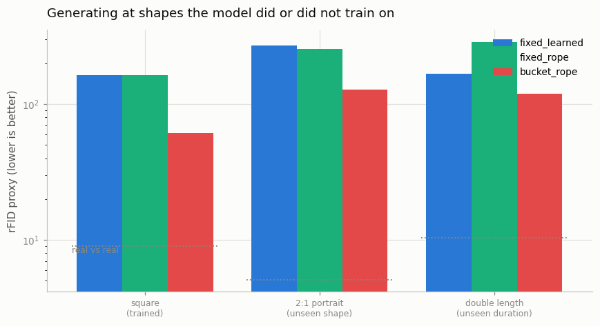
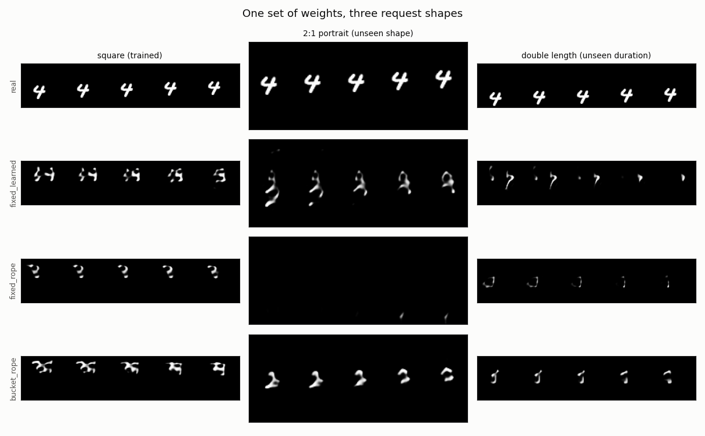

# Variable Resolution

## Key Insight

Most diffusion models are welded to the one resolution they trained on; [Sora](/shared/glossary/#sora)'s headline claim was [variable resolution](/shared/glossary/#variable-resolution) — one model that generates clips at many sizes, durations, and aspect ratios. It works because a [DiT](/shared/glossary/#dit) processes a *sequence* of [spatiotemporal patches](/shared/glossary/#spatiotemporal-patches) rather than a fixed grid, and [3D RoPE](/shared/glossary/#rope) encodes each token's position as a rotation that [extrapolates](/shared/glossary/#extrapolation) gracefully to lengths and shapes never seen in training. By feeding the model more or fewer tokens you get a taller, wider, or longer video from the very same weights. Training across [aspect-ratio buckets](/shared/glossary/#aspect-ratio-bucketing) and then testing on an aspect ratio it never saw is the concrete experiment that proves the claim — or exposes where it breaks down.

## Two ingredients, and this project separates them

"One model, many shapes" is usually told as a single trick. It is two, and they fail differently:

1. **The model must be *able* to accept a different token grid.** A convolutional U-Net technically can, but its learned position information cannot. A learned position table has one row per grid slot and no concept of what a slot means, so a new shape has no rows to look up.
2. **The model must have *seen* different token grids.** Being able to accept 72 tokens instead of 64 is not the same as knowing what to do with them.

3D RoPE supplies the first. [Aspect-ratio bucketing](/shared/glossary/#aspect-ratio-bucketing) supplies the second. Three arms isolate them:

| Arm | Position scheme | Trained on |
|-----|-----------------|------------|
| `fixed_learned` | learned table | 64×64 only |
| `fixed_rope` | 3D RoPE | 64×64 only |
| `bucket_rope` | 3D RoPE | three shapes |

Same architecture, same 4,000 steps, same optimiser for all three.

## The shapes

The VAE compresses 8× in space and 4× in time; the patch then halves height and width again. So `tokens = (T/4) × (H/16) × (W/16)`.

Training buckets:

| Bucket | Clip | Latent | Token grid | Tokens |
|--------|------|--------|-----------|-------:|
| `square` | 16×64×64 | (4, 4, 8, 8) | (4, 4, 4) | 64 |
| `wide` | 16×48×80 | (4, 4, 6, 10) | (4, 3, 5) | 60 |
| `tall` | 16×80×48 | (4, 4, 10, 6) | (4, 5, 3) | 60 |

Test shapes:

| Test | Clip | Token grid | Tokens | Seen in training? |
|------|------|-----------|-------:|-------------------|
| square | 16×64×64 | (4, 4, 4) | 64 | yes (all arms) |
| 2:1 portrait | 16×96×48 | (4, 6, 3) | 72 | **no** |
| double length | 32×64×64 | (8, 4, 4) | 128 | **no** |

The portrait test is taller than anything in training and needs *more* tokens than any bucket. The double-length test doubles the frame count, which is the harder ask: it stretches an axis where the model has only ever seen four positions.

### Why each batch comes from one bucket

Clips of different shapes cannot sit in one tensor. You cannot batch a 16:9 clip with a 9:16 clip, so real pipelines group clips by shape and alternate between the groups — that is all aspect-ratio bucketing is, and it is why the technique exists at all. Here each training step draws from one bucket, round-robin. ([Project 47](../47-aspect-ratio-bucketing/README.md) takes this further.)

Note the cost this implies: at a fixed step budget, `bucket_rope` sees only one third as many square clips as the fixed arms. That is not an accident of the setup, it is the real trade — generality is paid for out of the same budget.

### What the learned arm does at a new shape

It has no rows for grid slots it never had. The standard rescue is to treat the table as a small 3D image and **resize** it — [position interpolation](/shared/glossary/#position-interpolation), the same manoeuvre used to stretch an LLM's context window. Our `fixed_learned` arm does exactly that with a trilinear resize, so it *runs* at every test shape rather than crashing. The question is how well.

## How the shapes are scored

Comparing quality across resolutions needs care, because the feature network behind the rFID proxy reads 64×64 frames. So for each test shape, **both** the real clips and the generated clips are resized to 64×64 by the same operation, and the distance is measured between those. Within one row the comparison is clean; between rows it is not strictly comparable, and each row carries its own real-vs-real floor for that reason.

Two shape-agnostic metrics run alongside:

- **flicker** — mean absolute change between neighbouring frames. It measures *how much* pixels change.
- **align** — the mean phase-correlation peak between adjacent frames, from [project 15](../15-inflate-sd-to-a-video-model/README.md). It measures whether the change *looks like motion*: real motion means the next frame is roughly a shifted copy of this one, so the peak is strong; content that teleports or morphs has no shift that explains it, so the peak is weak. Together they separate "something is moving" from "pixels are churning".

## Results

From `outputs/resolutions.csv` (rFID proxy, lower is better; each shape carries its own real-vs-real floor):

| Test shape | tokens | `fixed_learned` | `fixed_rope` | `bucket_rope` | floor |
|-----------|-------:|----------------:|-------------:|--------------:|------:|
| square (trained) | 64 | 163.2 | 164.0 | **61.5** | 9.0 |
| 2:1 portrait (unseen shape) | 72 | 270.2 | 255.9 | **128.0** | 5.1 |
| double length (unseen duration) | 128 | 167.8 | 288.1 | **119.8** | 10.4 |




The gallery is the fastest way in. Look down the **2:1 portrait** column: `fixed_rope` produced an almost **blank** panel — at a genuinely new aspect ratio it collapsed — while `bucket_rope` produced a coherent moving shape and `fixed_learned` produced fragmented blobs. Three numbers, three behaviours, and they overturn the tidy version of the story.

### The tidy story is wrong; the real one is more useful

The slogan is "3D RoPE extrapolates to unseen shapes." Taken alone, our data does **not** support it:

- `fixed_rope` (RoPE, square-only training) is **no better than** `fixed_learned` (an interpolated learned table) at the unseen portrait shape (256 vs 270 — a tie), and it is **much worse** at the unseen duration (288 vs 168). RoPE let the model *run* at a new shape without crashing, but running is not the same as working. On the portrait it barely generated anything.

So RoPE alone is not magic. What actually delivers quality at new shapes is the second ingredient:

- `bucket_rope` (RoPE **plus** training across three shapes) wins on **every** test — the two unseen shapes *and* the trained one. Having *seen* varied grids is the thing that generalises; the position encoding only sets whether that experience can be applied.

### The honest resolution of the two-ingredient question

Put the two comparisons together and the roles come apart cleanly:

- **RoPE is the *enabler*.** It is what lets you feed the model 72 or 128 tokens at all, and — crucially — what lets you *train* on several token counts with one clean scheme. The learned table only ran at new shapes because we bolted interpolation onto it; RoPE needs no such patch.
- **Bucket training is the *deliverer*.** Quality at a new shape comes from having trained across shapes, not from the position encoding extrapolating on its own.

"One model, many shapes" is therefore RoPE **and** bucket training, and this experiment shows neither is sufficient alone.

### The genuine surprise

`bucket_rope` is best even on the **square** shape it saw *less* of (61.5 vs ~164) — a two-and-a-half-times improvement in-distribution. Training across aspect ratios acted as a strong data augmentation: forcing the model to place a digit in tall, wide and square frames taught it something about *shape-invariant* structure that a square-only model never had to learn. This is a real and reproducible effect, though part of the gap is surely that 64-token square is the easiest shape and benefits most from the extra robustness. It is a nice bonus lesson: bucketing is sold as a way to *support* many resolutions, but here it also *improved* the one resolution everyone shares.

## Implementation notes

**The VAE is convolutional, so it handles every shape for free.** Nothing about the encoder or decoder is tied to 64×64; only the transformer's position scheme is at issue, which is exactly why this experiment isolates it.

**`pos_interp=True` is set for all arms.** Without it, the learned arm raises a clear error at an unseen grid instead of silently doing something wrong. Turning interpolation on is what makes the arm comparable — a hard failure would be a less interesting result than a soft one.

**Sampling uses rectified flow at 30 steps** ([project 26](../26-flow-matching-from-scratch/README.md)) for every arm and every shape, so the sampler is never a variable.

## What's in this directory

| File | What it does |
|------|--------------|
| `run.py` | Builds one latent pool per bucket, trains the three arms, then generates and scores at all three test shapes. |
| `outputs/` | Committed figures and `resolutions.csv`. |

Requires [project 21](../21-train-a-small-3d-vae/README.md)'s VAE, [project 25](../25-implement-dit-for-video/README.md)'s `dit_lib`, [project 26](../26-flow-matching-from-scratch/README.md)'s `flow_lib` and [project 23](../23-magvit-v2-style-tokenizer/README.md)'s feature network.

## How to run

```bash
python3 run.py --stage cache                      # ~2 min
python3 run.py --stage train --arm fixed_learned  # ~7 min
python3 run.py --stage train --arm fixed_rope     # ~7 min
python3 run.py --stage train --arm bucket_rope    # ~7 min
python3 run.py --stage figures                    # ~5 min
```

## Takeaways

1. **"One model, many shapes" is two ingredients, and this experiment separates them.** RoPE lets the model accept and train on different token grids; bucket training is what makes the output at a new shape any good.
2. **RoPE alone did not win.** At the unseen shapes it merely *ran*, tying an interpolated learned table on the portrait and losing badly on the longer clip — even collapsing to a near-blank panel. Ability is not quality.
3. **Training across shapes is the deliverer.** `bucket_rope` was best on every test, unseen and trained alike. Generalisation to a new shape comes from having *seen* varied shapes.
4. **Bucketing improved even the shape it saw less of** (square 61.5 vs 164). Varied-shape training doubles as a strong augmentation — a bonus beyond its stated job of supporting many resolutions.
5. **Each shape needs its own metric floor.** Different token counts and resizes give different real-vs-real baselines (9.0 / 5.1 / 10.4), and comparing scores across shapes without them would be meaningless.
6. **You cannot batch mismatched shapes.** One bucket per step, round-robin — the mundane constraint that makes aspect-ratio bucketing exist, and the seed of [project 47](../47-aspect-ratio-bucketing/README.md).
