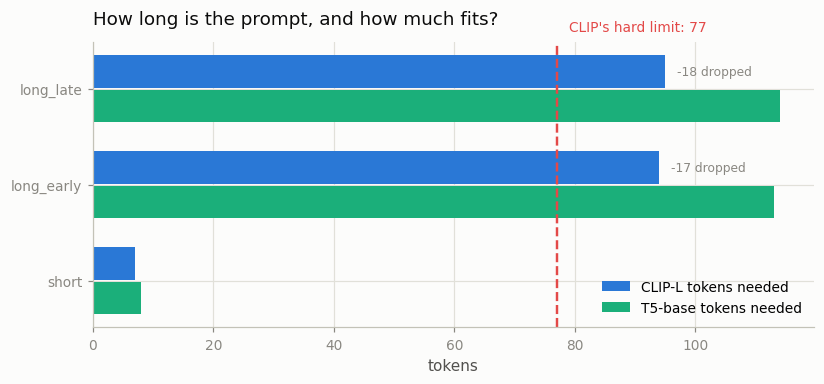
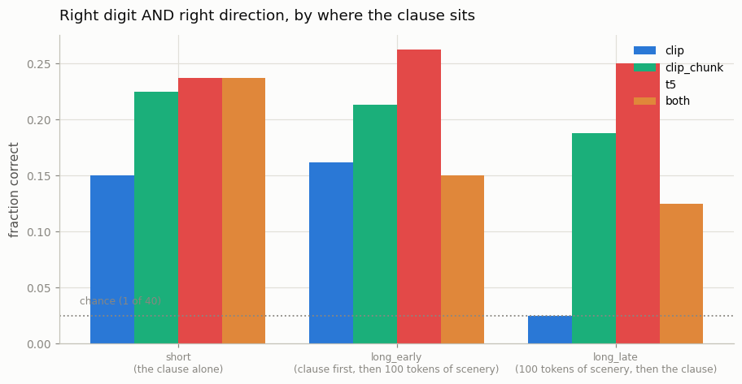
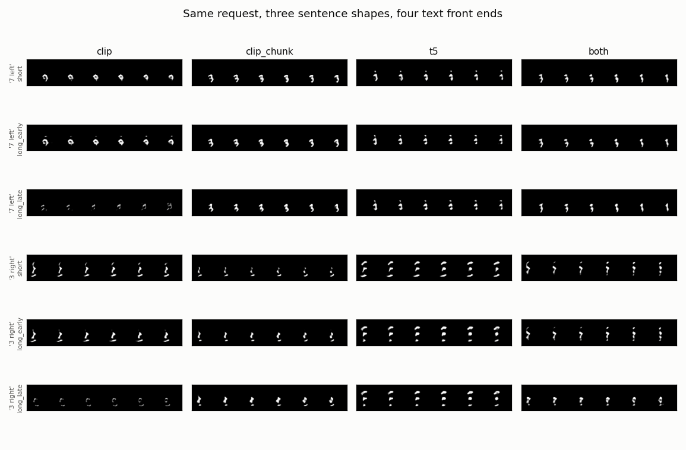
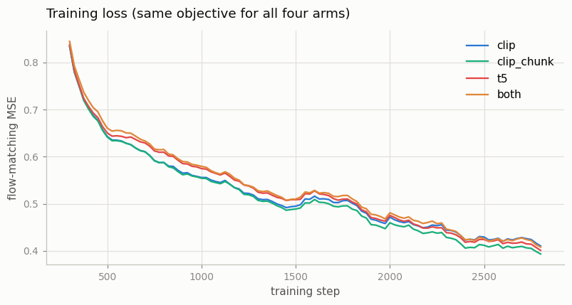

# Long-Prompt Handling

## Key Insight

A [text-to-video](/shared/glossary/#t2v) model is only as good as the text encoder that reads your prompt, and the popular [CLIP](/shared/glossary/#clip) text encoder was trained on short captions and silently cuts off anything past 77 tokens — so a detailed, paragraph-long prompt loses most of its words before the model ever sees them. This project fine-tunes with [T5-XXL](/shared/glossary/#t5) prompts (up to 256 tokens), a language [transformer](/shared/glossary/#transformer) built to read long, detailed sentences, and compares its prompt adherence against [CLIP-L](/shared/glossary/#clip-l) conditioning. The payoff is concrete: with the longer encoder the model can honor clauses like "a red car *behind* a blue truck at sunset" that a 77-token encoder would clip or scramble. Many frontier models hedge by feeding *both* encoders into [cross-attention](/shared/glossary/#cross-attention) — CLIP for a quick gist of style, T5 for the fine-grained wording.

> This project is the backbone of Phase 7. Projects [31](../31-controlnet-video/README.md),
> [33](../33-video-inversion-edit/README.md) and [34](../34-lora-for-video/README.md)
> all reuse the model trained here as their frozen base.

## The wall, measured before anything is built

The truncation is not a soft limit or a gentle quality slope. It is a hard cut,
and you can watch it happen with a tokenizer and no training at all.
`--stage prompts` writes three captions describing the same clip, differing only
in *where* the decisive words sit:

| Prompt shape | CLIP-L tokens needed | Kept | Thrown away | T5 tokens | Decisive clause survives? |
|--------------|---------------------:|-----:|------------:|----------:|--------------------------|
| `short` — the clause alone | 7 | 7 | 0 | 8 | yes |
| `long_early` — clause first, then 100 tokens of scenery | 94 | 77 | 17 | 113 | yes |
| `long_late` — 100 tokens of scenery, then the clause | 95 | 77 | **18** | 114 | **no** |



### Why exactly 77, and why you cannot just raise it

CLIP learned a **position table**: one trainable vector per slot in the sentence,
so the model can tell "the first word" from "the fifth word". That table was
built with exactly 77 rows. Token 78 has no row to look up — there is no vector
to add and no flag that turns the limit off. Raising it is not a configuration
change; it is a new pretraining run.

T5 was built for a different job — read a passage, write another one — so it uses
*relative* position information and ships with a 512-token window. Nothing about
T5 is inherently smarter here. It was simply designed for text long enough to
have paragraphs in it.

### The proof, in one number

`outputs/truncation_proof.txt` encodes two genuinely different requests — *a 7
drifting left* and *a 1 drifting right* — and compares what CLIP actually
produces after truncation:

| Prompt shape | Same token ids after truncation? | Cosine similarity | Largest difference anywhere |
|--------------|----------------------------------|------------------:|----------------------------:|
| `short` | no | 0.914 | 4.771 |
| `long_early` | no | 0.958 | 3.545 |
| `long_late` | **yes** | **1.0000** | **0.00000** |

For `long_late` the two captions arrive at the model as **the same numbers** —
not similar, identical to the last decimal. That settles everything below before
a single training step runs: no amount of training can teach a model to
distinguish two inputs that are the same input.

## Why a second text encoder at all?

A fair objection: the DiT is a transformer and CLIP is a transformer, so why bolt
one onto the other — and then bolt a *second* one on?

**Why any external encoder, when the DiT could read words itself?** Two reasons,
and they are different reasons.

1. **Knowledge it cannot get here.** CLIP and T5 were trained on far more text
   than any video dataset contains. They arrive already knowing that "drifting"
   is a kind of motion. A text pathway trained from scratch on video captions
   would have to rediscover all of that from the handful of captions a video
   dataset can afford.
2. **Protection from this training run.** Because the encoder is *frozen*,
   nothing that happens during video training can damage that knowledge. The DiT
   learns to *use* the representation; it never gets to change it.

**Why not use CLIP's single pooled vector, the output it was designed to
produce?** CLIP's headline output is one vector for the whole caption, trained so
that a caption's vector lands near the matching image's vector. That is a
*matching* signal: excellent for "do this picture and this sentence go
together?", useless for "which pixels does the word *left* apply to?". Generation
needs the per-token hidden states so the
[cross-attention](/shared/glossary/#cross-attention) inside the DiT can look up
individual words while it paints. This project uses the per-token states for
cross-attention *and* a pooled summary for the global
[AdaLN](/shared/glossary/#adaln-zero) conditioning — two jobs, two shapes of the
same encoder's output.

**Why keep CLIP at all if T5 reads more?** That is the `both` arm's question, and
the answer real systems (Imagen, [SD3](/shared/glossary/#sd3)) give is that the
two encoders are good at different things. CLIP's representation is grounded in
*images*, because it was trained against pictures, so it carries a sense of
visual style; T5 never saw a picture but parses word order and clause structure
far better. Keeping both is a hedge, not redundancy — and it costs context
length, which is why this project measures whether the hedge pays for itself.

## The four arms

Same DiT (dim 128, depth 5, 4 heads, 2.0M parameters), same 2,800
[rectified-flow](/shared/glossary/#rectified-flow) steps, same cached latents.
Only the text front end differs.

| Arm | What reaches the model | Context tokens |
|-----|------------------------|---------------:|
| `clip` | CLIP-L, truncated at 77 — the naive path | 77 |
| `clip_chunk` | CLIP-L run on 75-token slices, results laid side by side | 154 |
| `t5` | T5-base, 128 tokens | 128 |
| `both` | CLIP-L (truncated) **and** T5, concatenated | 205 |

`clip_chunk` is the workaround the community actually uses — it is what
AUTOMATIC1111 and ComfyUI do with long prompts: cut the token stream into
77-token windows, encode each window separately, glue the outputs together.
Nothing is discarded. The catch is that each window is encoded *without seeing
the others*, so a phrase split across a seam is read as two unrelated fragments,
and no window knows it is the second half of anything.

T5-base rather than T5-XXL is the one concession to a CPU: XXL is 11 billion
parameters. T5-base is 110M and, conveniently, produces the same 768-wide vectors
as CLIP-L — so the two arms are compared at equal width rather than accidentally
comparing model sizes.

## What the model is asked to do

The video side is Phase 6's world: one MNIST digit sliding in one straight
direction, so the caption "a 7 drifting left" is true of *every* frame and can be
graded without ambiguity. Two independent judges from earlier projects do the
grading:

- **which digit** — [project 28](../28-mmdit-for-video/README.md)'s classifier
  (84.2% on real held-out clips, the ceiling any generated clip is measured
  against)
- **which direction** — the centre-of-mass drift from
  [project 25](../25-implement-dit-for-video/README.md), which needs no training
  and is 100% correct on real clips

Training samples all three prompt shapes at random, so the `clip` arm is not
handicapped by unfamiliarity: it *trained* on `long_late` captions. It simply
never received the words in them.

## Results

80 clips per cell (40 prompts × 2 samples), guidance 3.0, 30 sampling steps.
From `outputs/adherence.csv`:

| Arm | Prompt shape | Right digit | Right direction | **Both** | rFID proxy |
|-----|--------------|------------:|----------------:|---------:|-----------:|
| `clip` | short | 0.162 | 0.975 | 0.150 | 95.7 |
| `clip` | long_early | 0.175 | 0.975 | 0.162 | 68.4 |
| `clip` | **long_late** | 0.138 | **0.188** | **0.025** | 158.1 |
| `clip_chunk` | short | 0.237 | 0.988 | 0.225 | 49.2 |
| `clip_chunk` | long_early | 0.213 | 1.000 | 0.213 | 58.4 |
| `clip_chunk` | **long_late** | 0.188 | 1.000 | **0.188** | 84.3 |
| `t5` | short | 0.250 | 0.988 | 0.237 | 14.0 |
| `t5` | long_early | 0.275 | 0.988 | **0.262** | 16.8 |
| `t5` | **long_late** | 0.262 | 0.988 | **0.250** | 23.6 |
| `both` | short | 0.237 | 1.000 | 0.237 | 68.6 |
| `both` | long_early | 0.175 | 0.975 | 0.150 | 63.2 |
| `both` | **long_late** | 0.150 | 0.975 | 0.125 | 72.8 |
| *chance* | | 0.100 | 0.250 | 0.025 | |
| *real clips (ceiling)* | | 0.842 | 1.000 | | 3.0 |



### The collapse is exactly total, and exactly where predicted

`clip` on `long_late` scores **0.025** — chance is 1-in-40, which is 0.025. Not
"degraded", not "worse": indistinguishable from guessing. Direction falls to
0.188 against a 0.25 chance level, i.e. also random, while the same model gets
direction right 97.5% of the time when the clause is in the first 77 tokens.

This is the truncation proof cashing out. The model's input for every `long_late`
prompt was literally the same tensor, so it produced the same distribution of
clips regardless of what was asked. Nothing about training, capacity, or
guidance could have changed that.

The sample grid shows it as well as the numbers do. In the `clip` / `long_late`
rows the output is not a wrong digit — it has degraded into faint specks, because
the model is averaging over every clip that any `long_late` caption could have
described.



### The chunking workaround genuinely works

`clip_chunk` takes `long_late` from 0.025 to **0.188** — from chance to within
noise of its own `short` score (0.225). This is worth stating plainly because
chunking is often described as a hack: **it recovers essentially all of the lost
adherence.** Each window is still read in isolation, but our decisive clause sits
entirely inside one window, so nothing important straddles a seam. A prompt
whose meaning spans the boundary ("a car that is **not** red") is where the
method would be expected to fail, and this experiment does not test that.

### T5 wins on every cell, and on quality too

`t5` is the only arm that is **flat across prompt shapes** — 0.237 / 0.262 /
0.250. Where you put the important words simply does not matter to it, which is
the entire practical point of a longer context window.

Less expected: `t5` also has by far the best rFID proxy (14.0–23.6, against
49–158 for every other arm; real-vs-real is 3.0). Adherence and raw sample
quality usually trade off against each other, and here one arm dominated both.
The plausible reading is that T5's per-token features are simply easier for a
small cross-attention to use, so the model spent less of its limited capacity
decoding the conditioning and more of it on the pictures.

### The honest surprise: `both` is worse than `t5` alone

The hedge did not pay. `both` starts level with `t5` on short prompts (0.237 vs
0.237) and then **degrades as prompts get longer** — 0.237 → 0.150 → 0.125 — the
opposite of what "more information is better" predicts.

The mechanism is visible in the setup once you look for it. On a `long_late`
prompt, the CLIP half of the context is *the same 77 vectors for every caption*.
So a third of what the model reads is guaranteed-uninformative, and it must learn
to ignore it — while carrying 60% more context tokens and 100k more parameters at
the same 2,800-step budget.

That does **not** show that frontier models are wrong to use two encoders. It
shows what their configuration is actually buying: they feed CLIP a prompt that
fits inside 77 tokens, or a separately-written short caption, so CLIP's
contribution is real rather than constant. Concatenating a *truncated* encoder to
a working one adds noise, not knowledge. The lesson is about pairing an encoder
with a prompt it can actually read.

### Reading the absolute numbers honestly

Digit accuracy tops out at 0.275 against a judge that scores 0.842 on real clips.
This is a 2.0M-parameter model trained for 2,800 steps on 64-pixel clips; drawing
a recognisable specific digit is genuinely hard for it, and `both_acc` is
dominated by that weakness. Direction, which is easy, sits at 0.97–1.00 for every
arm that can read the clause.

So the trustworthy signal here is **relative**: same model, same data, same
budget, one thing changed. And on that comparison the effect is not subtle — it
is the difference between 0.025 and 0.250.



The training losses are nearly indistinguishable — all four arms land between
0.39 and 0.42 — and the *lowest* curve belongs to `clip_chunk`, which is not the
best arm on either adherence or rFID. All four are equally good at the denoising
objective; they differ entirely in *whether the conditioning meant anything*. A
loss curve could never have shown you this. Adherence has to be measured
directly.

## Implementation notes

**Padding is masked, and that is not a detail.** Every prompt is padded to a
fixed length so a batch can be one tensor. Without an attention mask those
padding slots are ordinary keys the video tokens may attend to. Padding carries
no meaning, and — worse for this experiment — the *amount* of padding depends on
prompt length. An unmasked model would behave differently for long and short
prompts for reasons that have nothing to do with the words, which is exactly the
difference being measured.

**The encoders run once.** They are frozen, so a prompt's embedding is a
constant. `--stage encode` computes all 240 of them and stores them; training
never loads CLIP or T5 again. Real pipelines do the same at enormous scale, for
the same reason.

**The pooled-text projection is *not* zero-initialised.** Phase 4's
[project 17](../17-temporal-cfg-study/README.md) found a conditioning path whose
signal started ~40× weaker than the timestep signal it was added to, and never
caught up — ordinary gradient descent does not equalise two terms in a sum. So
the pooled text goes through a LayerNorm and a plainly-initialised Linear,
landing on the same scale as the timestep term from step 1.

## What's in this directory

| File | What it does |
|------|--------------|
| `text_lib.py` | Prompt builder, the frozen CLIP-L / T5 encoders, `TextVideoDiT` with masked cross-attention, CFG sampling. Imported by projects 31, 33 and 34. |
| `train.py` | The four stages: `prompts`, `encode`, `train`, `figures`. |
| `outputs/` | Committed figures, CSVs and the truncation proof. |

Requires [project 21](../21-train-a-small-3d-vae/README.md)'s 3D VAE,
[project 25](../25-implement-dit-for-video/README.md)'s `dit_lib` and latent
cache, [project 26](../26-flow-matching-from-scratch/README.md)'s `flow_lib`,
[project 23](../23-magvit-v2-style-tokenizer/README.md)'s feature network and
[project 28](../28-mmdit-for-video/README.md)'s digit judge.

## How to run

```bash
python3 train.py --stage prompts                  # ~1 min
python3 train.py --stage encode                   # ~3 min (downloads CLIP-L + T5-base)
python3 train.py --stage train --arm t5           # ~5 min
python3 train.py --stage train --arm clip         # ~4 min
python3 train.py --stage train --arm clip_chunk   # ~7 min
python3 train.py --stage train --arm both         # ~10 min
python3 train.py --stage figures                  # ~9 min
```

## Takeaways

1. **The 77-token limit is a hard cut, not a gentle decline.** Two different
   requests whose difference falls past token 77 arrive at CLIP as the *same
   numbers* — cosine 1.0000, maximum difference 0.00000. Verify this with a
   tokenizer before you blame your model for ignoring your prompt.
2. **A deleted word cannot be recovered downstream.** The `clip` arm scored
   exactly chance (0.025 of 0.025) on late-clause prompts despite having trained
   on them. No amount of data, capacity or guidance fixes information that was
   destroyed before the model saw it.
3. **You cannot raise the limit.** CLIP's position table has 77 rows and token 78
   has nowhere to go. This is an architectural fact, not a setting.
4. **The chunking workaround really works** — 0.025 → 0.188, back to its own
   short-prompt level. It has a real weakness (each window is read blind to the
   others, so meaning spanning a seam is lost), but "just a hack" undersells it.
5. **A long-context encoder makes adherence flat in prompt length.** T5 scored
   0.237 / 0.262 / 0.250 across the three shapes — where you put the words simply
   stopped mattering. It also had the best sample quality by a wide margin.
6. **Adding a truncated encoder to a working one made things worse** (0.237 →
   0.125 as prompts lengthened). Two encoders help when *both* can read the
   prompt; bolted onto a prompt it cannot see, the second encoder contributes a
   constant block of context the model has to learn to ignore. Pair each encoder
   with a prompt it can actually read.
7. **The training loss knew nothing about any of this.** All four arms converged
   to within 0.03 of each other, and the lowest loss belonged to a mid-table arm.
   Conditioning quality is invisible to the objective — measure it separately.
