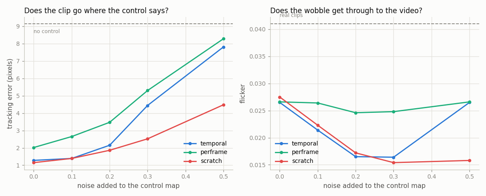
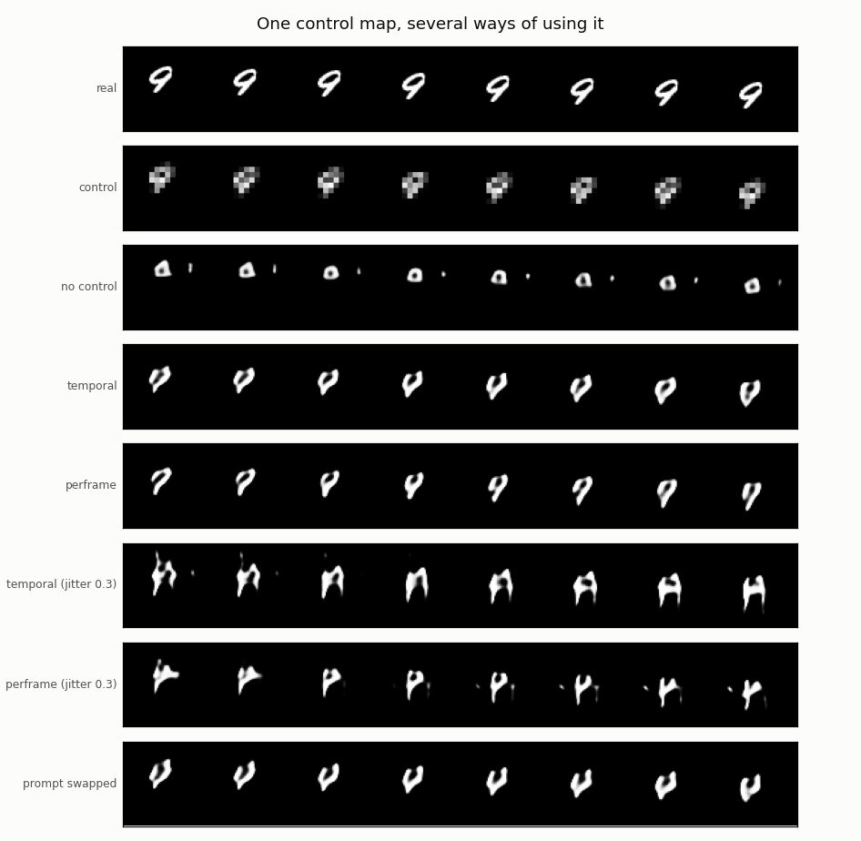
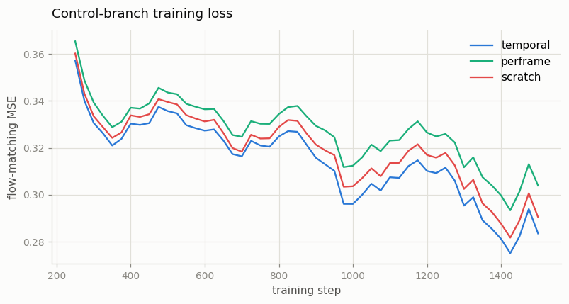

# ControlNet-Video

## Key Insight

[ControlNet](/shared/glossary/#controlnet) gives an image [diffusion model](/shared/glossary/#diffusion-model) precise spatial control by feeding it a structural map — a [depth map](/shared/glossary/#depth-map), pose skeleton, or edge map — that dictates *where* shapes go while the prompt decides *what* fills them. This project carries that idea to video by conditioning a video diffusion model on a depth map for *every* frame, so the generated clip follows the real scene's near-and-far layout shot by shot. The new difficulty is [temporal consistency](/shared/glossary/#temporal-consistency): running ControlNet on each frame independently makes textures crawl and flicker, so the control features must be shared across time. Like the difference between a smoothly animated flipbook where each drawing flows into the next, and a scattered pile of individual sketches that jitter wildly when played back—this shared time-awareness is what separates a true [video-to-video](/shared/glossary/#v2v) method from a stack of unrelated image edits.

## What ControlNet is for

A prompt says *what*. It is hopeless at saying *where*: no sentence pins a shape
to a pixel. ControlNet adds a second input — a structural map, frame by frame —
that says exactly where things belong, and leaves the prompt in charge of
everything else.

**Why not just fine-tune the base model to take the extra input?** You can, and
it usually goes badly. Control datasets are small — thousands of clips, not
millions — and updating every weight on a small dataset drags the model away from
everything else it knew. Phase 4's [project 16](../16-joint-image-video-training/README.md)
measured that damage directly. ControlNet's answer is three commitments:

1. **The base is frozen.** Its knowledge cannot be harmed, because no gradient
   ever reaches it.
2. **A copy of some of its blocks becomes a trainable side branch.**
3. **The branch connects to the base through
   [zero-initialised](/shared/glossary/#zero-conv) projections**, so at step 0 the
   branch contributes exactly nothing and the whole system is bit-for-bit the
   original model.

**Why copy blocks instead of starting the branch from random weights?** Because a
copy already knows how to represent this kind of data. Random weights would spend
thousands of steps rediscovering what the frozen model sitting right next to them
already knows. The `scratch` arm below measures what that head start is worth.

**Why "zero convolution"?** ControlNet's paper joins branch to base with 1×1
convolutions whose weights start at zero. Zero output means the frozen model
keeps behaving exactly as before, while the branch's own weights are free to
start moving. Our tokens are vectors rather than feature maps, so the same idea
is a zero-initialised `nn.Linear` — same role, same reason, different shape. The
`checks` stage asserts the consequence:

```
temporal  |output - frozen base| at init: 0.00e+00   trainable 1,167,792 of 3,169,216 (36.8%)
perframe  |output - frozen base| at init: 0.00e+00   trainable 1,150,896 of 3,152,320 (36.5%)
scratch   |output - frozen base| at init: 0.00e+00   trainable 1,167,792 of 3,169,216 (36.8%)
```

Exactly zero, not merely small.

## The control signal, and being honest about it

Moving MNIST has no depth. So the control here is built to play the same *role* a
depth map plays: every frame of a real clip is average-pooled down to 16×16,
which keeps **where** the bright object is and how it moves, and destroys the
stroke detail that says **which** digit it is.

That is a fair analogy, because a real depth map is also a partial description: it
gives silhouette and distance, and says nothing about colour or texture. And like
a real depth map, it is not identity-free — a depth map of a face still reveals a
great deal. The `checks` stage measures exactly how much leaks through:

```
digit judge on full-resolution frames: 84.4%
digit judge on the control map alone:  38.3%   (chance 10%)
```

So the control retains a real but much-reduced trace of identity. Worth knowing
before reading any "the prompt decides what" claim below.

## Three arms

The frozen base is [project 30](../30-long-prompt-handling/README.md)'s T5 arm —
a working text-to-video model. Only the control branch trains, for 1,500 steps.

| Arm | Control encoder | Self-attention inside the branch | Question it answers |
|-----|-----------------|----------------------------------|---------------------|
| `temporal` | 3D convolutions — each output pools several input frames | full spatiotemporal | the video-native design |
| `perframe` | 2D convolutions on four separate frames — no mixing across time anywhere | locked inside each frame | what "run the image ControlNet on every frame" really means |
| `scratch` | same as `temporal` | full spatiotemporal | is copying the base blocks worth anything? |

`perframe` is deliberately built so that **each control token is a function of
exactly one input frame**. Nothing in that path lets frame 5 know what frame 4
looked like. That is the naive per-frame pipeline written out honestly.

## The experiment that separates them

Both arms track a clean control map about equally well — that is the easy case.
The interesting stress is the one that happens in practice: **real control maps
are computed one frame at a time and wobble.** A depth estimator run on
consecutive frames returns slightly different depths for the same unmoving wall.
That flicker is in the *control*, before the video model sees anything.

So both arms train on the same lightly-jittered control, and are then evaluated
across a sweep of jitter levels (0 → 0.5) that runs well past what they trained
on. The hypothesis going in was that a time-blind branch would pass the wobble
straight through while a time-aware one would average it away. The results
section reports what actually happened, which is only half that. Two things are
measured at each level:

- **tracking error** — mean distance, in pixels, between where the generated clip
  put the object and where the control asked for it
- **flicker** — mean absolute change between neighbouring frames of the output

This mirrors the noise-augmentation robustness sweep in Phase 4's
[project 18](../18-cascaded-super-resolution/README.md), and for the same reason:
the interesting question is never "how good is it on perfect input", it is "how
fast does it fall apart on realistic input".

## Results

48 clips per cell, guidance 3.0, 30 sampling steps. From `outputs/control.csv`:

| Arm | Control noise | Tracking error (px) | Flicker | Digit accuracy |
|-----|--------------:|--------------------:|--------:|---------------:|
| **no control** (frozen base) | — | **9.14** | 0.0321 | 0.292 |
| *the real clips themselves* | — | *0.10* | *0.0410* | |
| `temporal` | 0.0 | **1.28** | 0.0265 | 0.354 |
| `temporal` | 0.2 | 2.15 | 0.0165 | 0.188 |
| `temporal` | 0.5 | 7.81 | 0.0265 | 0.146 |
| `perframe` | 0.0 | **2.02** | 0.0266 | 0.250 |
| `perframe` | 0.2 | 3.47 | 0.0246 | 0.167 |
| `perframe` | 0.5 | 8.28 | 0.0266 | 0.146 |
| `scratch` | 0.0 | **1.15** | 0.0275 | 0.354 |
| `scratch` | 0.2 | 1.86 | 0.0172 | 0.188 |
| `scratch` | 0.5 | **4.48** | 0.0158 | 0.188 |




### Control works, and the size of the effect is the point

The frozen base misses the requested layout by **9.14 pixels** on a 64-pixel
canvas — which is what "the prompt cannot say where" looks like when you measure
it. It is not being careless; it was never told. Adding the control branch takes
that to **1.15–1.28 px**, a 7–8× improvement, against a floor of 0.10 px for the
real clips themselves.

In the strip figure the "no control" row is a small blob sitting in the wrong
place and barely moving, while both control arms produce a digit-shaped object
walking along the control's path.

### The time-blind branch is worse — but not for the reason predicted

`perframe` is worse at every single noise level: 2.02 vs 1.28 px on clean
control, 3.47 vs 2.15 at moderate noise, 8.28 vs 7.81 at extreme noise. So the
headline claim holds — **a control branch with no sense of time tracks about 58%
worse.**

But the *shape* of the gap is not what "jitter passes through a time-blind path"
predicts. The two curves are roughly parallel; `perframe` does not fall off a
cliff as noise rises. The penalty is there from the clean case onward, which
points at a different mechanism than noise: each latent slot has to summarise
four pixel frames, and `perframe` sees only one of them. It therefore does not
know where the object is *heading*, only where it was in one instant. Its
handicap is missing information, not amplified noise.

### The flicker result inverts, and both arms are failing

Flicker was expected to *rise* for `perframe` as noise grew. It does not — it
stays flat at ~0.025–0.027 — while the time-aware arms *fall* to 0.015–0.017.

Read that carefully before calling it a win, because the real clips score
**0.041** and every arm is below it. Lower flicker here does not mean "smoother",
it means "moving less". Under a badly corrupted control the time-aware branches
respond by damping motion until the clip is nearly static, while the time-blind
branch keeps relaying the wobble. Those are two different failure modes, not a
good outcome and a bad one. The honest summary is that the temporal branch
suppresses the noise *and* the signal along with it.

The jitter-0.3 strips show it: `temporal` becomes a fat smeared shape, while
`perframe` scatters loose specks around the digit — visible debris from the noise
it is passing on.

### The textbook inversion: `scratch` beat the copy

ControlNet's design says to initialise the branch from a copy of the base's
blocks. Here the randomly-initialised branch was **better on every measurement**:
1.15 vs 1.28 px on clean control, and far more robust as noise rose (4.48 vs 7.81
at the extreme).

This is worth stating plainly rather than hiding, and worth bounding. ControlNet's
argument is about a *huge* pretrained model and a *small* control dataset: there,
random weights would need more data than you have to catch up. Neither condition
holds here — the base is 2.0M parameters and the control branch trains on the
same 1,024 clips the base itself learned from. So the copied weights arrive
already specialised for a different task (denoise video given text) and that turns
out to be a worse starting point than nothing for "read a control map". Do not
generalise this to production scale; do take it as evidence that the copy is an
optimisation for a specific regime, not a law.

### Where the control's authority stops

From `outputs/swap.csv`, generating with the control from one clip and a prompt
naming a *different* digit:

| Measure | Value |
|---------|------:|
| digit matches the **prompt** | 0.167 |
| digit matches the **control's source clip** | 0.167 |
| tracking error vs the control | **1.19 px** |
| chance | 0.100 |

The layout claim is confirmed: **1.19 px tracking even when the prompt is fighting
the control** — the object still goes where the control says, and the strip's
"prompt swapped" row shows a digit walking the control's path.

The content claim is *not* resolved. Prompt and source score identically, both
near chance. That is a limitation of this scale rather than a finding: the base
model's digit accuracy is only 0.29–0.35 to begin with, so there is not enough
signal in either channel to declare a winner. The `checks` stage already showed
the control map itself retains 38% digit information, so the two conditions were
never cleanly separated. Reporting this as "the prompt decides what" would have
been overclaiming.

One genuine detail: **control slightly improved digit accuracy** on the matched
setting (0.354 vs the base's 0.292). Constraining where the object goes makes the
remaining job easier. And digit accuracy collapses as the control is corrupted
(0.354 → 0.146) — a bad control map does not merely misplace the object, it
degrades the content too.



## What's in this directory

| File | What it does |
|------|--------------|
| `control_lib.py` | The depth-map stand-in, the two control encoders, the frame-local attention mask, and `ControlledDiT` (frozen base + trainable branch + zero connections). |
| `run.py` | Stages: `checks`, `train --arm ...`, `figures`. |
| `outputs/` | Committed figures and CSVs. |

Requires [project 30](../30-long-prompt-handling/README.md)'s trained `t5` arm
and its text cache, [project 21](../21-train-a-small-3d-vae/README.md)'s VAE,
[project 25](../25-implement-dit-for-video/README.md)'s latent cache, and
[project 28](../28-mmdit-for-video/README.md)'s digit judge.

## How to run

```bash
python3 run.py --stage checks                  # ~1 min
python3 run.py --stage train --arm temporal    # ~7 min
python3 run.py --stage train --arm perframe    # ~6 min
python3 run.py --stage train --arm scratch     # ~7 min
python3 run.py --stage figures                 # ~8 min
```

## Takeaways

1. **Zero-initialised connections make the addition free, exactly.** `|output −
   frozen base| = 0.00e+00` at init, so the control branch can only ever improve
   on a working model. Assert this in code — "approximately identity" is a
   different and much worse guarantee.
2. **A prompt genuinely cannot say where.** The frozen base missed the requested
   layout by 9.14 px on a 64-px canvas; the control branch cut that to 1.15 px.
   That gap *is* the case for ControlNet, measured.
3. **A time-blind control branch tracks ~58% worse — but check why before you
   explain it.** The penalty was there on clean control and stayed roughly
   constant as noise rose, which points at missing information (one frame per
   latent slot, so no sense of where the object is heading) rather than the
   amplified-jitter story the experiment was designed around.
4. **Lower flicker is not automatically better.** Under corrupted control the
   time-aware arms dropped to 0.015 against real clips' 0.041 — they suppressed
   the noise by suppressing the motion. Always carry the real-data reference
   alongside a "smoothness" metric, or you will award points for going still.
5. **The trainable copy lost to random initialisation here** (1.15 vs 1.28 px,
   and far more robust). ControlNet's copy argument assumes a huge frozen model
   and a small control dataset; at toy scale neither holds, and inherited
   task-specific weights were a worse start than none. A recipe's justification
   matters as much as the recipe.
6. **The control map is not identity-free, and that limited the experiment.** It
   still carried 38% digit accuracy, so the "prompt decides what, control decides
   where" split could only be confirmed on the *where* half (1.19 px even with a
   conflicting prompt). Real depth maps leak the same way.
