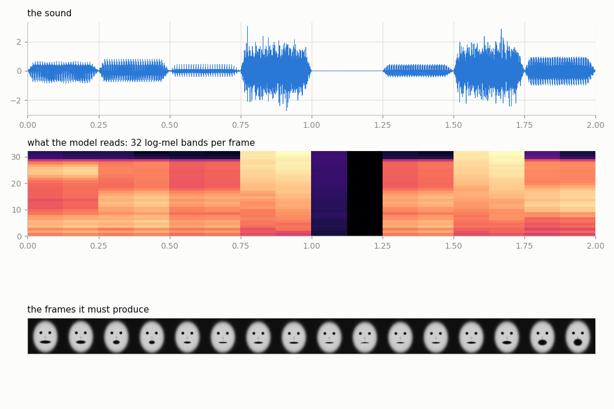
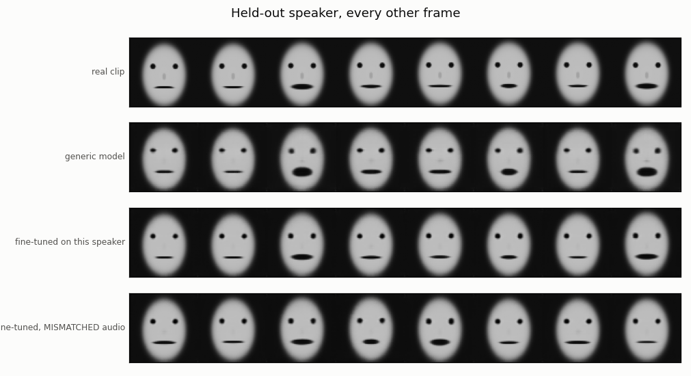
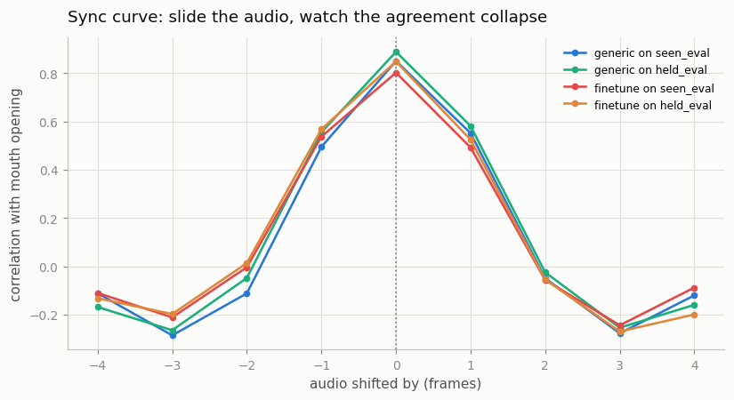
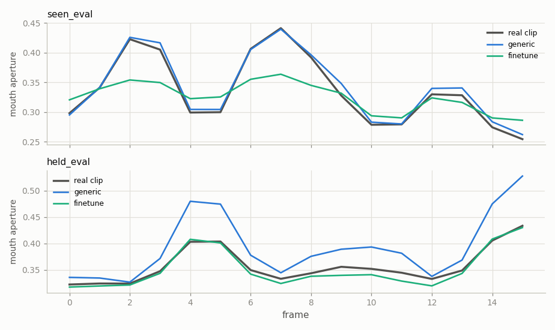

# Talking Head

## Key Insight

A [talking-head](/shared/glossary/#talking-head) model takes a single portrait photo and an audio clip and produces a video of that person speaking the audio, with lips, jaw, and head moving in sync — the audio drives the motion while the photo fixes the identity. This project runs a pretrained model such as [EMO](/shared/glossary/#emo) or [Hallo](/shared/glossary/#hallo) on a portrait-plus-audio pair, then [fine-tunes](/shared/glossary/#fine-tuning) it for one specific speaker so the mouth shapes and mannerisms match that person more faithfully. The core challenge is lip sync: the mouth must form the right shape for each sound at the right instant, which is why these models extract audio features (often with a speech encoder like wav2vec) and align them to facial motion frame by frame.

## Why this project builds a miniature instead of running EMO

EMO and Hallo do not fit on the hardware this guide targets. Each is a
Stable-Diffusion-scale U-Net plus a ReferenceNet plus an audio encoder, sampled
with 25+ diffusion steps *per frame*: tens of gigabytes of weights, and on a CPU
not minutes but hours per clip. [Project 10](../10-run-svd-inference/README.md)
is where this guide runs a real pretrained video model end to end; this project
spends its budget elsewhere.

So it builds the smallest world that still contains every real problem: a face
whose mouth must move in time with a sound, an identity that must survive the
animation, and a speaker whose personal habits are invisible in their photo.
Every measurement below — sync, the shift curve, the mismatched-audio control —
is what talking-head papers actually report.

The honest limits: the audio is synthesised rather than recorded, the faces are
drawn rather than photographed, and there is no diffusion sampler. What carries
over is the *structure* of the problem and how you prove a lip-sync claim.

## The world

**Six sounds.** Each has a spectrum (two formants — the resonances of the vocal
tract that make "ah" sound different from "ee" — or filtered noise for "ss") and
a target mouth shape. A clip is eight of them in a row, turned into a waveform.

**Decoding two names.** A **[phoneme](/shared/glossary/#phoneme)** is the
smallest unit of *sound* that changes a word's meaning. A
**[viseme](/shared/glossary/#viseme)** is the smallest unit of visible *mouth
shape*. They are not the same and not one-to-one: "p", "b" and "m" look identical
from outside — lips pressed shut — which is why lip-reading is hard, and why a
model that predicts mouth shape can never fully recover the words.

**Mel, and why the spectrum is re-binned.** Human hearing resolves low
frequencies much more finely than high ones: the gap between 100 Hz and 200 Hz is
far more audible than the gap between 5000 Hz and 5100 Hz. The
[mel](/shared/glossary/#mel-bands) scale (from "melody") stretches the low end and
squashes the high end so that equal distances on the scale sound equally far
apart. A [mel spectrogram](/shared/glossary/#mel-spectrogram) is therefore a
spectrum re-binned the way an ear would bin it — fewer numbers than a raw
spectrum, and the numbers that survive are the ones that matter for speech.



**Ten speakers**, each with their own head shape, skin tone, eye spacing — and one
property that is *not* visible: `max_open`, how far they drop their jaw. Speaker 8
is held out and barely opens their mouth (`max_open` 0.40, against 0.75–1.00 for
everyone else).

That single hidden number is why this project has a fine-tuning stage, and it
answers the obvious objection: **if the model already receives a photo of the
person, what is left for fine-tuning to learn?** The photo shows a closed mouth.
Nothing in it says how far this person's jaw travels when they speak. A model
trained on other people will apply the *average* habit and over-animate them, no
matter how good the photo is. Appearance is in the image; behaviour is not.

## The model

Portrait in, audio in, video out.

- The portrait is encoded **once** and reused for every frame — it decides *who*.
- The audio produces **one control vector per frame**, which modulates those
  shared portrait features via [FiLM](/shared/glossary/#film-feature-wise-linear-modulation)
  (the same mechanism as [project 13](../13-motion-control/README.md)) — it
  decides *how the face moves*.
- The portrait is also handed straight to the final layer, so sharp identity
  detail does not have to squeeze through the bottleneck. That shortcut is the
  miniature version of EMO's **ReferenceNet**, which exists for exactly this
  reason.

**Why does the audio encoder mix across time?** Because a mouth shape is not a
function of one instant of sound. Lips start closing before an "m" arrives and
are still rounded after an "oo" ends — an effect called *coarticulation*. A
per-frame audio lookup would have to guess; a small 1D convolution over
neighbouring frames does not have to.

**Why regression rather than diffusion?** EMO is a diffusion model; Wav2Lip, an
equally famous talking-head system, is a regressor trained with a reconstruction
loss and a sync discriminator. Regression is defensible *here* because lip shape
is close to a deterministic function of the sound: there is one right answer,
unlike open-ended video generation where many outputs are equally valid. It is
also what fits in a few CPU minutes.

**Why weight the mouth in the loss?** The mouth is a tiny fraction of the pixels.
Plain L1 lets a model drive the average error very low while animating nothing at
all, because cheeks and background are most of the picture. Weighting the region
that carries the task is the standard fix, and it is why the loss here is
`L1 + 4 × L1(mouth box)`.

## How a sync claim is proved

The measured quantity is **aperture**: how much darkness sits in the mouth box.
The mouth is the dark blob in the lower face, so this rises and falls with the
jaw. It is a proxy, not millimetres — which is fine, because every use of it is a
*correlation*, and correlation ignores units.

**Measure the ruler first.** Run the aperture measure on *real* frames and
correlate it with the ground truth:

```
aperture-vs-truth correlation on REAL seen_eval frames: 0.883
aperture-vs-truth correlation on REAL held_eval frames: 0.855
```

So ~0.87 is the ceiling. A generated clip scoring 0.80 is not 20% short of
perfect; it is close to as good as this instrument can read. (The gap exists
because the aperture measure sees mouth *area*, which mixes opening with width,
and because the heads sway.)

Three tests then follow, and they answer three different questions:

1. **Sync** — does the mouth move *with* the sound? Correlate measured aperture
   against the truth.
2. **The shift curve** — slide the audio by ±4 frames and re-correlate. A model
   that has genuinely learned timing peaks sharply at zero. A model that has
   learned "mouths move sometimes" produces a flat curve. This distinguishes
   *being in sync* from *being busy*.
3. **Mismatched audio** — give the model a portrait and *someone else's*
   utterance. If the audio is what drives the motion, the output must track the
   audio it was given and be uncorrelated with the portrait clip's own soundtrack.
   Without this control, a model that had memorised "this face always does this"
   would pass test 1.

## Results

From `outputs/sync.csv`. `swing_ratio` is how far the generated mouth travels
divided by how far the real one does — 1.00 is right, above 1 is over-animating.

| Model | Evaluated on | Sync | Identity PSNR (dB) | Mouth swing | Real swing | **Swing ratio** |
|-------|--------------|-----:|-------------------:|------------:|-----------:|----------------:|
| `generic` | 8 training speakers | 0.850 | 29.36 | 0.137 | 0.145 | **0.95** |
| `generic` | held-out speaker | 0.888 | 29.25 | 0.165 | 0.090 | **1.84** |
| `finetune` | 8 training speakers | 0.802 | 26.93 | 0.070 | 0.145 | **0.49** |
| `finetune` | held-out speaker | 0.848 | 29.68 | 0.093 | 0.090 | **1.03** |
| *ceiling* | *(the ruler on real frames)* | 0.855–0.883 | | | | 1.00 |



### Sync is essentially at the ceiling

0.850 and 0.888 against a ruler that reads 0.883 and 0.855 on *real* frames. The
mouth is moving with the sound about as well as this instrument can detect.

The held-out score (0.888) *exceeds* the ruler's reading on real clips (0.855),
which sounds impossible until you remember what the ceiling is: it is the
correlation of the measurement with the truth **on the real rendering**, and that
rendering includes a head sway that adds noise to the aperture reading. The
model's output is a smoother, cleaner version of the same signal, so the
correlation comes out slightly higher. It is not "better than real" — it is
easier to measure. Worth flagging rather than quietly reporting as a win.

### The shift curve is sharp, which is the actual proof



| Audio shifted by | −2 | −1 | **0** | +1 | +2 |
|------------------|---:|---:|------:|---:|---:|
| `generic` / held-out | −0.05 | 0.56 | **0.89** | 0.58 | −0.03 |
| `finetune` / held-out | 0.01 | 0.57 | **0.85** | 0.52 | −0.06 |

Every curve peaks at exactly zero and falls to *nothing* within two frames — a
quarter of a second. This is what separates "the mouth is in sync" from "the
mouth is busy": a model that had merely learned to open and close at a plausible
rate would score moderately at every shift and produce a flat line. The peak
being narrow means the model is placing each mouth shape at the right *instant*.

### The audio really is what drives it

From `outputs/mismatch.csv`, giving each portrait somebody else's utterance:

| Measure | Correlation |
|---------|------------:|
| with the audio it was **given** | 0.848 |
| with the audio of the portrait's **own** clip | **−0.051** |
| matched audio, for reference | 0.848 |

Zero — actually a hair below zero, which is what "no relationship" looks like
with 40 clips. The face contributes nothing to the timing. Without this control,
a model that had memorised "this speaker's mouth does this" would have passed the
sync test and the shift test both.

### Fine-tuning fixes the speaker, and breaks the others

This is the result worth sitting with. The generic model **over-animates the
held-out speaker by 84%** (swing ratio 1.84) — exactly the failure predicted from
the setup, because that speaker's restraint is not in their photograph. 400 steps
on 20 of their clips fixes it almost perfectly: **1.84 → 1.03**.

But look at the same model's score on the eight speakers it used to handle:
**0.95 → 0.49**. It now *under*-animates everyone else by half, and its identity
PSNR on them drops 2.4 dB. Fine-tuning did not add a speaker; it *moved* the
model onto one, and it took the general case with it. That is
[catastrophic forgetting](/shared/glossary/#catastrophic-forgetting) measured in a
single number.



The tracks make the trade visible in one picture. On a **training** speaker (top)
the generic model sits almost exactly on the real curve while the fine-tuned one
flattens every peak. On the **held-out** speaker (bottom) the roles reverse
completely: the generic model overshoots each opening badly, and the fine-tuned
curve lies on top of the truth. Same two models, opposite verdicts — the timing
was never the problem, only the amplitude.

Which is precisely the argument for adapters. A per-speaker
[LoRA](/shared/glossary/#lora) — the subject of
[project 34](../34-lora-for-video/README.md) — would keep the frozen generic model
intact and swap in a few hundred KB per speaker, so serving speaker 8 costs
nothing for speakers 0–7. This project is the honest demonstration of the problem
that project solves.

## What's in this directory

| File | What it does |
|------|--------------|
| `face_lib.py` | Speakers, the six sounds, the waveform synthesiser, log-mel features, the renderer, the `TalkingHead` model, and the sync/identity metrics. |
| `run.py` | Stages: `data`, `train --arm generic`, `train --arm finetune`, `figures`. |
| `outputs/` | Committed figures and CSVs. |

Self-contained — this project needs nothing from the rest of the phase.

## How to run

```bash
python3 run.py --stage data                 # ~1 min
python3 run.py --stage train --arm generic  # ~7 min
python3 run.py --stage train --arm finetune # ~2 min
python3 run.py --stage figures              # ~2 min
```

## Takeaways

1. **Measure the ruler before the result.** The aperture proxy scores only
   0.86–0.88 on *real* frames, so a generated 0.85 is near-perfect, not a C
   grade. Reporting a raw correlation without its ceiling would have made a
   working model look mediocre — and here it also explained an apparently
   impossible 0.888.
2. **A high sync score alone proves nothing.** Two controls are what make it a
   claim: the shift curve (peak at 0, gone by ±2 frames) shows the model placed
   sounds at the right *instant*; the mismatched-audio test (correlation −0.05
   with the portrait's own soundtrack) shows the *audio*, not the face, is
   driving the motion.
3. **The photo fixes appearance; it says nothing about behaviour.** The held-out
   speaker's restraint is invisible in a closed-mouth portrait, so the generic
   model over-animated them by 84%. That gap is the entire reason per-speaker
   fine-tuning exists — not that the photo was bad.
4. **Fine-tuning moved the model rather than extending it.** Swing ratio on the
   target speaker went 1.84 → 1.03, and on everyone else 0.95 → 0.49, with
   identity quality down 2.4 dB. A per-speaker adapter
   ([project 34](../34-lora-for-video/README.md)) is the standard fix, and this
   is the measurement that motivates it.
5. **Weight the region that carries the task.** The mouth is a tiny fraction of
   the pixels; plain L1 lets a model score well while animating nothing.
6. **Phonemes and visemes are not the same thing.** "p", "b" and "m" produce one
   mouth shape, so even a perfect lip-sync model cannot recover the words —
   which is why the audio must drive the video and never the reverse.
