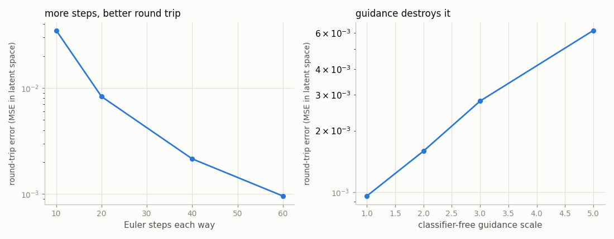
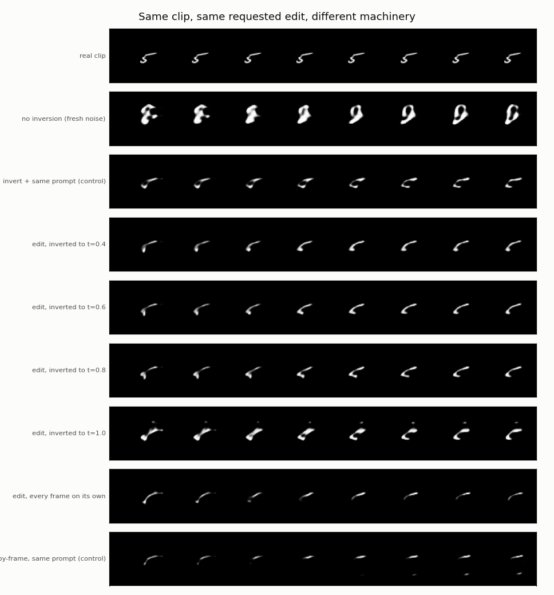
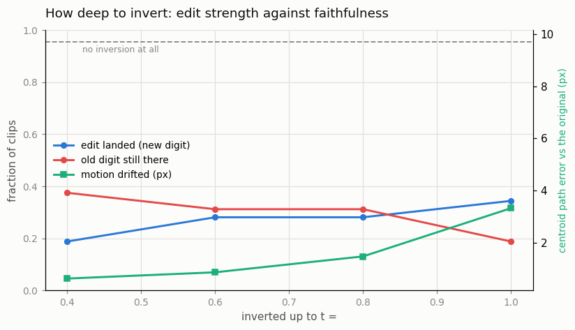

# Video Inversion and Edit

## Key Insight

To edit a *real* video with a [diffusion model](/shared/glossary/#diffusion-model) you first have to get it *into* the model's world, and that is what [DDIM inversion](/shared/glossary/#ddim-inversion) does: it runs the deterministic sampler backward to recover the exact starting noise that would regenerate the clip. Holding that noise, you change the text prompt — "a cat" → "a dog" — and denoise forward again (the [Prompt-to-Prompt](/shared/glossary/#prompt-to-prompt) style of edit), so the new object swaps in while the original's layout, motion, and timing are preserved. The video-specific catch is [temporal consistency](/shared/glossary/#temporal-consistency): inverting and editing each frame on its own makes the new object jitter between frames, so the edit has to be propagated coherently across time rather than recomputed independently per frame.

## What inversion is, and why it is needed at all

A generator turns noise into video. To *edit* a real video with one, you need the
noise that would have produced **that particular video** — otherwise the model
has nothing to start from but a random seed, and a random seed gives you a
different scene entirely. Finding that noise is inversion: running the
generator's process backwards.

The obvious alternative — "just generate again with the new prompt" — is the
first row of the results table below, and it fails in exactly the way you would
expect: you get *a* clip matching the new prompt, and nothing else about the
original survives.

**Why our inversion does not literally look like DDIM inversion.** DDIM inversion
works only because [DDIM](/shared/glossary/#ddim) sampling is *deterministic*:
plain [DDPM](/shared/glossary/#ddpm) sampling injects fresh random noise at every
step, and you cannot undo a coin flip. DDIM removed that injection, which turned
sampling into a fixed path you can walk in either direction.

The Phase-6/7 backbone is trained with
[rectified flow](/shared/glossary/#rectified-flow), which states that path even
more plainly: it is the solution of an [ODE](/shared/glossary/#ode),
`dx/dt = v(x, t)`. Sampling integrates from t = 1 (noise) down to t = 0 (clip);
inversion integrates the same field from t = 0 up to t = 1. Same idea as DDIM
inversion, one fewer layer of algebra — a fair summary of why flow matching took
over.

## Two knobs that decide whether inversion works at all

`--stage checks` measures both, because an edit built on a broken round trip is
not measuring anything.

**Sampling steps.** [Euler integration](/shared/glossary/#euler-method) is only
approximate. Too few steps and the walk up and the walk back down do not meet.

**Guidance.** This is the trap worth naming. Inverting with
[classifier-free guidance](/shared/glossary/#cfg-classifier-free-guidance) turned
up means inverting a *different* velocity field from the one the model was
trained to follow — an extrapolated one, `v_null + s·(v_prompt − v_null)`. The
error compounds every step and the round trip falls apart. The practical rule
that comes out of every inversion paper: **invert at guidance 1, edit at whatever
guidance you like.**

From `outputs/roundtrip.csv`. The number to compare against is the latent's own
variance, **0.866** — that is how much signal there is to lose.

| Knob | Value | Round-trip error (MSE) | As a share of the signal |
|------|-------|-----------------------:|-------------------------:|
| Euler steps each way | 10 | 0.0349 | 4.0% |
| | 20 | 0.0083 | 1.0% |
| | 40 | 0.00215 | 0.25% |
| | 60 | **0.00096** | **0.11%** |
| Guidance in both directions | 1.0 | 0.00096 | 0.11% |
| | 2.0 | 0.00159 | 0.18% |
| | 3.0 | 0.00279 | 0.32% |
| | 5.0 | **0.00617** | **0.71%** |



At 60 steps and guidance 1 the clip survives the trip to noise and back with
0.11% of its variance lost — the round trip is essentially exact, so anything
that changes afterwards changed because of the *edit*, not because of the
machinery.

Turning guidance up to 5 makes the round trip **6.4× worse** while changing
nothing else. That is the whole argument for inverting unguided in one number.
Note also that both plots use a log scale: the step-count curve is a steady
decline with no cliff, so "more steps" is a smooth cost-for-accuracy trade, while
guidance is a straight climb in error you get nothing back for during inversion.

## The edit, and the sweep that makes it a choice rather than a setting

The edit is deliberately blunt: take a real clip of "a 3 drifting left", invert
it, and denoise with "a 8 drifting left". The direction is left alone, so motion
is a thing that can be *preserved* rather than a thing being changed.

Four things are measured on every method:

| Measure | Question |
|---------|----------|
| new digit | did the edit land? |
| old digit | is the original still showing through? |
| path error | how far did the object's frame-by-frame trajectory drift from the original's, in pixels? |
| flicker | how much do neighbouring frames disagree? |

**Inversion depth is a dial, not a setting.** You do not have to go all the way to
t = 1. Stopping at t = 0.6 leaves most of the original clip still present under a
partial layer of noise, and denoising from there with a new prompt is the
[SDEdit](/shared/glossary/#sdedit) recipe. Shallow inversion preserves more and
edits less; deep inversion edits more and preserves less. The sweep turns that
sentence into a curve you can pick a point on.

## The frame-by-frame baseline

"Run an image editor on each frame" is the thing the Key Insight warns against,
so this project runs it, rather than asserting it is bad.

It is possible at all only because the backbone uses
[rotary positions](/shared/glossary/#rope), which let the same weights run on a
one-frame token grid — the variable-shape ability from
[project 29](../29-variable-resolution/README.md). Each latent frame is inverted
and re-denoised on its own, and nothing lets one frame know what another frame
did.

**The control that keeps this fair.** Running the model on a one-frame grid is
also running it on a shape it never trained on, so a bad result could mean either
"frame-by-frame editing is incoherent" or "the model broke at T=1". So the same
frame-by-frame machinery is also run with the *original* prompt — a
reconstruction, not an edit. If that comes back clean, the shape change is fine
and the incoherence belongs to the independent edits.

## Results

32 real clips, 60 Euler steps each way, edit guidance 3.0. From
`outputs/edits.csv`:

| Method | New digit ↑ | Old digit ↓ | Direction | Path error (px) ↓ | Flicker |
|--------|------------:|------------:|----------:|------------------:|--------:|
| no inversion (fresh noise) | 0.281 | 0.031 | 1.000 | **9.70** | 0.0294 |
| invert + same prompt (control) | 0.188 | 0.281 | 1.000 | 3.38 | 0.0330 |
| edit, inverted to t=0.4 | 0.188 | 0.375 | 1.000 | **0.62** | 0.0279 |
| edit, inverted to t=0.6 | 0.281 | 0.312 | 1.000 | 0.86 | 0.0266 |
| edit, inverted to t=0.8 | 0.281 | 0.312 | 1.000 | 1.47 | 0.0263 |
| edit, inverted to t=1.0 | **0.344** | 0.188 | 1.000 | 3.32 | 0.0316 |
| edit, every frame on its own | 0.250 | 0.125 | **0.844** | 5.94 | 0.0150 |
| frame-by-frame, same prompt (control) | 0.312 | 0.156 | **0.875** | 5.45 | 0.0177 |
| *the real clips themselves* | | *0.844* | *1.000* | *0.00* | *0.042* |



### What inversion buys, in one comparison

Generating afresh with the new prompt lands **9.70 px** away from the original's
trajectory. Inverting first and editing at full depth lands **3.32 px** away —
about a third of the drift — while *editing better* (0.344 vs 0.281 on the new
digit). Preservation and edit strength both improved, which is the whole reason
the technique exists.

The strip figure makes it obvious: the "no inversion" row is a different object
in a different place following a different path. Every inversion row is
recognisably the same clip with something changed.

### The depth dial is a clean, monotone trade-off



Reading down the sweep as inversion goes deeper (t = 0.4 → 1.0):

- the edit lands more often: 0.188 → 0.344
- the original shows through less: 0.375 → 0.188
- the motion drifts further: 0.62 px → 3.32 px

At t = 0.4 the trajectory is preserved almost perfectly — **0.62 px**, near the
0.00 floor — but the prompt barely gets a word in and the old digit is still the
most visible it is anywhere in the table. This is the [SDEdit](/shared/glossary/#sdedit)
regime: a thin wash of noise that recolours rather than repaints.

There is no "correct" setting here, which is the point of measuring it as a
curve. Editing a background wants shallow; replacing an object wants deep.

### A caveat on the round-trip control

`invert + same prompt` should be the identity, and on layout it nearly is —
3.38 px, matching the deepest edit. But its old-digit score is only 0.281 against
0.844 for the real clips, meaning the digit's *identity* did not fully survive.

The cause is a deliberate mismatch: inversion runs at guidance 1 (as the `checks`
stage showed it must) while denoising runs at guidance 3. Those are two different
velocity fields, so the return journey is not the reverse of the outward one. This
is exactly the gap that null-text inversion was invented to close, and at this
scale it is the main limit on faithfulness.

### The frame-by-frame baseline degrades — but the control refuses to convict

Editing each latent frame independently gives 5.94 px of drift and drops
direction accuracy from a perfect 1.000 to **0.844** — the first time in this
table that the object stops reliably moving the right way. In the strips, the
frame-by-frame rows show the object shrinking and fading as the clip runs, because
each frame was solved without reference to any other.

**But the control did not come back clean.** Running the same machinery with the
*original* prompt — a pure reconstruction, no edit — degrades almost identically
(5.45 px, direction 0.875). So most of the damage is attributable to running the
model on a one-frame token grid it never trained on, not to the independence of
the edits.

That is not the result the setup was hoping for, and reporting it as "frame-by-frame
editing is incoherent" would be unsupported. The honest statement is narrower:
*this* experiment cannot separate the two causes, because the shape change alone
already breaks things. Testing the claim properly needs a model trained on
single-frame grids too — the multi-shape training of
[project 29](../29-variable-resolution/README.md) applied here.

Finally, note the frame-by-frame rows have the **lowest** flicker in the table
(0.015 against 0.042 for real clips). As in
[project 31](../31-controlnet-video/README.md), low flicker is not smoothness here
— it is the object fading out until there is less left to change.

## What's in this directory

| File | What it does |
|------|--------------|
| `invert_lib.py` | `invert` / `denoise` (the ODE walked in both directions, with a depth limit), the frame-by-frame editor, and the preservation metrics. |
| `run.py` | Stages: `checks`, `figures`. No training — the model comes from project 30. |
| `outputs/` | Committed figures and CSVs. |

Requires [project 30](../30-long-prompt-handling/README.md)'s trained `t5` arm
and text cache, [project 21](../21-train-a-small-3d-vae/README.md)'s VAE,
[project 25](../25-implement-dit-for-video/README.md)'s latent cache, and
[project 28](../28-mmdit-for-video/README.md)'s digit judge.

## How to run

```bash
python3 run.py --stage checks     # ~3 min
python3 run.py --stage figures    # ~9 min
```

## Takeaways

1. **Inversion is worth it, and the number says how much.** Regenerating from
   fresh noise drifted 9.70 px from the original's motion; inverting first
   drifted 3.32 px *and* landed the edit more often. You are not trading
   faithfulness for edit strength — you are buying both.
2. **Check the round trip before you trust an edit.** At 60 steps the walk up and
   back loses 0.11% of the latent's variance; at 10 steps it loses 4%. An edit
   built on a broken round trip measures the round trip, not the edit.
3. **Never invert with guidance turned up.** Guidance 5 made the round trip 6.4×
   worse for nothing in return, because guided sampling follows an extrapolated
   velocity field the model was never trained on. Invert at 1, edit at whatever
   you like.
4. **Inversion depth is a dial, not a setting.** Shallow (t=0.4) preserved the
   trajectory to 0.62 px and barely edited; deep (t=1.0) edited best and drifted
   3.32 px. Pick the point, do not accept a default.
5. **The guidance mismatch is the real faithfulness limit here.** Inverting
   unguided and denoising guided means the return trip is not the reverse of the
   outward one, which is why the identity round-trip control scored 0.281 rather
   than the real clips' 0.844. Null-text inversion exists to close exactly this
   gap.
6. **A baseline needs a control, and sometimes the control refuses to convict.**
   Frame-by-frame editing did degrade — but frame-by-frame *reconstruction*
   degraded just as much, so the damage belongs to the unfamiliar one-frame grid
   rather than to independent editing. Better to report an unresolved question
   than a conclusion the design cannot support.
