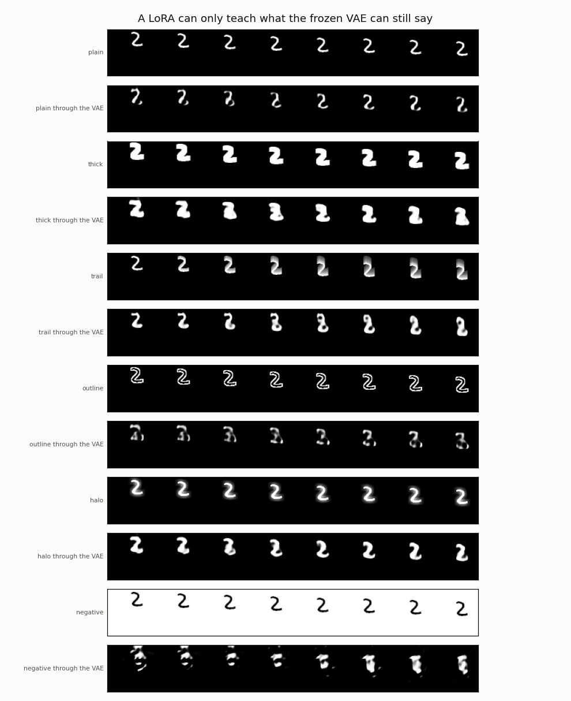
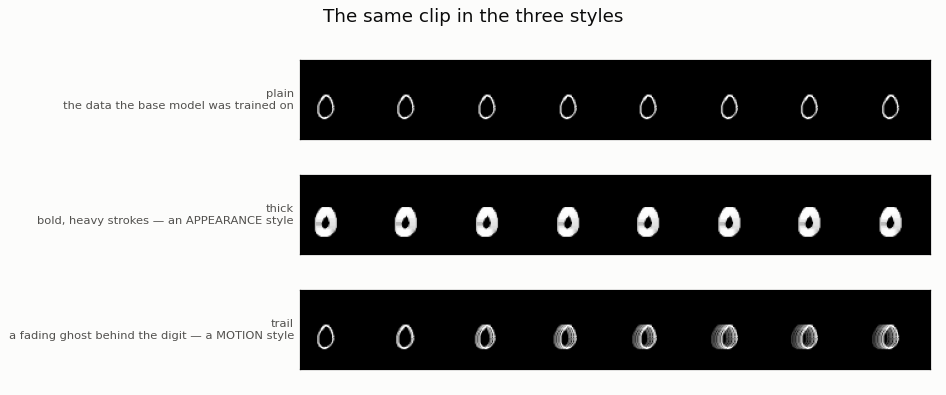
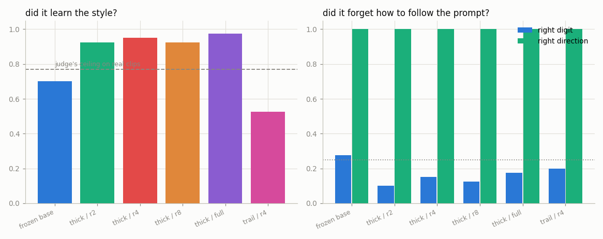
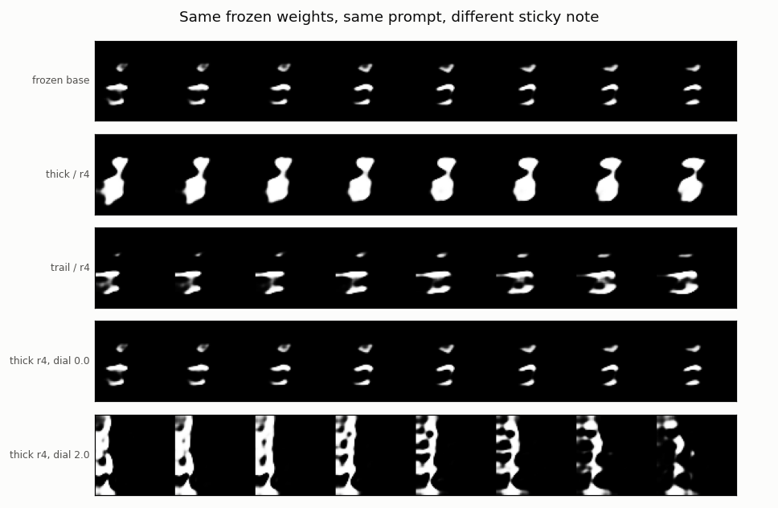
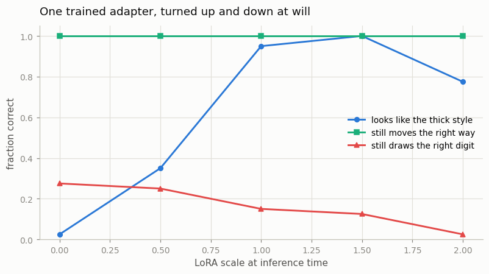

# LoRA for Video

## Key Insight

[LoRA (Low-Rank Adaptation)](/shared/glossary/#lora) fine-tunes a giant model cheaply by freezing all its original [weights](/shared/glossary/#weights) and learning only a tiny pair of [low-rank](/shared/glossary/#low-rank) matrices that nudge the output — small enough to train on a handful of examples and to swap in and out like sticky notes. This project trains such an adapter on roughly 50 clips of one specific visual style or character, teaching a [text-to-video](/shared/glossary/#t2v) model to reproduce that look on demand without retraining the whole network. Because the adapter is only a few megabytes, you can keep a separate LoRA per style and load whichever one a given shot needs — the same workflow that made LoRAs the dominant way to personalize image models.

## What the name says

Fine-tuning normally learns a full update matrix `dW`, the same size as the
weight `W` it corrects. LoRA instead writes

```
dW = B @ A          with  A: (r x in),  B: (out x r),  r tiny
```

The **rank** of a matrix is how many independent directions it can move things
in — a rank-1 matrix can only ever stretch things along one axis, no matter how
many numbers it contains. `B @ A` cannot have rank higher than `r`, so
"low-rank" is a literal statement about how many independent directions the
update is *allowed* to use. For a 128×384 weight at r = 4 that is 2,048 numbers
instead of 49,152.

Why is that enough? Because "draw everything with heavier strokes" is **one
consistent instruction applied everywhere**, not thousands of unrelated
corrections. One instruction needs few directions. That is the bet, and it is the
bet that held up across the entire image-generation world.

**Why does `B` start at zero?** So that `B @ A = 0` and the adapted model is
bit-for-bit the original at step 0. Same guarantee ControlNet gets from its
[zero convolutions](/shared/glossary/#zero-conv) in
[project 31](../31-controlnet-video/README.md), for the same reason: a fresh side
path must not damage a model that already works. (`A` must start *non*-zero, or
both matrices would sit at a saddle point where no gradient exists.)

**Why the `alpha / r` scale?** It keeps the update's typical size roughly constant
as `r` changes, so a rank sweep compares *ranks* rather than accidentally
comparing learning rates.

## The two styles — and why the choice was not free

The project needs a style to teach. The first two candidates were an **outline**
look (hollow strokes) and a **trail** (a fading ghost behind the moving digit).
Outline had to be thrown away, and the reason is worth more than the style was.

**A LoRA adapts the generator. The [VAE](/shared/glossary/#vae) underneath it
never changes.** The generator works in a latent that compresses 8× in space, and
[project 21](../21-train-a-small-3d-vae/README.md)'s VAE was trained on solid
digits. If a style cannot survive a trip through that VAE, no adapter can bring
it back — the model would be being asked to produce something its own decoder
cannot draw.

`--stage data` measures this before any training. Each style is applied to a real
clip, pushed through the frozen VAE, and the *change it made* is compared before
and after — by cosine similarity, not by size, because a style can be replaced by
a different artefact of similar magnitude and a size comparison would call that
"preserved":

| Style | Size of the change | Size after the VAE | Is it still the *same* change? |
|-------|-------------------:|-------------------:|-------------------------------:|
| `thick` — bold strokes | 0.106 | 0.105 | **0.87** |
| `trail` — fading ghost | 0.044 | 0.057 | **0.77** |
| `halo` — soft glow | 0.053 | 0.061 | 0.75 |
| `outline` — hollow strokes | 0.094 | 0.051 | **0.44** |
| `negative` — dark on white | 1.977 | 0.080 | **0.17** |



The picture says it plainly. `outline` goes in as a crisp hollow ring and comes
out as a blurry blob — a 1-pixel wall is exactly the high-frequency detail an 8×
compression throws away first. `negative` is worse: the VAE has never seen a
bright background, so it does not merely blur the style, it fails completely and
returns garbage. This is the same lesson Phase 3's
[project 14](../14-camera-trajectory/README.md) hit from the other side — at this
scale only low-frequency structure survives the pipeline.

So the two styles kept are the two that survive, and they were chosen to be
different *kinds* of thing:

- **`thick`** is a *look*. It changes how a frame is drawn and nothing else.
- **`trail`** is a *behaviour*. It can only be seen because the clip has a time
  axis, and reproducing it means changing what the model does *across* frames,
  not just within one.

Having one of each is the point: a video LoRA can teach motion, which an image
LoRA has no way to express.



## The arms

The frozen base is [project 30](../30-long-prompt-handling/README.md)'s T5 arm.
Each run sees exactly 50 clips for 700 steps.

| Arm | What trains | Why it is here |
|-----|-------------|----------------|
| `r2`, `r4`, `r8` | LoRA on every attention and cross-attention projection inside the DiT blocks | the rank sweep |
| `full` | every weight in the model, at a 10× lower learning rate | the thing LoRA replaces |
| `frozen base` | nothing | the reference |

`full` is the control that makes the comparison mean something. If a LoRA matches
full fine-tuning on style *and* keeps more of the base model's prompt-following,
that is a result. Without the `full` arm, "the LoRA learned the style" would just
be a claim that 50 clips are enough — true of any method.

## What is measured, and why two things

**Did it learn the style?** A three-way style classifier (plain / thick / trail),
trained separately and graded on VAE round-trips of real clips so it is judging
the same kind of picture the generator produces.

**Did it forget how to follow the prompt?** The base model can already be asked
for a specific digit moving in a specific direction. Adaptation on 50 clips can
quietly destroy that — the classic
[catastrophic forgetting](/shared/glossary/#catastrophic-forgetting) failure — and
a style score alone would never notice. So every run is also graded on digit and
direction accuracy, using the same judges as
[project 30](../30-long-prompt-handling/README.md).

**The dial.** After training, the adapter's contribution is multiplied by a
scale you set at inference time — 0 turns it off entirely and restores the exact
base model; 2 doubles it. This is a genuinely LoRA-only capability: a
fully fine-tuned model has one behaviour and no dial, because the update is baked
into the weights it replaced. The sweep shows what you buy and what you break as
you turn it up.

## Results

40 prompts per run, guidance 3.0. The style judge scores 0.768 on
VAE-reconstructed real clips (chance 0.333) — that is the ceiling. From
`outputs/runs.csv`:

| Run | Trainable | Weights on disk | Style score | Right digit | Right direction |
|-----|----------:|----------------:|------------:|------------:|----------------:|
| frozen base | 0 | 0 KB | — (0.700 "plain") | 0.275 | 1.000 |
| `thick` / r2 | 16,640 | **65 KB** | 0.925 | 0.100 | 1.000 |
| `thick` / r4 | 33,280 | **130 KB** | 0.950 | 0.150 | 1.000 |
| `thick` / r8 | 66,560 | 260 KB | 0.925 | 0.125 | 1.000 |
| `thick` / full | 2,001,424 | **7,818 KB** | 0.975 | 0.175 | 1.000 |
| `trail` / r4 | 33,280 | 130 KB | **0.525** | 0.200 | 1.000 |




### 50 clips and 65 KB are enough

A rank-2 adapter — **0.82% of the model's parameters, 65 KB on disk** — takes the
style score from nothing to 0.925, against a judge whose ceiling on real clips is
0.768. (Scores above the ceiling are normal here: the generated clips are
*exaggerated* examples of the style, so the judge finds them easier than real
ones.) Full fine-tuning reaches 0.975 and costs **7.8 MB**: **120× the storage
for 0.05 more style score.**

That ratio is the entire reason LoRA took over. You can keep a hundred styles on
a phone.

### Rank barely matters, which is the low-rank bet paying off

r2 → 0.925, r4 → 0.950, r8 → 0.925. Quadrupling the rank changed nothing outside
noise. This *is* the result: if the style needed many independent directions, more
rank would have helped visibly. It did not, so "draw everything with heavier
strokes" really is a low-rank instruction, exactly as the method assumes.

### An honest non-result: LoRA did not forget less

The expected story was that full fine-tuning on 50 clips would damage the base
model's prompt-following more than a small adapter would. It did not happen:

- **Direction survived perfectly everywhere** — 1.000 for every arm, LoRA and
  full alike. No forgetting at all on that channel.
- **Digit accuracy fell for everyone**, from the base's 0.275 to 0.10–0.175, and
  the *least* damaged arm was `full` (0.175). With 40 samples those differences
  are inside noise.

So this experiment does not reproduce the classic
[catastrophic forgetting](/shared/glossary/#catastrophic-forgetting) contrast, and
the reason is worth naming: 700 steps at a 10× lower learning rate is a *gentle*
full fine-tune, and the base model's digit channel was weak to begin with. The
argument for LoRA that this project **does** establish is storage and swapping,
not damage limitation. Do not repeat the forgetting claim on the strength of these
numbers.

(For a case where fine-tuning *did* visibly break the general model, see
[project 32](../32-talking-head/README.md): adapting to one speaker moved that
model's mouth-motion scale from 0.95 to 0.49 on everyone else.)

### The motion style is much harder than the look

`trail` reached only **0.525**, with 22.5% of its samples still judged plain,
against `thick`'s 0.950 at the identical rank, step count and clip count.

The two styles are not equally difficult, and the asymmetry is instructive. To
draw thicker strokes the model changes what every frame looks like — a change it
can make independently at each moment. To leave a trail it must make each frame
depend on where the object *was*, which is a change in behaviour across time.
Fifty clips buy a look cheaply and a behaviour expensively. This is also the
clearest sense in which a video LoRA is not just an image LoRA with more frames.

### The dial, and where it breaks

From `outputs/dial.csv` — one trained adapter, scaled at inference time:

| LoRA scale | Style score | Still "plain" | Right digit | Right direction |
|-----------:|------------:|--------------:|------------:|----------------:|
| 0.0 | 0.025 | 0.700 | **0.275** | 1.000 |
| 0.5 | 0.350 | 0.125 | 0.250 | 1.000 |
| 1.0 | 0.950 | 0.000 | 0.150 | 1.000 |
| 1.5 | **1.000** | 0.000 | 0.125 | 1.000 |
| 2.0 | 0.775 | 0.000 | **0.025** | 1.000 |



At **scale 0 the base model is back exactly** — 0.275 digit accuracy and 0.700
"plain", both identical to the frozen base's row. That is the zero-initialised `B`
guarantee still holding after training: the adapter is a term you can switch off,
not a modification you have to undo.

At **scale 2.0 it overshoots**: style score *falls* (1.000 → 0.775) and digit
accuracy collapses to 0.025, below the 0.10 chance level. The final row of the
swap figure shows why — the frames are blown out into white blobs. Pushing an
adapter past the strength it was trained at is the same failure mode as pushing
[guidance](/shared/glossary/#cfg-classifier-free-guidance) too high in Phase 4's
[project 17](../17-temporal-cfg-study/README.md): extrapolate far enough outside
the trained regime and every axis degrades at once, including the one you were
trying to strengthen.

The useful range is roughly 0.5 to 1.5, and it is a genuine dial: 0.5 gives a
visible-but-mild version of the style with more of the base model's content
intact.

## What's in this directory

| File | What it does |
|------|--------------|
| `lora_lib.py` | `LoRALinear`, the injector, the inference-time scale, and the style transforms. |
| `run.py` | Stages: `data`, `clf`, `train --style ... --arm ...`, `figures`. |
| `outputs/` | Committed figures and CSVs. |

Requires [project 30](../30-long-prompt-handling/README.md)'s trained `t5` arm
and text cache, [project 21](../21-train-a-small-3d-vae/README.md)'s VAE,
[project 23](../23-magvit-v2-style-tokenizer/README.md)'s feature network, and
[project 28](../28-mmdit-for-video/README.md)'s digit judge.

## How to run

```bash
python3 run.py --stage data                            # ~1 min
python3 run.py --stage clf                             # ~2 min
python3 run.py --stage train --style thick --arm r2    # ~3 min
python3 run.py --stage train --style thick --arm r4
python3 run.py --stage train --style thick --arm r8
python3 run.py --stage train --style thick --arm full
python3 run.py --stage train --style trail --arm r4
python3 run.py --stage figures                         # ~6 min
```

## Takeaways

1. **65 KB and 50 clips did the job.** A rank-2 adapter reached 0.925 style
   score; full fine-tuning reached 0.975 for 120× the storage. That ratio, not
   raw quality, is why LoRA won.
2. **Rank hardly mattered (0.925 / 0.950 / 0.925 for r2 / r4 / r8).** That flat
   line is the low-rank hypothesis being confirmed: a consistent stylistic
   instruction needs very few independent directions, so buying more does
   nothing.
3. **A LoRA can only teach what the frozen VAE can still express.** The `outline`
   style was abandoned because an 8× spatial compression turns a 1-pixel hollow
   ring into a blob (change-similarity 0.44), and `negative` broke the VAE
   outright (0.17). Check what survives your tokenizer *before* you train
   anything.
4. **A motion style costs far more than a look** — 0.525 for `trail` versus 0.950
   for `thick` at identical settings. Changing every frame is easy; making each
   frame depend on the last is not. This is the part of a video LoRA that has no
   image-model equivalent.
5. **The dial is real, and it is LoRA-only.** Scale 0 restored the base model
   exactly; scale 1.5 maximised the style; scale 2.0 overshot and collapsed
   digit accuracy below chance while *losing* style too — the same
   everything-degrades-at-once pattern as excessive guidance. A fully fine-tuned
   model has one behaviour and no dial.
6. **This experiment did not show LoRA forgetting less.** Direction accuracy was
   perfect for every arm including full fine-tuning, and digit accuracy fell
   about equally for all of them. The storage-and-swapping argument is
   established here; the damage-limitation argument is not, and should not be
   claimed from these numbers.
