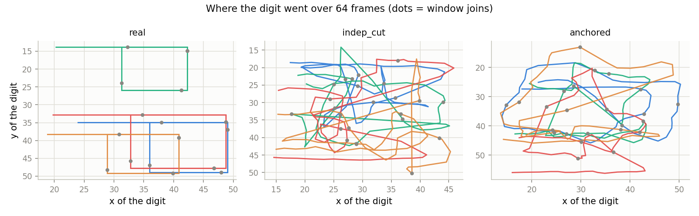
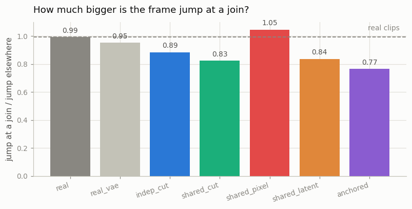
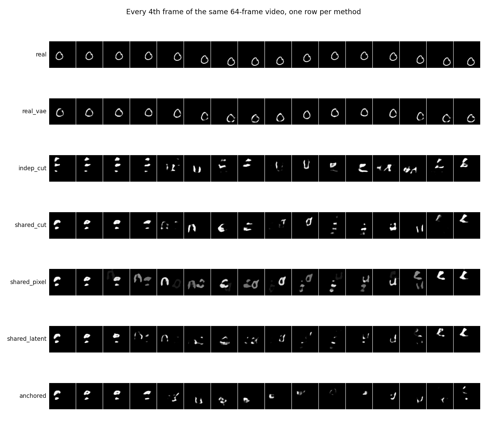
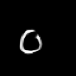
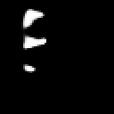
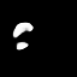

# Sliding-Window T2V

## Key Insight

[Sliding-window generation](/shared/glossary/#sliding-window-generation) is the cheapest way to push a [text-to-video (T2V)](/shared/glossary/#t2v) model past the clip length it was trained on: generate a series of short clips that overlap by a few frames, then blend each overlap so the joins are invisible. This project chains 5-second clips into a 30-second video and fuses the shared frames in the model's [latent space](/shared/glossary/#latent-space) — averaging there is smoother than on raw pixels and avoids ghosting. Because the only thread tying distant moments together is whatever those short overlaps can carry forward, the picture slowly [drifts](/shared/glossary/#drift): colors creep and a character's outfit mutates the further you travel from the opening frame. It is the first long-form trick worth trying, since it needs no retraining — only a clever way to stitch existing outputs.

## The problem in one picture

The model from [project 30](../30-long-prompt-handling/README.md) makes clips of
exactly 16 frames. We want 64. Nothing about the architecture forbids a longer
input — it uses [RoPE](/shared/glossary/#rope), so longer grids still get valid
positions — but [project 29](../29-variable-resolution/README.md) measured what
happens when you simply *ask* for a shape the model never trained on: quality
falls off a cliff. So the model keeps its trained shape, and the length is
assembled around it:

```
window 0:  latent frames 0 1 2 3
window 1:      latent frames 2 3 4 5      <- 2 frames of overlap
window 2:          latent frames 4 5 6 7
   ...
window 6:                          ...  14 15

7 windows x 4 latent frames, stride 2  ->  16 latent frames  ->  64 pixel frames
```

Every window is one ordinary generation. The overlap is the **only** channel
through which information can travel from one window to the next, so how you
handle that overlap decides whether you get one video or seven unrelated clips
glued together. This project builds five ways of handling it and measures all
of them against real 64-frame clips.

## Why the prompt has to change during a long video

A beginner-reasonable objection: why does the direction change every window
instead of asking for "a 3 drifting right" the whole way through? The answer is
arithmetic, not taste.

The training clips show a digit crossing most of a 64-pixel canvas in 16 frames
— about 1.75 pixels per frame. Sixty-four frames of that is 110 pixels of travel
on a canvas that has only ~36 pixels of room. The digit would be flattened
against the wall for three quarters of the video, in a situation the model has
never seen.

This is not a quirk of our toy. Real long-form video has exactly the same
property, and it is easy to miss: **a 30-second shot is not a 5-second shot
repeated six times.** Something has to change, or there is nothing left to
generate. So our long timeline is a small *shot list* — one direction per
window, `right, down, left, up, right, down, left` — which is exactly the object
[project 38](../38-llm-shot-planner/README.md) asks a language model to write.

## The five ways to join two windows

| mode | what it does |
|---|---|
| `indep_cut` | fresh random noise per window; windows cut and stacked. The naive thing. |
| `shared_cut` | one long noise field, each window reads its own slice; still cut and stacked. |
| `shared_pixel` | shared noise; the overlapping frames are cross-faded **after decoding**, in pixels. |
| `shared_latent` | shared noise; the overlap is cross-faded **before decoding**, in latents. |
| `anchored` | the overlap is *pinned* to what the previous window already decided. |

Two of these need unpacking.

### Sharing the noise ("noise rescheduling")

Instead of drawing fresh noise per window, draw **one** noise field for the
whole 16-frame latent timeline and let each window read its own slice. Two
windows that overlap therefore start from the *same random numbers* in the
frames they share.

Why does that matter? A [diffusion](/shared/glossary/#diffusion-model) sample is
a deterministic function of its starting noise: same noise plus same prompt
gives the same picture. If two windows start from unrelated noise, they are
drawing two unrelated 3s, and averaging them produces a cross-dissolve between
two different pictures rather than one picture. Sharing the noise is free, needs
no retraining, and is the core trick of [FreeNoise](/shared/glossary/#freenoise).

### Pinning the overlap ("anchoring")

Here the model is not asked to re-invent the shared frames at all. At every
sampling step, the first two latent frames are overwritten with the value they
are *supposed* to have at the current noise level:

```python
x[:, :, :2] = (1 - t) * anchor + t * anchor_noise      # the flow's own formula
```

This is the same trick as image [inpainting](/shared/glossary/#inpainting), and
it works for the same reason: the model was trained on partly-noisy latents, so
a latent whose first frames sit at exactly the right noise level looks entirely
normal to it. At `t = 0` the pinned frames equal the [anchor](/shared/glossary/#anchor-frame)
exactly, so there is no join left to blend. Nothing is retrained; this is a
sampling-time change only.

## Before measuring anything: what does "good" read?

Every number below is compared against two references, both measured rather
than assumed:

* **`real`** — genuine 64-frame clips following the same shot list. The
  unreachable ceiling.
* **`real_vae`** — those same clips pushed through the frozen
  [3D VAE](/shared/glossary/#3d-vae) and back. **No** generator here can beat
  this, because every one of them produces latents that the same VAE has to
  decode; its blur is already in the price. Comparing against `real` alone would
  blame the joining method for the VAE's losses.

The metrics, in plain language:

| metric | what it asks |
|---|---|
| `path_jerk` | how suddenly the digit's speed changes. A teleport at a seam is a big number; smooth motion is small. ("Jerk" is the everyday word for a lurch — what a passenger feels when a bus brakes late.) |
| `direction_follow` | fraction of windows where the digit actually moved the way its caption asked. |
| `ink_spread` | how spread out the bright pixels are. One digit ≈ 9 px; a *ghost* (the same digit visible twice at once) is much larger. |
| `identity_drift` | distance between the digit's handwriting now and in frame 0, with the motion removed by centring a 28×28 crop on the digit. |
| `digit_stable` | how often the [digit judge](../28-mmdit-for-video/README.md) sees the same digit it saw in frame 0. |
| `seam_ratio` | frame-to-frame change *around* a join, divided by the change everywhere else. |

One measurement detail worth stealing: `seam_ratio` originally looked only at
the single frame at the join and reported *no seams at all*. A discontinuity
between two **latent** frames does not come out of the VAE as one bad pixel
frame — the decoder is a 3D convolution, so it smears the disagreement across
the four pixel frames each latent frame expands into, and a little beyond.
Measuring a band of ±2 frames fixed it.

## Results

Twenty-four 64-frame videos per method, same prompts, same shot list, same
random numbers.

| mode | jerk ↓ | direction follow ↑ | ink spread ↓ | digit stable ↑ | drift at frame 60 ↓ | seconds |
|---|---|---|---|---|---|---|
| `real` | 0.80 | 1.00 | 7.11 | 0.90 | 0.000 | — |
| `real_vae` | **0.47** | **1.00** | 7.50 | **0.72** | **0.063** | — |
| `indep_cut` | 2.78 | 0.78 | 7.78 | 0.41 | 0.152 | 14.3 |
| `shared_cut` | 2.71 | 0.71 | 7.99 | 0.35 | 0.168 | 14.0 |
| `shared_pixel` | 1.02 | 0.46 | **10.78** | 0.39 | 0.169 | 16.6 |
| `shared_latent` | 1.54 | 0.47 | 8.79 | 0.34 | 0.167 | 36.5 |
| `anchored` | 1.83 | **0.77** | **7.22** | 0.30 | 0.153 | 25.0 |

A reminder for reading the drift column: **0.144 is what a completely different
person's handwriting of the same digit scores.**



The path picture says most of it. Real clips draw crisp rectangles with sharp
corners. `indep_cut` scribbles — each window starts its digit wherever it likes,
so the path teleports at every join. `anchored` is visibly rounder and more
continuous, because the pinned frames force each window to start where the last
one stopped.





   

*(left to right: `real_vae`, `indep_cut`, `shared_pixel`, `anchored`)*

### Blending smooths the picture by destroying the motion

This is the result that inverts the obvious expectation, and it is the most
useful thing in the project.

Both blends do make the video *smoother*: `path_jerk` drops from 2.7 to 1.0
(pixel) and 1.5 (latent). Read that alone and cross-fading looks like the
answer. But look at what it costs: `direction_follow` collapses from 0.78 to
**0.46**. The blended videos have lost more than a third of their compliance
with the caption.

The mechanism is not subtle once you see it. A cross-fade averages two clips
that *disagree about where the digit is*. The average of "digit at the left" and
"digit at the right" is not "digit in the middle moving" — it is a faint digit
in both places, fading between them. Motion is exactly the thing an average
destroys. The smoothness the jerk metric rewards is the smoothness of a
dissolve, not of movement.

**So: latent blending beats pixel blending, and the ghosting metric says by how
much.** `ink_spread` reads 7.50 on real clips through the VAE. Pixel blending
inflates it to **10.78** — a 44% wider blob, which is what "the same digit
visible in two places at once" looks like as a number, and which you can see
directly in the filmstrip's `shared_pixel` row. Latent blending only reaches
8.79, and its jumps at the join are smaller too (0.0216 vs 0.0369 average frame
change). The Key Insight above predicted exactly this ("averaging there is
smoother than on raw pixels and avoids ghosting") and the prediction holds.
What latent blending does *not* do is fix the underlying problem, because both
blends fail for the same reason. Anchoring, which never averages anything,
sits at 7.22 — the real-data level.

### Anchoring keeps the motion but pays in accumulated error

`anchored` is the only method that both keeps `direction_follow` high (0.77) and
reduces the join discontinuity — its `seam_ratio` is 0.77, meaning frames change
*less* around a join than elsewhere, which is what a pinned overlap should do.

But watch the filmstrip's last row: the digit thins out and eventually fades to
almost nothing. Each window is conditioned on frames the previous window
generated, which are already slightly wrong, and the model was never trained to
read a slightly-wrong past. Seven windows of that compounds. This is
**[exposure bias](/shared/glossary/#exposure-bias)**, and the fix is not a better
blend — it is training the model to continue from its own output, which is
exactly what [project 39](../39-streaming-t2v/README.md) does and measures.

### None of them keeps the character — and here is the reason

Every generated method ends around `identity_drift ≈ 0.15`, and a *completely
different person's* handwriting of the same digit reads 0.144. In other words,
after 64 frames the character is gone under all five methods, while `real_vae`
sits at 0.063.

It would be easy to blame the joins. The `window` stage checks that:

```
glyph drift between frame 0 and frame 15 of ONE ordinary generation
  generated : 0.095
  real_vae  : 0.078
  (a different person's handwriting: 0.144)
```

So a single window already spends about a quarter of the whole identity budget
— `(0.095 − 0.078) / (0.144 − 0.078) ≈ 26%` — before any stitching happens.
Seven windows of that compound to the full distance, under every method
including `anchored`, which pins the *pixels* of the overlap but cannot pin the
model's habit of redrawing the digit slightly differently each time it is asked.

**No stitching strategy can preserve across 64 frames something the model does
not preserve across 16.** That is not a failure of sliding windows; it is a
statement about where the problem actually lives — and it is the reason
[project 37](../37-character-consistency/README.md) exists, which attacks
identity directly with a reference image instead of hoping the overlap carries
it.

## An honest note on the base model

This project ships a `base` stage that continues [project 30](../30-long-prompt-handling/README.md)'s
`t5` model for another 4000 steps (6800 total) before anything else runs. That
is not cheating and it is not a different model: same weights, same data, same
objective, same 2M parameters — only more optimiser steps.

The reason is that project 30 trained *four* arms inside one time budget, so
each got 2800 steps and about 24% per-clip accuracy. Every project in this phase
stacks several generations on top of each other, and stacking multiplies
whatever one window gets wrong. Judging a joining method with a model that is
wrong three times out of four would measure the model, not the method. The
longer-trained weights are saved here rather than overwritten onto project 30's
checkpoint, so project 30's published numbers stay reproducible.

## What's in this directory

| file | what it is |
|---|---|
| `long_lib.py` | the phase backbone: the long timeline, real long clips, window sampling with anchoring, blending, and every metric. Imported by projects 36, 37, 38 and 39. |
| `run.py` | the stages: `base`, `reference`, `window`, `generate`, `figures`. |
| `outputs/results.csv` | every metric for every method. |
| `outputs/one_window.csv` | the single-window identity ceiling. |
| `outputs/paths.png` | where the digit travelled, for three methods. |
| `outputs/seams.png` | frame change around joins, per method. |
| `outputs/filmstrips.png` | every 4th frame of the same video, one row per method. |
| `outputs/long_*.gif` | the videos themselves. |

## How to run

```bash
python3 run.py --stage base                       # ~9 min  (once; everything depends on it)
python3 run.py --stage reference                  # ~1 min
python3 run.py --stage window                     # ~1 min
python3 run.py --stage generate --mode indep_cut  # ~20 s each
python3 run.py --stage generate --mode shared_cut
python3 run.py --stage generate --mode shared_pixel
python3 run.py --stage generate --mode shared_latent
python3 run.py --stage generate --mode anchored
python3 run.py --stage figures                    # ~1 min
```

Prerequisites, all from earlier phases:
[project 21](../21-train-a-small-3d-vae/README.md)'s 3D VAE (`--stage 3d`),
[project 25](../25-implement-dit-for-video/README.md)'s latent cache
(`--stage cache`), [project 23](../23-magvit-v2-style-tokenizer/README.md)'s
feature net (`--stage clf`),
[project 28](../28-mmdit-for-video/README.md)'s digit judge (`--stage probe`),
and project 30's `t5` arm (`--stage encode`, then `--stage train --arm t5`).

## Takeaways

1. **Sliding windows are the cheapest way to get length, and they genuinely
   work for length.** Seven 16-frame generations really do become 64 frames,
   in 14–37 seconds, with no retraining.
2. **Sharing one noise field across windows costs nothing.** It is the
   precondition for any blending to mean anything.
3. **Cross-fading trades motion for smoothness.** It is not a free repair: our
   blends lost a third of their caption compliance to buy a smoother path.
   Latent blending is the better of the two — less ghosting, smaller jumps —
   but the trade is the same.
4. **Pinning the overlap is strictly better than blending it** when you can do
   it: same continuity, no averaging, no ghosts. Its price is
   [exposure bias](/shared/glossary/#exposure-bias) — errors compounding across
   windows, visible as the digit fading away by window seven.
5. **Identity is not a joining problem.** Every method ends at the "different
   person" distance, because the base model already loses the handwriting
   within one window. Fixing that needs a reference image
   ([project 37](../37-character-consistency/README.md)) or a model trained to
   continue itself ([project 39](../39-streaming-t2v/README.md)) — not a better
   seam.
