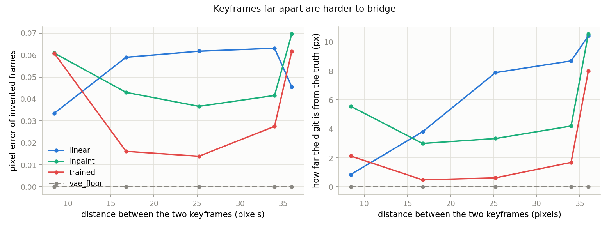
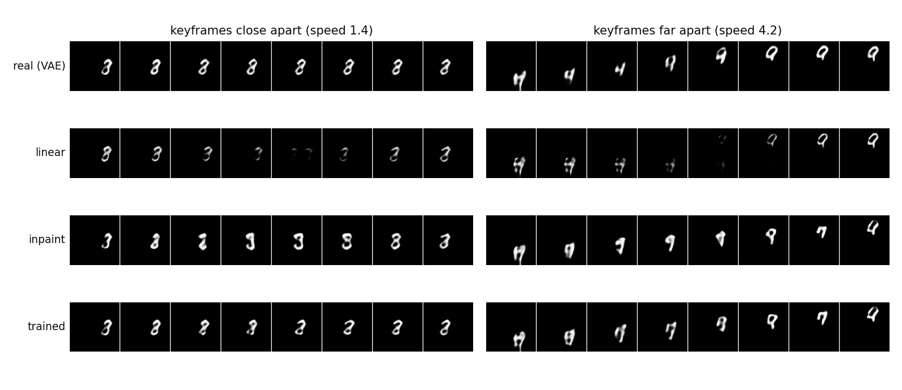
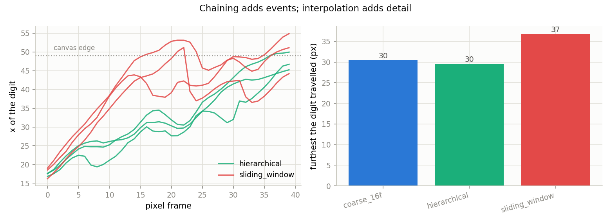
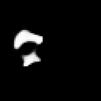
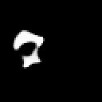
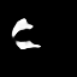

# Keyframe Interpolation

## Key Insight

This project builds a long clip the way an animation studio does: first draw the [keyframes](/shared/glossary/#keyframe) — here, 4 frames spaced 5 seconds apart that pin down how the scene should look at those moments — then fill the gaps between them. The filling is done by an [image-to-video (I2V)](/shared/glossary/#i2v) model or a [frame-interpolation](/shared/glossary/#frame-interpolation) model, which only has to invent the short motion between two anchors it can already see rather than a whole scene from nothing. This is the simplest form of [hierarchical generation](/shared/glossary/#hierarchical-generation): decide the big structure first and the details second, which keeps a long video far more coherent than generating it straight through. The trade-off is that the keyframes must be chosen well — pick two that are too different and no interpolation can bridge them smoothly.

## Two different ways to make a video longer

[Project 35](../35-sliding-window-t2v/README.md) made a long video by *chaining*:
window after window, each one adding new time on the end. This project goes the
other way round — decide the moments that matter first, then fill in everything
between them.

These sound like two routes to the same place. They are not, and the difference
is worth stating up front because it decides which one you should reach for:

* **Chaining adds events.** Each new window invents new content, so the video
  gets longer *and* more things happen in it.
* **Interpolation adds detail.** The events are already fixed by the keyframes;
  filling only makes the motion between them smoother and slower. This is
  frame-rate upsampling, and it is how cascaded video pipelines get from a
  cheap low-frame-rate base model to a watchable result.

The `long` stage below measures that difference directly.

## The task, and the three ways to do it

Given latent frame 0 and latent frame 3 of a window, produce frames 1 and 2.
Because every keyframe pair is cut out of a **real** clip, the frames the filler
invents can be checked against the frames that were actually there — this
project has ground truth, which most of the phase does not.

| arm | what it is |
|---|---|
| `linear` | weighted average of the two ends. No model at all. |
| `inpaint` | [project 30](../30-long-prompt-handling/README.md)'s text-to-video model, with the two ends pinned at every sampling step. No training. |
| `trained` | a model trained on exactly this task: the two ends arrive as extra input channels. |

**Why run `linear` at all?** It is the honest floor. If a learned model cannot
beat a straight line drawn between the endpoints, it has learned nothing about
motion. It also shows what "no model" looks like: the digit fades out of one
position while fading in at the other, instead of travelling.

**Why train a third model when `inpaint` already works?** This is the question
a beginner should ask, because `inpaint` reuses weights we already have and
costs nothing extra. The difference is what the model is *allowed to assume*.
The base model was trained to invent a clip out of noise; when we pin two of its
frames it has never seen that situation, and has to work out mid-sampling that
part of its canvas is already decided. The trained interpolator sees the two
ends in its input from step one of *training*, so "the answer has to connect
these two pictures" is built into its weights instead of being imposed from
outside at sampling time. Whether that difference is worth a training run is
exactly what the numbers below answer.

### What the interpolator's extra inputs are

The model is [project 30](../30-long-prompt-handling/README.md)'s architecture
with a wider entrance: 4 latent channels of noisy video, plus 4 channels holding
the keyframes, plus **1 mask channel**.

That mask channel looks redundant — the keyframe content is already there — but
it is not. Without it, a frame of zeros is ambiguous between "this slot is
empty, invent something" and "this keyframe happens to be all zeros". The mask
says *which* frames are keyframes, separately from *what* they contain. Every
[inpainting](/shared/glossary/#inpainting) model carries one for this reason.

One more detail: the training loss is computed **only on the frames the model
has to invent**. Grading it on the keyframes too would reward copying an input
straight to the output, which is free and teaches nothing.

## The experiment: how far apart can keyframes be?

The stub's warning — "pick two that are too different and no interpolation can
bridge them" — is a claim that can be measured. We sweep the digit's speed, so
the distance the digit travels between the two keyframes grows from 8 pixels to
36 (on a 64-pixel canvas):

| speed (px/frame) | gap between keyframes |
|---|---|
| 0.7 | 8.4 px |
| 1.4 | 16.8 px |
| 2.1 | 25.2 px |
| 2.8 | 34.0 px |
| 4.2 | 36.0 px (saturated — the canvas runs out) |

The interpolator is trained only on speeds 1.4–2.2, the same range the base
model saw, so 0.7 and 2.8+ are genuinely outside what either arm was taught.
The last row saturates because a digit moving 4.2 px/frame runs into the wall,
so its measured gap stops growing; treat it as "as far apart as this canvas
allows".

Everything is scored against `vae_floor`: the true middle frames, encoded and
decoded by the same frozen [3D VAE](/shared/glossary/#3d-vae) every arm has to
go through. That is the best score physically available.

## Results: the gap sweep

96 clips per point.

| gap | arm | pixel error of invented frames ↓ | how far the digit is from the truth (px) ↓ | ink left ↑ (truth in brackets) | digit judged right ↑ |
|---|---|---|---|---|---|
| 8.4 | `linear` | **0.034** | **0.85** | 0.020 (0.026) | 0.53 |
| 8.4 | `inpaint` | 0.061 | 5.56 | 0.023 | 0.46 |
| 8.4 | `trained` | 0.061 | 2.13 | **0.026** | 0.35 |
| 8.4 | *vae_floor* | 0 | 0 | 0.026 | 0.74 |
| 16.8 | `linear` | 0.059 | 3.81 | 0.012 (0.028) | 0.41 |
| 16.8 | `inpaint` | 0.043 | 3.00 | 0.026 | 0.55 |
| 16.8 | `trained` | **0.016** | **0.48** | **0.027** | **0.63** |
| 16.8 | *vae_floor* | 0 | 0 | 0.028 | 0.68 |
| 25.2 | `linear` | 0.062 | 7.88 | 0.009 (0.025) | 0.32 |
| 25.2 | `inpaint` | 0.037 | 3.34 | 0.022 | 0.46 |
| 25.2 | `trained` | **0.014** | **0.62** | **0.023** | 0.44 |
| 34.0 | `linear` | 0.063 | 8.69 | 0.011 (0.024) | 0.31 |
| 34.0 | `inpaint` | 0.042 | 4.20 | 0.019 | 0.30 |
| 34.0 | `trained` | **0.028** | **1.69** | 0.017 | 0.30 |
| 36.0 | `linear` | **0.046** | 10.42 | 0.008 (0.022) | 0.28 |
| 36.0 | `inpaint` | 0.070 | 10.55 | 0.020 | 0.31 |
| 36.0 | `trained` | 0.062 | **8.00** | 0.019 | 0.35 |





### Training for the task is worth it — in the middle of the range

At the gap the model was trained for (16.8 px), the trained interpolator puts
the digit within **0.48 px** of where it truly was, against 3.00 px for the
training-free `inpaint` and 3.81 px for `linear`. Its digit accuracy, 0.63, is
within touching distance of the 0.68 that the VAE round-trip itself scores —
in other words, at this gap the interpolator is close to as good as this
pipeline can be.

That is a 6× improvement in positional accuracy over the *same weights* used
training-free. Pinning frames at sampling time tells the model *what* the
answer must touch; training tells it *that the answer must connect two given
pictures*, and the second turns out to be worth a great deal more.

### `linear` wins when there is nothing to invent

At the smallest gap (8.4 px) the ordering flips: `linear` is best on both error
measures (0.034 and 0.85 px). This is not noise, and it is not a broken model —
it is the correct answer. When the two keyframes are almost the same picture,
the straight line between them nearly *is* the true motion, and a generative
model's willingness to invent becomes pure downside. (It does not help that
0.7 px/frame is slower than anything the model was trained on, so it keeps
trying to move the digit further than it should.)

The practical lesson generalises well beyond this toy: **interpolate with a
model only where a model is needed.** Classical frame blending is free and
correct for tiny gaps; save the network for the gaps that contain real motion.

### The cliff is real, and it has a visible shape

Look at the ink column. `linear` loses more than half the ink in the middle
frames (0.009–0.012 against a truth of 0.025–0.028). That number is what a
cross-dissolve looks like when written down: averaging a digit at position A
with the same digit at position B does not make a digit halfway between — it
makes two half-brightness ghosts that fade into each other. The filmstrip shows
it directly.

And by the widest gap all three arms fail together (`trained` 8.0 px off,
`inpaint` 10.6, `linear` 10.4). This is the trade-off the Key Insight promised:
the keyframes have to be chosen so that a bridge exists. Two frames sharing no
motion in common are not a keyframe pair, they are a cut.

## Results: chaining versus refining

The `long` stage builds a 40-frame video two ways from the same prompt:

* **hierarchical** — one ordinary 16-frame generation, whose 4 latent frames
  are then treated as keyframes 3 latent frames apart, with the interpolator
  filling each gap.
* **sliding_window** — [project 35](../35-sliding-window-t2v/README.md)'s
  `anchored` mode, run for 4 windows.

| method | frames | furthest travelled (px) | fraction of frames near a wall ↓ | jerk ↓ | identity drift ↓ | digit stable ↑ |
|---|---|---|---|---|---|---|
| `coarse_16f` (the source) | 16 | 30.4 | 0.16 | 0.61 | 0.077 | 0.57 |
| `hierarchical` | 40 | **29.6** | **0.14** | **0.80** | **0.140** | **0.46** |
| `sliding_window` | 40 | 36.8 | 0.31 | 1.32 | 0.155 | 0.44 |



  

*(left to right: the 16-frame source clip, the same content interpolated to 40
frames, and 40 frames built by chaining)*

The travel column is the whole argument in one number. The hierarchical video
covers **29.6 px** — essentially the same ground as the 16-frame clip it was
built from (30.4 px) — but takes 40 frames to do it. Nothing new happened; the
same motion is simply shown in more detail, like slow motion. The sliding
window covers 36.8 px, because it kept generating *new* motion, and it pays for
that: it spends **31%** of its frames with the digit pressed against the edge
of the canvas, against 14% for the source clip and 14% for the hierarchical
version.

That wall is not a bug in the chaining method — it is chaining working as
designed and running out of world. Our canvas is 64 pixels wide and the model
moves the digit ~1.75 px per frame, so 40 frames of continued motion needs more
room than exists. A real T2V system meets the same wall in a less visible form:
keep chaining and the subject eventually walks out of the scene, or the model
starts inventing content to fill time that the prompt never asked for.

The other columns follow from that. Hierarchical is smoother (jerk 0.80 vs
1.32) because it is interpolating a motion that was already coherent, and holds
its character slightly better (drift 0.140 vs 0.155, digit stable 0.46 vs 0.44)
because there are only four decisions in it instead of forty. But note the
honest limit: 0.140 is still close to the 0.131 that a *different person's*
handwriting scores. Hierarchical generation buys smoothness and control over
the shape of the motion. It does not buy identity — for that, see
[project 37](../37-character-consistency/README.md).

## What's in this directory

| file | what it is |
|---|---|
| `interp_lib.py` | the interpolation task: keyframe conditioning, `InterpDiT`, and the three fillers. |
| `run.py` | the stages: `cache`, `train`, `compare`, `long`, `figures`. |
| `outputs/gap_sweep.csv` | every arm at every gap size. |
| `outputs/long_forms.csv` | hierarchical vs sliding window. |
| `outputs/gap_sweep.png` | error against keyframe distance. |
| `outputs/fills.png` | filmstrips at an easy and an impossible gap. |
| `outputs/long_forms.png` | the digit's x-position over 40 frames, both methods. |
| `outputs/long_*.gif` | the videos. |

## How to run

```bash
python3 run.py --stage cache      # ~1 min
python3 run.py --stage train      # ~6 min
python3 run.py --stage compare    # ~3 min
python3 run.py --stage long       # ~2 min
python3 run.py --stage figures    # ~1 min
```

Needs [project 35](../35-sliding-window-t2v/README.md)'s `--stage base` first,
plus the earlier-phase prerequisites listed there.

## Takeaways

1. **Interpolation and chaining are not interchangeable.** Chaining adds
   events; interpolation adds detail between events that are already decided.
   Ask which one your problem needs before picking a method.
2. **Training a model for the interpolation task beats using a general model
   training-free** — 0.48 px against 3.00 px positional error at the gap size
   it was trained for. Pinning frames during sampling tells the model what to
   touch; training tells it what the job *is*.
3. **A learned filler is not always the right filler.** For gaps small enough
   that the endpoints nearly agree, a plain linear blend wins outright.
4. **The keyframe spacing is a real design parameter with a cliff.** Every
   method degrades as the gap grows, and all of them collapse together once the
   endpoints stop sharing any motion.
5. **A cross-dissolve is measurable, not just visible.** Half the ink
   disappears from the middle frames, because averaging two positions of one
   object makes two faint objects rather than one moving one.
