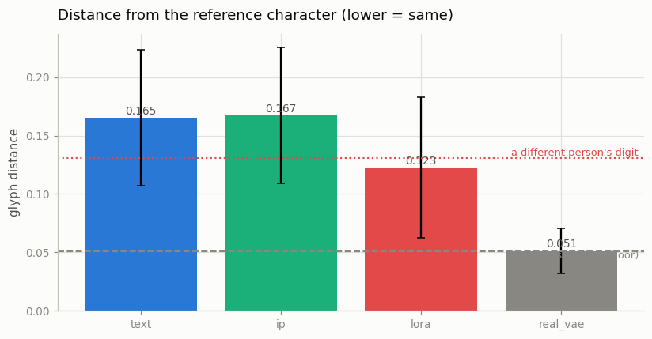
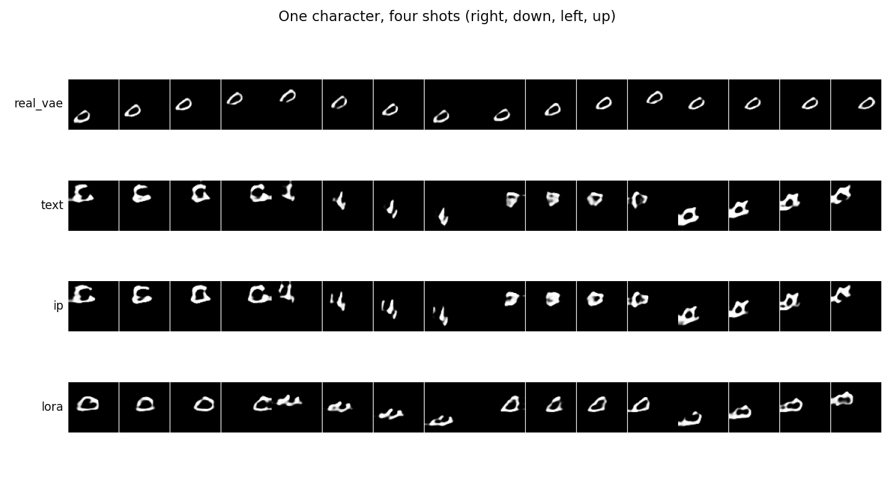
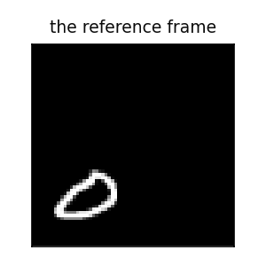

# Character Consistency

## Key Insight

The hardest part of stitching many shots into one story is keeping the *same* character looking like themselves across cuts — a failure called [drift](/shared/glossary/#drift), where a face or outfit morphs from shot to shot. This project fights drift two ways and measures which works better: an [IP-Adapter](/shared/glossary/#ip-adapter), which injects a reference image's appearance into the model through extra [cross-attention](/shared/glossary/#cross-attention) layers, and a character [LoRA](/shared/glossary/#lora), a tiny adapter fine-tuned on a few images of that character. Both pin the identity without retraining the whole [text-to-video](/shared/glossary/#t2v) model, but they trade off differently: the IP-Adapter needs no training and accepts any new reference on the fly, while the LoRA must be trained per character but usually reproduces it more faithfully. You quantify the leftover drift by turning each generated face into an [embedding](/shared/glossary/#embedding) and watching how far it moves shot to shot.

## The problem the previous projects could not solve

[Project 35](../35-sliding-window-t2v/README.md) ended with every method losing
the character by frame 60, and traced the cause: the base model does not keep
one handwriting steady even inside a single window. This project attacks that
directly.

The root issue is that **a caption is a coarse handle.** "A 3 drifting right"
names a *category* with thousands of members. It cannot say *which* 3 — whose
handwriting, which exact shape. So a text-only model draws a fresh, unrelated 3
in every shot, and a viewer watching four shots in a row sees the character
change at every cut.

"But the model already reads text — isn't the digit already specified?" Only
the class is. Identity lives below the resolution of language, which is why
every production system fixes it with a **picture**, not a longer sentence.

## Two ways to hand the model a picture of the character

| arm | what it is | trained… |
|---|---|---|
| `text` | the base model, caption only. The baseline that has no idea who the character is. | never |
| `ip` | an [IP-Adapter](/shared/glossary/#ip-adapter): a separate image branch that reads a reference frame. | **once**, across 64 characters |
| `lora` | a character [LoRA](/shared/glossary/#lora): a tiny fine-tune on a handful of that character's clips. | **per character** |

The difference in *when* they are trained is the whole practical trade-off. The
IP-Adapter is trained once and then works on any new reference instantly,
including a character it has never seen. The LoRA must be trained fresh for each
new character (here, 250 steps, ~65 KB) but bakes that one identity deep into
the weights.

### Why the IP-Adapter needs its own attention layer

A fair objection: the model already has a [cross-attention](/shared/glossary/#cross-attention)
layer that reads a sequence of context vectors. Why not just append the image's
tokens to the text's tokens and reuse it?

Because the two sequences answer different questions. The text keys were shaped,
across the whole of training, to answer *"what should happen"*; image keys have
to answer *"what should it look like"*. Pushing both through one softmax makes
them compete for the same attention budget, so a strong reference quietly
suppresses the prompt. The IP-Adapter's fix is to give the image its own keys,
values, and output projection and *add* the result:

```
out = cross_attn_text(x) + s * cross_attn_image(x)
```

Both branches get their full share, and `s` becomes a dial for how hard the
reference is imposed. The design is called **decoupled cross-attention** —
"decoupled" because the two attentions are pulled apart instead of merged. Its
output projection starts at zero, so at step 0 the adapted model is bit-for-bit
the original — the same guarantee [ControlNet](../31-controlnet-video/README.md)'s
zero convolutions and [LoRA](../34-lora-for-video/README.md)'s zero `B` give,
for the same reason: a new side branch must not damage a model that already
works.

### One honest simplification

Our reference encoder is a small convolutional net trained from scratch. A real
IP-Adapter uses a **frozen, pretrained CLIP image encoder** here, for exactly
the reason [project 30](../30-long-prompt-handling/README.md) used a frozen CLIP
*text* encoder: it arrives already knowing what things look like. Keep this in
mind — it turns out to be the reason the results below land the way they do.

## Measuring identity honestly

Identity is measured with `glyph_crops`: a 28×28 box centred on the digit, so
position and motion are removed and only the handwriting is left. But a raw
number means nothing without knowing what the ruler reads on cases whose answer
we already know ([project 32](../32-talking-head/README.md) paid for this lesson
the hard way). The `ruler` stage measures three:

| case | glyph distance |
|---|---|
| the same character, another clip | 0.000 |
| the same character through the VAE | **0.051** — the best any generator can reach |
| a **different** person, same digit | **0.131** — no identity at all |

Every score below is read against those two anchors: 0.051 is a perfect match
after the unavoidable VAE blur; 0.131 is total failure.

Every evaluation character comes from MNIST's **test** split, so "works on an
unseen character" means genuinely unseen by every arm.

## Results

Eight unseen characters, a four-shot story each (right, down, left, up), four
samples per shot.

| arm | identity ↓ | shot-to-shot ↓ | digit judged right ↑ | direction right ↑ |
|---|---|---|---|---|
| `text` | 0.165 | 0.106 | 0.57 | 1.00 |
| `ip` | 0.167 | 0.119 | 0.59 | 1.00 |
| `lora` | **0.123** | **0.089** | 0.56 | 1.00 |
| `real_vae` | 0.051 | 0.038 | 0.63 | — |







*The reference frame the `ip` arm was given for the character above.*

### The LoRA works; the from-scratch IP-Adapter barely moves the needle

This inverts the Key Insight's tentative framing ("the IP-Adapter needs no
training … while the LoRA usually reproduces it more faithfully" makes them
sound like a convenience-vs-fidelity trade). At this scale it is not a trade —
the LoRA simply wins. It cuts identity distance to **0.123**, roughly halfway
from total failure (0.131) to the VAE floor (0.051), while the IP-Adapter's
0.167 is indistinguishable from the text-only baseline's 0.165 — if anything a
hair worse.

Why does the IP-Adapter fall flat when the literature treats it as the strong,
convenient option? Because of the simplification flagged above. A real
IP-Adapter reads its reference through a giant CLIP image encoder that already
knows how to describe any picture; ours learns a reference encoder **from
scratch on 64 characters**. That is nowhere near enough data to learn a
representation of handwriting that *generalises to an unseen character* — so at
test time it extracts almost nothing identity-specific to inject. This is the
same lesson as [project 30](../30-long-prompt-handling/README.md) (a real
pretrained encoder is doing heavy lifting you don't see) and
[project 31](../31-controlnet-video/README.md) (the "trained copy vs from
scratch" argument assumes a scale we don't have here). The LoRA sidesteps the
whole problem: it never has to *generalise* identity, because it is retrained
for the one character it needs.

### Pushing the reference harder does not rescue it

The `dial` stage sweeps the IP-Adapter's strength `s`:

| `s` | identity ↓ | digit judged right ↑ |
|---|---|---|
| 0.0 (off) | 0.167 | 0.59 |
| 1.0 | 0.165 | **0.63** |
| 2.0 | 0.157 | 0.28 |
| 3.0 | 0.154 | 0.25 |

Turning `s` up buys a tiny identity improvement (0.165 → 0.154) at a brutal cost
to whether the digit is even legible (0.63 → 0.25). This is the same
"everything degrades at once past the sweet spot" that [CFG](/shared/glossary/#cfg-classifier-free-guidance)
overshoot and [LoRA scale](../34-lora-for-video/README.md) overshoot both show:
there is a strength beyond which a control just corrupts the image, and no
amount of it turns a weak identity signal into a strong one.

There is a subtlety worth naming inside the dial. How the reference is treated
under [classifier-free guidance](/shared/glossary/#cfg-classifier-free-guidance)
should matter in principle: guidance amplifies whatever *differs* between the
prompted and unprompted branches, so leaving the reference in **both** branches
cancels it out of the amplified term and quietly leaves the character at
strength 1 while the prompt is multiplied by the guidance scale. The `dial`
stage tests dropping the reference from the null branch too — and here it
changes essentially nothing, because the identity signal is too weak for the
distinction to bite. On a real IP-Adapter it is a real knob.

### What all three arms get right

`direction_acc` is 1.00 everywhere and `digit_acc` never collapses (except when
the IP-Adapter is cranked past its sweet spot). Adding an identity mechanism did
**not** cost the model its ability to follow the prompt — the adapters attach
beside the base model rather than overwriting it, exactly as designed. The
question was only ever whether they *add* identity, and only the LoRA does.

## What's in this directory

| file | what it is |
|---|---|
| `ident_lib.py` | the cast, the `IPAdapterDiT` with decoupled cross-attention, the guidance-aware sampler, and the identity ruler. |
| `run.py` | stages: `cache`, `ruler`, `ip`, `dial`, `lora`, `evaluate`, `figures`. |
| `outputs/summary.csv` | every arm's identity, shot-to-shot, and prompt-following scores. |
| `outputs/ruler.csv` | the two anchor distances every score is read against. |
| `outputs/dial.csv` | the IP-Adapter strength sweep. |
| `outputs/identity.png` | identity distance per arm, with both ruler ends drawn. |
| `outputs/shots.png` | one character, four shots, one row per arm. |
| `outputs/tradeoff.png` | identity against everything it might cost. |

## How to run

```bash
python3 run.py --stage cache      # ~2 min
python3 run.py --stage ruler      # ~1 min
python3 run.py --stage ip         # ~7 min
python3 run.py --stage dial       # ~2 min
python3 run.py --stage lora       # ~3 min
python3 run.py --stage evaluate   # ~2 min
python3 run.py --stage figures    # ~1 min
```

Needs [project 35](../35-sliding-window-t2v/README.md)'s `--stage base` first,
plus the earlier-phase prerequisites listed there.

## Takeaways

1. **Text cannot specify identity, only category.** A caption picks the digit,
   never the handwriting. Every real long-form system fixes this with a
   reference picture or a per-character fine-tune.
2. **A character LoRA works even at toy scale** — it cut identity distance
   halfway to the physical floor. It never has to *generalise* identity,
   because it is retrained for the one character it needs.
3. **A from-scratch IP-Adapter does not** — because the mechanism leans on a
   large pretrained image encoder we replaced with 200 K from-scratch
   parameters. The design is sound; the missing piece is the encoder, the same
   invisible workhorse from [project 30](../30-long-prompt-handling/README.md).
4. **Turning a weak control up does not make it strong** — it corrupts the
   image long before it fixes the identity, the familiar overshoot cliff.
5. **Identity mechanisms attach beside the model, not over it.** Prompt-
   following survived intact under both adapters; that is what the zero-init
   side-branch design buys you.
