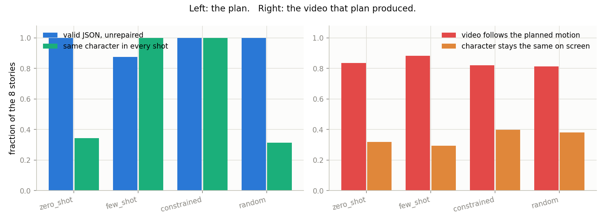
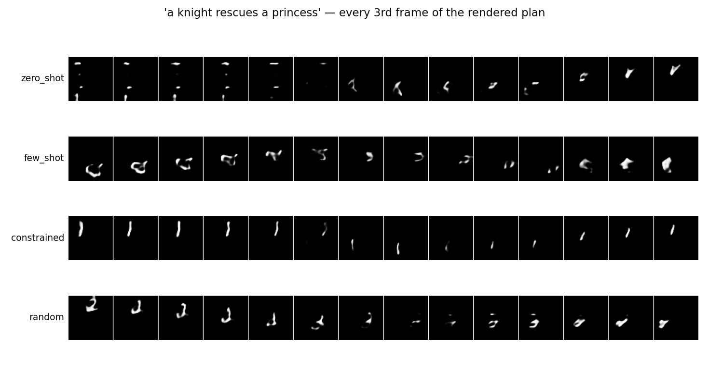
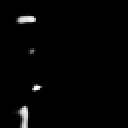
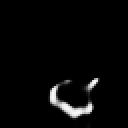

# LLM Shot Planner

## Key Insight

A minute-long story is too much for any single [text-to-video (T2V)](/shared/glossary/#t2v) generation, so this project borrows the film world's solution: a [shot list](/shared/glossary/#shot-list). A small [large language model (LLM)](/shared/glossary/#llm) acts as a "director," expanding a one-line prompt like *"a knight rescues a princess"* into a structured JSON plan — a sequence of shots, each with its own description — that you then generate one at a time and stitch together. This is the planning half of [hierarchical generation](/shared/glossary/#hierarchical-generation): the LLM decides *what happens in what order* before any pixels are made, which is the only way to get a video whose events follow a sensible narrative rather than wandering. You evaluate the result on coherence — do the shots actually tell the intended story, and does the knight stay the same knight across them?

Both models here are real: the director is **Qwen2.5-0.5B-Instruct** running on
the CPU, and the renderer is [project 35](../35-sliding-window-t2v/README.md)'s
video model. Nothing about the planning half is simulated.

## Why a *second* model, when the video model already reads text?

This is the first objection to answer, because the video model does contain a
text encoder — a frozen T5, from [project 30](../30-long-prompt-handling/README.md)
— and it does read English. So why not hand it the whole story?

Look at what that encoder is *for*: it turns one caption into vectors describing
**one** 16-frame clip. It has no notion of before and after, no memory between
calls, and nothing in its training ever asked it to decide what should happen
next. Hand it "a knight rescues a princess" and it will try to cram the entire
story into two seconds.

The language model fills a different gap: **decomposition and ordering.** It
turns one sentence into four, in a sequence that makes narrative sense, and it
is supposed to keep the protagonist the same across them. It never touches a
pixel. Then the video model does what it is good at — rendering one short moment
at a time. That division of labour is what "hierarchical generation" means in
practice, and it is how VideoTetris and MovieDreamer are organised.

## Telling the director what the studio can build

Our video model can draw exactly one thing: a handwritten digit sliding in one
of four directions. So the prompt tells the LLM precisely that — the character
is a digit 0–9, the only camera moves are right/down/left/up, and the output
must be a JSON array of four shots with `subject`, `motion`, and `caption`.

This is not a toy shortcut; it *is* the real problem. Every production shot
planner has to be told what its renderer can and cannot do, and most planning
failures are the planner asking for something the renderer has no way to make.

## Three ways to get a shot list

| arm | what it is |
|---|---|
| `zero_shot` | just ask. Tests whether a 0.5B model can follow a format instruction unaided. |
| `few_shot` | ask, after showing two worked examples. Examples are a cheaper, faster lever than fine-tuning. |
| `constrained` | never let it write free text: we write the JSON skeleton and the model only *chooses* between the legal values at each slot, by scoring them. |
| `random` | a plan with no thought behind it. The control. |

`random` earns its place: a random plan still renders into a video, so "it
produced a video" is never evidence that the planning worked. Every planning
number has to beat random to mean anything.

### How constrained decoding actually works

Instead of sampling tokens and hoping the result is legal JSON, we build the
JSON ourselves and ask the model only to *choose* values. At each slot we score
every legal option by its total log-probability and keep the best. Malformed
output becomes **impossible** rather than merely unlikely.

Two details make it practical on a CPU, and both are worth stealing:

* **The subject is chosen once and reused.** The rules say the character is the
  same in every shot, so scoring ten digits at every shot would waste compute
  *and* invite the model to change the character mid-story. A constraint the
  plan must satisfy is better built into the decoder than hoped for from the
  model.
* **`logits_to_keep`.** Scoring a batch of candidates naively makes the model
  materialise a full `(candidates × prefix_length × 150k-word)` score tensor,
  almost all of which is discarded. Keeping only the last few positions is the
  difference between seconds and minutes per plan. (It is the same trap that
  silently OOM-kills MCQ evaluation in the [LLM guide](../../../llm/).)

## Results: the plan

Eight stories, scored on whether the plan is usable *before* any video is made.

| arm | valid JSON (unrepaired) ↑ | repairs needed ↓ | same character every shot ↑ | motion variety ↑ |
|---|---|---|---|---|
| `zero_shot` | **1.00** | 0.0 | 0.34 | 1.00 |
| `few_shot` | 0.88 | 1.0 | **1.00** | 0.97 |
| `constrained` | **1.00** | **0.0** | **1.00** | **1.00** |
| `random` | 1.00 | 0.0 | 0.31 | 0.59 |



### The interesting failure: format is easy, the *rule* is hard

Zero-shot produces valid JSON every time — a 0.5B model has no trouble with the
*shape* of the answer. But its `subject_consistency` is **0.34**, barely above
the random control's 0.31. Look at what it actually wrote:

```
shot 1: subject 7, right  Knight leaps into battle, sword raised...
shot 2: subject 8, down   Knight swings his sword...
shot 3: subject 5, left   Knight moves forward...
shot 4: subject 6, up     Knight lands on the princess's chest...
```

The captions describe one consistent knight — but the `subject` digit changes
every shot, silently violating the one rule that most affects the video ("keep
the character the same"). The model obeyed the format instruction and ignored
the harder semantic one. This is the single most useful thing in the project:
**a plan that parses is not a plan that is correct**, and the gap between the
two is exactly where planning goes wrong.

### Examples fix the rule; constraints guarantee it

Showing two worked examples (`few_shot`) lifts subject consistency to a perfect
1.00 — the model copies the pattern of a fixed protagonist from the examples,
which no amount of instruction-wording achieved. The cost is a small crack in
reliability: one of the eight plans came back as slightly malformed JSON and
needed the repair step, dropping unrepaired validity to 0.88. More capability,
slightly less predictability — a familiar trade.

`constrained` is the only arm that gets everything at once: 100% valid (it
cannot be otherwise), 100% consistent (the subject is chosen once by
construction), full motion variety. When a field *must* be right, building the
guarantee into the decoder beats asking nicely and checking afterwards.

## Results: the rendered video

Each plan is then shot by the video model and graded.

| arm | subject drawn as planned ↑ | video follows planned motion ↑ | character stable on screen ↑ |
|---|---|---|---|
| `zero_shot` | 0.25 | 0.84 | 0.32 |
| `few_shot` | 0.22 | **0.88** | 0.29 |
| `constrained` | **0.33** | 0.82 | **0.40** |
| `random` | 0.30 | 0.81 | 0.38 |



  

*(the first story rendered from the zero-shot, few-shot, and constrained plans)*

### An honest non-result: the planner's win does not fully survive the renderer

The right-hand half of the figure is deliberately sobering. `direction_follow`
is ~0.82–0.88 for *every* arm including `random`, and the "character stable on
screen" column is low across the board. Two separate reasons, both worth
understanding:

1. **The renderer is the bottleneck, and it is prompt-shaped, not
   plan-shaped.** The video model renders whatever `(subject, motion)` pair each
   shot hands it, and it renders a random pair about as faithfully as a planned
   one — a digit sliding left is no harder to draw because a knight-story
   motivated it. So the planning quality that the left-hand figure measures
   (does the *plan* make sense) is largely invisible to the motion metric,
   which only asks whether the *render* obeyed its own shot.

2. **On-screen identity is a renderer weakness this project cannot fix.** As
   [project 37](../37-character-consistency/README.md) established, the base
   model does not hold one handwriting steady across shots even when the plan
   correctly asks for the same subject. So `constrained`'s perfect *planned*
   consistency (1.00) decays to 0.40 *on screen* — better than the other arms,
   but far from the plan's promise. Good planning is necessary for a coherent
   story and nowhere near sufficient; it has to be paired with the identity
   tools of project 37.

The one place the planning quality *does* show through is `subject_acc`:
constrained's rendered digit matches the plan 0.33 of the time against
zero-shot's 0.25, because at least its plan asked for a single consistent digit
the model could try to draw. Small, but real, and in the right direction.

## What's in this directory

| file | what it is |
|---|---|
| `plan_lib.py` | the director: prompt, few-shot examples, free-form and constrained decoders, JSON extraction, validation, and repair. |
| `run.py` | stages: `plan`, `render`, `figures`. |
| `outputs/planning.csv` | plan-quality metrics per arm. |
| `outputs/render.csv` | rendered-video metrics per arm and story. |
| `outputs/plans.json` | every plan, raw reply included. |
| `outputs/example_plans.txt` | one readable plan per arm, with the raw model output. |
| `outputs/planning.png` | plan quality beside the video it produced. |
| `outputs/stories.png` | the first story rendered from each arm's plan. |

## How to run

```bash
python3 run.py --stage plan       # ~6 min  (real 0.5B LLM on CPU)
python3 run.py --stage render     # ~2 min
python3 run.py --stage figures    # ~1 min
```

The first run downloads Qwen2.5-0.5B-Instruct (~1 GB) from the Hugging Face Hub.
Needs [project 35](../35-sliding-window-t2v/README.md)'s `--stage base` first.

## Takeaways

1. **Planning and rendering are genuinely different jobs.** The frozen text
   encoder captions one clip; it cannot decompose a story into ordered shots.
   That is the gap a separate LLM fills, and it is the whole idea of
   hierarchical generation.
2. **A plan that parses is not a plan that is correct.** Zero-shot produced
   perfect JSON while silently changing the protagonist every shot — the format
   was easy, the semantic rule was not.
3. **Examples buy capability; constraints buy guarantees.** Few-shot taught the
   consistency instruction that wording alone could not; constrained decoding
   made invalid and inconsistent output structurally impossible.
4. **Build must-hold constraints into the decoder**, not the prompt — and mind
   `logits_to_keep`, or scoring candidates will OOM or crawl.
5. **Good planning is necessary but not sufficient.** A perfect plan still hits
   a renderer that cannot hold identity across shots ([project 37](../37-character-consistency/README.md))
   — the pieces of a long-form system only work together.
