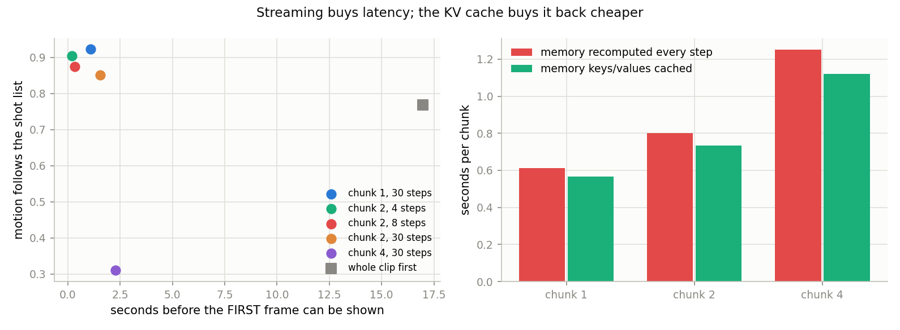
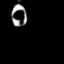
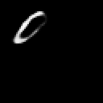
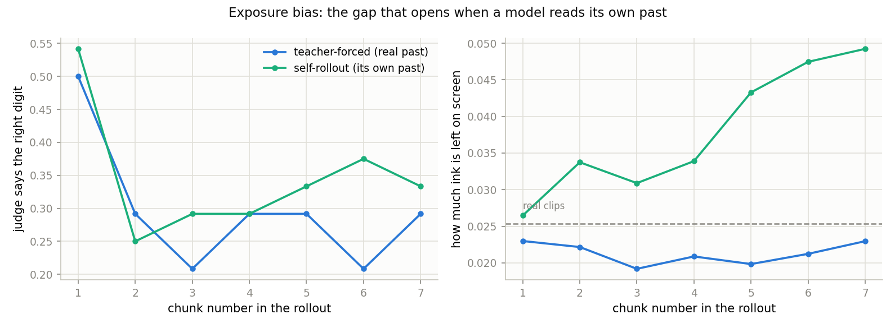

# Streaming T2V

## Key Insight

Most video models generate a whole clip at once, which means you wait for the entire thing before seeing a single frame — fine for a 5-second clip, impossible for an endless or interactive one. [Streaming video generation](/shared/glossary/#streaming-video-generation) instead emits frames chunk by chunk as it goes, conditioning each new chunk on the ones already produced. This project implements that loop and reuses a [KV cache](/shared/glossary/#kv-cache) across chunks — storing the [attention](/shared/glossary/#attention) keys and values from earlier frames so each new chunk does not recompute the whole history — then measures the [latency](/shared/glossary/#latency)-versus-quality trade-off. The same idea underlies real-time systems like [CausVid](/shared/glossary/#causvid) and [Self-Forcing](/shared/glossary/#self-forcing), which [distill](/shared/glossary/#distillation) a slow full-clip diffusion model into a fast [autoregressive](/shared/glossary/#autoregressive-model) one that produces frames in time order.

## The loop

```
memory (2 clean latent frames)  ->  denoise the NEXT chunk  ->  emit it
         ^                                                        |
         +--------------------- becomes the new memory ------------+
```

The model must be **causal in chunks**: what it draws next may depend on the
past, never on the future. That is the same constraint an
[autoregressive](/shared/glossary/#autoregressive-model) language model lives
under, which is why the same vocabulary — KV cache, exposure bias, teacher
forcing — shows up here.

Compared with [project 35](../35-sliding-window-t2v/README.md)'s anchoring, this
is a step further. Project 35 pinned the overlap of a *bidirectional* model that
could still see its whole window at once. Here the model is **trained** never to
see the future, which is what makes true streaming — emit frame, then think
about the next — possible.

## Why the memory gets its own attention (and why that is the KV cache)

The obvious design is to glue the memory frames onto the front of the noisy
frames and run ordinary self-attention over everything. It works, and it is what
a plain long-context model does. But it makes a KV cache impossible, and the
reason is worth spelling out because it is *the* reason the cache exists.

Inside a diffusion block, every token is modulated by the current noise level
`t` before its keys and values are computed (that is what
[AdaLN](/shared/glossary/#adaln) does). Denoising one chunk visits ~30 different
values of `t`. If the memory tokens sit in that same stream, their keys and
values are recomputed **30 times** even though the memory itself never changes.

So the memory gets a separate cross-attention whose keys and values come from a
`t`-independent projection. They can be computed **once per chunk** and reused
for every denoising step. That reuse *is* the KV cache: keep the keys and values
of things that are not going to change. Here the saving is per-chunk rather than
per-token as in an LLM, but it is the same idea and the same bookkeeping.

## Training on turns, not straight lines

The single most important design decision in this project is the training data,
and the first version got it wrong in an instructive way.

The obvious training set is [project 25](../25-implement-dit-for-video/README.md)'s
cache of 16-frame clips. Every one of those clips moves in a **single**
direction. A model trained on `(memory, next chunk)` pairs cut from them only
ever sees a continuation of the motion already under way — so at rollout time,
when the shot list asks it to turn a corner at every chunk, it is in a situation
it never trained for. The measurement then shows quality collapsing after chunk
1, which *looks* like exposure bias but is really just the model being off its
training distribution.

The fix is to train on 64-frame clips that follow the same shot list the rollout
will follow, so **turns are inside the training data.** After that change,
chunk-2 direction-following rose from 0.55 to 0.85. Getting this wrong first, and
seeing exactly how it fails, is the lesson: a streaming model can only continue
distributions it was trained to continue.

## The KV cache is correct, and what it saves

The `cache` stage checks two things. First, that caching changes nothing: the
cached and recomputed outputs are **bit-for-bit identical** (max difference
0.0), which is the only acceptable result — a cache that changes the answer is a
bug, not an optimisation. Second, what it buys:

| chunk size | recomputed (s) | cached (s) | saving |
|---|---|---|---|
| 1 | 0.61 | 0.57 | 8% |
| 2 | 0.80 | 0.73 | 8% |
| 4 | 1.25 | 1.12 | 10% |

The saving is modest here because our memory (2 frames × 16 patches = 32 tokens)
is small next to the chunk being denoised. In a real system the context is
thousands of past frames and the memory dominates, so the same mechanism saves a
large fraction rather than a tenth. The point of measuring it on a toy is to
confirm the machinery is right and free of correctness cost.

## Results: latency versus quality

24 rollouts, the same 64-frame shot list as project 35, scored against
`real_vae` (0.051-style VAE floor for identity; direction-follow 1.00).

| setting | time to FIRST frame (s) | s/frame | direction follow ↑ | jerk ↓ |
|---|---|---|---|---|
| whole clip (project 35 sliding window) | **16.97** | 0.265 | 0.77 | 1.88 |
| stream, chunk 1, 30 steps | 1.07 | 0.244 | **0.92** | 1.08 |
| stream, chunk 2, 30 steps | 1.53 | 0.159 | 0.85 | 1.01 |
| stream, chunk 2, 8 steps | 0.32 | 0.044 | 0.88 | 0.93 |
| stream, chunk 2, 4 steps | **0.20** | **0.020** | 0.90 | 0.86 |
| stream, chunk 4, 30 steps | 2.26 | 0.149 | 0.31 | 0.90 |



  

*(left to right: real through the VAE, project 35's whole-clip sliding window,
and this project's chunk-2 stream)*

### Streaming crushes the time-to-first-frame

This is the headline and it is not subtle. The whole-clip method makes you wait
**17 seconds** before you see anything. The chunk-2 stream shows its first frame
in **0.2–1.5 seconds** depending on how many denoising steps you allow — a
10–80× improvement in [latency](/shared/glossary/#latency) — while *also*
following the shot list *better* (0.85–0.92 against 0.77). The streaming model
wins on quality here because it was trained on the turns; the win is not
intrinsic to streaming, but the latency collapse is.

### Fewer denoising steps are almost free — up to a point

Cutting a chunk from 30 steps to 4 barely touches direction-following
(0.85 → 0.90, within noise) while making it **8× faster** per frame (0.159 →
0.020 s). This is the same lesson [project 26](../26-flow-matching-from-scratch/README.md)
found for [rectified flow](/shared/glossary/#rectified-flow): the straight
probability path integrates accurately in very few steps, so on an easy target
the extra steps buy almost nothing. It is exactly the property that
[distillation](/shared/glossary/#distillation) into few-step students exploits
in CausVid and Self-Forcing.

### The chunk cannot be bigger than the memory can support

Chunk 4 collapses to 0.31 direction-following. A 4-frame chunk is as long as the
model's entire memory, so it is being asked to invent more future than its 2
frames of past can anchor — and with only a change of direction to go on, it
loses the thread. The usable regime is **small chunks, few steps**, which is
also the regime real streaming systems operate in.

## Results: exposure bias, the reason long streams still rot

The `drift` stage rolls the model out twice over the same shot list:

* **self** — the normal way: each chunk's memory is the model's *own* previous
  output.
* **teacher** — the memory is taken from the *real* latent sequence instead.

| rollout | identity drift by the end ↓ | direction follow ↑ |
|---|---|---|
| self (its own past) | 0.221 | 0.85 |
| teacher (the real past) | **0.146** | 0.90 |



Feeding the model the real past instead of its own cuts end-of-clip identity
drift by a third (0.221 → 0.146). That gap **is**
[exposure bias](/shared/glossary/#exposure-bias), and the name is literal:
during training the model is only ever *exposed* to real past frames
(that setup is called [teacher forcing](/shared/glossary/#teacher-forcing)),
so it never learns what to do when the past is slightly wrong — and at
generation time the past is *always* slightly wrong, because the model made it.

The right-hand panel of the figure shows the mechanism directly. Self-rollout
**accumulates ink**: the amount of bright pixels on screen climbs from the real
level (0.026) to 0.049 by the last chunk, because each imperfect frame leaves a
faint smear that the next chunk copies and adds to, like a photocopy of a
photocopy. Teacher-forcing, reading clean frames each time, stays at the real
level. (Per-chunk digit accuracy is too noisy on 24 clips to read a trend from —
the reliable signals are the identity drift and the ink accumulation, which is
why those are the reported numbers.)

This is precisely the gap [Self-Forcing](/shared/glossary/#self-forcing) closes,
by making the model generate from its *own* predictions during training too. We
implement and measure the problem; the fix is a training-loop change that is its
own project's worth of work.

## What's in this directory

| file | what it is |
|---|---|
| `stream_lib.py` | the chunk-causal `StreamDiT`, its separated memory attention, the KV cache, and the rollout loop. |
| `run.py` | stages: `data`, `train`, `cache`, `sweep`, `drift`, `figures`. |
| `outputs/sweep.csv` | latency and quality at every chunk size / step count. |
| `outputs/kv_cache.csv` | cache correctness and speed. |
| `outputs/drift.csv` | self-rollout versus teacher-forcing. |
| `outputs/latency.png` | the latency-vs-quality scatter and the cache saving. |
| `outputs/exposure_bias.png` | the gap that opens when the model reads its own past. |
| `outputs/stream_*.gif` | the streamed videos. |

## How to run

```bash
python3 run.py --stage data       # ~2 min
python3 run.py --stage train      # ~7 min
python3 run.py --stage cache      # ~1 min
python3 run.py --stage sweep      # ~4 min
python3 run.py --stage drift      # ~3 min
python3 run.py --stage figures    # ~1 min
```

Needs [project 35](../35-sliding-window-t2v/README.md)'s `--stage base` first,
plus the earlier-phase prerequisites listed there.

## Takeaways

1. **Streaming's whole point is latency.** First frame in 0.2 s instead of 17 s
   — a change of kind, not degree, and the thing that makes real-time and
   endless video possible at all.
2. **A streaming model can only continue what it was trained to continue.**
   Trained on straight-line clips it cannot turn a corner; the fix is putting
   the corners in the training data.
3. **The KV cache is a correctness-preserving reuse**, not an approximation —
   bit-for-bit identical output. Its saving grows with how much past there is.
4. **On an easy target, few-step sampling is nearly free** — 4 steps matched 30
   at 8× the speed, the property distillation turns into real-time models.
5. **Exposure bias is real and measurable.** Reading its own imperfect past
   costs the model a third of its identity by the end of the clip, and shows up
   as ink accumulating frame over frame. Closing that gap is what
   [Self-Forcing](/shared/glossary/#self-forcing) is for.
