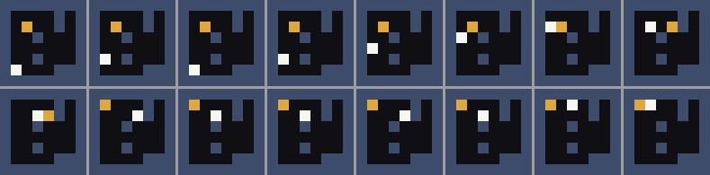
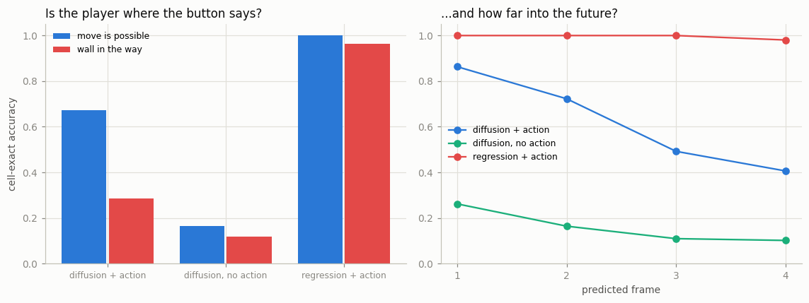
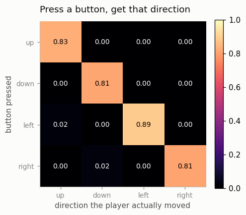
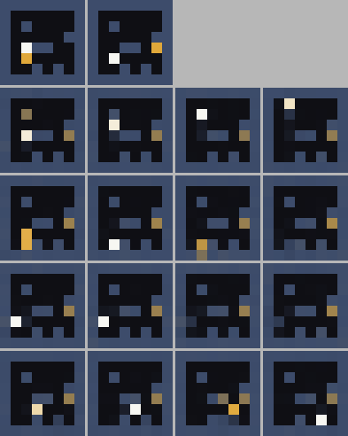
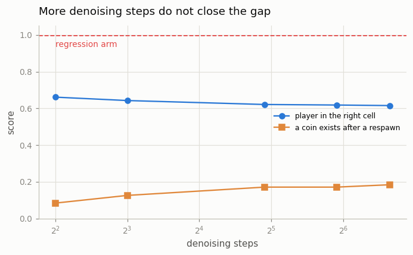
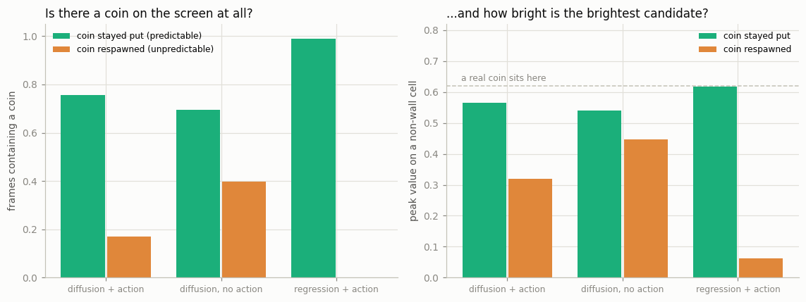
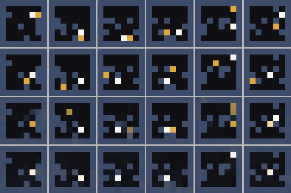
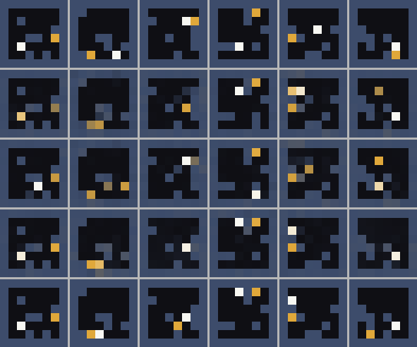

# Action-Conditioned Video

## Key Insight

A plain video model predicts what happens next; the moment you also feed it an action and ask it to predict what happens next *because of that action*, it becomes a [world model](/shared/glossary/#world-model). This project adds [action conditioning](/shared/glossary/#action-conditioning) to a small [video diffusion model](/shared/glossary/#diffusion-model) — a discrete input of, say, four game buttons injected alongside the noisy frames — and trains it on a simple game's recorded play, where every frame is paired with the button that was pressed. Once trained, pressing *up* versus *left* sends the predicted future down different branches, which is the whole point: the action is the steering wheel. It is the smallest possible step from "generate a clip" to "simulate an interactive world."

## The game

Phases 1 to 8 generated video from *text*: you describe the clip once, the model
paints five seconds. A world model has to answer a new question at **every
frame** — "given this screen and this button, what is the next screen?" — so it
needs data where one button is attached to one frame. The moving-digit clips of
the earlier phases have one fixed direction per clip, so they can teach a model
to *continue* motion but never to *react*. This phase therefore records its own
data by playing a tiny game.




An 8×8 grid. Blue is wall, gold is the coin, white is you. Four buttons: up,
down, left, right. Two rules make this more than bookkeeping:

1. **Walking into a wall does nothing.** The model cannot simply slide the white
   square in the direction of the button; it has to look at what is in the way.
2. **Stepping on the coin scores, and the coin reappears somewhere random.**
   From the same screen and the same button, several different next screens are
   all correct.

Rule 2 is the reason this project has three arms instead of one. It puts a
genuinely uncertain event inside an otherwise clockwork world, which is exactly
the situation where "generate a sample" and "predict the average" stop being the
same thing.

### Why the model works on 8×8 and not on 32×32 pixels

Phase 5's lesson was: do not run [diffusion](/shared/glossary/#diffusion-model)
on raw pixels, run it in a compressed space a
[tokenizer](/shared/glossary/#tokenizer) gives you. This game hands us a perfect
tokenizer for free — every 4×4 pixel block is one flat colour, so a 32×32 screen
carries exactly 8×8 = 64 numbers. The models here work on the 8×8 grid and we
expand to 32×32 only for display.

You may reasonably ask: *isn't that just cheating, compared with a real
[3D VAE](/shared/glossary/#3d-vae)?* It is a shortcut, and worth naming
precisely. A learned VAE has to be trained and still loses a little detail; our
"encoder" is exact and free. What it is **not** is a different idea — it plays
the identical role in the pipeline (shrink the thing diffusion has to model).
A real game frame comes with no such gift, which is why GameNGen, Genie and
OASIS spend a large slice of their compute on a learned tokenizer. We skip that
part because Phase 5 already built one, and because it makes every experiment in
this phase 16× cheaper.

## The three arms

All three are the **same U-Net, the same 750k parameters, the same data, the
same 3000 optimiser steps.** They differ by one line each.

| arm | what it is | the question it answers |
|---|---|---|
| `diff` | flow matching, **knows** the buttons | the real thing |
| `noact` | flow matching, **not told** the buttons | does action conditioning do anything at all? |
| `mse` | one-shot regression, knows the buttons | do we even need a generative model? |

`noact` deserves a note, because the obvious objection is "of course it will be
worse, you removed an input." That is exactly the point: it converts a
plausible-sounding claim ("the action steers the video") into a measured gap.
Without it, a reader cannot tell whether `diff`'s predictions follow the button
or merely follow *the momentum already visible in the two context frames* —
which would look almost as good on most frames and would not be a world model at
all.

`mse` is the same network fed a zero tensor where the noise usually goes, with
the timestep pinned at 0, trained to output the four future frames directly.
Same capacity, no denoising loop.

### How the button gets into the network

The four button IDs become embeddings, are **concatenated** (not averaged) into
one vector, and that vector modulates every convolution block's normalisation —
a per-channel scale and shift. That mechanism is
[FiLM](/shared/glossary/#film-feature-wise-linear-modulation), "feature-wise
linear modulation": *feature-wise* because each feature channel gets its own
numbers, *linear* because all it does is multiply and add. It is the
convolutional twin of the [AdaLN](/shared/glossary/#adaln) that steers
[project 25](../25-implement-dit-for-video/README.md)'s DiT.

The concatenation is not a detail. The first version of this code *averaged* the
four action embeddings, which makes "left then up" and "up then left"
indistinguishable to the network — and they lead to different screens. Averaging
scored 0.31 cell-exact accuracy; concatenating scored 0.62. Half of the model's
apparent stupidity was a two-line bug in how the conditioning vector was built.

## Results: does the button steer the video?

256 held-out windows, two context frames in, four future frames out, scored by
"is the white square in exactly the right cell?" (chance ≈ 1/30).



| arm | overall | frame 1 | frame 4 | move possible | wall in the way |
|---|---|---|---|---|---|
| `diff` diffusion + action | 0.62 | 0.86 | 0.41 | 0.67 | 0.29 |
| `noact` diffusion, no action | 0.16 | 0.26 | 0.10 | 0.17 | 0.12 |
| `mse` regression + action | **0.995** | 1.00 | 0.98 | 1.00 | **0.96** |

### Action conditioning is doing almost all the work

`diff` beats `noact` by 0.62 to 0.16 — about **four times better**. Plainly: a
model that is not told which button was pressed cannot guess it from the screen,
because nothing on the screen says where the player *intends* to go. That gap is
the entire content of the sentence "a video generator becomes a world model when
you give it actions."

The counterfactual test says the same thing more directly. Take one screen, hold
each button for four frames, and see which way the player actually goes:





*(top row: the two context frames. Then four four-frame futures from that same
screen — holding up, down, left, right.)*

The diagonal is 0.81–0.89: press a button, get that direction about 85% of the
time, and essentially never the opposite one. The action is a steering wheel,
not a suggestion.

### The honest inversion: plain regression wins the obedience contest

This is the result that would not make a paper's headline, and it is worth
sitting with. **The one-shot regressor is right 99.5% of the time; the diffusion
model — same size, same data, same steps — is right 62%.**

The reason is not subtle once stated: *where the player ends up is completely
determined* by the screen and the button. There is exactly one correct answer,
and squared-error regression is the ideal tool for a problem with exactly one
correct answer. Diffusion answers a harder question — "draw me a sample from the
distribution of next screens" — and pays for that generality with sampling noise
on a part of the problem that had no uncertainty in it.

Two checks, because this claim invites two objections.

**"You just used too few denoising steps."** No:



| denoising steps | 4 | 8 | 30 | 60 | 100 |
|---|---|---|---|---|---|
| cell-exact accuracy | 0.66 | 0.64 | 0.62 | 0.62 | 0.62 |

The curve is flat from 4 steps to 100. More careful integration of the same
[ODE](/shared/glossary/#ode) does not help, so the limit lives in the learned
velocity field, not in the solver. (A useful side observation for [project 44](../44-real-time-latency-hunt/README.md):
**4 steps are as good as 100 here** — the same "few steps are nearly free on an
easy target" effect [project 26](../26-flow-matching-from-scratch/README.md) found for
[rectified flow](/shared/glossary/#rectified-flow).)

**"You just under-trained the diffusion model."** Diffusion losses do fall much
more slowly than regression losses, so `run.py --stage longer` retrains `diff`
with 3× the optimiser steps and re-scores it on the identical evaluation set.
The result lands in `outputs/longer.csv`, so the objection can be answered with
a number instead of an opinion.

### And the inversion inverts back: the regressor deletes the coin

Now score the *uncertain* part of the world. Whenever the player collects the
coin, the replacement lands on one of about thirty free cells at random. Score
every predicted frame at or after such a respawn:



| arm | screen has a coin (coin stayed put) | screen has a coin (after respawn) | brightest candidate after respawn |
|---|---|---|---|
| `diff` | 0.75 | 0.17 | 0.32 |
| `noact` | 0.70 | 0.40 | 0.45 |
| `mse` | **0.99** | **0.00** | 0.06 |



*(rows: last context frame, the true next frame, `diff`, `mse` — only on windows
where the coin respawned. Look at the bottom row: there is no gold anywhere.)*

`mse` scores **0.00**. Not "the coin is in the wrong place" — *there is no coin
on the screen at all.* Its brightest non-wall cell sits at 0.06 where a real
coin is 0.62, meaning it has spread one coin's worth of brightness across thirty
cells as a haze too faint to see.

That is [mode averaging](/shared/glossary/#mode-averaging), and the name says
what happens: when several answers are equally right, the answer with the lowest
*squared* error is their average, so a squared-error model outputs the average
instead of any of them. The average of thirty possible coin positions is not a
dim coin — it is a picture of a game state that cannot exist. This is precisely
the failure generative modelling exists to avoid, and it is why real world
models are diffusion or [autoregressive](/shared/glossary/#autoregressive-model)
models rather than regressors, even though a regressor would be far cheaper to
run.

`diff` is better here but not good: it draws a full-brightness coin only 17% of
the time, and a half-bright hedge (peak 0.32 ≈ two candidate cells splitting the
mass) otherwise. Rectified flow with an Euler solver is not immune to averaging;
it is merely less committed to it.

### One curiosity worth explaining

`noact` scores *higher* than `diff` on "screen has a coin after a respawn" (0.40
against 0.17). It is not better — it is oblivious. Not knowing the button, it
cannot tell that the player just stepped onto the coin, so it mostly predicts
"the coin stays where it was" and happens to draw a crisp coin in the old place.
A metric that only asks "is there a coin somewhere" rewards that. It is a good
reminder to read *what a number measures*, not what you hoped it would measure.

## What to take from the three arms together

This world is roughly 95% deterministic (where the player goes) and 5% random
(where the coin reappears). Regression wins the 95% decisively and fails the 5%
totally; diffusion is mediocre at the 95% and merely poor at the 5%. On *this*
toy, a careful engineer would ship the regressor and special-case the coin.

Real systems do the opposite because real worlds invert the ratio. In a real
game frame almost nothing is determined: textures shimmer, particles scatter,
enemies decide, the camera shakes. A regressor asked to predict that frame
averages nearly *all* of it, and the whole screen turns to soup. Our toy makes
the trade visible precisely because it is unusual — here you can see exactly
which cells each method gets right.



*(rows: last context frame, `diff`, `noact`, `mse`, truth.)*

## What's in this directory

| file | what it is |
|---|---|
| `world_lib.py` | the game, the recorder, the renderer, the `ActionUNet`, the metrics. Projects [41](../41-gamengen-reproduction-mini/README.md)-[44](../44-real-time-latency-hunt/README.md) all import this. |
| `run.py` | stages: `data`, `train`, `eval`, `figures`, and the optional `longer`. |
| `outputs/the_game.png`, `real_play.gif` | what the environment looks like. |
| `outputs/obedience.png` | who follows the button, and how far ahead. |
| `outputs/uncertainty.png` | who still draws a coin when the coin is unpredictable. |
| `outputs/respawn.png` | the same question as a picture. |
| `outputs/branching.png`, `steering.png` | four buttons, four different futures. |
| `outputs/sampler_steps.png` | more denoising steps do not rescue the diffusion arm. |
| `outputs/predictions.png` | all three arms against the truth. |
| `outputs/eval.csv`, `data.csv`, `loss.csv` | every number quoted above. |

## How to run

```bash
python3 run.py --stage data       # ~1 min
python3 run.py --stage train      # ~7 min   all three arms
python3 run.py --stage eval       # ~2 min
python3 run.py --stage figures    # ~1 min
python3 run.py --stage longer     # ~7 min   optional: is diffusion just under-trained?
```

CPU only, and no earlier project's checkpoints are needed. The only imports from
outside this directory are [project 26](../26-flow-matching-from-scratch/README.md)'s
`flow_lib` (pure code, no weights) and [project 01](../01-video-loader-benchmark/README.md)'s
plotting style.

## Takeaways

1. **Actions are what turn a video model into a world model**, and the effect is
   large and measurable: 0.62 against 0.16 cell-exact accuracy, with a clean
   diagonal in the press-a-button-get-that-direction matrix.
2. **Concatenate your conditioning, do not average it.** Averaging the four
   action embeddings halved accuracy by making action *order* invisible.
3. **A generative model is not automatically the better predictor.** On the
   deterministic part of this world, plain regression beat diffusion 0.995 to
   0.62, and neither more sampling steps nor 3× more training closed the gap.
4. **The reason to be generative is [mode averaging](/shared/glossary/#mode-averaging).**
   Where the future was genuinely uncertain, the regressor produced frames with
   no coin on them at all — a state the game cannot be in. Being right on
   average is not the same as being right.
5. **Read what a metric measures.** The no-action arm "won" a coin metric by
   being too ignorant to predict a respawn.
