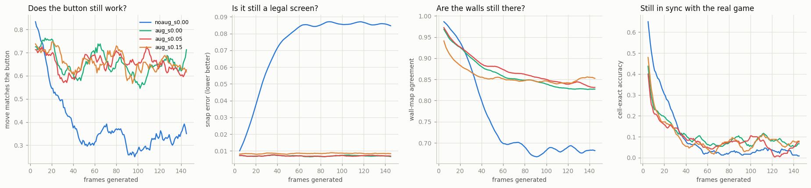
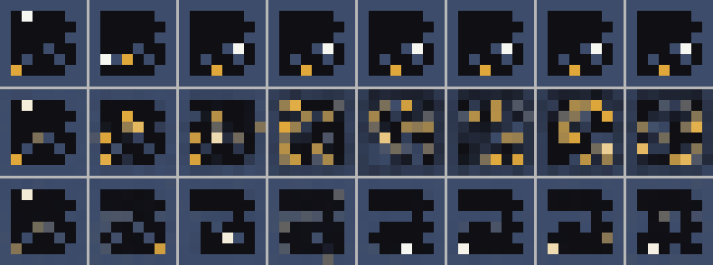
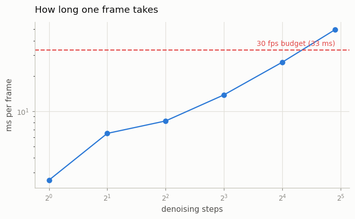

# GameNGen Reproduction (Mini)

## Key Insight

[GameNGen](/shared/glossary/#gamengen) stunned people by running a playable copy of DOOM with no game engine at all — every frame was generated by an [action-conditioned](/shared/glossary/#action-conditioning) [diffusion model](/shared/glossary/#diffusion-model) reacting to the player's controls. This project reproduces the idea at toy scale: train the same kind of model on a much simpler game — an [Atari](/shared/glossary/#atari) title or a [GridWorld](/shared/glossary/#gridworld) — then actually play it, feeding your live keypresses in as the action and watching the model paint the next frame. Going small matters because real-time play demands the model render a frame in tens of milliseconds, so a tiny game keeps both the training cost and the per-frame [latency](/shared/glossary/#latency) within reach of a single GPU. You will feel firsthand where a learned [world model](/shared/glossary/#world-model) holds together and where it [drifts](/shared/glossary/#drift) into nonsense.

## The one change from project 40

[Project 40](../40-action-conditioned-video/README.md) predicted four frames from
two real frames and stopped. Here the model predicts **one** frame, and that
frame becomes part of its own input for the next one:

```
 real frames         ┌──────────────┐
   f0  f1  ─────────►│  the model   │──► f2'
                     └──────────────┘     │
              f1  f2' ─────────────────────┘  ──► f3'
                     f2' f3' ──────────────────────► f4'  ...
```

Nothing real is ever shown to it again after those first two frames. That single
change is what makes a *playable* world — and what lets tiny errors pile up.

This loop is [autoregressive](/shared/glossary/#autoregressive-model): "auto" =
self, "regressive" = predicting from earlier values, so the word literally means
"predicting from its own earlier output." It is the same term, and the same
danger, as in a language model that conditions on the words it just wrote.

### Why two context frames is enough here (and nine were not, for DOOM)

GameNGen conditions on the past **nine** frames. We use two, and one would
almost do. The difference is not model quality — it is a property of the game.

Our screen shows everything: the walls, the coin, the player. Knowing the
current screen is enough to compute the next one, so this world has the
[Markov property](/shared/glossary/#markov-property) — "the future depends on the
present, not on how you got here", named after the mathematician Andrey Markov,
who studied exactly such memoryless chains. DOOM does not have it: a frame does
not show your ammo trend, an enemy's attack timer, or momentum carried from
earlier. GameNGen's nine frames are a cheap way to smuggle that hidden state
back in.

Practical consequence: if you extend this project to a game with hidden state,
lengthen the context first. Everything else stays the same.

## The problem: training and playing are different jobs

During training the "past" the model reads is always a **real, perfect frame
from the recording**. During play the past is whatever the model drew a moment
ago — which is slightly wrong. A model that has only ever seen flawless history
has no practice at recovering from a flawed one, so its mistakes compound
instead of being corrected. That mismatch is
[exposure bias](/shared/glossary/#exposure-bias) — the model was never *exposed*
to its own imperfect output — and [project 39](../39-streaming-t2v/README.md)
measured it for streaming text-to-video.

GameNGen's fix, reproduced here, is
[context noise augmentation](/shared/glossary/#context-noise-augmentation):
during training, deliberately corrupt the context frames with a random amount of
noise, and tell the model how much you added.

The obvious objection: *this is already a diffusion model — it spends its whole
life removing noise. Why add more?* Because the two noises sit in different
places and teach different skills.

| | the diffusion noise | the context noise |
|---|---|---|
| **where it goes** | on the frame being *predicted* | on the frames being *read* |
| **what it teaches** | how to turn noise into a frame | how to work from a damaged past |
| **known at play time?** | yes — it is the sampler's own schedule | yes — you pass the σ you want |

Denoising the *output* teaches nothing about repairing the *input*, because the
input is never damaged. Adding the second noise writes "clean up the past while
you predict the future" into the job description. Analogy: a musician who only
ever rehearses along with a flawless recording, versus one who practises
recovering after a wrong note. Both play the same piece; only one can finish a
concert.

## The two arms

Identical networks, identical data, 3000 optimiser steps each.

| arm | training context | inference σ tested |
|---|---|---|
| `noaug` | clean, exactly as recorded | — |
| `aug` | corrupted with σ ~ U(0, 0.4), and told σ | 0.00 / 0.05 / 0.15 |

(`aug` carries one extra small MLP to embed σ — 755,585 parameters against
750,596, a difference of 0.7%. Far too small to explain any gap below, but worth
stating rather than claiming the arms are literally identical.)

## What "drift" actually means — four different questions

A single accuracy number hides what is going on, so the `drift` stage tracks four
curves over a 150-frame rollout that replays a real action sequence.



| arm | button obeyed (first 20 → last 20) | in sync with the real game | screen still legal (lower better) | walls still right |
|---|---|---|---|---|
| `noaug` | 0.75 → **0.34** | 0.51 → 0.02 | **0.085** | 0.68 |
| `aug` σ=0.00 | 0.74 → **0.67** | 0.33 → 0.06 | **0.007** | 0.83 |
| `aug` σ=0.05 | 0.70 → 0.63 | 0.29 → 0.05 | 0.007 | 0.83 |
| `aug` σ=0.15 | 0.72 → 0.63 | 0.34 → 0.07 | 0.008 | **0.85** |

**"Button obeyed"** asks the question a *player* asks: given where the model put
the player last frame, did this frame move it the way the button says? It does
not care whether the model has wandered away from the reference recording, only
whether the game still *works*.

**"In sync"** asks whether the player is in the cell the real game would have put
it in. This one is a ratchet: a single wrong step desynchronises the model from
the reference forever, even if every later step is perfectly lawful. It collapses
to near chance (1/30 ≈ 0.03) for every arm, and that is expected rather than
damning — after 150 self-fed frames nobody should expect cell-level agreement
with a recording. We report it anyway, because leaving it out would make the
other numbers look better than they are.

**"Screen still legal"** measures how far each cell sits from one of the four
legal colours: it answers "is this even a picture of the game?"

### Noise augmentation does not save accuracy — it saves the *world*

This is the headline, and it is more interesting than "the trick works."

Both arms start equally playable (0.75 against 0.74). By frame 150 the plain
model has **lost half its playability** (0.34 — barely above the 0.25 you would
get by pressing buttons at random), while the augmented model has lost almost
nothing (0.67). Meanwhile its frames stay legal: snap error 0.007 against 0.085,
i.e. **twelve times cleaner**, and it still draws 83–85% of the walls in the
right place against 68%.

The pictures make it obvious:



*(rows: the real game, `noaug`, `aug` — every 20th generated frame.)*

  

*(left to right: real, `noaug`, `aug`.)*

The `noaug` rollout does not merely get the player's position wrong — it
dissolves. Gold smears spread until the level is a soup of half-coins with no
walls left. The `aug` rollout still looks like the game 150 frames in.

### The cost, stated honestly

Noise augmentation is not free. Look at "in sync" over the *first* 20 frames:
`noaug` scores 0.51, `aug` scores 0.33. The plain model is genuinely better at
the clean, short-horizon task — because that is the only task it trained on.
Augmentation spends short-term precision to buy long-term stability.

The trade is worth it here, and in GameNGen, for one reason: an interactive world
is played for thousands of frames, not four. If you only ever needed four frames
you should not pay for it — which is exactly the situation
[project 40](../40-action-conditioned-video/README.md) is in, and why it does not
use the trick.

### Adding noise at play time barely matters

σ = 0.00, 0.05 and 0.15 at inference land within noise of each other (0.67 /
0.63 / 0.63 button obedience; 0.83 / 0.83 / 0.85 walls). The benefit came from
**training** on corrupted context, not from corrupting it at play time. Read
GameNGen quickly and you might come away thinking you must inject noise while
playing; on this world, you do not have to.

## Latency: can you actually play it?



| denoising steps | 1 | 2 | 4 | 8 | 16 | 30 |
|---|---|---|---|---|---|---|
| ms per frame (CPU) | **2.6** | 6.5 | 8.3 | 13.8 | 26.2 | 49.6 |
| frames per second | 385 | 154 | 121 | 73 | 38 | 20 |

Interactivity has a hard deadline: at 30
[fps](/shared/glossary/#frame-rate-fps) you get 1000 ÷ 30 = **33 ms** per frame,
and that budget has to cover everything. At the model's nominal 30 denoising
steps we spend 50 ms and miss it. At 16 steps or fewer we are inside the budget;
at 4 steps we have 25 ms to spare — on a *CPU*.

That is why `play.py` defaults to 4 steps.
[Project 44](../44-real-time-latency-hunt/README.md) pushes the step count lower
still with [distillation](/shared/glossary/#distillation) and measures what it
costs.

## Playing it yourself

```bash
python3 play.py                  # 4 steps, playable
python3 play.py --steps 30       # slow and careful
python3 play.py --arm noaug      # watch it fall apart
python3 play.py --real           # the actual game, for comparison
```

W A S D or the arrow keys to move, R to restart, Q to quit. The header shows the
measured milliseconds for the frame you are looking at. Playing one session with
`--arm aug` and one with `--arm noaug` is the fastest way to *feel* the
difference the table above measures.

## What's in this directory

| file | what it is |
|---|---|
| `run.py` | stages: `data`, `train`, `drift`, `latency`, `figures`. |
| `play.py` | the interactive terminal player. |
| `outputs/drift.png` | the four curves over 150 self-fed frames. |
| `outputs/rollout_strip.png` | the same story as pictures. |
| `outputs/roll_*.gif` | 80-frame rollouts, real and generated. |
| `outputs/latency.png`, `latency.csv` | ms per frame against denoising steps. |
| `outputs/drift.csv`, `loss.csv` | every number quoted above. |

## How to run

```bash
python3 run.py --stage data       # ~1 min
python3 run.py --stage train      # ~5 min   both arms
python3 run.py --stage drift      # ~3 min
python3 run.py --stage latency    # ~1 min
python3 run.py --stage figures    # ~1 min
```

Imports [project 40](../40-action-conditioned-video/README.md)'s `world_lib` for
code only — it records its own data and trains its own weights, so project 40
does not have to be run first.

## Takeaways

1. **A next-frame model becomes a playable world the moment you feed its output
   back in** — and that same loop is what lets errors compound.
2. **[Context noise augmentation](/shared/glossary/#context-noise-augmentation)
   is the difference between a world that survives 150 frames and one that
   melts:** button obedience 0.67 against 0.34, frame legality twelve times
   better.
3. **It fixes structure, not synchronisation.** Both arms wander away from the
   reference recording; only the augmented one keeps drawing a game.
4. **It costs short-horizon accuracy** (0.33 against 0.51 on the first frames).
   Pay for it only if you intend to roll out for a long time.
5. **Context length is a property of the game, not of the method.** Our screen is
   [Markov](/shared/glossary/#markov-property), so two frames suffice; DOOM is
   not, so GameNGen needed nine.
6. **Real time is a step-count problem.** 30 steps costs 50 ms and misses the
   33 ms budget; 4 steps costs 8 ms and clears it easily.
