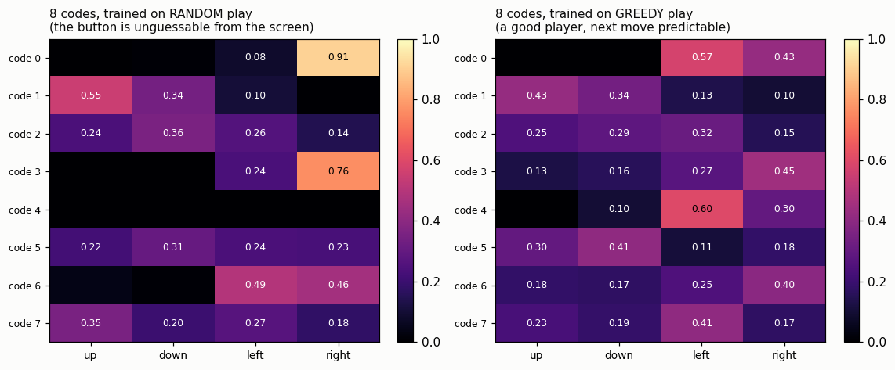
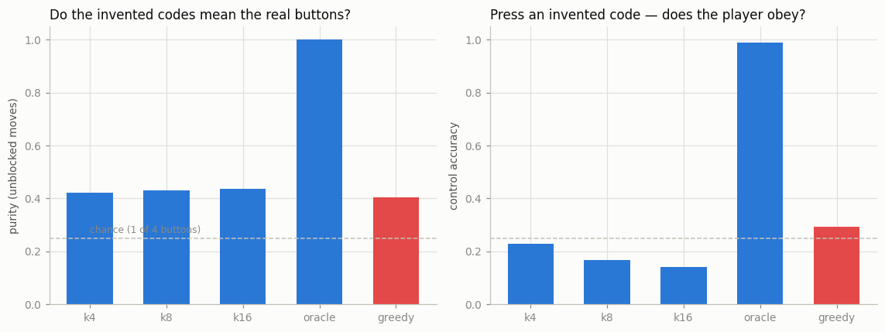
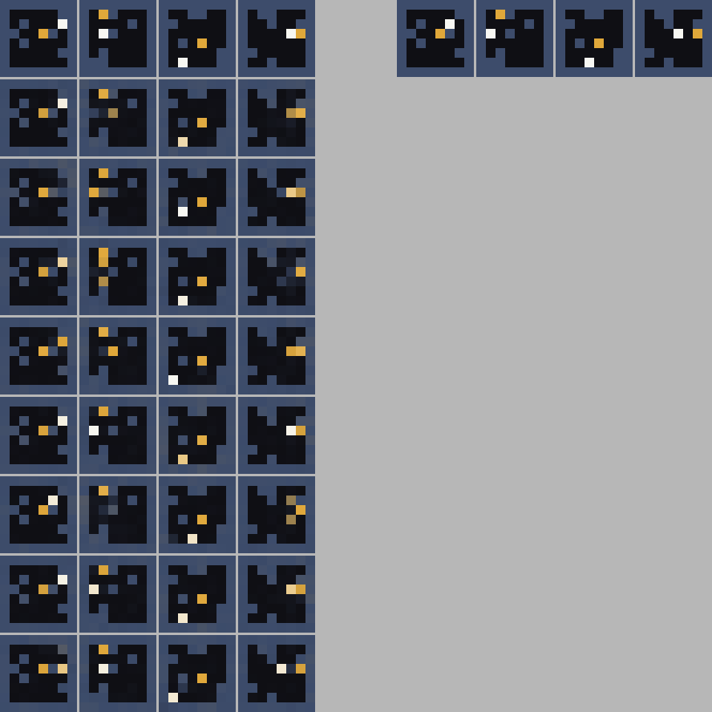

# Latent Action Inference

## Key Insight

Most [action-conditioned](/shared/glossary/#action-conditioning) models need video where every frame is tagged with the action that caused it — but the internet's billions of hours of footage carry no such labels. A [latent action model](/shared/glossary/#latent-action-model), the trick behind [Genie](/shared/glossary/#genie), sidesteps this by *inferring* the action: it learns a small [latent](/shared/glossary/#latent-space) code that best explains how one frame became the next, discovering a reusable vocabulary of "moves" with no labels at all. This project trains exactly that on unlabeled clips, then checks whether the discovered codes line up with real, meaningful actions (does code #3 always mean "move left"?). Succeed and you can build a controllable [world model](/shared/glossary/#world-model) straight from raw footage — the data bottleneck that limits everything else in this phase suddenly disappears.

## The shape of the model

```
  frame_t, frame_t+1  ──►  [encoder]  ──►  one of K codes  ──┐
                                                             ▼
  frame_t, that code  ◄──────────────────────  [decoder]  ◄──┘
                             predicts frame_t+1
```

Both halves train together on **one** loss: reconstruct `frame_t+1`. Notice
what is *not* in that loss — the action. The model is never told which button
was pressed; it has to invent a code that is worth transmitting, purely to help
the decoder.

### Why the bottleneck is the whole trick

The obvious worry: the encoder can see `frame_t+1` (it is one of its inputs), so
why not copy it straight through the code and let the decoder read it off? That
would make the model a pointless autoencoder that learned nothing about actions.

The defence is to make the code *tiny* — one symbol out of K (we use K = 4, 8,
16). A single symbol out of 8 carries 3 bits. You cannot fit a 64-cell frame
into 3 bits, so the encoder is forced to send only the *smallest* description of
the change. In this game the smallest description of a change is "which way did
the player move," so — with luck — the action falls out of the compression.

This is exactly the argument behind [VQ-VAE](/shared/glossary/#vq-vae): a narrow
discrete bottleneck keeps only what the decoder cannot already guess. The twist
here is what sits on the decoder's side: it *already has* `frame_t`, so the one
thing it cannot guess is the player's input.

## The honest engineering: two collapses before anything worked

Getting the bottleneck to carry the action took three tries, and the two
failures are more instructive than the success. Both are documented in
`lam_lib.py`.

**Collapse 1 — the encoder shrank to nothing.** The first version used the
standard [VQ-VAE](/shared/glossary/#vq-vae) recipe: encode to a vector, snap it
to the nearest code, and add a term pulling the vector toward its code. With
nothing fixing the *scale*, the cheapest way to shrink that pulling term is for
the encoder to output smaller and smaller vectors, until everything sits in one
tiny blob near the origin — all codes equally close, no information carried.
Measured: encoder outputs collapsed to a standard deviation of 0.03, and the
codes told you nothing (NMI ≈ 0.01).

**Collapse 2 — one code ate everything.** Normalising every vector to length 1
(so it lives on a sphere and cannot shrink) stopped that, but a second collapse
took its place: the model assigned *every* frame pair to a single code. Nothing
rewarded using the others, and a decoder that ignores the code still gets a
safe-but-mediocre loss by predicting the average future. This is
[codebook collapse](/shared/glossary/#codebook-collapse).

**What finally worked.** Score the K options directly (the encoder emits K
numbers), take the best with a
[straight-through estimator](/shared/glossary/#straight-through-estimator) so a
gradient still flows, and add a **usage penalty** — the gap, in
[nats](/shared/glossary/#nat), between the batch's average code distribution and
a flat one. It is zero only when all codes get used equally, so a one-code
solution is now expensive. (A fourth idea, Gumbel sampling noise, actually made
things *worse* on this toy — at a fixed noise level the decoder learns to ignore
a code it cannot trust — so it was removed. Not every trick from the papers
helps at this scale.)

## The experiment that matters: whose footage do you learn from?

Here is the result that separates "I ran the Genie recipe" from "I understand
what it needs." **A latent action model can only recover the action if the
action is not already written on the screen.** We train two ways on the same
game:

- **random play** — the recorded player presses buttons at random. Nothing on
  the screen tells you what they will do next, so the *only* way to know what
  happened is to compare the two frames. This is what a latent action model is
  for.
- **greedy play** — a skilled coin-seeker. Its next move is almost always "step
  toward the coin," which you can read off the screen without seeing the next
  frame at all.



*(each row is one invented code; each column a real button; brightness = how
often that code coincided with that button, on moves that were actually
possible.)*

On **random** play (left), the codes carry real signal. Code 0 means "right"
91% of the time; code 3 means "right" 76%; code 1 leans "up." It is not a clean
one-code-per-button dictionary, but several codes clearly latched onto a
direction. On **greedy** play (right), every code is a muddy mix — no code
exceeds 0.60 for any button.

The summary numbers say the same thing, and one of them is a trap:

| trained on | codes used | purity ↑ | NMI ↑ | control accuracy ↑ | reconstruction ↓ |
|---|---|---|---|---|---|
| random, K=4 | 4/4 | 0.42 | 0.12 | 0.23 | 0.0043 |
| random, K=8 | 7/8 | 0.43 | **0.14** | 0.17 | 0.0030 |
| random, K=16 | 11/16 | 0.44 | 0.11 | 0.14 | 0.0038 |
| **greedy, K=8** | 8/8 | 0.40 | **0.07** | 0.29 | 0.0025 |
| oracle (true button) | 4/4 | **1.00** | **1.00** | **0.99** | 0.0003 |



**Purity** is the fraction of moves you would get right if each code guessed its
single most-common button. **[NMI](/shared/glossary/#mutual-information)**
(normalised mutual information) asks a stricter question — "how many bits does
knowing the code tell you about the button?" — and, unlike purity, it punishes
*splitting one button across many codes*.

### The trap: greedy looks competitive on purity, and it is fooling you

Greedy play scores 0.40 purity — barely below random's 0.43 — and the *highest*
control accuracy of any learned arm (0.29). A quick reader would conclude greedy
data is fine.

NMI exposes the lie: greedy scores **0.07 against random's 0.14 — half**. Here is
what happened. On greedy footage the codes did not learn the *action*; they
learned the *situation* — roughly, which region of the board the player is in.
Because a greedy player's action is tightly correlated with their position ("if
the coin is to my right, I press right"), a code that secretly encodes position
will *coincide* with the right button often enough to score decent purity. But
it is not representing the button, so it carries little genuine information about
it (low NMI), and if you tried to use it as a controller it would only work in
the positions it happened to memorise.

This is the single most important lesson of the project, and it is why the real
Genie is trained on huge, diverse, largely-exploratory web video: **the action
is only recoverable to the extent it is unpredictable from the frame.** Give the
model footage of an expert and it learns to predict the expert, not to isolate
the control.

### The other honest result: even at its best, this is partial

Read the random numbers plainly. Purity 0.43 is well above the 0.25 you would
get by chance, so the codes are *real* — but they are nowhere near the oracle's
1.00. Control accuracy of 0.17 means that if you pick a code and ask the decoder
to "play" it, the player moves the code's intended direction only one time in
six.

That gap is not a bug to be tuned away in a ten-minute CPU budget; it is the
genuine difficulty of the task. Inferring a clean action vocabulary with no
labels is *hard*, which is why Genie is a landmark result and not a homework
exercise. What this project earns you is the intuition for **why** it is hard and
**what** the data has to look like for it to work at all.



*(top row: four starting frames, then their four true next frames. Rows below:
the same four starts, each driven by code 0…7. Some codes reliably nudge the
player one way; others hedge.)*

### More codes did not help

K=4, 8, and 16 all land within noise of each other on purity (0.42–0.44) and NMI
actually *falls* at K=16 (0.11). With only four real actions to explain, extra
codes get spent splitting one action across several near-synonyms — which lifts
reconstruction slightly but scatters the mutual information. The lesson matches
the tokenizer projects of Phase 5: a bottleneck should be *just* big enough for
the structure that is actually there, and no bigger.

## What's in this directory

| file | what it is |
|---|---|
| `lam_lib.py` | the encoder, the discrete bottleneck (and the two failed versions, documented), the decoder, and the purity/NMI metrics. |
| `run.py` | stages: `data`, `train`, `align`, `control`, `figures`. |
| `outputs/confusion.png` | codes-vs-buttons, random against greedy. |
| `outputs/alignment.png` | purity and control across all five arms. |
| `outputs/vocabulary.png` | every code applied to the same four frames. |
| `outputs/driven.gif` | the world driven by a hand-picked code sequence. |
| `outputs/align.csv`, `control.csv` | every number quoted above. |

## How to run

```bash
python3 run.py --stage data       # ~1 min
python3 run.py --stage train      # ~11 min  five arms
python3 run.py --stage align      # ~1 min
python3 run.py --stage control    # ~1 min
python3 run.py --stage figures    # ~1 min
```

Imports [project 40](../40-action-conditioned-video/README.md)'s `world_lib`
(the game, the renderer, the `FiLMBlock`) — code only, no weights.

## Takeaways

1. **A discrete bottleneck can invent an action vocabulary with zero labels** —
   on random play, codes recovered "right" and "up" well above chance (purity
   0.43, NMI 0.14 against a 0.25 floor).
2. **The action is only recoverable when it is *not* predictable from the
   frame.** Trained on an expert's footage the codes learned position, not
   action — a trap that inflates purity (0.40) while gutting NMI (0.07).
3. **Read NMI, not just purity.** Purity alone called greedy data "fine"; mutual
   information showed the codes carried half the information.
4. **It is genuinely hard.** Even at its best, one code drove the player its
   intended way only 1 time in 6, against the oracle's 99%. Genie is a landmark
   because this is difficult, not because the recipe is long.
5. **The bottleneck should match the real structure.** With four true actions,
   16 codes did no better than 4 and hurt NMI.
6. **Two collapses had to be beaten first** — a shrinking encoder and a
   single-code monopoly — which is why the bottleneck scores options directly
   and pays a usage penalty rather than copying VQ-VAE verbatim.
