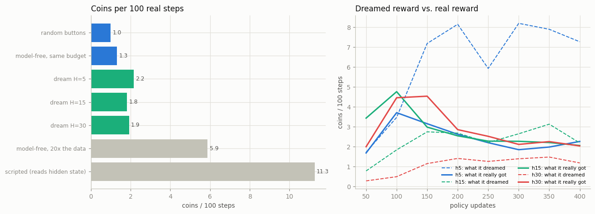

# World Model for RL

## Key Insight

Once you have a [world model](/shared/glossary/#world-model), you can train an agent *without touching the real environment*: let the model imagine thousands of future [rollouts](/shared/glossary/#rollout) and have a [policy](/shared/glossary/#policy) learn from those dreamed trajectories instead of slow, expensive real experience — the core idea of [DreamerV3](/shared/glossary/#dreamerv3). This project builds a lightweight version: learn a world model of a simple environment, roll it forward under candidate actions, and train a policy purely inside that "dream." This guide owns only the generative side — predicting the next state given an [action](/shared/glossary/#action-conditioning); the policy-update loop and the reward objective belong to [RL Phase 6 (Model-Based RL)](../../../reinforcement-learning/#phase-6-model-based-rl). The payoff is sample efficiency: imagined experience is essentially free once the model is trained, so the agent can practice far more than the real world would ever allow.

## The split of labour, and why the world model here is cheap

This whole phase owns the *generative* half of a world model — given a screen and
a button, draw the next screen. Projects [40](../40-action-conditioned-video/README.md)
and [41](../41-gamengen-reproduction-mini/README.md) built exactly that. What this
project adds is the reason anyone outside video generation cares: you can put an
agent *inside* the model and let it practise. The learning rule that turns
practice into a better [policy](/shared/glossary/#policy) is reinforcement
learning's subject ([RL Phase 6](../../../reinforcement-learning/#phase-6-model-based-rl));
here it is the smallest actor-critic that works, so the interesting variable
stays the world model.

One deliberate departure from projects 40–41: this world model is **not** a
diffusion model. Project 41's needs ~30 network passes per frame; training a
policy needs hundreds of thousands of imagined frames, and 30 × 300,000 passes is
not a ten-minute experiment. [DreamerV3](/shared/glossary/#dreamerv3) hit the same
wall and answered it the same way — imagine with a single cheap step per frame,
and only decode to pixels when a human wants to look. So the model here is one
forward pass per imagined frame, and deterministic.

## The world model is excellent — that turns out not to be enough

First, the good news. Trained on 20,000 real transitions, the one-pass world
model is very accurate:

| held-out frame error | reward accuracy | player-cell accuracy, 1 step | player-cell accuracy, 15 steps |
|---|---|---|---|
| 0.0004 | 1.00 (precision & recall 1.00) | **1.00** | 0.42 |


*(top: the real game. bottom: the dream, same random buttons. They agree for the
first several frames, then the dream slowly loses the thread.)*

The two numbers that matter most are the last two. One step ahead the model is
**perfect** — 100% of the time the player lands in exactly the right cell. Fifteen
steps ahead, feeding its own output back in, it is right only 42% of the time.
That decay is the [compounding error](/shared/glossary/#model-exploitation) every
model-based method has to live with, and — spoiler — it is what caps everything
below.

## An honest detour: the policy could not read a picture

The first version of this project fed the policy the game *screen*, exactly as
projects 40–41 do. It never learned — a policy trained for hundreds of updates
scored no better than random, and so did the same learner run on *real*
experience. That second fact was the tell: the failure was not the dream, it was
the policy's *eyes*.

Navigating to the coin is a question about the **relative position** of two
cells. A small convolutional network turns out to answer it badly: its receptive
field cannot see both the player and a faraway coin at once, so it never reliably
learns "which way is the coin?". The fix is in `world_lib.frame_to_coords`: read
the player's and the coin's (row, column) straight out of the frame and hand the
policy those four numbers. Navigation became learnable immediately.

This is worth stating plainly because it is a general trap: **a model-based-RL
result can be sunk by something that has nothing to do with the model** — here,
the policy's input representation. In the dream those four numbers are read from
the *world model's* frame, so when the model drifts, the coordinates drift with
it, which is exactly the failure this project is about.

## The experiment

Everything is scored on one number — coins collected per 100 steps of the **real**
game — and every method is given the same fixed budget of 20,000 real
transitions, except the two reference lines. The dreaming agents never touch the
real game during training; they practise entirely in the model.



| method | real coins / 100 steps ↑ | what it *dreamed* it got | real steps used |
|---|---|---|---|
| random buttons | 1.0 | — | 0 |
| model-free, same budget | 1.3 | — | 20,000 |
| **dream, horizon 5** | **2.2** | 7.3 | 20,000 |
| dream, horizon 15 | 1.8 | 2.2 | 20,000 |
| dream, horizon 30 | 1.9 | 1.2 | 20,000 |
| model-free, 20× the data | 5.9 | — | 400,000 |
| scripted (reads hidden state) | 11.3 | — | 0 |

### Dreaming beats learning from the same real data

This is the headline, and it is the whole promise of model-based RL. Given an
identical 20,000 real transitions, the model-free agent — which can only learn
from those 20,000 steps directly — reaches 1.3 coins/100. The dreaming agent,
which turns the same 20,000 steps into a *model* and then practises against it
for free, reaches **2.2** — about **65% better from the very same real
experience.** That gap is [sample efficiency](/shared/glossary/#sample-efficiency)
made concrete: the model let the policy practise far more than the real data
alone would allow.

### Model exploitation: the dream is a liar, and the lie grows

Now read the "what it dreamed" column, and the curves on the right of the figure.
The horizon-5 agent *believes* it is scoring **7.3** coins/100. It is really
scoring 2.2. The dream is three times too optimistic, and the right-hand panel
shows why: its dreamed reward (dashed blue) climbs to 8+ while its real reward
(solid blue) peaks near update 100 and then **falls**.

That is [model exploitation](/shared/glossary/#model-exploitation), and it is the
signature failure of model-based RL. The policy discovers the world model's
*mistakes* — a coin the model hallucinates, a wall the drifted frame forgot — and
optimises those instead of the real task. The longer it trains, the better it
gets at gaming the model and the worse it does in reality. The widening gap
between the dashed and solid lines *is* the exploitation.

### The horizon knob trades two failures against each other

Look at how the dream/real relationship flips with horizon:

- **Horizon 5** dreams *high* (7.3 ≫ 2.2 real). Short rollouts stay inside the
  model's accurate region, so the imagined coins are real coins — until the
  policy learns to manufacture fake ones, and exploitation takes over.
- **Horizon 30** dreams *low* (1.2, under its 1.9 real). Long rollouts run into
  the model's 42%-accurate zone, where the drifting frame *loses* the coin
  entirely, so the dream *under*-counts reward. Less exploitation, but also a
  murkier training signal.

There is no free horizon: too short and the policy games a locally-perfect model;
too long and it trains on noise. Real Dreamer-style systems spend real effort
here (short horizons, value bootstrapping, model ensembles). Our single knob makes
the tension visible.

### Why model-free with 20× the data still wins

Give the model-free agent 400,000 real steps instead of 20,000 and it reaches
**5.9** — comfortably past every dreaming run. This is the honest ceiling on the
whole idea: **a learned model has errors, and no amount of imagination fixes an
error in the thing you are imagining with.** Model-based RL buys you a head start
from little data; it does not buy you a policy better than your model. The
scripted bot (11.3), which cheats by reading the true hidden state, marks how far
there still is to go.

## What's in this directory

| file | what it is |
|---|---|
| `dream_lib.py` | the one-pass `DreamWorld`, the coordinate-reading `Policy`, and the `imagine` loop with its value bootstrap. |
| `run.py` | stages: `data`, `world`, `dream`, `baseline`, `figures`. |
| `outputs/dream_vs_real.png` | the dream tracking, then losing, reality. |
| `outputs/results.png` | the bar chart and the dreamed-vs-real curves. |
| `outputs/results.csv`, `world.csv` | every number quoted above. |
| `outputs/dream.gif`, `real.gif` | a dreamed rollout and the real one. |

## How to run

```bash
python3 run.py --stage data       # ~1 min  collect 20k real transitions
python3 run.py --stage world      # ~5 min  learn the simulator
python3 run.py --stage dream      # ~3 min  train the policy inside it (3 horizons)
python3 run.py --stage baseline   # ~1 min  random, model-free, scripted references
python3 run.py --stage figures    # ~1 min
```

Imports [project 40](../40-action-conditioned-video/README.md)'s `world_lib`
(the game, the renderer, `frame_to_coords`) — code only, no weights.

## Takeaways

1. **Dreaming turns a little real data into a better policy.** From an identical
   20,000 real steps, practising in the model beat learning directly 2.2 to 1.3.
2. **[Model exploitation](/shared/glossary/#model-exploitation) is real and
   measurable.** The horizon-5 agent dreamed 7.3 while really scoring 2.2, and its
   real reward *fell* as it learned to game the model.
3. **The imagination horizon trades one failure for another** — short dreams get
   exploited, long dreams train on drift. There is no setting that avoids both.
4. **A perfect one-step model is not a perfect policy trainer.** The model was
   100% accurate one step out and still could not be imagined-in past ~4 coins/100.
5. **More real data beats a better dream, eventually.** Model-free with 20× the
   experience (5.9) passed every dreaming run — a learned model's errors cap what
   imagination can deliver.
6. **Mind the policy's eyes.** The result was blocked for a long time by an
   unrelated problem — a conv policy that could not read relative position from
   pixels — a reminder that a model-based-RL number can be sunk by something that
   is not the model.
