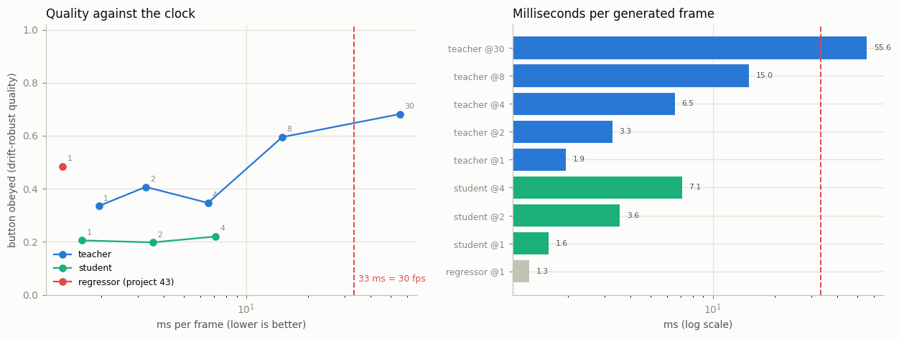
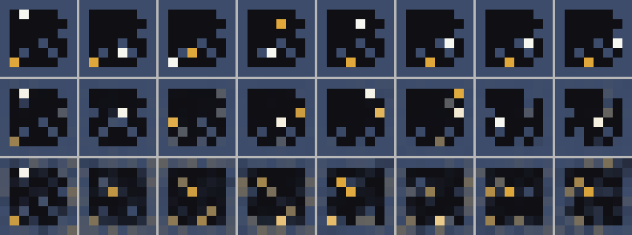

# Real-Time Latency Hunt

## Key Insight

Interactivity has a hard deadline: to feel real-time at 30 [frames per second](/shared/glossary/#frame-rate-fps) the model must produce each frame in about 33 milliseconds, yet a normal [diffusion model](/shared/glossary/#diffusion-model) needs dozens of denoising steps per frame — far too slow. This project closes that gap with [distillation](/shared/glossary/#distillation): train a fast "student" [consistency model](/shared/glossary/#consistency-model) to reproduce a slow 30-step "teacher" in just 4 steps — or even 1 — then measure the real win in milliseconds per frame. Cutting steps from 30 to 4 is a ~8× speedup, the difference between a model that renders overnight and one you can actually play. This is the same few-step toolkit behind real-time and [streaming](/shared/glossary/#streaming-video-generation) systems like [CausVid](/shared/glossary/#causvid).

## The deadline, made concrete

The teacher is project [41](../41-gamengen-reproduction-mini/README.md)'s
`aug` world model: a diffusion model that spends 30 denoising steps on each
frame. At 30 frames per second you have 1000 ÷ 30 = **33 ms** per frame for
everything — read the button, run the model, draw the result. The teacher, at
30 steps, spends **56 ms**. It misses the deadline; you cannot play it.

There are two different ways to spend fewer network passes.

1. **Just ask the teacher for fewer.** A [rectified flow](/shared/glossary/#rectified-flow)
   sampler is an [ODE](/shared/glossary/#ode) solver; running it with 4 steps
   instead of 30 is legal — merely coarser integration. Free to implement.
2. **Distil a student that needs only one.** Train a
   [consistency model](/shared/glossary/#consistency-model): compute the
   teacher's 30-step path from noise to a clean frame once, and teach a student
   that from *any* point on that path it can jump straight to the endpoint.
   "Consistency" is the property being trained in — every point on one path must
   agree about where the path ends. The student outputs the *destination*, not a
   *direction to move*, so one call is already an answer.

The interesting question is which one you should actually reach for. This
project measures both, and the answer is not the one the project title assumes.

## Quality that survives a rollout

You cannot score a 100-frame self-fed rollout by "is the player in the exact
cell the real game would be in" — after that many frames every method has
drifted away from the reference, and the number collapses to chance for teacher
and student alike, hiding the very thing we want to compare. So the quality
metric is **"button obeyed"**, borrowed from project 41: *given where the model
itself put the player last frame, did this frame move it the way the button
says?* That asks whether the game still works, and it does not punish honest
drift away from a recording.

## Results



| model & steps | ms/frame | fps | button obeyed ↑ | frame legality (snap) ↓ | draws a coin |
|---|---|---|---|---|---|
| teacher @30 | 55.6 | 18 | **0.68** | **0.007** | 0.17 |
| teacher @8 | 15.0 | 67 | 0.60 | 0.012 | 0.17 |
| teacher @4 | 6.5 | 154 | 0.35 | 0.016 | 0.07 |
| teacher @1 | 1.9 | 526 | 0.34 | 0.042 | 0.05 |
| student @4 | 7.1 | 141 | 0.22 | 0.023 | **0.64** |
| student @1 | **1.6** | **625** | 0.21 | 0.038 | 0.18 |
| regressor (project 43) | 1.3 | 769 | 0.49 | 0.016 | 0.03 |

### The latency hunt succeeds — 30× faster, into real-time

The headline the project was set to find is real: the fastest generators produce
a frame in **1.6 ms** against the teacher's 55.6 ms — a **35× speedup**, from
missing the 33 ms budget by 22 ms to clearing it with 31 ms to spare. Real-time
interactive generation is comfortably reachable on a *CPU*.

### The honest inversion: distillation was not the way to get there

Now look at *how* you get under the deadline, and the surprise appears. Compare
each generator against a teacher run at the **same step count**:

- At 1 step, the distilled student scores **0.21** button-obeyed. The teacher,
  run with a single Euler step, scores **0.34** — *higher*, at essentially the
  same speed (1.9 ms vs 1.6 ms).
- The student's 4-step sampling (0.22) barely improves on its 1-step (0.21), and
  both sit well below the teacher's own few-step numbers.

So on this task, the expensive tool lost to the free one. **Just running the
teacher with fewer steps beat distilling a student.** The reason is the property
project [40](../40-action-conditioned-video/README.md) already measured and
project [26](../26-flow-matching-from-scratch/README.md) explained: on an *easy*
target the rectified-flow path is nearly straight, so a 4-step Euler integration
is almost as accurate as a 30-step one. Teacher @8 (0.60) is within a hair of
teacher @30 (0.68) at **4× the speed** — the few-step win is nearly free, and it
leaves distillation nothing to add.

This is not distillation failing in general; it is distillation being the wrong
tool *here*. Consistency distillation pays for itself when the teacher's
few-step quality **collapses** — deep pixel-space video models where 4 steps
look like static. On a toy whose teacher already few-steps gracefully, the extra
training run buys a messier frame (student snap 0.038 vs teacher-@1 0.042 is a
wash, but its button-obeying is worse), not a better one. Reaching for the
fancy method when the simple one already works is a real and common mistake; the
measurement is what tells them apart.

### Where the student *does* win, and why it is a trap

One column bucks the trend: the student draws a coin **0.64** of the time at 4
steps, against the teacher's 0.07. That looks like a win — until you remember
what the student was trained on. It learned to reproduce the teacher's *clean
30-step endpoint*, which usually has a crisp coin, so it stamps a crisp coin
even when its own rollout has drifted somewhere a coin should not be. It is
confidently drawing coins in the wrong places, which is why its button-obeying is
low. A high number on one metric bought by ignoring another is exactly the trap
projects 40 and 42 kept surfacing.

### The regressor floor, one more time

Project 43's one-pass regressor is here as the hard speed floor: 1.3 ms, and the
*highest* button-obeying (0.49) because it is deterministic and never wastes a
step. But its "draws a coin" is **0.03** — it has mode-averaged the coin out of
existence, exactly project 40's finding. Fastest and most obedient, and it
cannot represent the one uncertain thing in the world.



*(rows: the real game, the teacher at 30 steps, the student at 1 step. The
student is faster and messier — you can see the noise it could not denoise away
in one pass.)*


*(the 1-step student, generating at 625 fps.)*

## What's in this directory

| file | what it is |
|---|---|
| `distill_lib.py` | the teacher-path sampler, the `Student` (jump-to-endpoint), and its multi-step consistency sampling. |
| `run.py` | stages: `distill`, `bench`, `figures`. |
| `outputs/latency.png` | quality-against-the-clock, and ms/frame per method. |
| `outputs/teacher_vs_student.png` | the real game, the teacher, and the 1-step student. |
| `outputs/student_1step.gif` | the fastest generator, rolled out. |
| `outputs/bench.csv`, `distill_loss.csv` | every number quoted above. |

## How to run

```bash
python3 run.py --stage distill    # ~4 min   cache teacher paths, train the student
python3 run.py --stage bench      # ~4 min   time and score everything
python3 run.py --stage figures    # ~1 min
```

Needs project [41](../41-gamengen-reproduction-mini/README.md)'s trained `aug`
teacher (run its `train` stage first) and, for the regressor floor, project
[43](../43-world-model-for-rl/README.md)'s `world` stage. Imports project
[40](../40-action-conditioned-video/README.md)'s `world_lib`.

## Takeaways

1. **The latency hunt works: 35× faster, from 56 ms to 1.6 ms**, taking
   interactive generation from impossible to comfortable on a CPU.
2. **On an easy target, distillation is not worth it.** The distilled student
   (0.21 button-obeyed at 1 step) *lost* to simply running the teacher with one
   Euler step (0.34) at the same speed.
3. **Few-step sampling is nearly free here** — teacher @8 (0.60) matched teacher
   @30 (0.68) at 4× the speed, which is exactly what leaves distillation nothing
   to add. Distillation earns its keep only when the teacher's few-step quality
   *collapses*.
4. **Reach for the simple tool first.** Turning the teacher's step count down
   costs one line; distillation costs a training run. Measure before you assume
   the fancy method wins.
5. **Speed can hide a lie.** The student "drew more coins" and the regressor
   "obeyed more buttons," each by sacrificing the other — fast wrong answers are
   still wrong.
