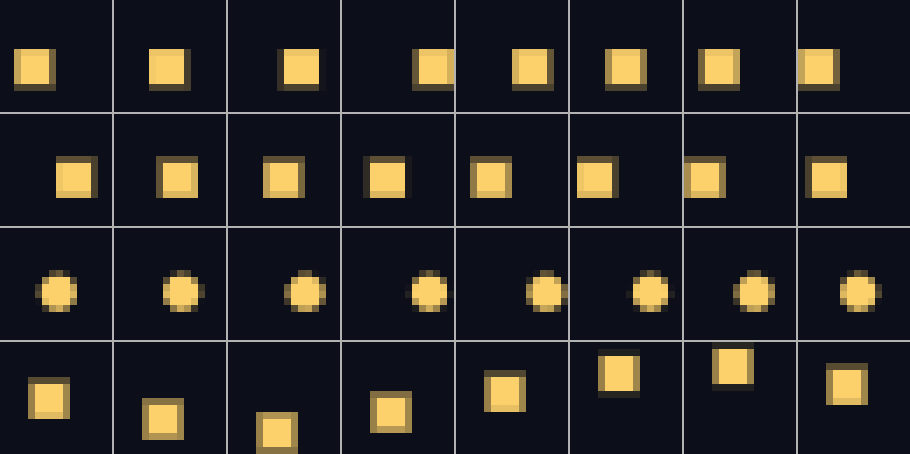
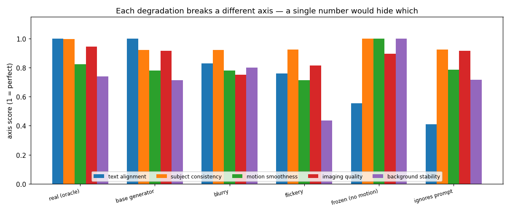
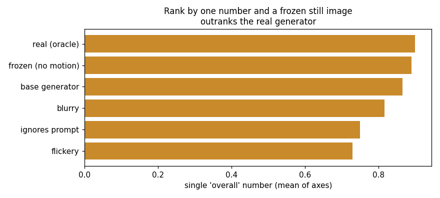
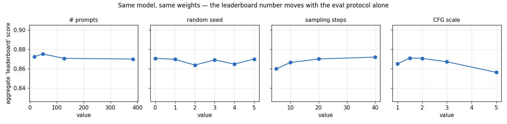
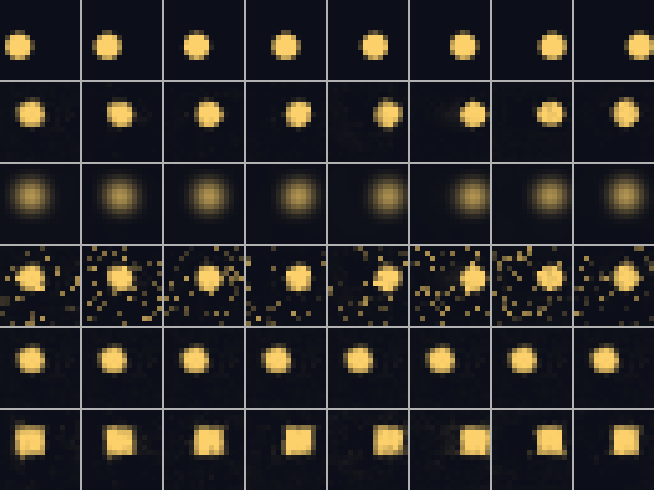
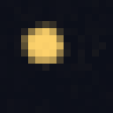

# Run VBench End to End

## Key Insight

Evaluating video generation is even harder than evaluating images, and a single number like [FVD (Fréchet Video Distance)](/shared/glossary/#fvd) correlates poorly with what people actually like. [VBench](/shared/glossary/#vbench) breaks the vague question "is this video good?" into many separate axes — subject consistency, motion smoothness, [aesthetic quality](/shared/glossary/#aesthetic-score), text alignment, and more — and scores each one, so you learn *which* aspect a model is weak at instead of getting one blurry verdict. This project runs an [open](/shared/glossary/#open-model) [text-to-video (T2V)](/shared/glossary/#t2v) model through the full VBench suite and reproduces a published [leaderboard](/shared/glossary/#leaderboard) number — which is itself a lesson in how fragile "just reproduce the benchmark" turns out to be once prompt wording, sampling settings, and clip counts all start to matter.

## Why a miniature VBench

The real VBench downloads a multi-gigabyte model and scores hundreds of prompts
on a GPU for hours. The two *lessons* it teaches do not need that scale:

1. **One number hides which axis a model fails on.**
2. **"Just reproduce the leaderboard" is fragile** — the same weights can post
   different numbers depending on how you run the eval.

We reproduce both on a 16×16 sprite toy in minutes. The toy is the shared
Phase-10 backbone (`eval_lib.py`, imported by projects 46–50); this project is
where it is introduced and where the base generator is trained.

### The toy: captioned moving-sprite clips

Every clip is 8 frames of a soft grey sprite gliding across a dark square. Three
attributes, named in the caption, decide everything:

| attribute | choices | in the clip |
|---|---|---|
| shape | ball, block | a round disk, or a square |
| direction | up, down, left, right | which way it launches |
| speed | slow, fast | pixels moved per frame |

So a caption is literally *"a fast block moving right"*. The sprite bounces off
the four walls like a ball in a squash court — a simple, checkable rule that
project [50](../50-physical-plausibility-probe/README.md) later probes.



*(four captions, one row each: "a fast block moving right", "a slow block moving
left", "a slow ball moving right", "a fast block moving down". The ball is round;
the block is square.)*

The generator is a small conditional [flow-matching](/shared/glossary/#flow-matching)
model — the [rectified-flow](/shared/glossary/#rectified-flow) recipe of project
[26](../26-flow-matching-from-scratch/README.md), steered by the caption through
[FiLM](/shared/glossary/#film) (the same idea as a [DiT](/shared/glossary/#dit)'s
[AdaLN](/shared/glossary/#adaln)), with
[classifier-free guidance](/shared/glossary/#cfg-classifier-free-guidance) at
sampling time. It reaches ~0.98 prompt-following after ~3 minutes of CPU
training.

### Why a learned embedding, not a frozen CLIP text encoder

Phase 7 fed captions through the *real, frozen* [CLIP](/shared/glossary/#clip)
and [T5](/shared/glossary/#t5) encoders because its captions were open-ended
English — it needed a model that already knew what "drifting" and "teal" mean.
Here the vocabulary is **closed**: exactly 2 × 4 × 2 = 16 possible captions. A
frozen internet-scale encoder would be pure overkill and would slow every run
with a model download. When the vocabulary is a short fixed list, the natural
encoder is a small **learned embedding table** — one trainable vector per shape,
per direction, per speed. It plays exactly CLIP's role (turn words into a
conditioning vector) without the baggage a closed vocabulary does not need. CLIP
is kept frozen to *protect* internet-scale knowledge from being damaged by video
training; a 16-word table has no such knowledge to protect, so it is trained
jointly with the generator.

## The five axes

Each axis is computed exactly from the pixels — no learned metric to hide behind:

| axis | question it asks | how we read it |
|---|---|---|
| **text alignment** | did the clip show what the caption said? | read the sprite's direction, speed, shape back out and compare |
| **subject consistency** | does the sprite keep its size/brightness? | variance of its total brightness across frames |
| **motion smoothness** | is the path smooth, or does it jitter? | second difference of the sprite centre |
| **imaging quality** | are pixels crisp, or smeared to grey? | how far pixels sit from a clean 0/1 value |
| **background stability** | does the background stay dark, or twinkle? | frame-to-frame flicker of the dark pixels |

To show the axes actually discriminate, we score a roster: the trained
generator, plus four deliberate degradations each engineered to break **one**
axis, plus a clean-render oracle.

## Results



| model | text align | subject | motion | imaging | background | overall |
|---|---|---|---|---|---|---|
| real (oracle) | 1.00 | 1.00 | 0.82 | 0.95 | 0.74 | **0.900** |
| **base generator** | **1.00** | 0.92 | 0.78 | 0.92 | 0.71 | **0.866** |
| blurry | 0.83 | 0.92 | 0.78 | **0.75** | 0.80 | 0.816 |
| flickery | 0.76 | 0.92 | 0.71 | 0.81 | **0.44** | 0.730 |
| frozen (no motion) | **0.55** | 1.00 | 1.00 | 0.89 | 1.00 | 0.890 |
| ignores prompt | **0.41** | 0.93 | 0.79 | 0.92 | 0.72 | 0.751 |

Read across the rows and every degradation lights up its own column: blur tanks
**imaging** (0.75), the flicker injection tanks **background** (0.44), the
prompt-ignoring model tanks **text alignment** (0.41). The multi-axis view names
the disease.

### The single number lies — and here is exactly how



Now collapse the five axes into one "overall" mean and rank by it, the way a
leaderboard forces you to:

**A frozen still image ranks second — above the real generator.**

Look at the frozen row. A clip that never moves is *perfectly* consistent (1.00),
*perfectly* smooth (1.00 — a motionless path has zero jitter), and its background
is *perfectly* stable (1.00 — nothing ever changes). Four of five axes reward it
for doing nothing, and the average (0.890) sails past the base generator's 0.866.
The one axis that catches it — text alignment, 0.55 — is drowned out by the
other four. This is the whole argument for reporting axes, not an average: a
motionless image is obviously broken, and the single number cannot see it.

### Reproduction is fragile: the same weights, a moving number



Here we freeze the model completely and change *only the eval protocol*:

- **Number of prompts:** 0.870 → 0.875 (small-sample noise in the estimate).
- **Random seed:** 0.864 → 0.871 — a spread of 0.007 from luck alone.
- **Sampling steps:** 0.860 at 5 steps → 0.872 at 40 (fewer steps, blurrier
  clips, lower imaging).
- **[CFG](/shared/glossary/#cfg-classifier-free-guidance) scale:** peaks near
  1.5–2.0 (0.871) and *falls* to 0.856 at scale 5.0, where over-guidance
  oversaturates the pixels.

Across all these knobs the same model posts anything from **0.856 to 0.875**.
That ~0.02 swing is **as large as the gap between the base generator (0.866) and
the broken frozen model (0.890)**. On a real VBench leaderboard, where entries
are often separated by less than a point, a protocol difference this size would
reorder the board. "Reproduce the number" is not one number — it is a number
*plus* the exact prompts, seed, step count, and guidance scale, and papers that
omit those cannot be reproduced.



*(one frame-strip per roster model, top to bottom: oracle, base generator,
blurry, flickery, frozen, ignores-prompt.)*

  

*(base generator; the frozen model that scored 0.89; the flickery one.)*

## What's in this directory

| file | what it is |
|---|---|
| `eval_lib.py` | the shared Phase-10 backbone: toy, generator, and all five axes. Imported by 46–50. |
| `run.py` | stages: `train`, `bench`, `fragility`, `figures`. |
| `outputs/axes.png` | per-axis scores for every roster model. |
| `outputs/single_number.png` | the overall-mean ranking where a still image wins. |
| `outputs/fragility.png` | the same model's score under four eval-protocol knobs. |
| `outputs/bench.csv`, `fragility.csv`, `train_loss.csv` | every number quoted here. |

## How to run

```bash
python3 run.py --stage train      # ~3 min   train + save the shared generator
python3 run.py --stage bench      # ~1 min   score the roster on all five axes
python3 run.py --stage fragility  # ~2 min   wobble the eval protocol
python3 run.py --stage figures    # ~20 s
```

The `train` stage saves `checkpoints/base.pt`, which projects
[48](../48-consistency-model-distillation/README.md),
[49](../49-watermarking/README.md) and
[50](../50-physical-plausibility-probe/README.md) load. Run it first.

## Takeaways

1. **One number hides which axis fails.** Each degradation broke exactly one of
   the five axes; the multi-axis view named it, the average did not.
2. **The average can be gamed by doing nothing.** A frozen still image scored
   0.89 overall — second place — because four of five axes reward stillness. This
   is not a toy artifact: motion-smoothness and consistency metrics genuinely
   favour low-motion video, which is why VBench is read axis-by-axis.
3. **A leaderboard number is a number *plus a protocol*.** The same weights
   posted 0.856–0.875 depending on seed, step count, prompt set, and guidance
   scale — a swing as big as the gap between a real model and a broken one.
4. **Report failures and settings honestly.** Reproducibility here means
   publishing the prompts, seed, sampler, steps, and CFG — not just the score.
5. This toy and its axes are the measuring stick for the rest of Phase 10.
