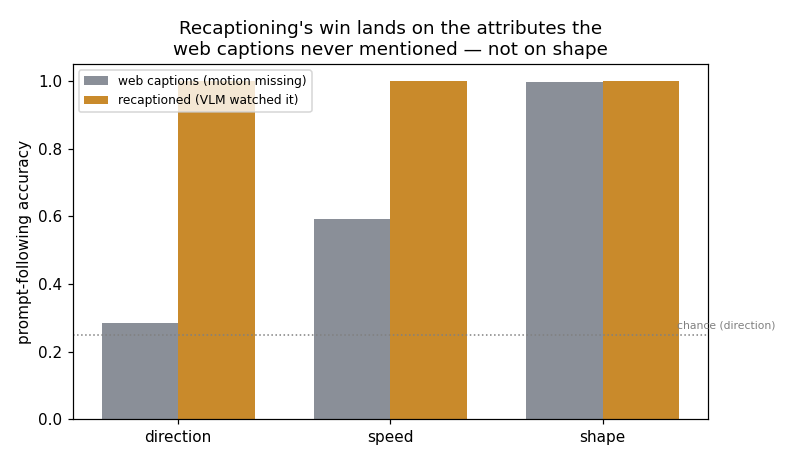
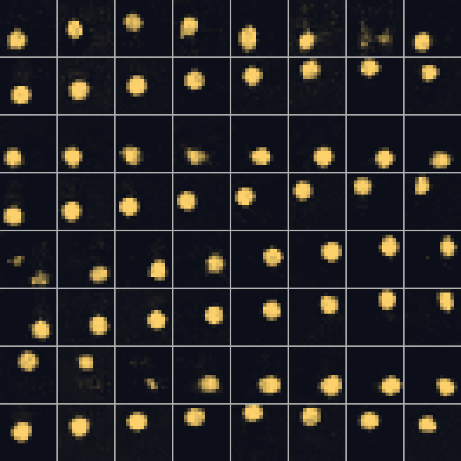

# Recaption a Dataset

## Key Insight

Most public video ships with terrible labels — keyword spam, bare filenames, or [alt-text](/shared/glossary/#alt-text) that has nothing to do with the footage — and a generator can only learn the words-to-pixels mapping that its captions actually teach. Recaptioning replaces those with fresh, detailed descriptions written by a [VLM](/shared/glossary/#vlm) that actually watches each clip (these rewrites are called [synthetic captions](/shared/glossary/#synthetic-captions)), and it is widely considered the single highest-leverage change you can make to a video-training pipeline. This project recaptions 100k clips, trains a small [text-to-video (T2V)](/shared/glossary/#t2v) model on the original captions versus the rewritten ones, and measures the gap in how faithfully each follows a prompt — usually a large, cheap win for the same model and data.

## The one thing that changes: the words

Recaptioning does not touch a single training pixel. It rewrites the **labels**.
So we train two generators on the *exact same clips* and change only the caption
each clip is paired with. Whatever differs between the two models must come from
the captions — which is what makes the comparison clean.

We reuse project [45](../45-run-vbench-end-to-end/README.md)'s sprite toy and its
generator. Each clip truly contains a shape, a direction, and a speed. The two
captioners describe those clips very differently:

| captioner | shape | direction | speed |
|---|---|---|---|
| **web** (realistic bad labels) | always named | named only 15% of the time (and wrong on half of those) | named 10% of the time |
| **recaptioned** (a VLM watched it) | always correct | always correct | always correct |

Why this split, and not just "random noise"? Because it mirrors reality. A
YouTube description or [alt-text](/shared/glossary/#alt-text) almost always names
the *object* ("a ball", "a car") — that is what a caption is *for* — but it
rarely records the *motion* ("moving left, slowly"). Motion is exactly the thing
a video model most needs to be taught and exactly the thing web text most often
omits. When an attribute is left "unknown" in the caption, the model never gets a
signal linking that word to the pixels, so it cannot learn to obey it.

### Why the missing attribute collapses to *chance*, not just "worse"

If a caption never says which way the sprite goes, the model still sees clips
going every which way — it just has no *label* to attach the motion to. So it
learns to generate *some* plausible motion, uncorrelated with the (absent)
direction word. When you then test "did it go the way the prompt asked?", the
answer is right only by luck: with four directions, that is **25%**. A missing
caption attribute does not make the model a little worse at that attribute — it
makes it *random* at it.

## Results



| captions | direction | speed | shape | mean |
|---|---|---|---|---|
| web (motion missing) | **0.28** | 0.59 | 1.00 | 0.62 |
| recaptioned (VLM watched it) | **1.00** | **1.00** | 1.00 | **1.00** |

Three things worth reading carefully:

- **Direction went from 0.28 to 1.00.** The web model sits at *chance* (0.25) —
  proof it learned essentially nothing about direction, because its captions
  almost never mentioned direction. Recaptioning did not "improve" direction; it
  *created* the ability from nothing.
- **Speed went from 0.59 to 1.00.** Web captions named speed only 10% of the
  time, so the model got a weak, partial signal — better than chance (there are
  only two speeds) but far from reliable.
- **Shape stayed at 1.00 for both.** This is the control. Web captions *always*
  named the shape, so there was nothing for recaptioning to add — and indeed it
  added nothing. **The win lands precisely on the attributes the web captions
  were missing, and nowhere else.** That is the signature of a real effect, not a
  lucky training run: a change to captions moved exactly the attributes those
  captions changed.



*(four prompts, each shown as web-caption model (odd rows) then recaptioned model
(even rows). The recaptioned rows glide cleanly in the requested direction; the
web rows wander, because the word for "which way" was never in their training
captions.)*

 

*(same prompt — a clear direction — from the web-caption model and the
recaptioned model.)*

## Why this is "the single highest-leverage data trick"

Note what recaptioning cost here: **zero** new video, zero architecture changes,
zero extra training steps. The two models are identical in every way except the
text file that names their clips. Yet mean prompt-following went from 0.62 to
1.00. In a real pipeline the numbers are less extreme, but the shape is the same:
web video is full of motion, colour, and camera moves that the captions never
mention, so a model trained on raw web captions is *starved of labels for exactly
the things video generation is about*. A [VLM](/shared/glossary/#vlm) that watches
each clip and writes those things down is the cheapest large gain available —
which is why every serious open pipeline (Panda-70M, Movie Gen, the CogVideoX and
Hunyuan recipes) recaptions before training.

## What's in this directory

| file | what it is |
|---|---|
| `run.py` | stages: `train` (two models), `eval`, `figures`. Imports project 45's `eval_lib`. |
| `outputs/recaption_gain.png` | per-attribute prompt-following, web vs recaptioned. |
| `outputs/web_vs_recap.png` | same-prompt clips from both models. |
| `outputs/eval.csv` | the numbers above. |

## How to run

```bash
python3 run.py --stage train   # ~7 min   train the web-caption and recaptioned models
python3 run.py --stage eval    # ~1 min   per-attribute prompt-following for both
python3 run.py --stage figures # ~15 s
```

Needs project [45](../45-run-vbench-end-to-end/README.md)'s `eval_lib.py` (on the
import path automatically). Trains its own two models; no shared checkpoint
required.

## Takeaways

1. **Recaptioning changes labels, not pixels — and that alone doubled prompt
   following** (mean 0.62 → 1.00) with the same clips and the same model.
2. **A missing caption attribute is not "weaker", it is *random*.** Direction
   sat at chance (0.28 ≈ 0.25) for the web model because its captions never named
   direction.
3. **The gain is targeted.** It appeared on direction and speed (which web
   captions dropped) and *not* on shape (which they kept) — the fingerprint of a
   causal effect, not noise.
4. **Web captions omit exactly what video models need most:** motion. That is why
   recaptioning is the highest-leverage single change in a real training
   pipeline.
