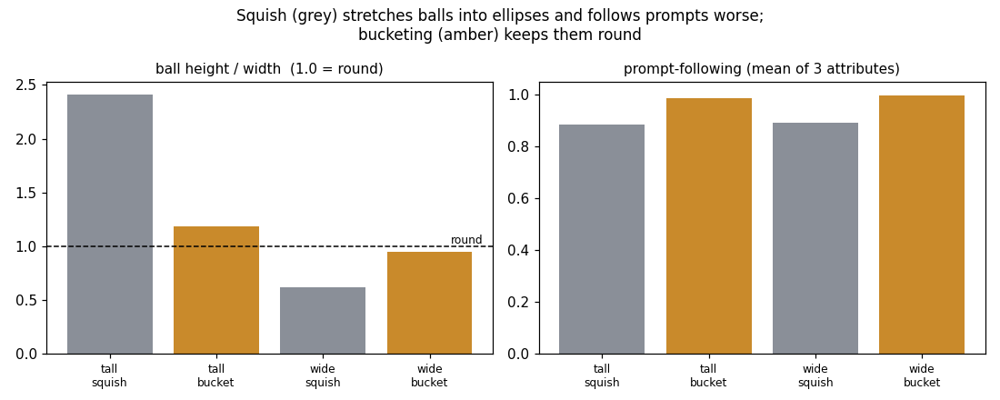
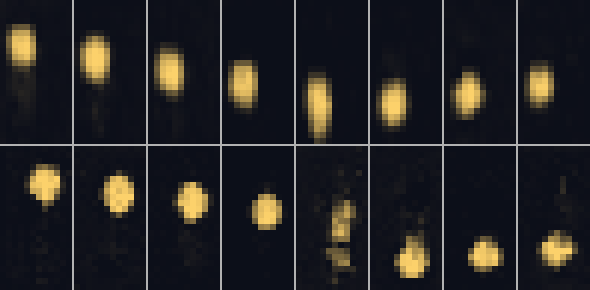
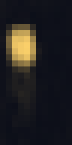
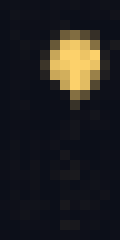
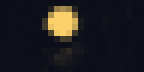

# Aspect-Ratio Bucketing

## Key Insight

A batch of training clips must be a single [tensor](/shared/glossary/#tensor) of one [shape](/shared/glossary/#shape), so the lazy fix is to crop everything to a square — which slices the edges off tall phone videos and wide cinematic shots, teaching the model to frame only squares. [Aspect-ratio bucketing](/shared/glossary/#aspect-ratio-bucketing) instead sorts clips by their shape into a handful of buckets (tall, wide, square) and builds each [batch](/shared/glossary/#batch) from a single bucket, so nothing gets cropped and the model learns to generate at many shapes at once. This project implements bucketed batching and shows the quality jump on portrait and widescreen test prompts — the groundwork for [variable-resolution](/shared/glossary/#variable-resolution) inference, where one trained model can output any aspect ratio on demand.

## The batching problem, and two ways out

A training [batch](/shared/glossary/#batch) has to be one [tensor](/shared/glossary/#tensor)
of one [shape](/shared/glossary/#shape) — you cannot stack a tall clip and a wide
clip into the same array. So a dataset of mixed aspect ratios forces a choice.
This project compares the two real options head to head:

- **squish** — resize *every* clip to one square shape (16×16), so all the
  squares batch together. At inference, to make a tall clip, generate a 16×16
  square and stretch it back to the target aspect. Simple, and wrong in a
  specific way.
- **bucket** — sort clips into buckets by shape (tall 24×12, wide 12×24, square
  16×16) and build each batch from *one* bucket. Now every batch is naturally one
  tensor shape, and **nothing is ever resized**. The model sees, and learns to
  generate, each true aspect ratio.

We train one generator each way on the same clips and test both on tall (24×12)
and wide (12×24) prompts.

### Why "squish" is worse than it sounds

Stretching is not a harmless preprocessing step — it *teaches the model a lie*.
When you squish a tall 24×12 clip down to 16×16, a round ball gets squashed into
a wide ellipse. The squish model therefore learns that "ball" means "ellipse this
particular shape", because that is all it ever saw. Then at inference you stretch
its square output back out to 24×12 and the distortion compounds: the ball comes
out **taller than it is wide**. Bucketing never introduces the lie in the first
place.

## Results



| test aspect | model | ball height/width (1.0 = round) | prompt following |
|---|---|---|---|
| tall (24×12) | squish | **2.41** | 0.89 |
| tall (24×12) | **bucket** | **1.18** | **0.99** |
| wide (12×24) | squish | **0.61** | 0.89 |
| wide (12×24) | **bucket** | **0.95** | **1.00** |

Two things happened, both bad for squish:

- **The balls are visibly distorted.** On a tall frame the squish model's ball
  measures **2.41× taller than it is wide** — a stretched pill, not a ball. On a
  wide frame it is **0.61** (flattened). The bucketed model stays near round
  (1.18 and 0.95). This is the stretch-back-out distortion, measured directly.
- **It follows the prompt worse (0.89 vs ~1.00).** Part of that is the shape
  attribute itself: a badly-stretched ball starts reading as a block, so the
  model's "ball vs block" score drops. Distortion does not just look bad — it
  corrupts the content the caption asked for.



*(a tall prompt. Top row: the squish model — vertically stretched pills. Bottom
row: the bucketed model — round balls. Same prompt, same training clips, only the
batching strategy differs.)*

  &nbsp;&nbsp;  

*(left pair: tall squish (stretched) vs tall bucket (round). right pair: wide
squish (flattened) vs wide bucket (round).)*

## Why this is the groundwork for variable-resolution inference

The bucketed model was trained on three shapes at once and can generate any of
them correctly on demand — that is exactly [variable-resolution](/shared/glossary/#variable-resolution)
generation, the trick [Sora](/shared/glossary/#sora) highlighted. It works
because the model's body is fully convolutional: it has no hard-wired image size,
so once it has *seen* tall and wide clips during training, it can produce them.
The squish model, by contrast, only ever learned one shape, so "portrait output"
for it is just "square output, stretched" — and stretching is precisely where the
quality goes. Bucketing is the cheap change (group your batches by shape) that
unlocks the expensive-sounding capability (one model, every aspect ratio).

## What's in this directory

| file | what it is |
|---|---|
| `run.py` | stages: `train` (both models, with the bucketed and squish batchers), `eval`, `figures`. Imports project 45's `eval_lib`. |
| `outputs/bucketing.png` | ball aspect ratio and prompt-following, both models, both test aspects. |
| `outputs/tall_squish_vs_bucket.png` | stretched pills vs round balls on a tall prompt. |
| `outputs/eval.csv` | the numbers above. |

## How to run

```bash
python3 run.py --stage train   # ~7 min   train the squish and bucketed models
python3 run.py --stage eval    # ~1 min   score both on tall + wide prompts
python3 run.py --stage figures # ~15 s
```

Trains its own two models (no shared checkpoint needed); imports project
[45](../45-run-vbench-end-to-end/README.md)'s `eval_lib.py`.

## Takeaways

1. **Bucketing is just "batch by shape".** Group same-shape clips together and
   every batch is one tensor with no resizing — the whole implementation.
2. **Squishing teaches a distortion.** The squish model's tall ball came out
   2.41× taller than wide, its wide ball 0.61× — because stretching to a square
   for training, then stretching back for output, compounds.
3. **Distortion corrupts content, not just looks.** Squish's prompt-following
   fell to 0.89 (vs ~1.00 for bucketing), partly because stretched balls stop
   reading as balls.
4. **Bucketing is the on-ramp to variable-resolution inference** — one model that
   outputs any aspect ratio, which only works because it *trained* on more than
   one.
