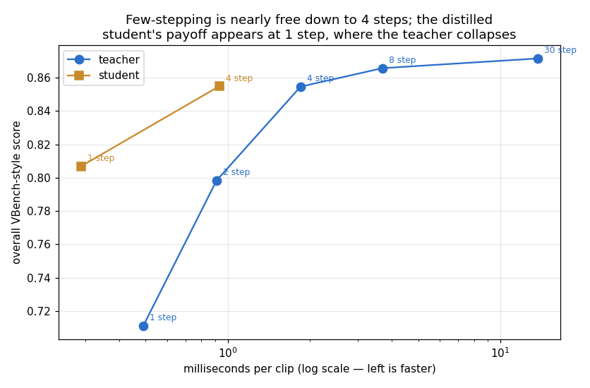
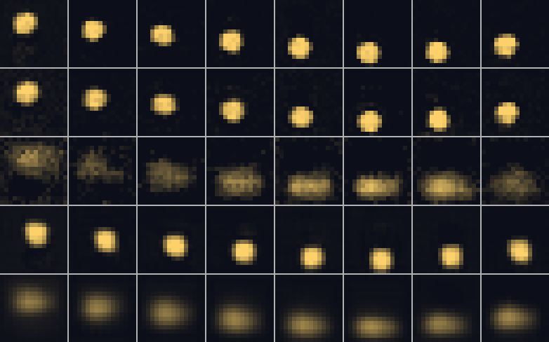

# Consistency-Model Distillation

## Key Insight

A [diffusion model](/shared/glossary/#diffusion-model) needs around 50 denoising steps to produce a clip, which is far too slow for production use; [distillation](/shared/glossary/#distillation) trains a fast "student" to reproduce that 50-step "teacher" in only about 4 steps. A [consistency model](/shared/glossary/#consistency-model) is the student design that makes this possible: it is trained so that *every* point along the noisy-to-clean denoising path points straight at the same finished clip, so one or a few jumps replace the long walk. This project performs that distillation and measures the bargain directly — the speed you gain (50 ÷ 4 ≈ 12× fewer steps) against the quality you lose. Where the [real-time latency hunt](../44-real-time-latency-hunt/README.md) project chases raw milliseconds-per-frame for interactivity, this one zeroes in on the speed-versus-quality trade of the distillation step itself.

## Teacher, student, and what "consistency" means

The teacher is project [45](../45-run-vbench-end-to-end/README.md)'s generator, a
30-step [rectified-flow](/shared/glossary/#rectified-flow) model: to make one clip
it walks from noise to clean in ~30 small steps, each one a network call.

The student has the *same body* but is trained to do a different job:

- A rectified-flow teacher outputs a **direction to move** (a velocity). One call
  gives you a nudge, not an answer — you have to keep walking.
- The consistency student outputs the **destination** — the clean clip it thinks
  this noisy input will become. It is trained so that from *any* point on the
  teacher's noise→clean path, it names the *same* endpoint. That agreement is the
  "consistency" the name refers to. If every point on a path agrees where the
  path ends, then one look is already an answer, and you can skip the walk.

We distil by generating a pile of teacher clips, then teaching the student: given
a noisy version of a teacher clip at any noise level, predict the clean clip. At
inference the student can run in 1 step (noise → clip in a single call) or a few
steps (name a clip, add a little fresh noise, name again — each pass cleans up the
last).

## Results



| model & steps | ms/clip | text align | sharpness | overall |
|---|---|---|---|---|
| teacher @30 | 13.7 | 1.00 | 0.92 | **0.87** |
| teacher @8 | 3.7 | 1.00 | 0.91 | **0.87** |
| teacher @4 | 1.8 | 0.99 | 0.89 | 0.85 |
| teacher @2 | 0.9 | 0.93 | 0.85 | 0.80 |
| teacher @1 | 0.5 | 0.71 | 0.69 | **0.71** |
| student @4 | 0.9 | 0.92 | 0.88 | 0.85 |
| student @1 | 0.3 | 0.83 | 0.71 | **0.81** |

### First: few-stepping is nearly free — down to a point

Look at the teacher rows from 30 steps down to 4: the overall score barely
moves (0.87 → 0.87 → 0.85) while the cost drops **7×** (13.7 → 1.8 ms). This is
the same thing projects [26](../26-flow-matching-from-scratch/README.md) and
[44](../44-real-time-latency-hunt/README.md) found: a rectified-flow path is
nearly straight, so a coarse 4-step integration lands almost where the fine
30-step one did. On an easy target, you get most of the speedup for free just by
asking the teacher for fewer steps — no distillation required.

Then it falls off a cliff. At 2 steps the score dips to 0.80; at **1 step the
teacher collapses to 0.71** — a single Euler step is too coarse to reach a clean
clip, so text-alignment craters (1.00 → 0.71) and the image smears (sharpness
0.69).

### Where the student earns its keep: the 1-step regime

Now compare the student to the teacher *at the same step count*:

- **At 1 step, the student wins decisively: 0.81 vs the teacher's 0.71**
  (alignment 0.83 vs 0.71). This is exactly the regime where plain few-stepping
  broke. The student was trained to name the clean endpoint in one shot, so it
  does not care that a single straight-line step cannot get there — it does not
  *take* a step, it jumps to the destination. That is the whole point of a
  consistency model, and here it shows up precisely where the teacher's own
  1-step quality fell apart.
- **At 4 steps the two tie on quality (both 0.85)** — but the student gets there
  in half the time (0.9 vs 1.8 ms), because the teacher pays for
  [classifier-free guidance](/shared/glossary/#cfg-classifier-free-guidance) with
  *two* network calls per step while the student uses one.

### Reconciling with project 44 — the result is teacher-dependent

Project 44 distilled a consistency student too, and there the student **lost** to
simply running the teacher with fewer steps. Here it **wins** at 1 step. Both
results are honest, and the difference is the whole lesson:

- In project 44 the teacher's own 1-step quality was still usable, so few-stepping
  already covered the fast regime and left distillation nothing to add.
- Here *this* teacher's 1-step quality **collapses** (0.87 → 0.71). Consistency
  distillation pays for itself exactly when the teacher's few-step quality
  collapses — and that is a property of the *teacher and task*, not a universal
  verdict on distillation.

So the rule is not "distillation always wins" or "always loses". It is: **measure
the teacher's few-step curve first. Distillation buys you the regime the teacher
cannot reach on its own** — the deep, 1-step, real-time end. Where the teacher
few-steps gracefully, skip it.



*(rows: teacher @30, teacher @4, teacher @1, student @4, student @1. Notice the
teacher's 1-step row is smeared, while the student's 1-step row still reads as a
clean sprite.)*


*(the 1-step student — one network call per clip, ~0.3 ms.)*

## What's in this directory

| file | what it is |
|---|---|
| `run.py` | stages: `cache` (teacher clips), `distill`, `bench`, `figures`. Imports project 45's `eval_lib`. |
| `outputs/speed_quality.png` | overall score vs ms/clip for teacher (5 step counts) and student (2). |
| `outputs/teacher_vs_student.png` | frame strips across step counts. |
| `outputs/bench.csv`, `distill_loss.csv` | every number quoted here. |

## How to run

```bash
python3 run.py --stage cache    # ~1.5 min  generate teacher clips to distil against
python3 run.py --stage distill  # ~3 min    train the 1-step student
python3 run.py --stage bench    # ~1 min    time + score teacher @5 steps, student @2
python3 run.py --stage figures  # ~15 s
```

Needs project [45](../45-run-vbench-end-to-end/README.md)'s trained `base.pt` (run
its `train` stage first) as the teacher.

## Takeaways

1. **Few-stepping is nearly free down to ~4 steps** (0.87 → 0.85 for a 7×
   speedup), because a rectified-flow path is almost straight.
2. **The teacher collapses at 1 step** (0.71): a single straight-line step is too
   coarse to reach a clean clip.
3. **The distilled student wins exactly there** (0.81 at 1 step), because it jumps
   to the destination instead of stepping toward it.
4. **Distillation's value is teacher-dependent.** It won here and lost in project
   44 — because it earns its keep only where the teacher's *own* few-step quality
   collapses. Measure that curve before deciding.
