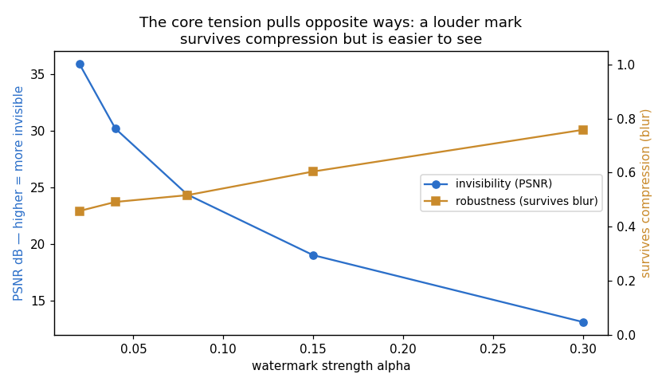
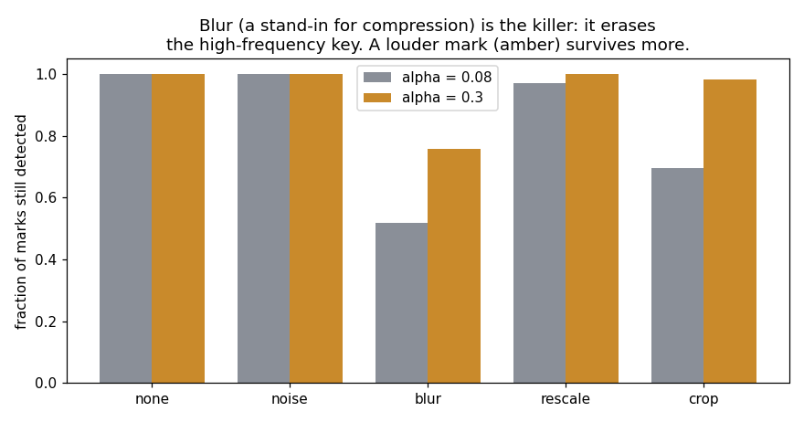
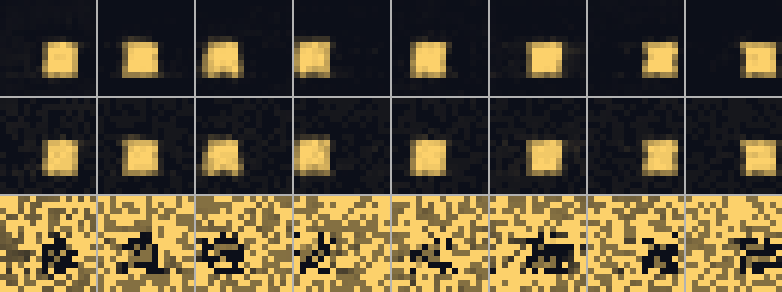

# Watermarking

## Key Insight

As AI video becomes hard to tell apart from real footage, being able to prove a clip was machine-made matters for fighting [deepfakes](/shared/glossary/#deepfake) and misinformation. [Watermarking](/shared/glossary/#watermarking) hides an invisible, machine-detectable signal inside the output — either stamped into the pixels after generation or baked into the model's own sampling, the way [SynthID](/shared/glossary/#synthid) does — that a matching detector can later read back out without the mark ever being visible to a human. This project adds such a watermark to a model's outputs and verifies that a detector flags them while leaving real footage unflagged, confronting the core tension head-on: a mark strong enough to survive cropping and compression is harder to keep imperceptible.

## The mark: a spread-spectrum watermark

We use a [spread-spectrum watermark](/shared/glossary/#spread-spectrum-watermark).
Fix one secret pattern of +1/−1 noise — the **key** — the size of a whole clip,
and add a faint copy of it to every generated clip:

```
watermarked = clip + alpha · key        (then clipped back to [0, 1])
```

"Spread-spectrum" because the one-bit message — *"this clip is watermarked"* — is
spread thinly across thousands of pixels. Each pixel is nudged by an amount too
small to see, but a detector that correlates the whole clip against the key adds
those thousands of tiny nudges back into a clear signal. Real footage, which has
no relationship to the secret key, sums to near zero.

### Why the detector high-passes first (isn't the correlation enough?)

The sprite itself is a big, bright, low-frequency blob. If we correlated the raw
clip against the key, that blob would add its own large, random contribution and
swamp the faint mark. So the detector first **high-passes** the clip — subtracts a
blurred copy, leaving only fine detail — because the key *is* fine detail. This
is not redundant with the correlation; it removes the one thing that would drown
the correlation out. It is the same reason you tune a radio to the carrier
frequency before listening: strip away everything that is not where your signal
lives.

## Results

### The clean channel: even a whisper is heard



| alpha | PSNR (dB) | detected (clean) | false alarm | survives compression |
|---|---|---|---|---|
| 0.02 | **35.9** | 1.00 | 0.00 | 0.46 |
| 0.04 | 30.2 | 1.00 | 0.00 | 0.49 |
| 0.08 | 24.4 | 1.00 | 0.00 | 0.52 |
| 0.15 | 19.1 | 1.00 | 0.00 | 0.60 |
| 0.30 | **13.1** | 1.00 | 0.00 | **0.76** |

On an untouched clip the mark is trivial to detect at *every* strength — even the
faintest (alpha 0.02, [PSNR](/shared/glossary/#psnr) 35.9 dB, essentially
invisible) is caught 100% of the time with zero false alarms on real footage.
That is spread-spectrum working as designed: thousands of tiny nudges add up.

So on a clean channel, invisibility is free. The tension only appears when someone
*touches* the clip.

### The attack that matters: compression erases the mark



| attack | survives @ alpha 0.08 | survives @ alpha 0.30 |
|---|---|---|
| none | 1.00 | 1.00 |
| additive noise | 1.00 | 1.00 |
| **blur (compression)** | **0.52** | **0.76** |
| rescale (16→8→16) | 0.97 | 1.00 |
| crop + resize | 0.70 | 0.98 |

The killer is **blur** — our stand-in for what a video codec does. The key lives
in high-frequency detail, and compression is a low-pass filter: it throws away
exactly the fine detail the mark is written in. At the near-invisible strength
(alpha 0.08) blur knocks detection down to **0.52 — a coin flip**. Additive noise,
by contrast, barely dents it, because noise does not systematically remove the
key, it just adds more grass for the correlator to see through.

This is the whole trade-off, made concrete:

- **Turn the mark up** (alpha 0.30) and it survives compression far better
  (0.76) — but PSNR falls to 13 dB and the speckle becomes visible to a human.
- **Turn it down** (alpha 0.02) and it is perfectly invisible — but a single pass
  through a video codec would wash it away.

There is no free lunch. Robustness and invisibility pull in opposite directions,
and every real watermarking system lives somewhere on this curve.



*(top: a clean clip. middle: the same clip watermarked at alpha 0.04 — look hard
and the background has a faint speckle, but it reads as identical. bottom: the
difference, amplified ×6, revealing the hidden random key pattern that the
detector reads.)*

### Why SynthID bakes the mark into sampling instead

The blur result is exactly why production systems like
[SynthID](/shared/glossary/#synthid) do **not** add high-frequency noise after
the fact. They steer the model's *own sampling* so the watermark lives in the
*content* — the shapes and textures the model would draw anyway — rather than in
fragile high frequencies. A mark carried by the content survives compression
because compression is designed to *preserve* content. Our pixel-space
spread-spectrum mark is the simple, teachable version; its failure under blur is
the motivation for the fancier approach.

## What's in this directory

| file | what it is |
|---|---|
| `run.py` | stages: `embed`, `attack`, `figures`. Imports project 45's `eval_lib`. |
| `outputs/tradeoff.png` | invisibility (PSNR) vs robustness (survives blur) as strength grows. |
| `outputs/attacks.png` | detection survival under noise, blur, rescale, crop. |
| `outputs/visual.png` | clean, watermarked, and the amplified hidden pattern. |
| `outputs/embed.csv`, `attack.csv` | every number quoted here. |

## How to run

```bash
python3 run.py --stage embed    # ~1 min   watermark at 5 strengths, detect
python3 run.py --stage attack   # ~1 min   test survival under 4 attacks
python3 run.py --stage figures  # ~15 s
```

Needs project [45](../45-run-vbench-end-to-end/README.md)'s trained `base.pt`
(run its `train` stage first) — the watermark is added to *that* generator's
outputs, with fresh renders standing in for real footage.

## Takeaways

1. **Spread-spectrum works because it adds up.** A whisper-quiet mark (PSNR 36
   dB, invisible) is detected 100% of the time on a clean clip — thousands of
   sub-visible nudges correlate into a clear signal.
2. **Zero false alarms on real footage.** Uncorrelated content scores near zero,
   so the detector never flags genuine clips.
3. **Compression is the enemy.** Blur (a codec stand-in) low-passes away the
   high-frequency key, dropping detection to a coin flip at invisible strength.
   Not all attacks are equal — additive noise barely mattered.
4. **Robustness vs invisibility is a genuine trade-off, not a bug to fix.**
   Louder marks survive compression but become visible; there is no setting that
   is both perfectly hidden and codec-proof.
5. **That trade-off is why real systems (SynthID) put the mark in the content,**
   via sampling, instead of stamping high-frequency noise onto finished pixels.
