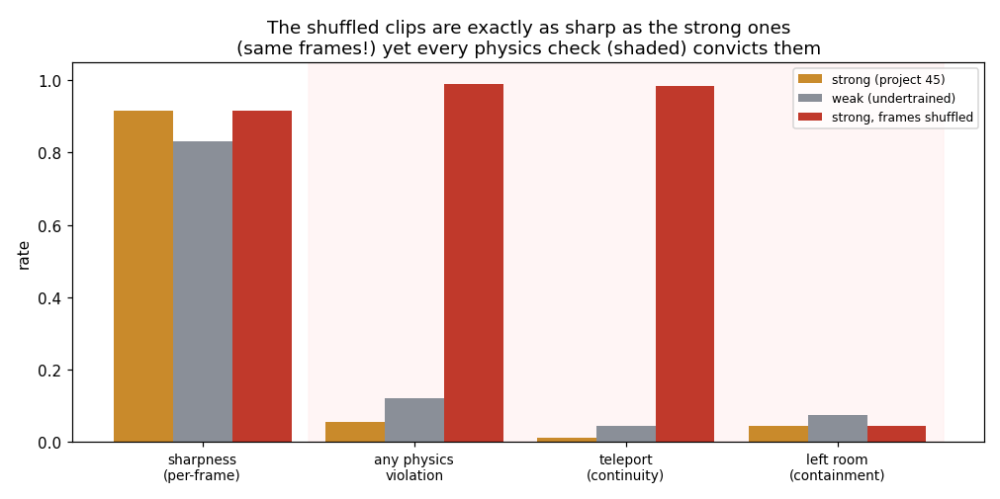
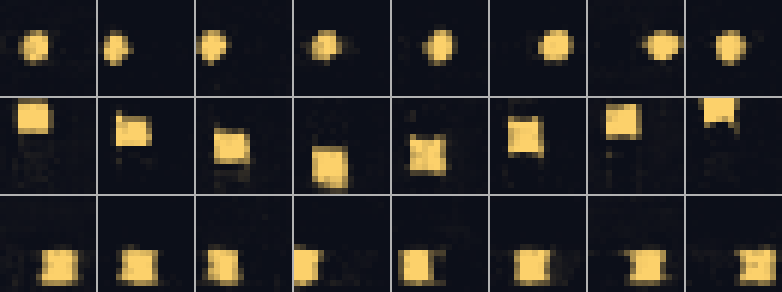
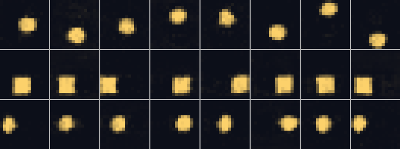
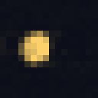
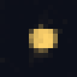
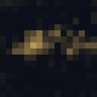

# Physical-Plausibility Probe

## Key Insight

A generated video can look gorgeous frame-by-frame yet quietly break the rules of the physical world — water flowing uphill, a dropped ball hovering in mid-air, an object that vanishes when something passes in front of it. These failures of [physical plausibility](/shared/glossary/#physical-plausibility) — including [object permanence](/shared/glossary/#object-permanence) and [world consistency](/shared/glossary/#world-consistency) — are exactly what today's automatic metrics miss and what [Sora](/shared/glossary/#sora)'s own report flags as still unsolved. This project builds 50 deliberately tricky prompts that *should* obey simple physics and uses them to probe [open](/shared/glossary/#open-model) models, turning the fuzzy "does it understand the world?" question into concrete, inspectable pass/fail cases.

## The toy's one physical law

Our sprite is a ball in a closed room. Its physics is simple and checkable:

- **object permanence** — the ball is present in every frame (it does not blink
  out of existence),
- **containment** — it stays in the room (walls stop it; it never crosses the
  edge),
- **continuity** — it moves smoothly; between two frames it can travel at most
  its top speed (~2.8 px), never teleport across the room.

The probe is 200 *fast* clips, chosen because a fast sprite is guaranteed to hit
a wall within 8 frames — so every clip is a real physics test, not a lucky
straight line down the middle. We read the physics off the generated pixels: find
the ball each frame, and check the three laws.

## The experiment: decouple "looks sharp" from "is physical"

The claim we want to test is that **per-frame image quality is blind to
physics** — a model can pass the frame-quality metric and still break the world.
To prove it rigorously, we run three conditions:

1. **strong** — project [45](../45-run-vbench-end-to-end/README.md)'s
   well-trained generator.
2. **weak** — the same model trained for only 300 steps instead of 1800.
3. **strong, frames shuffled** — take the strong model's own clips and *scramble
   the frame order*. This is the key trick: the frames are **byte-for-byte
   identical** to the strong model's, so any per-frame image metric scores them
   exactly the same — but the motion is destroyed, so the ball now teleports
   around the room.

## Results



| condition | sharpness (per-frame) | any violation | teleport | left room |
|---|---|---|---|---|
| strong | 0.91 | 0.06 | 0.01 | 0.04 |
| weak (undertrained) | 0.83 | 0.12 | 0.04 | 0.07 |
| **strong, frames shuffled** | **0.91** | **0.99** | **0.98** | 0.04 |

Read the shuffled row against the strong row. **Their sharpness is identical
(0.91) — because they are literally the same frames** — yet the shuffled clips
violate physics **99% of the time**, almost all of it teleporting (0.98). A
per-frame [imaging-quality](/shared/glossary/#fvd) score cannot tell these two
apart at all; only a metric that looks *across* frames catches the difference.
This is the whole point of the project, proven by construction: **sharpness and
physics are independent axes, and the popular metrics only measure the first
one.**

The weak model is the softer, more realistic version of the same lesson: it is a
little less sharp (0.83) *and* a little less physical (0.12 violations, double the
strong model's 0.06). Training improved both — but notice the two do not move
together in lockstep, which is exactly why you cannot read one off the other.



*(the strong model — the ball glides and bounces, staying in the room.)*



*(the same frames, shuffled in time — every frame is just as crisp, but the ball
jumps around incoherently. A per-frame metric sees no problem here.)*

  

*(left: strong, physical. middle: shuffled — same frames, teleporting. right: a
weak-model failure.)*

## Why this matters beyond the toy

This is precisely the gap [Sora](/shared/glossary/#sora)'s report names as
unsolved. A frontier model can render photoreal water and still have it flow
uphill; it can draw a flawless glass and still let a hand pass through it. The
[FVD](/shared/glossary/#fvd) and per-frame quality scores everyone reports would
rate those clips highly, because those metrics were built to measure *image*
realism, not *world* consistency. Building targeted probes — trick prompts whose
correct answer is a specific physical behaviour — is currently the only reliable
way to measure [object permanence](/shared/glossary/#object-permanence) and
[world consistency](/shared/glossary/#world-consistency), and it is why "does it
understand physics?" remains a human-inspection question, not a leaderboard
column.

## What's in this directory

| file | what it is |
|---|---|
| `run.py` | stages: `weak` (train the undertrained model), `probe`, `figures`. Imports project 45's `eval_lib`. |
| `outputs/physics.png` | sharpness vs three physics checks, across the three conditions. |
| `outputs/strong_shuf_clips.png` | the identical-frames, shuffled-order clips that break physics. |
| `outputs/probe.csv` | every number quoted here. |

## How to run

```bash
python3 run.py --stage weak   # ~1.5 min  train the undertrained model
python3 run.py --stage probe  # ~1 min    probe strong, weak, and shuffled
python3 run.py --stage figures # ~15 s
```

Needs project [45](../45-run-vbench-end-to-end/README.md)'s trained `base.pt` (run
its `train` stage first) as the "strong" model.

## Takeaways

1. **Per-frame image quality is blind to physics — provably.** The shuffled clips
   had *identical* sharpness to the strong ones (0.91) and a 99% physics-violation
   rate. Same frames, opposite physics; the metric cannot see the difference.
2. **Physics needs across-frame checks.** Object permanence, containment, and
   continuity all live in the *relationship* between frames, which a per-frame
   score never examines.
3. **Undertraining hurts physics too** (weak: 0.12 vs strong 0.06 violations), but
   sharpness and physics do not move in lockstep — you cannot infer one from the
   other.
4. **Trick-prompt probes are the current state of the art** for measuring world
   consistency, because the automatic metrics everyone reports were built for
   image realism, not physical plausibility.
